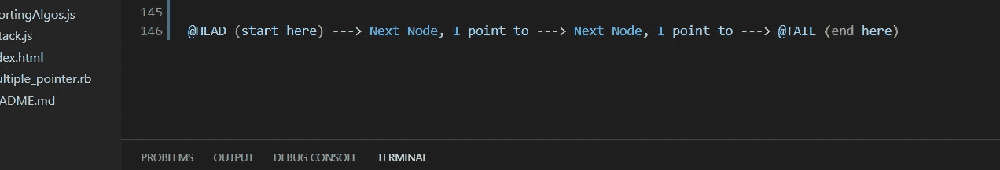

# Ruby 中的数据结构:单链表

> 原文：<https://medium.com/codex/data-structures-in-ruby-singly-linked-list-868cd4eb0626?source=collection_archive---------13----------------------->

虽然计算机科学专业的学生可能会学习 C、C++、Java 或 Python 等语言的数据结构和算法，但我首先学习的是作为后端语言的 Ruby 和 JavaScript。由于我用来学习数据结构和算法的课程使用 JavaScript 来教授示例，我想我应该回到我的根本，建立一个可行的单链表数据模型，它可以用在…