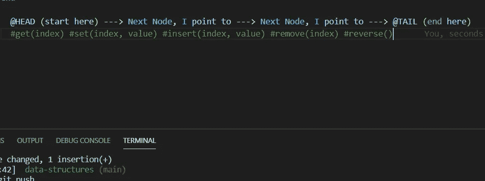

# Ruby 中的数据结构:单链表—第 2 部分

> 原文：<https://medium.com/codex/data-structures-in-ruby-singly-linked-list-part-2-42e285112bfb?source=collection_archive---------14----------------------->

在前一篇文章中，我们设置了节点类和 SinglyLinkedList 类，包括初始化和一些基本方法:#push、#pop、#shift 和#unshift。现在我们将扩展查看和操作单链表的方法集合(从现在开始:SLL)。

这并不奇怪，有时我们会想检查…