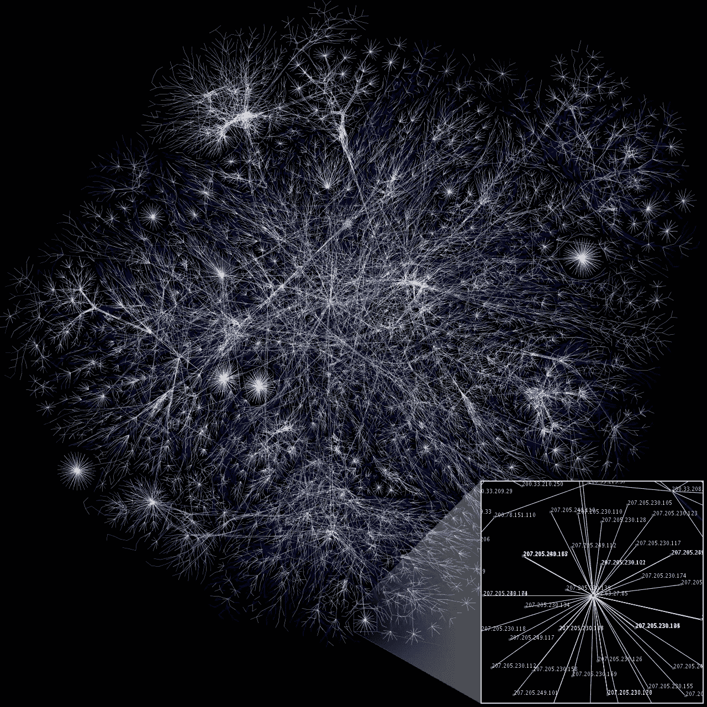
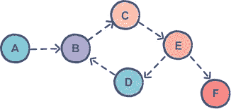
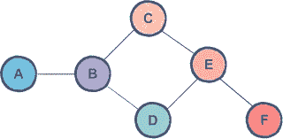
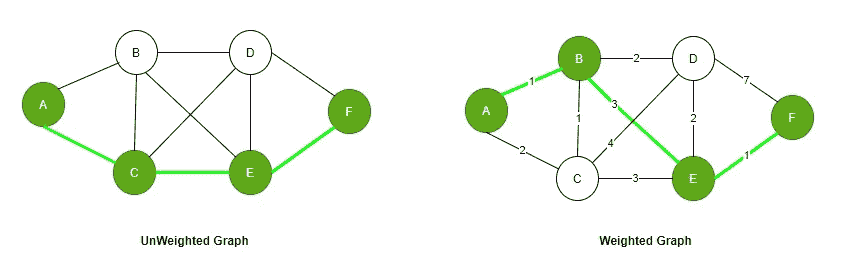
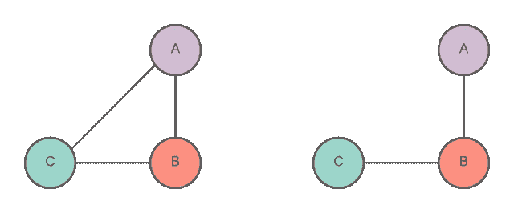
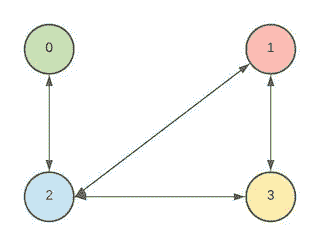
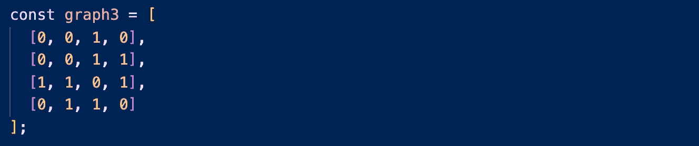
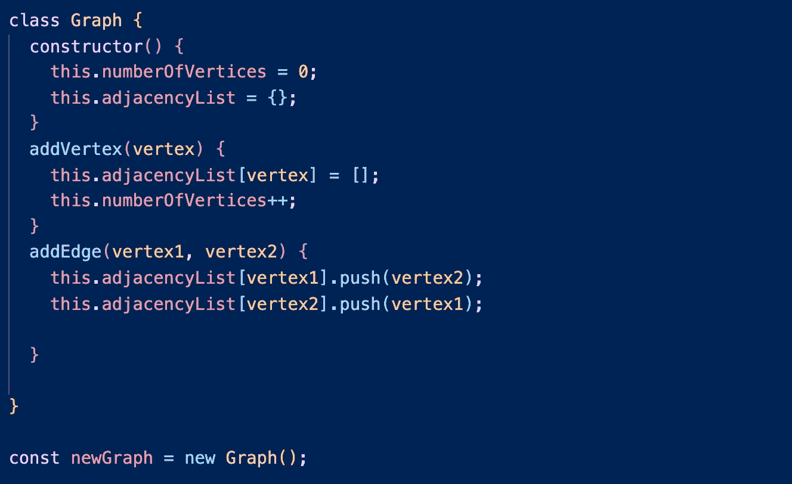

# 数据结构第 2 部分:图形

> 原文：<https://medium.com/codex/data-structures-part-2-graphs-54a974caa76b?source=collection_archive---------5----------------------->

## 互联网的基础设施，你最喜欢的社交媒体网站等等

图片由[Opte 项目](https://commons.wikimedia.org/wiki/File:Internet_map_1024.jpg)

欢迎回来！你可能会好奇上面这个彩色的，相互联系的图表是什么。它几乎看起来像一群神经元，但事实上它只是整个互联网地图的一小部分。每个端点(右下角的红点)是一个连接到另一个网站的网站，连接到另一个网站，等等。这张地图也就是你所说的图表。图形是计算机科学中使用的最重要的数据结构之一，它错综复杂地为现实生活中的关系和联系创建模型。今天我们将学习更多关于图形数据结构的知识，最重要的是如何构建我们自己的图形数据结构！

# **什么是图形？**

图是由成对相关的节点和边组成的非线性数据结构。节点也可以称为顶点，这两个术语可以互换使用。边是每个节点之间将它们连接在一起的线。有几种不同类型的图表，每一种都有自己的含义。当创建网站时，我们希望确保我们是在用正确的方法来规划和建设，以便获得想要的行为。

# **图表类型**

## *1。定向与非定向*

首先，我们有了有向图和无向图。有向图由沿一个方向行进的边所连接的节点组成。想象一条单行道。根据有向图设计的一个流行的社交媒体应用是 Twitter！当你想“关注”另一个用户时，你可以这样做，而不会被他们跟踪回来，就像 Instagram 一样。这种关系是一条“单行道”。下面是一个更复杂的直接图形的例子。您会注意到边只指向下一个节点(与单链表的行为相同…我们将很快介绍)。

有向图由 [Educative.io](https://www.educative.io/edpresso/directed-graphs-vs-undirected-graphs)

无向图由通过双向边连接的节点组成，因此这种类型的图没有固定的方向。这将是我们的双向街道和高速公路。你能想到一个使用无向图的社交媒体应用吗？如果你说是脸书，你是对的，原因如下:一旦你发送了一个朋友请求，并且那个人同意了，你们现在都是“朋友”并且互相关注。你可以看到他们的帖子，反之亦然。与我们其他社交媒体应用的关系是双向的，而不是单向的。这举例说明了双向链表的行为(我们将很快讨论的另一个主题)。在下图中，您可能会注意到没有双向箭头；但是，这些样式可以互换使用。

由 [Educative.io](https://www.educative.io/edpresso/directed-graphs-vs-undirected-graphs) 生成的无向图

## *2。加权与未加权*

当我们比较加权图和未加权图时，我们主要指的是边。未加权的图将不具有与边相关联的值/信息，而加权的图具有。当涉及到路径时，未加权的图并不特别关注优化。

谷歌地图是加权图的完美例子。例如，你正试图从家里去你最喜欢的餐馆。谷歌地图会神奇地给你几条到达目的地的路线。你会注意到不同的路线也会给你到达目的地所需的时间，也许还有英里数的距离。像我们的例子一样，加权图非常适合计算最优路径。

Kheri.net[的未加权图与加权图](https://kheri.net/weighted-vs-unweighted-graph/)

*3。)循环与非循环*

循环和非循环图也指边的行为。循环图的边以循环的方式从一个节点指向另一个节点，然后又回到原来的节点。非循环图正好相反。没有循环行为，所以不能从最后一个节点返回到原始节点。

您通常会看到循环图与加权图一起工作，因为我们不仅希望计算路径的优化，还希望能够返回到我们最初来自的原始节点或位置。现在我们知道谷歌地图是如何在幕后工作的，它只是一个循环和加权的图形数据结构，使街道导航变得不那么复杂。

Cierra McDonald 创建的循环与非循环图

# **图形表示**

现在我们已经介绍了几种不同类型的图，我们终于可以开始用代码实现它们了！我们有三种具体的方法来创建图表。您可以使用此图作为以下代码实现的可视化表示:

Cierra McDonald 创建的图形视觉

## 1.边缘列表

边缘列表看起来像数组的数组。其中的每一对都描述了节点之间的连接。让我们以这段代码为例。这个图有四种不同的连接。

边缘列表示例

## 2.邻接表

然而，邻接表也是一个数组；数组的每个索引代表一个节点，而到该节点的连接则表示为该索引的值。让我们来看看实际情况:

相邻列表示例

在这里，我们的图中仍然有四个节点，我们知道这一点是因为数组上升到了索引[3]。例如，索引[0]处的节点 0 连接到节点 2；索引[1]处的节点 1 连接到节点 2 和节点 3。除了使用数组，还可以使用对象或链表。

## 3)邻接矩阵

最后，邻接矩阵表示将使用 0 和 1 来指示是否存在到另一个节点的连接:0 表示“否”，1 表示“是”。

邻接矩阵示例

在我们的示例中，您可以看到父数组中索引[2]处的节点 2 连接到节点 0、节点 1 和节点 3(显然在子数组中的索引[2]处跳过自己)。让我们试试另一个，在父数组的索引[0]处，节点 0 没有到节点 1 或节点 3 的连接，但它有到节点 2 的连接。邻接矩阵也可以使用对象来实现。

# **举例:**

我们现在将使用邻接表方法和我们迄今为止积累的所有知识来创建我们自己的无向图。

创建一个无向无权重的图形

首先，我们要创建一个名为“Graph”的类。该类将包含一个具有两个属性的构造函数:numberOfVertices(它将从 0 开始，因为我们的图中还没有任何内容)和 adjacencyList(它是一个空对象，因为也没有连接/边)。

在这个类中我们有两个主要的函数。我们希望能够向我们的图形添加新的顶点，并且我们还希望能够创建双向边。

函数“addVertex”将把一个顶点作为参数。由于 adjacencyList 是一个对象，我们将创建一个新的键，将它分配给顶点，并赋予它一个空数组的值。然后，我们将更新图形中顶点的数量。简单吧？

函数“addEdge”将接受两个参数，都是顶点。我们将获取“vertex1”的键，并将“vertex2”作为连接推入其数组。我们将在下一行对“顶点 2”做完全相同的操作。如果这是一个**导向的**图，你认为这段代码会如何变化？

就这样，我们创建了一个简单的图表！

好了，我们已经到了这篇图文文章的结尾(是的…双关语是有意的)。正如所见，图是一种极其重要的数据结构，也是导航计算机科学时需要掌握的一个非常重要的概念。在我们最喜欢的社交媒体应用上建立联系和关系是基于不同类型的图表和它们拥有的独特行为。由于图表可以很快变得复杂，在面试中实现一个图表不像其他数据结构和算法那样常见(这并不意味着它不会发生，所以无论如何都要学习它们。).感谢您的阅读，希望很快再次见到您！

💕👩🏾‍💻*编码快乐！*👩🏾‍💻💕

参考资料:

[掌握编码面试:数据结构和算法](https://www.udemy.com/home/my-courses/learning/)

[什么是图(数据结构)？](https://www.educative.io/edpresso/what-is-a-graph-data-structure)