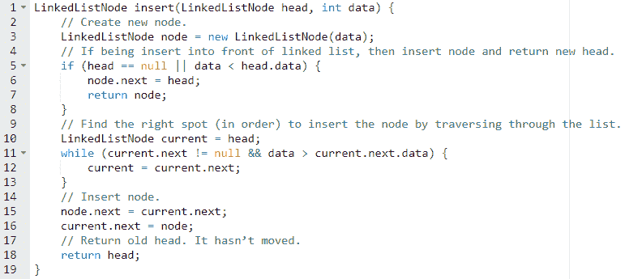

# 数据结构入门

> 原文：<https://medium.com/codex/data-structures-primer-b14c160cbd66?source=collection_archive---------6----------------------->

## 根据您优化的目的，有许多不同的方法来保存或组织您的数据。

顾名思义，数据结构是用于保存数据的结构。按照面试重要性的大致降序排列，常见的数据结构有:

# **数组**

数组是保存一组对象的最直接的方式。它在一个简单的对象列表中存储项目。如果你知道一个物体的索引(位置),查找速度会很快，否则会很慢。例如，检索列表中的第 12 个人很快，但查找所有名为“Alex”的人却很慢(因为您必须查看所有人)。

在大多数语言中，数组在创建后不能“增长”长度。您必须预先指定数组的长度，以后不能更改。

## **问题 1 —** 给定一个正整数的排序数组，末尾有一个空格，**按排序顺序插入一个元素**。

我们可以想象我们的数组看起来像这样(末尾有一个空白点):

1 4 7 8 9 _

如果我们需要插入一个像 6 这样的元素，就不能只在末尾插入。我们应该把它整理好。

1 4 6 7 8 9

这需要向下“移动”所有元素，为 6 腾出空间，然后插入它。解决这个问题有两种方法:

**方法 1:从后面移动，然后插入**

第一种方法是移动所有元素，然后插入值 x。我们必须小心不要在插入时覆盖值。我们可以从后面前进，而不是从前面转移。

1 4 7 8 9 _

我们首先将 9 复制到空白处。然后 8 到 9 的位置。然后将 7 放入 8 所在的位置，以此类推。当我们为 x 找到合适的点时，我们停下来插入 x。

如果可以插入元素，则返回 true，如果有错误，则返回 false。

**方法 2:向前交换元素**

或者，我们可以通过数组向前迭代。我们对数组中的初始元素(小于 x 的元素)不做任何处理。那些不会被移动。然而，当我们找到 x 应该插入的位置时，我们交换 x 和数组中的当前元素。x 的值现在将等于数组中的旧元素。当我们到达下一个元素时，我们想用 x 来交换那个值。我们对数组中的每个元素都继续这样做，直到最后。

将 6 插入 2，3，7，8，9 中

设定 x = 6

从 A[0]开始 I

将 I 移至 A[1]

将 I 移至 A[2]

交换 A[2]和 x。

A = {2，3，6，8，9，_}

x = 7

交换 A[3]和 x。

A = {2，3，6，7，9，_}

x = 8

交换 A[4]和 x。

A = {2，3，6，7，8，_}

x = 9

交换 A[5]和 x。

A = {2，3，6，7，8，9}

x = _

下面的代码实现了这个算法。

注意，一旦第 7 行的 if 语句变为真，它将永远为真。

两种算法都将花费 **O(N)时间**。

## **问题 2 —反转数组中**元素的顺序(不创建新数组)。

乍一看，我们可能只想创建第二个数组，按顺序迭代元素，并以相反的顺序将它们插入到新数组中。不幸的是，问题说不要创建第二个数组。

让我们来看一个例子:

原文:0，1，2，3，4，5，6

反转:6，5，4，3，2，1，0

你可能会注意到，通过反转数组，我们将 0 放在 6 所在的位置，将 6 放在 0 所在的位置。同样，5 和 1 被放在彼此的位置上。也就是说，我们在交换价值观！

我们可以遍历数组，而不是创建第二个数组，将左边的值与右边相应的值交换。我们只需要遍历数组的左半部分，因为右半部分已经处理好了。

非常小心第 2 行和第 5 行的算术运算。

该算法将花费 **O(N)时间**。

# **哈希表**

哈希表(有时称为“字典”或“哈希表”)允许您将“键”映射到“值”。这个键通常是一个数字或字符串，值可以是任何类型的对象。您可以使用它将一个人的 ID 号映射到某个包含其他信息的对象。

这是一个非常有用的数据结构，因为它允许非常快速的查找。我们一般假设一个哈希表是 **O(1)** (常数时间，不考虑数据量)对**插入和查找元素**。

## **问题 3 —** 给定两个唯一字符串列表(A 和 B)，写一个程序来**确定 A 是否是 B 的子集**。检查 A 中的所有元素是否都包含在 b 中。

我们被告知这两个列表包含唯一的字符串，所以我们只需要检查一个列表中的所有元素是否都包含在另一个列表中。

**方法 1:暴力破解**

我们可以通过“蛮力”来解决这个问题对于 A 中的每个元素，检查它是否在 B 中。一旦我们发现 A 中的元素不在 B 中，我们就可以返回 false，因为我们知道 A 不是子集。我们知道，如果我们到达 A 的终点，还没有返回，我们可以找到每个元素。我们返回 true。

这个算法需要 **O(a*b)时间**，其中 A 是 A 的长度，B 是 B 的长度。

**方法 2:哈希表**

早期的方法很慢，因为我们必须在 B 中搜索每个元素。如果一个元素在 B 中，只查找不是很好吗？这就是哈希表允许我们做的。我们可以建立一个 B 中所有元素的哈希表，然后，当我们想查找一个元素是否在 B 中时，我们只需要使用这个哈希表。

这个算法花费 **O(a+b)时间**，其中 A 是 A 的长度，b 是 b 的长度，保存哈希表需要 O(b)额外的内存。

## **问题 4 —** 给你一个销售数据的二维数组，其中第一列是产品 ID，第二列是数量。编写一个函数来获取这个数据列表，并返回一个新的二维数组，其中包含每个产品 ID 的**总销售额。**

示例:

输入:

211,4

262,3

211,5

216,6

输出:

211,9

262,3

216,6

该方法的输出需要是产品 id 及其总数的列表。

我们可以通过使用哈希表直接做到这一点。我们遍历(productID，quantity)对的列表。对于每个值，我们在哈希表中增加它的条目，或者如果它不在哈希表中，就插入它。最后，我们将哈希表转换回数组。

如果您不知道 keySet 和 containsKey 的具体命令，也不用担心。你的面试官不应该关心这样的事情。重要的是你知道如何将一种方法转化成类似于可工作代码的东西。

这个算法花费 **O(N)时间**，其中 N 是输入中的行数。

# **图形和树**

图**是一组通过边连接的节点。并非所有的节点都需要连接起来——你可以有两个完全独立的子图——边可以是“有向的”或“无向的”有向边可以被认为是单行道，而无向边就像是双行道。如果图是有向的，则从 v 到 w 的边不是从 w 到 v 的边。因此，您可能能够从节点 n“开车”到节点 m，但不能反过来。**

**树**是一种图形，其中任意两个节点通过一条且仅一条路径连接。树没有圈，因为任意两个节点之间只能有一条路径。

一棵树可以有多种形式，但目前最常见的是**二叉树**。二叉树是每个节点只有两个子节点的树。我们称这些节点为左节点和右节点。树上不能有任何“循环”(没有从一个节点回到自身的路径)。由于这些限制，二叉树可以用严格的分层方式表示，如下所示:

通常，我们和二分搜索法树一起工作。二叉查找树是这样一棵树，其中左子树中的所有节点都小于该节点的值，而该节点的值又小于右子树中所有节点的值。上面的树是二叉查找树。

如果一个二叉查找树是平衡的(通常我们处理平衡的二分搜索法树)，插入一个元素，以及找到一个元素是 **O(log n)** ，其中 n 是节点的数量。

## **问题 5 —将元素插入二叉查找树**(按顺序)。你可以假设二叉查找树包含整数。

在二叉查找树中，较小的值放在节点的左侧，较大的值放在右侧。

实现这一点最简单的方法是递归。从根开始比较想要插入的值 x，如果 x 小于根，调用 *root.left* 上的 insert。当 x 大于根时，调用右边的 insert。如此反复，直到没有左孩子或右孩子。在那里插入 x。

插入节点的**时间将取决于树的高度。**如果树是相对**平衡的**，它应该有**高度 O(log N)，**其中 N 是树中节点的数量。然而，如果树**非常不平衡**(例如，基本上节点都在一条直线上)，那么**的高度可能与 n 一样多**

## **问题 6 —** 给定一个包含整数作为值的**二叉查找树**,**计算所有数字的总和** **。**

如果我们递归地处理这个问题，它会出奇地简单。在这种情况下,“正确的”视角意味着。

假设我们想要计算树中节点的总和，如下所示:

我们可以遍历树，将它折叠成一个数组，然后计算这些值的总和。这比必要的要复杂得多。更简单的方法是考虑问题的子问题。整棵树的和将是左子树的*和+右子树的和+根的*和。

sum(树 _at_20) = sum(树 _at_10) + sum(树 _at_30) + value_at_node_20

在节点 10 得到的和可以用其子问题来定义。

sum(树 _at_10) = sum(树 _at_5) + sum(树 _at_15) + value_at_node_10

我们几乎可以直接把它翻译成代码。

如果我们到达路径的末端(一个空节点)，我们返回 0。

运行时将是 **O(N)** ，其中 N 是树中的节点数。了解运行时的一种方法是认识到对于树中的每个节点，sum 只被调用一次。

# **链表**

像二叉树一样，链表是由节点组成的数据结构，其中每个节点都有一个指向其他节点的指针。该节点在单链表中只有一个指向其下一个节点的指针。该节点在一个**双向链表**中指向它的上一个和下一个节点。如果一个链表有一个循环，这通常被认为是很有问题的，并且可能违反了链表的结构。

**在链表的**前端**插入**节点可以在 **O(1)** 时间内完成。但是，如果对**列表进行了排序**，并且您希望**按照顺序**插入节点，这将花费 **O(N)** 时间，其中 N 是节点的数量，因为您必须首先找到正确的位置，这需要搜索整个列表。

**在链表中找到一个节点**是 **O(N)** ，不管链表是否排序。

## **问题 7 —将一个节点插入到一个排序链表中。**

要将一个数字按顺序插入到一个链表中，我们首先需要找到合适的位置来插入节点。然后，我们需要插入它。

棘手的是如何处理在链表的前面插入一个节点。假设我们调用一个 *insertInOrder* 方法，如下所示，它(对于这个特殊的例子)需要在链表的前面插入 n:

*void insertin order(linked listnode nd，int value)*

仅仅插入节点 *n* 并让 *n.next* 指向 nd 是不够的。使用链表的人不知道链表真正的**头**已经从*第*更新为 *n* 。他们只有对*和*的引用。因此，在插入方法中，需要返回链表的新头。大多数时候，头部会和你调用 insert 之前一样。但是，有时它会改变，你需要通知打电话的人。

这个算法花费 **O(N)时间**，其中 N 是节点数。

## **问题 8 —“排序”一个只包含 0 和 1 的链表。**也就是说，修改列表，使全 0 出现在全 1 之前。

**方法 1:构建两个链表**

最简单的方法之一是建立一个“0 列表”和一个“1 列表”,然后在最后将它们连接起来。

注意我们需要返回链表的新头，因为它可能已经改变了。

**方法 2:数零**

我们不需要使用给我们的实物。如果我们移动值而不是节点，这将符合问题的要求。因此，我们可以只遍历链表一次，计算 0 的个数。然后，我们再次遍历它，将前 k 个值设置为 0，其余的值设置为 1。

在这种方法中，我们移动的是值，而不是节点。对头部的实际引用不会改变，所以我们不需要返回任何东西。

**方法 3:交换数值**

因为我们只需要移动值，所以我们也可以遍历链表，在找到 0 和 1 时交换它们。这种方法通过两个指针 p 和 q 工作，p 指针寻找 1，q 指针寻找 0。当他们找到自己的价值观时，他们就会交换。

1.从 p 开头。

0->0->0->1->1->0->1->0->1->0

p

2.将 p 移到第一个 1。

0->0->0->1->1->0->1->0->1->0

p

3.从 p 开始 p.next

0->0->0->1->1->0->1->0->1->0

p q

4.将 q 移动到下一个 0。

0->0->0->1->1->0->1->0->1->0

p q

5.交换 p 和 q 的值。

0->0->0->0->1->1->1->0->1->0

p q

6.重复第 4 步:

//将 p 移动到下一个 1

0->0->0->0->1->1->1->0->1->0

p q

//将 q 移动到下一个 0

0->0->0->0->1->1->1->0->1->0

p q

//交换

0->0->0->0->0->1->1->1->1->0

p q

//将 p 移动到下一个 1

0->0->0->0->0->1->1->1->1->0

p q

//将 q 移动到下一个 0

0->0->0->0->0->1->1->1->1->0

p q

//交换

0->0->0->0->0->0->1->1->1->1

p q

换句话说，p 总是指向第一个 1，q 指向第一个不在位置的 0(也就是 p 后面的第一个 0)。每当 q 找到一个 0，我们就知道这个 0 是不合适的。我们将其值与 p 交换，并将 p 移动到下一个节点。

对于某些人来说，这种方法可能是最不直观的，但是通过使用助手函数，它会产生相当短的代码——它会产生相当短的代码。

这三种途径都是 **O(N)** 。

# **栈**

堆栈是一种数据结构，它定义了元素插入和移除的精确顺序。当添加或“推送”一个元素时，它被插入到堆栈的顶部。当一个元素被移除时，它被从栈顶“弹出”。

栈被称为 LIFO(后进先出)数据结构，因为最后(最近)添加的元素是第一个被删除的。

这样，它就像现实生活中的一叠盘子。当你把一个盘子放在一堆盘子上时，你把它放在最上面。当你拿走一个盘子时，你总是从上面拿走。

**从堆栈中插入和移除**是 **O(1)** 。如果您需要查找具有特定值的元素，堆栈不是一个好的数据结构选择，因为它需要一个接一个地删除所有元素。

## **问题 9 —** 编写一个函数，将一个堆栈作为输入，**返回一个元素反转的新堆栈**。

最直接的方法是创建一个新的堆栈，并将第一个堆栈中的元素弹出到第二个堆栈中。这将把原始堆栈的顶部元素放在新堆栈的底部。

唯一的问题是，我们的原始堆栈在这个过程中被完全清空了。

如果这是一个问题，您可以使用一个额外的堆栈来保存所有弹出的值。我们将弹出的值推送到临时堆栈和反转堆栈上。(这些堆栈将具有相同的元素。)一旦我们完成了从栈中弹出元素，我们就把它们从 temp 推回到原始栈中。

两种方法都有运行时间。

第二个会经过两遍而不是一遍，但是常数不影响大 O 时间。请记住，大 O 不是一个表示某件事情需要多少秒的表达式。它表示随着输入大小变得越来越长，时间是如何缩放的(在本例中是线性的)。

## **问题 10 —** 写一个函数，让**从一个栈**中移除所有偶数。你应该返回原来的堆栈，而不是一个新的。

对于这个问题，我们可以依赖与前一个问题的第二种方法相同的直觉:将某个东西反转两次，将元素恢复到它们原来的顺序。

我们可以一个元素一个元素地弹出堆栈。如果元素是奇数(也就是说，不是偶数)，就把它推到一个新的临时堆栈上。然后，一旦我们都完成了，把它们推回到原来的堆栈。

这个算法将花费 **O(N)时间**。既然每个元素都要过一遍，那就不能比这个更快的解决问题了。

# **队列**

队列本质上与堆栈相反。它不是按照后进先出的原则删除最新的项目，而是删除最早的项目。这被称为“先进先出”，因为你添加的第一个项目将是你删除的第一个项目。

它在现实生活中充当一个队列(或线)。当人们排队买电影票时，第一个排队的人是第一个被服务的人。当然，这就是数据结构得名的原因。

**插入**(或“入队”)和**从队列中移除**(或“出队”)是 **O(1)** 。和在堆栈中一样，它不用于查找元素。

## **问题 11 —** 写一个函数给**检查两个队列是否相同**(相同顺序的相同值)。修改/销毁两个队列没问题。

我们被允许修改这两个队列，这应该给我们一个线索，我们需要这样做。我们可以反复去掉每个链表的前面，比较值。如果值不相等，那么我们立即返回 false。

当一个列表被清空时会发生什么？那得看情况。如果两个列表都是空的，我们知道链表是相同的(还没有失败)。然而，如果只有一个列表是空的，而另一个不是，我们知道这两个列表是不同的。毕竟，我们是以同样的顺序移除元素的。

这个算法花费了 **O(N)时间**，其中 N 是较小列表的长度。为什么变小了？因为一旦列表为空，我们就退出。这将首先发生在较小的列表上。更大的列表有多大并不重要；不会影响运行时间。

## **问题 12 —** 写一个函数来**从一个队列中移除第 k 个元素**(保持所有其他元素在适当的位置并保持相同的顺序)。

请注意，如果我们不断地从前面删除元素，并将它们添加到后面，我们会得到相同的列表。因此，要删除第 k 个元素，我们可以只删除每个元素并重新添加它—跳过第 k 个元素。

这个算法花费 **O(N)时间**，其中 N 是节点数。