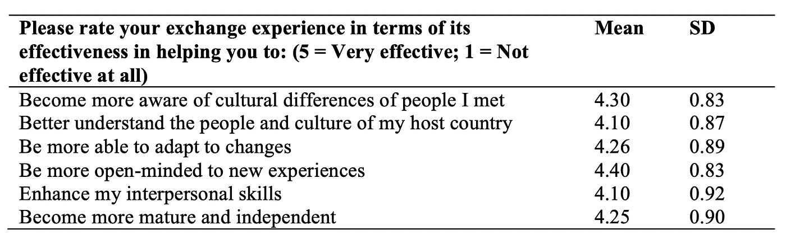
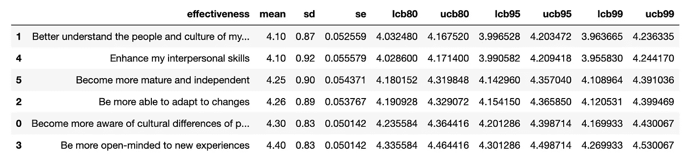
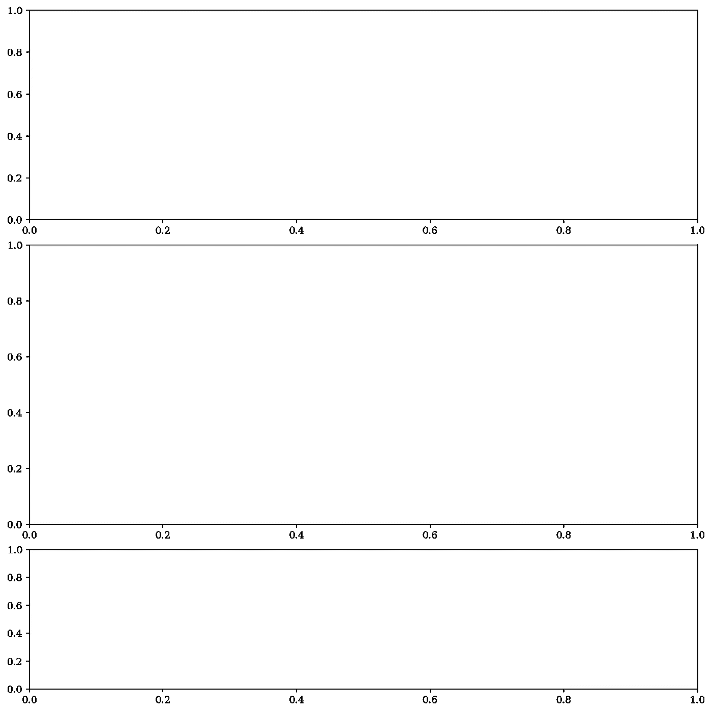
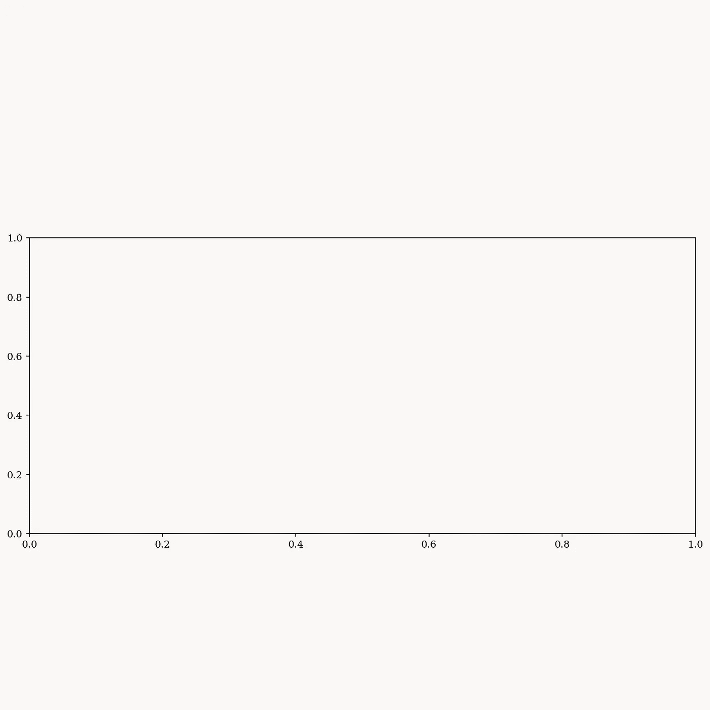
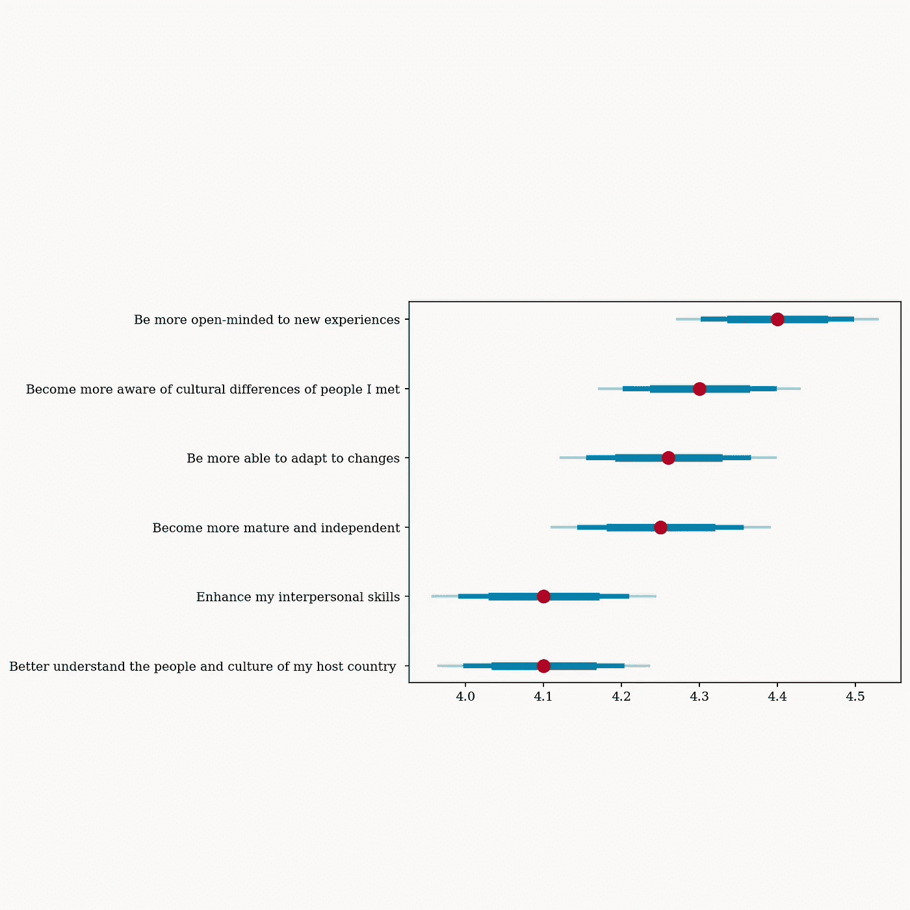
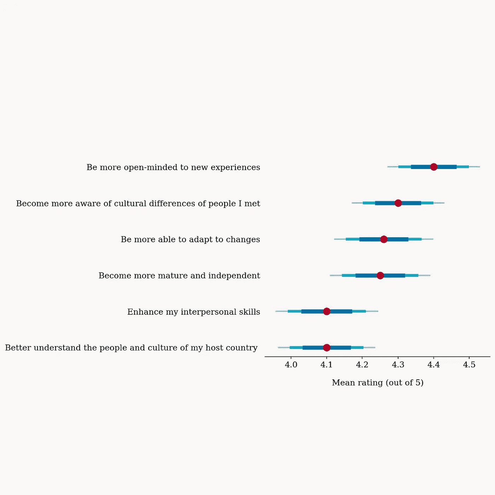

# 数据可视化|你应该去交换的 6 个理由

> 原文：<https://medium.com/codex/data-visualization-effectiveness-of-inbound-exchange-3f1fe4b078a5?source=collection_archive---------11----------------------->

嗨伙计们！这是另一个关于数据可视化的项目。在这个项目中，我计划将我从统计中学到的知识应用于 Python 专门化。我将首先计算置信区间，然后绘制图表。


最终输出:入站交换的有效性。由 H 创建

# 介绍

本项目基于香港科技大学李忠义教授和吴慧仪博士的会议论文《入境交换生的期望和经历:提升大学形象的见解》。

钟教授和吴博士对 279 名来港交换生进行了一项调查。在他们的研究中，他们调查了入站交换的有效性。他们的研究发现，入境交流体验被认为是积极的。



表:从六个方面对入站交换体验的有效性进行评分。由李忠义教授及吴惠妍博士撰写

# 导入数据

首先，导入所有需要的库:`numpy`用于数学计算，`pandas`用于数据争论，`scipy.stats`用于统计计算，`matplotlib`用于绘图。

```
import numpy as np
import pandas as pd
from scipy.stats import t
import matplotlib.pyplot as plt
```

然后，创建一个数据框架，并根据文中的数据输入数据。

```
# Create dataframe
df = pd.DataFrame({
    'effectiveness': [
        'Become more aware of cultural differences of people I met', 
        'Better understand the people and culture of my host country', 
        'Be more able to adapt to changes', 
        'Be more open-minded to new experiences', 
        'Enhance my interpersonal skills', 
        'Become more mature and independent'], 
    'mean': [4.3, 4.1, 4.26, 4.4, 4.1, 4.25], 
    'sd': [0.83, 0.87, 0.89, 0.83, 0.92, 0.9]
})
n = 274
```


创建一个数据框架。由 H 创建

接下来，计算 t*来计算置信区间。

```
# Compute t star with n-1 degrees of freedom
tstar_80 = t.ppf(.90, df=n-1)
tstar_95 = t.ppf(.975, df=n-1)
tstar_99 = t.ppf(.995, df=n-1)
```

并分别计算标准差、80%、95%和 99%的置信区间。

```
# Compute standard error
df['se'] = df['sd'] / np.sqrt(n)# Compute confidence interval with 80% confidence
df['lcb80'] = df['mean'] - tstar_80 * df['se']
df['ucb80'] = df['mean'] + tstar_80 * df['se']# Compute confidence interval with 95% confidence
df['lcb95'] = df['mean'] - tstar_95 * df['se']
df['ucb95'] = df['mean'] + tstar_95 * df['se']# Compute confidence interval with 99% confidence
df['lcb99'] = df['mean'] - tstar_99 * df['se']
df['ucb99'] = df['mean'] + tstar_99 * df['se']df = df.sort_values(by='mean')
```



计算置信区间。由 H 创建

# 形象化

首先，从定义颜色和设置绘图字体开始。

```
# Define colors for plotting
BG = '#f9f7f5'
RED = '#b60024'
BLUE1 = '#0070a6'
BLUE2 = '#00adc6'
BLUE3 = '#7ed8e4'
BROWN = '#39240d'# Set font for entire plot to Serif
plt.rcParams['font.family'] = 'Serif'
```

然后，创造情节。这里我们有三个支线剧情，第一个和第三个支线剧情分别是在顶部和底部添加空格，而第二个支线剧情是为了实际的剧情。
(不确定这是不是最好的方法，有什么建议请告诉我！)

```
# Create 3 subplots, with ratio 1.5:2:1
# The 1st and 3rd subplots are to add spaces
# The 2nd subplot will be used to plot graph
# Set contrained layout to ensure the entire image has a size of 10x10
fig, (s1, ax, s2) = plt.subplots(3, 1, figsize=(10, 10), gridspec_kw={'height_ratios': [1.5, 2, 1]}, dpi=150, constrained_layout=True)
```



由 H 创建

接下来，用我们刚刚定义的`BG`颜色设置背景颜色。并将第一和第三个支线剧情设置为不可见。

```
# Set bg color of plot
fig.set_facecolor(BG)
ax.set_facecolor(BG)# Set 1st and 3rd subplots to invisible
s1.axis('off')
s2.axis('off')
```



由 H 创建

并绘制图表！这里，我用`hlines`绘制置信区间，指定不同的颜色和宽度；并用`scatter`绘制平均数据点。

```
# Plot 80%, 95% and 99% confidence intervals
line1 = ax.hlines(data=df, xmin='lcb80', xmax='ucb80', y='effectiveness', color=BLUE1, linewidth=6, zorder=4)
line2 = ax.hlines(data=df, xmin='lcb95', xmax='ucb95', y='effectiveness', color=BLUE2, linewidth=4, zorder=3)
line3 = ax.hlines(data=df, xmin='lcb99', xmax='ucb99', y='effectiveness', color=BLUE3, linewidth=2, zorder=2)# Plot the mean
ax.scatter(data=df, x='mean', y='effectiveness', color=RED, linewidth=5, zorder=5)
```



由 H 创建

之后，设置轴的标签和记号，并删除边界。

```
# Set label of x-axis
ax.set_xlabel('Mean rating (out of 5)', labelpad=15, fontsize=12)# Set fontsize of tick labels, and remove yticks
ax.tick_params(axis='x', labelsize=12)
ax.tick_params(axis='y', labelsize=12, left=False)# Remove borders
ax.spines['left'].set_visible(False)
ax.spines['top'].set_visible(False)
ax.spines['right'].set_visible(False)
```



由 H 创建

另外，添加水平网格线和图例。

```
# Add horizontal grid lines
ax.grid(axis='y')# Add legend
ax.legend(['80%', '95%', '99%',], 
          title='Confidence interval', 
          loc=8, ncol=3, fontsize=12, title_fontsize=12, 
          bbox_to_anchor=(0.5, 0.18), bbox_transform=fig.transFigure, 
          frameon=False)
```


由 H 创建

最后加标题，引用数据！

```
# Add title
fig.suptitle('Effectivness of Inbound Exchange', y=.93, fontsize=24, fontweight='bold')# Add subtitle
fig.text(s='The feedback survey results showed that the inbound exchange\nexperience was perceived positive', 
        x=0.5, y=0.83, 
        horizontalalignment='center',
        fontsize=14, 
        linespacing=1.5, 
        transform=fig.transFigure)# Reference data source
fig.text(s='Source: "Expectations and Experiences of Inbound Exchange Students: \nInsights for Improving the University’s Image", by Annie W.Y. Ng, & Chung-Yee Lee, \nSEACE2020 Conference Proceedings, 2020', 
        x=0.2, y=0.03, 
        fontsize=12, 
        linespacing=2, 
        transform=fig.transFigure)fig.text(s='Designed by H |\n\n', 
        x=0.05, y=0.03, 
        fontsize=12, 
        linespacing=2, 
        transform=fig.transFigure)
```

最终输出:


最终输出:入站交换的有效性。由 H 创建

[源代码](https://github.com/hckkiu/data-viz/tree/main/exchange)