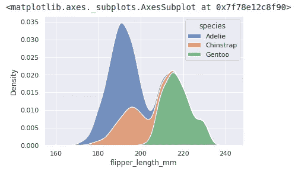

# 使用 Python 中的 Seaborn 库实现数据可视化。

> 原文：<https://medium.com/codex/data-visualization-using-seaborn-library-in-python-41039861edbe?source=collection_archive---------8----------------------->

数据可视化是获得更好的理解和更多关于数据的知识的重要工具。它通过使用数据讲述独特的故事，帮助数据科学家与非数据科学家交流。它使用图表、图形或地图来表示数据，以理解和可视化数据中的趋势和模式。

在这篇博客中，我们将学习如何使用最流行的数据可视化库“seaborn”。Seaborn 是一个 python 数据可视化库，它有一个优秀的界面，可以用来绘制有吸引力的信息丰富的统计图。它建立在另一个重要的数据可视化库 matplotlib 之上。Seaborn 还与 pandas data-frame 合作得很好，同时帮助我们从数据中探索和获得有意义的见解。seaborn 的绘图功能可以很好地处理具有整个数据集的数据帧和数组，并执行必要的语义映射和统计聚合以生成信息丰富的绘图。

现在我们将看到一些在 python 中使用 seaborn 的代码示例—

```
*# Import seaborn*
**import** **seaborn** **as** **sns**

*# Apply the default theme*
sns.set_theme()

*# Load an example dataset*
tips = sns.load_dataset("tips")

*# Create a visualization*
sns.relplot(
    data=tips,
    x="total_bill", y="tip", col="time",
    hue="smoker", style="smoker", size="size",
)
```


在上面的例子中，我们只需要导入 seaborn 库。按照惯例，它是以缩写形式“sns”导入的。它使用下面的 matplotlib 来绘制图形。该图使用 seaborn 函数 relplot()的一次调用显示了 tips 数据集中五个变量之间的关系。relplot()能够可视化不同类型的统计关系。上面的代码还使用了一个名为 load_dataset()的函数来快速访问样本数据集。我们还可以使用 seaborn 创建更简单的数据图，如直方图和 kde 图。看看下面如何绘制直方图和 kde(核密度估计)图—

```
penguins = sns.load_dataset("penguins")
sns.histplot(data=penguins, x="flipper_length_mm", hue="species", multiple="stack")
```


```
sns.kdeplot(data=penguins, x="flipper_length_mm", hue="species", multiple="stack")
```



Seaborn 是一个具有许多函数的广泛的库，它提供了对数据的更好的统计理解。在本教程中，我展示了一些简单和常见的例子，只是为了向初学者介绍这个库。

要了解更多关于 seaborn 的信息，您可以访问 seaborn 库的官方文档，其中有许多带示例的教程。

[](https://seaborn.pydata.org/tutorial.html) [## 用户指南和教程- seaborn 0.11.2 文档

### 编辑描述

seaborn.pydata.org](https://seaborn.pydata.org/tutorial.html) 

您还可以了解其他不常用的图，例如经验累积分布函数(ECDF)图，它表示低于数据集中每个唯一值的观察值的计数。在 ECDF，每次观察都是直接可视化的，不需要像直方图或密度图那样使用宁滨或平滑参数。

[](https://seaborn.pydata.org/generated/seaborn.ecdfplot.html) [## seaborn.ecdfplot - seaborn 0.11.2 文档

### 海博恩。ecdfplot(，*，，，，，，，，，，，** kwargs)绘制经验累积分布函数。一个 ECDF…

seaborn.pydata.org](https://seaborn.pydata.org/generated/seaborn.ecdfplot.html) 

要安装 seaborn，你也可以点击下面的链接

 [## 安装和入门- seaborn 0.11.2 文档

### seaborn 的官方版本可以从 PyPI 安装:这个库也是 Anaconda 的一部分…

seaborn.pydata.org](https://seaborn.pydata.org/installing.html) 

我希望这篇关于 seaborn 库的简短介绍能够帮助您探索数据，从而获得关于数据的有用见解。下次见！