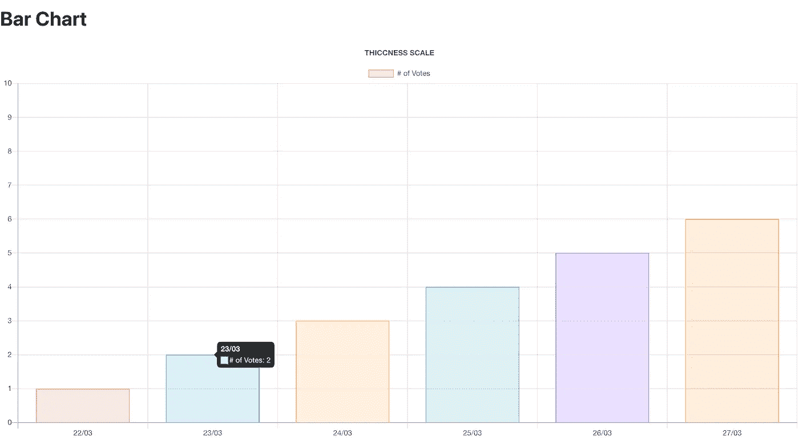
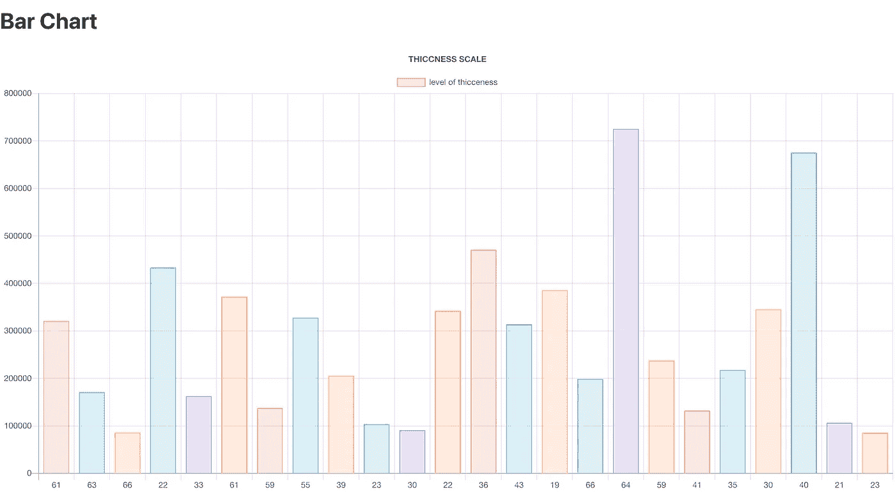
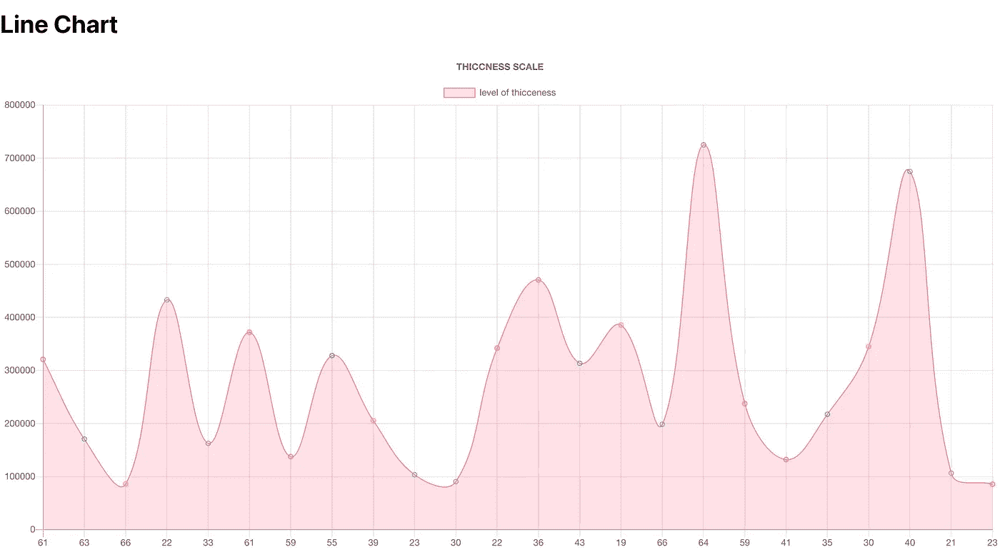
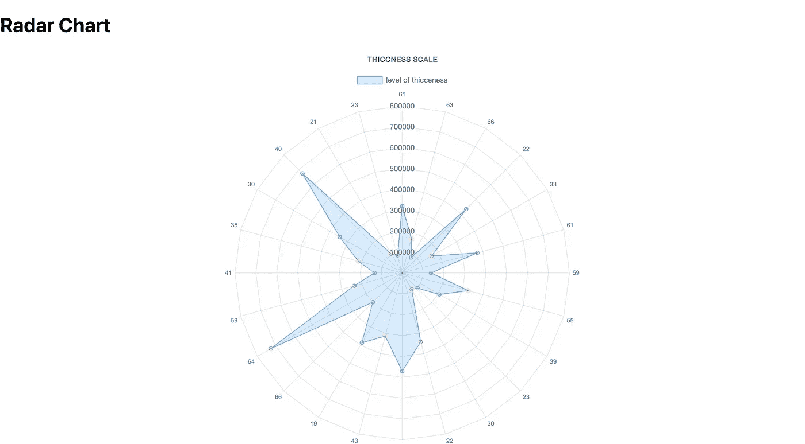
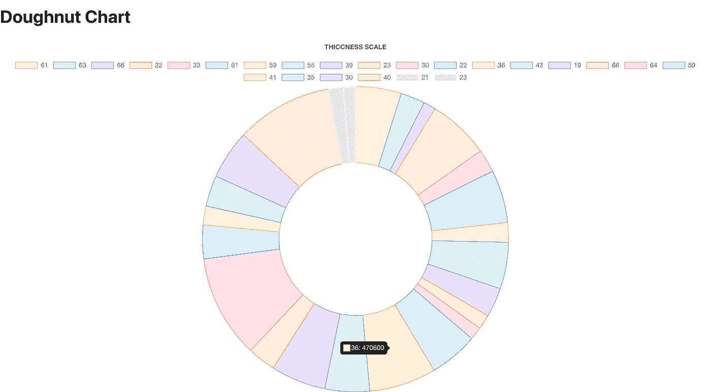
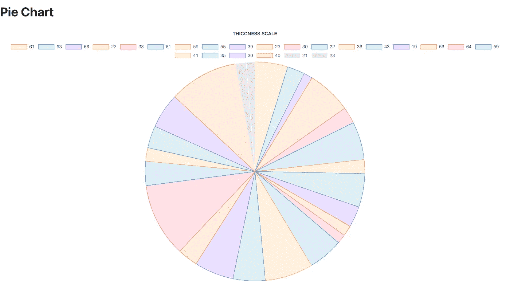
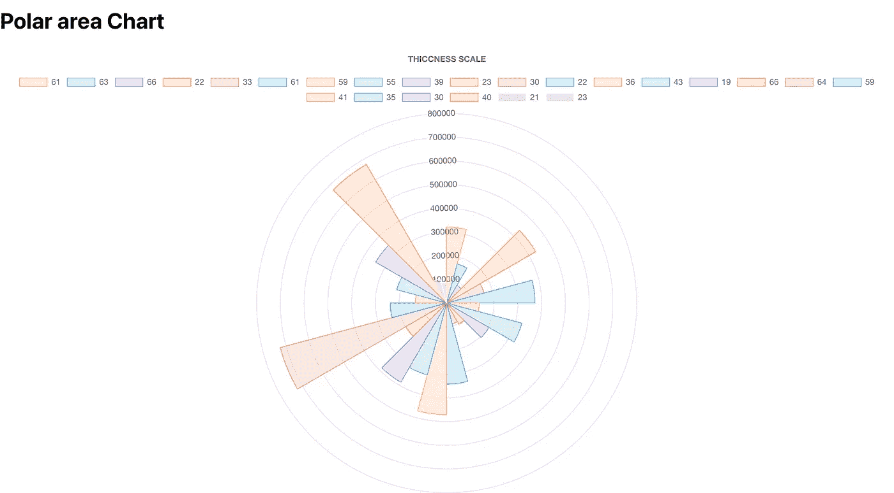

# 用 React JS 和 Chart JS 实现数据可视化

> 原文：<https://medium.com/codex/data-visualization-with-react-js-and-chart-js-cb6ca5d77ff6?source=collection_archive---------1----------------------->

## [法典](http://medium.com/codex)


你好，今天我将谈谈如何使用 React Js 来使用 great Chart Js charts，甚至如何使用 API 来动态地使数据可视化。

我想告诉你一些关于 Chart Js 的事情。Chart.js 是一个免费的开源 JavaScript 库，支持不同类型的图表用于数据可视化。

那么它支持哪些类型的图表呢？

📌线条

📌酒吧

📌雷达

📌油炸圈饼和馅饼

📌极区

📌泡泡

📌分散

如果你准备好了，我们开始吧！

要开始，您需要首先安装 React 应用程序。可以浏览一下:【https://reactjs.org/docs/create-a-new-react-app.html】T2

如果您已经安装了 React 应用程序，现在有必要为 React 设置 Chart Js。一行就够了。

> **通过 NPM 安装**

```
npm install --save react-chartjs-2 chart.js
```

> **通过纱线安装**

```
yarn add react-chartjs-2 chart.js
```

在加载之后，您需要创建一个 Js 文件，并导入想要与 react-chartjs-2 库一起使用的图表类型。

```
import { **Bar** } from 'react-chartjs-2'
```

然后我们创建一个名为 DynamicChart 的函数，创建一个名为 Chart 的函数，并开始执行操作。首先，创建常量变量来保存数据。

接下来，我们创建一个类似 Chart Js 文档中的结构，并静态地尝试我们自己的数据。

([https://www . chart js . org/docs/latest/getting-started/usage . html](https://www.chartjs.org/docs/latest/getting-started/usage.html))

您可以在这里设置带标签的水平数据和带数据的垂直数据。你也可以用背景和边框给它上色。用 **UseEffect** React 方法调用了
**Chart ()** 函数。return()后，在 **< Bar / >** 中指定从定义的 **chartData** 中接收数据，然后可以对图表外观的选项进行添加。

静态图表将如下所示:



好了，如果你已经学会了如何静态地制作条形图，我现在将解释如何通过从 API 中提取数据并做一些小的改动来制作动态条形图。

为此，首先你需要安装 **Axios。**

那么 Axios 是什么呢？
Axios 是一个 javascript 库，允许在客户端应用程序中进行简单的 HTTP 调用。可作为 npm 或 bower 包或通过 CDN 提供。

要在项目中包含 Axios，只需编写以下代码行

```
npm install axios --save 
```

然后，通过在 Chart()函数中键入 axios.get ('API URL)，您可以检查是否通过。然后和。在指定从哪个 URL 提取数据后，捕获方法。

现在需要拉这个数据。您需要定义两个字符串来处理 let 和 get salary 和 age。英寸然后，可以通过 for 循环解析 salary 和 age 变量来获取值。并且 **setChartData** 也必须括在。然后让这些值出现。

最后，为了实现动态，有必要将 empAge 和 empSal 数组指定到我们静态提供的标签和数据位置。这样，随着 API 的变化，数据也会发生变化。

从 API 中绘制的条形图视图如下所示。



是啊！通过这种方法，你可以从彼此身上看到丰富多彩且有用的数据。如果您想尝试不同的图表类型，您只需在导入部分写入名称，然后在导入的类型中写入您的值。

# 📌**折线图**

```
import { Line } from 'react-chartjs-2'
...
...return(
<Line
.
.
. />)
```



# 📌雷达图

```
import { Radar } from 'react-chartjs-2'
...
...return(
<Radar
.
.
. />)
```



# 📌甜甜圈和饼图

```
import { Doughnut } from 'react-chartjs-2'
...
...return(
<Doughnut
.
.
. />)
```



```
import { Pie } from 'react-chartjs-2'
...
...return(
<Pie
.
.
. />)
```



# 📌极区图

```
import { Polar} from 'react-chartjs-2'
...
...return(
<Polar
.
.
. />)
```



对，就是这样！我希望这篇文章对您使用 React Js 进行数据可视化有所帮助。

如果想复习，可以看看我的 github 项目:

[](https://github.com/Senakbulut/BarChart) [## senakbulut/条形图

### 这个项目的 API:http://dummy.restapiexample.com/api/v1/employees 这个项目是用 Create React 引导的

github.com](https://github.com/Senakbulut/BarChart) 

在我的下一篇文章中再见。