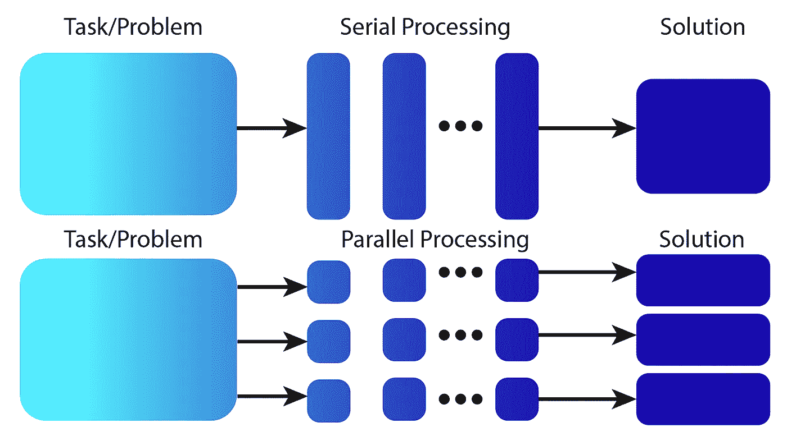

# 内存放不下数据？利用 Dask 进行并行计算！

> 原文：<https://medium.com/codex/data-wont-fit-in-memory-parallel-computing-with-dask-to-the-rescue-3403deac4c59?source=collection_archive---------11----------------------->

作者图片

# 并行编程

并行编程时有许多方面需要考虑。Ian Foster 在他的书*中概述了设计* *和构建并行程序* [1]的步骤。

福斯特指出了并行计算中存在的四个“理想属性”:**模块化**、**可伸缩性**、**并发性**和…