# 数据争论

> 原文：<https://medium.com/codex/data-wrangling-dc0f9c1843d8?source=collection_archive---------24----------------------->

## [法典](http://medium.com/codex)

数据争论是一个预处理阶段，数据从一种形式转换成另一种形式。该阶段的目的是使数据可用于分析，该阶段包括数据收集、探索性数据分析等。

在这个项目中，我使用来自瑞典非营利组织 Gapminder 的数据进行了数据辩论。

# **数据汇总:**

该数据文件夹包含三个 csv 文件，即:cell_phones.csv、population1.csv 和 ddf-entities-geo-country . CSV。

加载数据集并将其可视化。

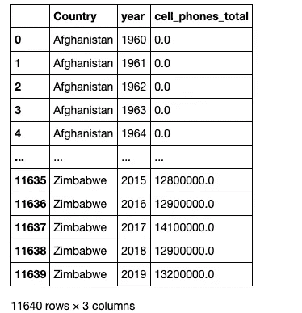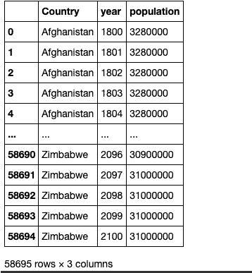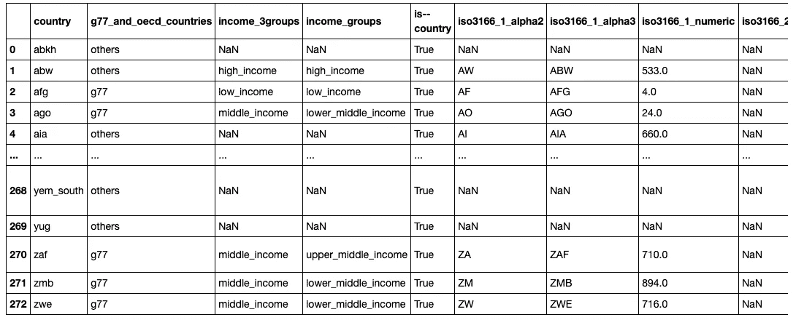

cell_phones.csv，population1.csv 和 ddf 实体-地理-国家. csv

我把手机和人口合并到国家和年份，并加入了内在论点。

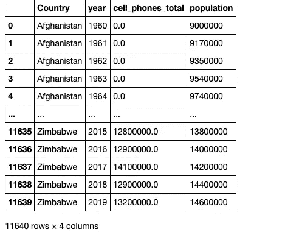

合并列

我将 country 和 name 重命名为 geo 和 country，重置 join_data 索引，并将 geo 和 country 合并到带有左侧参数的已合并数据集。

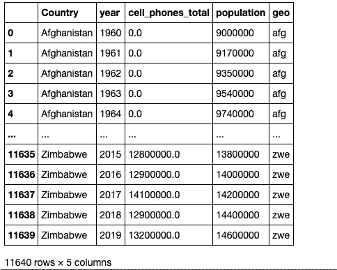

我计算了人口的手机总数，以创建人均手机数列，并检查了我的计算。

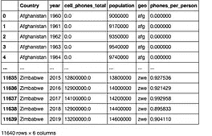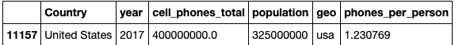

我将地理编码改为大写，并对数据集进行了总结。

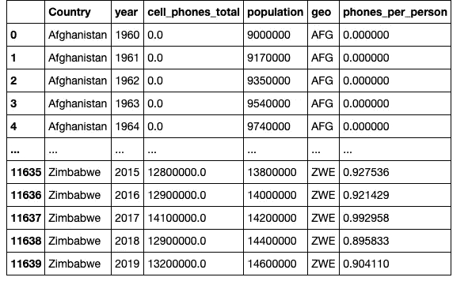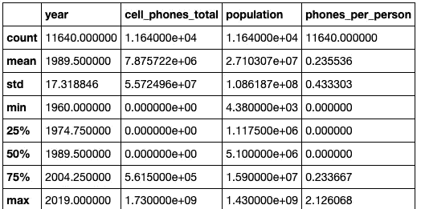

我检查了独特的国家准确性。

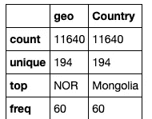

为了获得前五个国家，我创建了一个变量来显示 2017 年的国家，并按手机总数对前五个国家进行排序，显示最后 5 个国家。

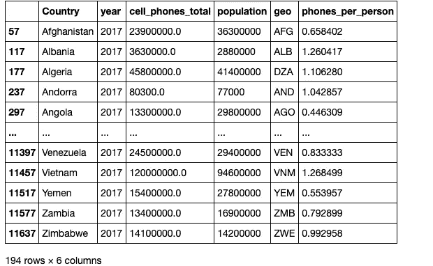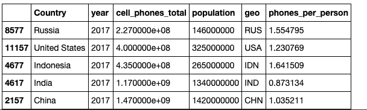

最后，我按标签、国家和年份显示了排名靠前的国家。

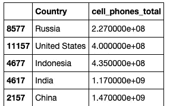

# **结论:**

这个项目的目的是展示在争论一个数据集时应用的不同技术。感谢您的阅读