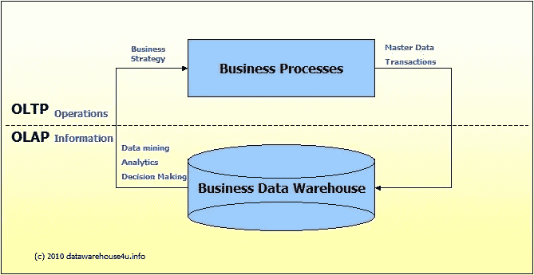
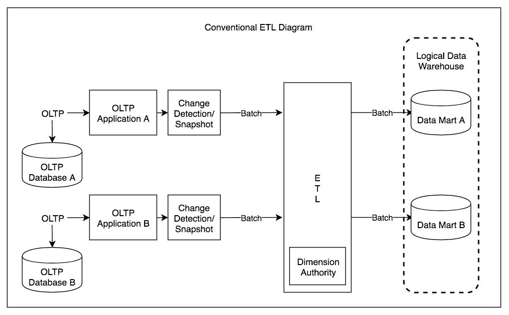

# 有目的的数据库设计

> 原文：<https://medium.com/codex/database-design-with-a-purpose-1b5c98801def?source=collection_archive---------10----------------------->

大卫·普帕扎在 [Unsplash](https://unsplash.com?utm_source=medium&utm_medium=referral) 上的照片

## [抄本](http://medium.com/codex)

我最近在 Flatiron 完成了一个沉浸式软件工程训练营，主要学习 Rails、Javascript 和 React。这些堆栈是学习如何构建我完成训练营所需的非常小的应用程序的好工具。虽然我在其他博客帖子中抱怨过训练营的设计，但公平地说，这种设计是为了让学生在尽可能短的时间内吸收尽可能多的信息。

随着训练营接近尾声，教学重点开始转移。最初，作为学生，我们的任务是简单地获取代码并呈现在页面上？到最后，重点是编写代码，然后可以被跟随我们脚步的开发人员使用。未来的开发人员能够理解并读懂我的代码吗？除了考虑未来开发我们的应用程序的开发人员，我们还被问到我们的应用程序是否是为增长而设计的。项目可扩展吗？

这种重心的转移是从学生转变为潜在雇员的决定性因素。我不仅需要改变我的编码方式，还需要能够思考我将在未来公司看到的代码库和环境。熨斗厂的项目非常小。我在尝试将我对数据库结构的理解应用到我每天使用的大量网站时遇到了困难。

那么一个网站是如何成长到如此大的规模的呢？一个关键因素是雇佣许多非常聪明的工程师，他们从一开始就有设计想法。那么数据库设计需要什么呢？所有数据库都需要模式。根据《牛津词典》，图式是“以大纲或模型的形式对计划或理论的表示”。更简单地说，它代表了应用于数据库中数据的结构。在 Flatiron，我使用 Rails 和面向对象语言来构建我的数据库。并非所有的数据库都是对象数据库，这就是为什么许多面向对象语言使用[ORM 来帮助解决这个问题](https://james-ardery.medium.com/to-abstract-or-not-to-abstract-the-orm-question-8b2f6d4e264)。Rails 以表格格式组织数据库模式。表之间的关系也是通过 has_many 或 owners _ to 模型关联来建立的。

关系、索引、目录、视图和表都是架构中组织数据的方式。但是，有些数据库存储数据没有结构，只有在数据库被查询时才应用结构。每个主要的数据库供应商(SQLite、MongoDB、Oracle、Hadoop、Snowflake、Microsoft 等)都以不同的方式处理数据库的结构化。

如果数据库以非结构化格式存储数据，因此只有在读取/查询/提取数据时才应用模式，它是读取数据库 (Hadoop)上的[模式。在数据可以被写入/放入之前，强制将结构作为条件的数据库是写数据库](https://www.techopedia.com/definition/30153/schema-on-read#:~:text=Schema%20on%20read%20refers%20to,than%20as%20it%20goes%20in.) (SQLite)上的[模式。](https://www.techopedia.com/definition/30899/schema-on-write) [NoSQL](https://www.youtube.com/watch?v=BgQFJ_UNIgw) 是这两种结构之间的中间地带，它允许你对进入数据库的数据应用一种结构，但并不要求它(MongoDB)。

那么这些结构之间有什么共同的应用/优势呢？为快速读写单个记录而设计的模式属于写入模式的范畴。应用于这些数据库中的数据和相应表的结构通常通过主键连接。快速读写数据库的便利性使这种结构最适合于专注于银行/信贷、电子商务或零售的应用程序。在家得宝结账时扫描商品将快速更新系统数据库，以读取和写入来自其库存的新商品。数据库结构需要非常简单、快速和敏捷，以处理大量的请求。即使内置系统出现故障，逻辑也足够简单，可以确保数据完整性。这些交易提供了当前业务活动的即时记录。这种类型的系统通常被称为在线事务处理(OLTP)。

相反，以阅读布局模式构建的数据库通常侧重于分析处理。存储大量数据，但在提取数据时只应用基于所应用的查询的结构，这并不注重速度。数据库作为一个仓库，只有在使用特定的查询指令进入仓库时，才考虑对数据的分析。这些在线分析处理系统(OLAP)用于数据挖掘、分析或商业智能项目。建立了一个 OLAP 系统，它需要来自 OLTP 系统的数据来执行查询。在我看来，OLAP 是机器学习生活的地方。当我喜欢一首歌或在 Spotify 上创建一个播放列表时，这些都是交易。创建、写入和读取与我的个人资料相关的实例应该是 Spotify 数据库(OLTP)的快速事务。然而，当 Spotify“接管”并最终选择播放的下一首歌曲时，在没有我的用户输入的情况下，这是一个来自不同 Spotify 数据库的更慢更周到的查询，很可能是一个 OLAP 系统。

当数据库被设计为不同用途的 OLTP + OLAP 时，必须使用 ETL 工具。ETL 是 extract transform load 的缩写，该工具用于从 OLTP 系统中提取数据，将数据转换为干净的格式或结构，然后加载到 OLAP 数据库中，并可用于复杂的查询。

## 参考资料:

 [## 数据库管理系统的类型

### 数据库是数据或记录的集合。数据库管理系统是用来管理数据库的。一个数据库…

www.c-sharpcorner.com](https://www.c-sharpcorner.com/UploadFile/65fc13/types-of-database-management-systems/)  [## 如何构建数据仓库

### 我们的原始视频问“你如何知道你是否有一个数据仓库？”有关什么是数据的支持白皮书…

www.intricity.com](https://www.intricity.com/whitepapers/peeling-the-onion-developing-a-data-warehouse)  [## MongoDB vs SQLite:有什么区别？

### Mongo 是所有 NoSQL 数据库中最广为人知的，也是 JS-heavy MEAN stack 不可或缺的一部分。很受欢迎…

www.codeclouds.com](https://www.codeclouds.com/blog/the-differences-between-mongodb-and-sqlite/)