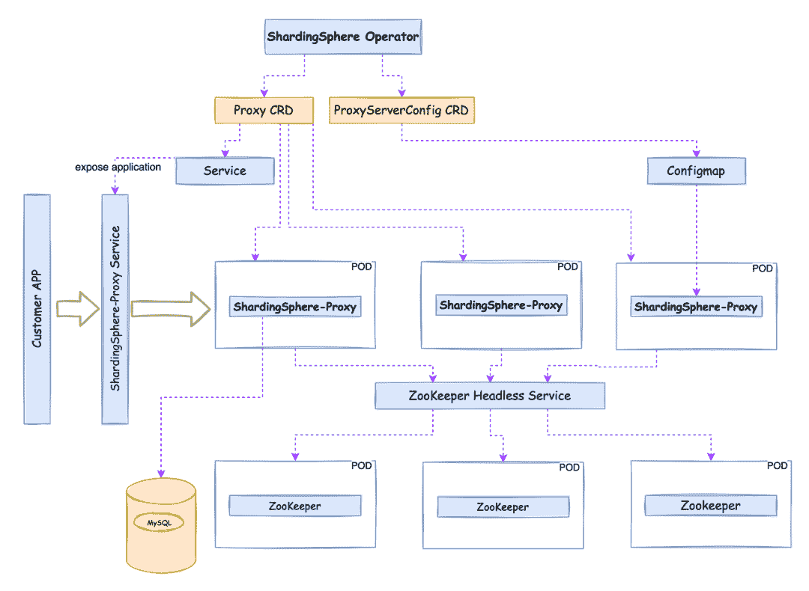

# Database Plus 拥抱云:ShardingSphere-on-Cloud 解决方案发布

> 原文：<https://medium.com/codex/database-plus-embracing-the-cloud-shardingsphere-on-cloud-solution-released-29916290ad06?source=collection_archive---------16----------------------->

作为[数据库加](https://faun.pub/whats-the-database-plus-concepand-what-challenges-can-it-solve-715920ba65aa?source=your_stories_page-------------------------------------)开发理念的追随者， [ShardingSphere](https://shardingsphere.apache.org/) 已经成功通过了跨多个行业的生产环境测试，并在社区爱好者中获得了普及。

随着 [Kubernetes](https://kubernetes.io/) 成为容器编排的事实上的标准，云原生概念已经在技术世界流行开来。Apache ShardingSphere 作为一个开放生态系统的数据库增强引擎，在设计理念上与 Kubernetes 有很多相似之处。因此, [SphereEx](https://www.sphere-ex.com/en/) 率先推出了 ShardingSphere-on-Cloud，它是 ShardingSphere 的云解决方案。Database Plus 的云计算之旅正式开始了。

云上 ShardingSphere 存储库将发布其最佳实践，包括配置模板、自动化脚本、部署工具和 Kubernetes Operator for Apache sharding sphere on the Cloud。目前，ShardingSphere-on-Cloud 已经发布了 V0.1.0，其中包含了 ShardingSphere Operator 的最小可用版本。

# 切分球算子

Kubernetes 成为云原生编排工具的事实上的标准的一个关键原因是其强大的可扩展性，使开发人员能够在其他平台上快速构建平台。

对于试图在 Kubernetes 上运行的各种软件，可以使用 Kubernetes 操作员模式与`CustomResourceDefinition`框架一起快速构建自动维护能力。

上个月，Apache ShardingSphere v5.1.2 发布了基于[舵图的包管理](https://faun.pub/shardingsphere-cloud-applications-an-out-of-the-box-shardingsphere-proxy-cluster-9fd7209b5512?source=your_stories_page-------------------------------------)功能。Helm Charts 帮助我们处理第一步，即如何在 Kubernetes 中描述和部署 ShardingSphere。

第二步关注如何在 Kubernetes 中管理有状态的或复杂的工作负载，这需要一个定制的管理工具。在这种情况下，SphereEx 的云团队开发了 **ShardingSphere 操作符**来进一步增强 ShardingSphere 在 Kubernetes 之上的部署和维护能力。



为了应对 Apache ShardingSphere 迁移到 Kubernetes 环境时所面临的挑战，ShardingSphere 做了以下改进。

*   **简化启动配置:** ShardingSphere 具有很强的数据库增强能力，其对应的配置相对复杂。在当前版本中，ShardingSphere Operator 自动化了配置和配置的挂载行为。用户只需要填写最小启动依赖配置，就可以快速部署和启动一个 sharing sphere-Proxy 集群。运行时配置可以通过 [DistSQL](https://shardingsphere.apache.org/document/5.1.0/en/concepts/distsql/) 实现。
*   **治理节点自动部署:** ShardingSphere 依靠治理中心实现元数据持久化，并在运行过程中实现集群节点间的元数据广播。为了优化用户体验并提供开箱即用的体验，ShardingSphere Operator 可以将治理节点与计算节点一起部署，并根据用户需求配置依赖关系。
*   **高可用性:**为了简化云环境中的维护，最好实现无状态部署。作为无状态计算节点， [ShardingSphere-Proxy](https://shardingsphere.apache.org/document/current/en/quick-start/shardingsphere-proxy-quick-start/) 可以配合 ShardingSphere Operator 实现多维健康检测和故障转移恢复。
*   **水平伸缩:**基于 CPU 和内存，使用 Kubernetes 中的 [HPA，可以实现 ShardingSphere-Proxy 水平伸缩。ShardingSphere Operator 将逐步支持各种定制规范，以实现高级的自动缩放，对于 ShardingSphere-Proxy 来说，这种缩放更加智能和稳定。](https://kubernetes.io/docs/tasks/run-application/horizontal-pod-autoscale/)

具体来说，在 0.1.0 版本中，ShardingSphere Operator 主要支持以下功能:

# 舵展开

> **切割球-操作图**

*   支持部署 ShardingSphere-Operator。

> **分割球簇图**

*   支持 ShardingSphere-Proxy 集群的部署。
*   通过[比特纳米](https://bitnami.com/)支持[动物园管理员](https://zookeeper.apache.org/)集群的部署。
*   ShardingSphere-Proxy 可以自动配置并连接到治理节点。

> **使用 Github 页面托管图表，并使用** `**helm repo add**`添加存储库

## **新功能**

*   `shardingsphereproxy` CRD 可以用来描述 sharing sphere-Proxy 集群信息。
*   本机 ShardingSphere-Proxy `server.yaml`配置可用于启动。
*   支持根据 CPU 规格自动横向扩展 HPA 配置。
*   支持自动下载 [MySQL](https://www.mysql.com/) 驱动。

其他配置信息参见项目[自述](https://github.com/SphereEx/shardingsphere-on-cloud/blob/main/README.md)。

## **快速启动**

您可以运行以下命令:

```
kubectl create ns sharding
helm repo add shardingspherecloud https://sphereex.github.io/shardingsphere-on-cloud/ 
helm install operator shardingspherecloud/shardingsphere-operator -n sharding
helm install cluster shardingspherecloud/shardingsphere-cluster -n sharding
```

上面的命令将根据默认配置在 sharding 名称空间中安装 ShardingSphere Operator、ShardingSphere-Proxy 集群和 ZooKeeper 集群。

可以通过服务在集群中访问 ShardingSphere-Proxy。然后通过 MySQL 客户端，使用 DistSQL 创建逻辑数据库，添加数据源并创建相应的规则表。然后就可以开始使用运行在 Kubernetes 上的 ShardingSphere-Proxy 了。

# 未来计划

ShardingSphere 运营商将逐步优化 ShardingSphere-Proxy 的部署模式，提高其自动维护能力，并不断打磨其在高可用性和灾难恢复场景方面的性能，努力给用户带来极致的云原生体验。

sharding sphere-on-Cloud repository 将继续从社区中吸收各种云实践，以构建一个面向云、受益于云并能增强云上数据库能力的开放生态系统解决方案。

如果你有什么要和我们分享的，请随时通过 GitHub Issue 或 Apache ShardingSphere Slack 联系我们。

## 项目链接:

[ShardingSphere 运营商 GitHub](https://github.com/SphereEx/shardingsphere-on-cloud)

[ShardingSphere Github](https://github.com/apache/shardingsphere/issues?page=1&q=is%3Aopen+is%3Aissue+label%3A%22project%3A+OpenForce+2022%22)

[ShardingSphere Twitter](https://twitter.com/ShardingSphere)

[切割球松弛度](https://join.slack.com/t/apacheshardingsphere/shared_invite/zt-sbdde7ie-SjDqo9~I4rYcR18bq0SYTg)

[投稿指南](https://shardingsphere.apache.org/community/cn/contribute/)

GitHub 问题

[投稿指南](https://shardingsphere.apache.org/community/en/contribute/)

[spherex 官网](https://sphere-ex.com/)

# 作者

SphereEx Cloud & ShardingSphere 贡献者团队。关注 ShardingSphere 的云解决方案 R&D、数据库网格开源社区和 SphereEx 云业务。