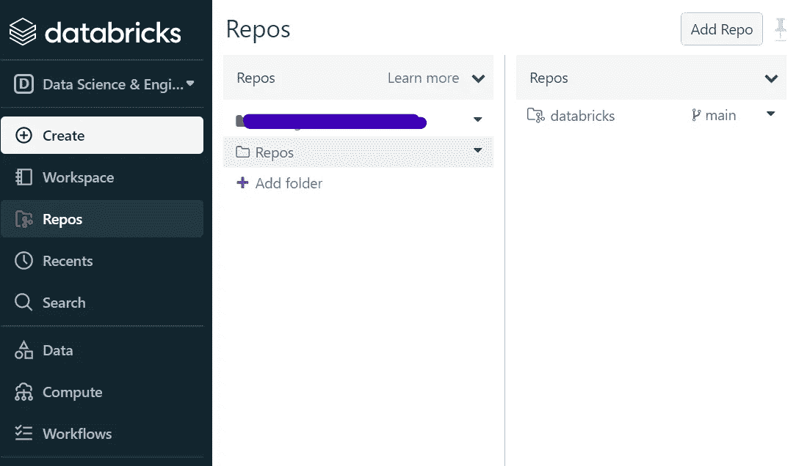

# Databricks CICD 采用回购方法，使用 Azure DevOps

> 原文：<https://medium.com/codex/databricks-cicd-using-repo-approach-using-azure-devops-8c4f64332761?source=collection_archive---------0----------------------->


Jez Timms 在 [Unsplash](https://unsplash.com?utm_source=medium&utm_medium=referral) 上拍摄的照片

数据砖块的 CICD 真的很有挑战性。使用回购方式让我们的生活变得轻松许多。为此，我们利用了存储库集成和来自 Databricks 的构建良好的 API，我们将对此进行详细研究。

# 概观

在这篇博客中，我将向您展示如何使用 Databricks 存储库方法实现令人信服的 CICD 管道。这将通过使用 Azure DevOps 来完成，但该演示的功能可在所有 CICD 工具上重用。这条 CICD 管道的整个理念与 [Databricks 回购工作流程](https://docs.microsoft.com/en-us/azure/databricks/repos/ci-cd-best-practices-with-repos)紧密相连。在这个演示之后，我还将讨论这种方法的替代方案，以及我们何时应该考虑使用它。

# 回购方法

## 准备

在我们开始之前，让我们讨论一下我们必须遵守的要求，以便能够实现这种方法。我们需要在 Databricks 中配置我们的 Git 集成，还需要一个 Azure DevOps 项目。

对于我们的 Git 集成，第一步是进入设置>用户设置> Git 集成。在这里，您需要插入您的 Git 凭证。例如，在使用 GitHub Enterprise 的情况下。之后，您可以在回购文件夹上导航，并在此创建您的回购克隆。最佳实践是创建一个名为“Repos”的空文件夹，并将克隆的存储库插入到这里。您需要为您的 Databricks 开发环境以及您希望用您的 CICD 管道作为目标的每个环境执行这个步骤。完成这些步骤后，您应该有一个回购文件夹，它应该是这样的:



集成知识库

## 数据块 API

管道的工作方式如下。它由您定义的事件触发(例如您的主分支机构的 PR ),并调用 Databricks [repos API](https://docs.databricks.com/dev-tools/api/latest/repos.html) 。使用这个 API，您能够在您的目标工作空间中更新或者替换您的存储库的当前分支。这意味着，如果您从您的开发数据块提交到您的主分支，您可以通过使用这个 API 调用，自动更新您的 TST 和 PRD 数据块环境中的存储库的每个克隆。这是使用以下 API 完成的:

```
/repos/{repo_id}#full example
https://adb-66210.0.azuredatabricks.net/api/2.0/repos/629 
```

使用 Databricks API 来完成这个任务，我们需要一些信息来使它工作。这包括:

*   数据块访问令牌(针对每个环境)
*   数据块工作空间 URL(针对每个环境)
*   存储库 ID(针对每个环境)
*   您要使用的分支

可以在设置>用户设置>访问令牌>生成令牌下创建令牌。

对应于您的 Databricks 工作区的 URL 就是您打开 Databricks 环境时浏览器显示的 URL。复制所有内容直到。网(如[https://adb-66210.0.azuredatabricks.net](https://adb-66210.0.azuredatabricks.net))。

如果右键单击克隆的 repo 文件夹> Git，可以找到存储库 ID...>设置，您可以在这里看到它。

这个分支就是您想要更新到目标环境中的分支。它可以是你的主分支或者任何其他类似的发布分支。

如果使用 CURL，将所有内容放在一起看起来像这样:

```
curl -X PATCH "https://adb-66210.0.azuredatabricks.net/api/2.0/repos/629"-H "Authorization: Bearer 1234"-H "Content-Type: application/json"-d '{"branch": "main"}'
```

## 管道

现在让我们看看基于 yaml 的 Azure DevOps 管道是什么样子的。因为我们使用的是之前的 curl 命令，所以我们将使用 bash 任务。

如您所见，在本例中，如果主分支发生变化，我们将触发管道。管道只是从前面调用 curl 语句来更新我们的目标 Databricks 环境中的存储库。

Azure DevOps 环境变量$(Build。SourceBrancheName)被用作 curl 主体的输入，这为我们提供了灵活性，我们可以添加更多的分支来触发这个管道。那么触发管道的分支将在我们的目标管道中得到更新。

如果您想在生产环境中使用这段代码，也要记住使用类似 Azure Key Vault 的东西来获取秘密。这只是为了演示而简化的。

# 供选择的

除了使用回购方式，你还可以使用[更经典的方式](https://docs.microsoft.com/en-us/azure/databricks/dev-tools/ci-cd/ci-cd-azure-devops)。这是通过创建您的数据块代码的工件，将它们捆绑到您的 CI 管道中，然后通过将它们推入共享工作区，将它们推向您的目标环境来实现的。

这种方式比回购方式复杂得多，也容易出错，但它也有一个很大的优势。您能够执行[单元测试，并与库](https://docs.microsoft.com/en-us/azure/databricks/dev-tools/ci-cd/ci-cd-azure-devops)进行更深入的集成。

作为结论，您可以说，如果您只需要将代码部署到其他数据块环境，请使用 repo 方法。但是如果你需要做更复杂的事情，比如单元测试，你应该研究一下经典的方法。