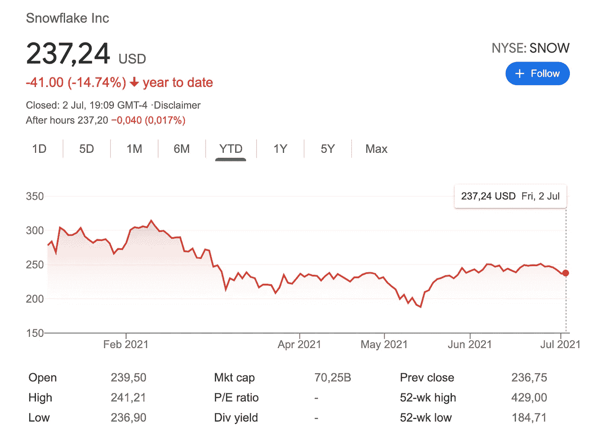

# Databricks 即将进行的首次公开募股是释放人工智能技术浪潮的基石。

> 原文：<https://medium.com/codex/databricks-pending-ipo-is-a-building-block-in-unleashing-a-ai-technological-wave-7f59e72c5527?source=collection_archive---------4----------------------->

阿里·古迪，Databricks 联合创始人兼首席执行官(来源:托德·约翰逊，[《旧金山商业时报》](https://www.bizjournals.com/sanfrancisco/about-us))

## Databricks 将如何成为渴望数据的人工智能公司的平台。

总部位于旧金山的科技公司 [Databricks](https://databricks.com/) 正日益吸引投资者的注意。去年 2 月，在富兰克林邓普顿(Franklin Templeton)的带领下，该公司在 G 轮融资中筹集了 10 亿美元，融资后估值达到了令人印象深刻的 280 亿美元。它是全球估值最高的上市前科技公司。分析称其为下一个雪花，该公司股票于 2020 年 9 月 16 日以 120 美元上市，并在交易首日上涨 104%，达到 245 美元，目前为 237 美元。

雪花公司的历史股票表现图。

它成立于 2013 年，由一群理科生创立，是一家专注于数据和人工智能的企业软件公司。它开发了一个基于 web 的平台，可以与存储在公共云中的企业信息进行交互。

其中，可以找到超过 5000 个客户，像 Nationwide、Condé Nast 和 Comcast 这样的大公司。

由这样的大玩家支持的数据块是可以理解的，因为它们为企业提供了价值；私人、公共和政府。它们消除了为组织的重要但非核心的数据业务构建、收集和集中数据的技术挑战和专业知识，然后这些数据可用于开发人工智能驱动的业务模型。

机器学习教学和数据收集是开发新系统和新产品所必需的任务如何消耗资源的好例子。数据收集本质上通常需要数据科学家处理和分析数 Pb 的数据。

内部解决方案的实施成本很高，内包体系结构和技术专业人员可能非常耗时、管理复杂且成本高昂。

这就是 Databricks 的用武之地。它像云一样工作，使破坏性项目能够顺利运行。他们负责这些任务，这让公司的团队做他们最擅长的事情。

这是科技行业当前趋势的一部分，即“租赁”公司执行主要活动所需的服务，而不是通过直接雇佣和拥有基础设施和专业知识来“购买”。

它的首席执行官，瑞典-伊朗裔计算机科学家和企业家[阿里·高德西](https://en.wikipedia.org/wiki/Ali_Ghodsi)，他也是伯克利的兼职教授，与伯克利教授[斯科特·申克](https://en.wikipedia.org/wiki/Scott_Shenker)，以及[尼奇拉](https://en.wikipedia.org/wiki/Nicira)的联合创始人/前首席执行官共同创建了它；[扬·斯托伊察](https://en.wikipedia.org/wiki/Ion_Stoica)，柏克莱教授、 [Conviva](https://en.wikipedia.org/wiki/Conviva) 联合创始人兼 CTO [Matei Zaharia](https://en.wikipedia.org/wiki/Matei_Zaharia) ，他创造了 Apache Spark，目前是斯坦福大学的教授。他们都还在 Databricks 任职。其他联合创始人是 Andy Konwinski、Patrick Wendell、 [Reynold Xin](https://en.wikipedia.org/wiki/Reynold_Xin) 和 Arsalan Tavakoli-Shiraji，他们都是前伯克利博士生和 Apache Spark 委员会成员。

他们最初合作推出 Spark，这是一个用于管理大数据的开源引擎，2009 年仍在伯克利的 AMPLab。越来越多的使用人工智能和机器学习等系统的需求使得该平台被广泛采用。

从这次冒险中，Databricks 诞生了，为企业将软件商业化。

这些年来，该公司表现非常出色，从加利福尼亚州的一个小办公室发展到拥有 1000 多名员工，并在加拿大、英国、荷兰、新加坡、澳大利亚、德国、法国、日本、中国和印度开展业务。它的商业模式被证明是成功的，有一系列四个开源产品，其中一个核心数据湖产品称为 Delta Lake，是旗舰产品。截至 2020 年，该公司的 ARR 为 4.25 亿美元，较上年同期增长 75%。

两年前，在一轮 4 亿美元的融资后，该公司的估值为 62 亿美元，不到目前的 280 亿美元。这种快速的增长使得投资者竞相从中分一杯羹。除了富兰克林邓普顿，富达，微软，亚马逊网络服务和 Salesforce Ventures 也获得了他们的。

顶级玩家对它的兴趣不仅仅基于成倍的投资因素，还基于 Databricks 在科技生态系统中的作用。它在开源生态系统中的发展有助于简化机器学习工作流，这有助于提高其客户自己的开发项目的效率。其首席执行官 Ali Ghodsi 表示，Databricks 是有史以来发展最快的 SaaS 企业公司。

谁也不想错过参与基本面这么好的公司的机会。

当寻找有前途的公司作为投资机会时，那些能够为其他企业提供价值的公司肯定是一个安全的赌注。在这个群体中，Databricks 脱颖而出。这些是其 280 亿美元估值的部分原因。

尽管 Databricks 尚未提交 IPO 文件，但据信它将在今年任何时候上市。

让我们拭目以待。当然，这是值得关注的。