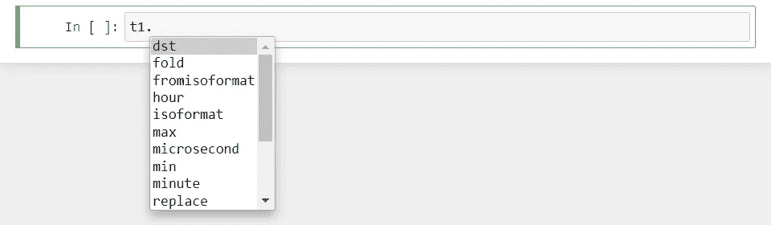
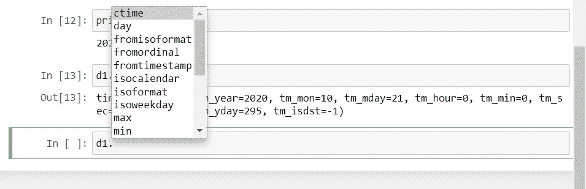

# Python 中的日期时间模块

> 原文：<https://medium.com/codex/datetime-module-in-python-b1ea2987a8bd?source=collection_archive---------0----------------------->

## Python 中日期时间模块的理解指南。


[Icons8 团队](https://unsplash.com/@icons8?utm_source=medium&utm_medium=referral)在 [Unsplash](https://unsplash.com?utm_source=medium&utm_medium=referral) 上的照片

# 时间

这个模块帮助处理时间戳。时间类具有小时、分钟、秒和微秒等属性。

```
**>>> import** datetime
```

让我们创建一个时间戳。参数按以下顺序排列:小时、分钟、秒、微秒、时区信息。

```
>>> t1 **=** datetime.time(6, 4, 2)>>> print(t1)
06:04:02
```

正如你可以有各种方法可以使用。



```
>>> t1.hour
6>>> t1.minute
4>>> t1.microsecond
0>>> print(t1.tzinfo)
None
```

我们也能得到我们能拥有的最少和最多的时间。

```
>>> print(datetime.time.min)
00:00:00>>> print(datetime.time.max)
23:59:59.999999
```

# 日期

现在看看日期。有一个约会类。这些属性是年、月和日。

```
>>> d1**=** datetime.date.today()>>> print(d1)
2020-10-21>>> d1.timetuple()
time.struct_time(tm_year=2020, tm_mon=10, tm_mday=21, tm_hour=0, tm_min=0, tm_sec=0, tm_wday=2, tm_yday=295, tm_isdst=-1)
```

我们还可以获得日期的最小值和最大值。

```
>>> print(datetime.date.min)
0001-01-01>>> print(datetime.date.max)
9999-12-31
```

这些是可以使用的各种方法。



我们可以使用 replace 方法来更改现有的日期。

```
>>> d2 **=** datetime.date(2020, 10, 21)>>> print(d2)
2020-10-21>>> d3 **=** d2.replace(year **=** 2019)>>> print(d3)
2019-10-21
```

检查时差的算术运算。

```
>>> d2 **-** d3
datetime.timedelta(days=366)
```

参考笔记本[这里](https://github.com/jayashree8/Python_guide/blob/master/Python%20modules%20and%20packages/Datetime%20module%20in%20python.ipynb)。

## 学习 Python 可以参考的入门书籍:

[](https://amzn.to/3yDY4To) [## Python 速成班，第二版:基于项目的编程入门实践

### 世界上最畅销的 Python 书籍的第二版。一个快速的，没有废话的 Python 编程指南…](https://amzn.to/3yDY4To) [](https://amzn.to/3vtvQZv) [## 艰难地学习 Python:一个非常简单的介绍可怕的美丽世界…

### 你会学习 Python！Zed Shaw 完善了世界上最好的学习 Python 的系统。遵循它，你会…](https://amzn.to/3vtvQZv) [](https://amzn.to/3urluYI) [## 思考 Python，2e:如何像计算机科学家一样思考

### 思考 Python，2e:如何像计算机科学家一样思考](https://amzn.to/3urluYI) 

## 学习 Python 可以参考的高级书籍:

[](https://amzn.to/3fMzVBn) [## 编程 Python:强大的面向对象编程

### 如果你已经掌握了 Python 的基础，你就可以开始使用它来完成真正的工作了。编程 Python 将…](https://amzn.to/3fMzVBn) [](https://amzn.to/34oFFMl) [## 高级 Python 编程:使用以下工具构建高性能、并发和多线程应用

### 关键特性使用 Dask 和 PySpark Master 技能在集群上设置和运行分布式算法，以准确地…](https://amzn.to/34oFFMl) 

> *联系我:* [*LinkedIn*](https://www.linkedin.com/in/jayashree-domala8/)
> 
> *查看我的其他作品:* [*GitHub*](https://github.com/jayashree8)