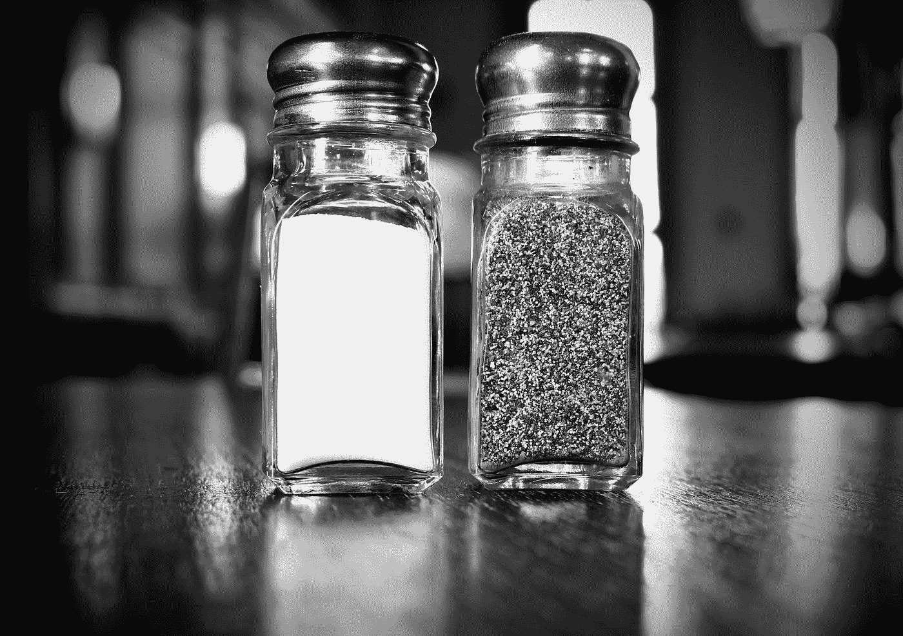

# Power BI DAX 和 SQL —前 N 名

> 原文：<https://medium.com/codex/dax-and-sql-top-n-73cc1bdce079?source=collection_archive---------4----------------------->

## …使用国别和等级

由[拉克伦](https://unsplash.com/@lachlancormie?utm_source=medium&utm_medium=referral)在 [Unsplash](https://unsplash.com?utm_source=medium&utm_medium=referral) 拍摄的照片

从 Power BI 开始？学一点 SQL？

Power BI 和 SQL 配合得很好，了解一点 DAX 将有助于您了解一点 SQL，反之亦然。

下面是使用 DAX 和 SQL 按组进行 top 3 的两种不同方法。