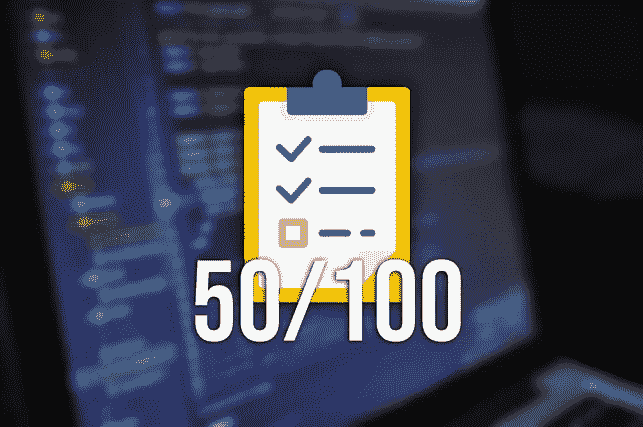
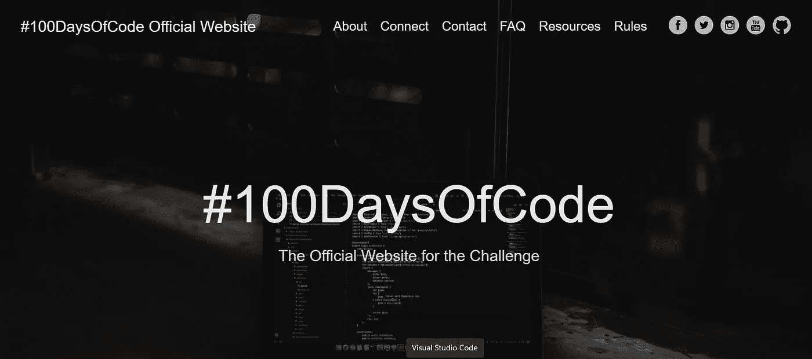

# #100DaysOfCode 的第 50 天:这是我到目前为止学到的

> 原文：<https://medium.com/codex/day-50-of-100daysofcode-this-is-what-i-have-learned-until-now-77835cafb21?source=collection_archive---------12----------------------->

## 我自己也对我做过的事情的数量感到惊讶

在过去的 50 天里，我每天至少花一个小时为**编码。今天我要告诉你我做过的所有事情。**

目前，我是后端开发人员。为了让自己为成为一名伟大的开发人员做好准备，我跟随一个挑战**创造每天编码的习惯**。当我开始的时候，我认为它会很难，我不得不强迫自己编码。

然而，真实的体验**却完全相反**。我喜欢花一个小时的空闲时间编写代码和学习计算机科学。此外，**我在翻我每天只花一个小时做的事情的数量**。

你不信任我吗？那么让我来发现我在参加#100DaysOfCode 挑战的头 50 天里做了什么的真相。

# 什么是#100DaysOfCode？

[#100DaysOfCode](https://www.100daysofcode.com/) 是[亚历山大·卡拉威](https://medium.com/u/c852ec9b2c3d?source=post_page-----9b8a5f5fcfd--------------------------------)为了培养编码习惯而创立的编码挑战。它只有两条规则:

1.  代码**在接下来的 100 天里每天最少一小时**。
2.  **每天用#100DaysOfCode 标签发布你的进度**。

如果你查看挑战赛的 FAQ 页面，你会看到一条“额外规则”,让挑战赛变得简单了一些。额外的规则是，你可以缺席一天，但绝对不能连续缺席两天。

# [100DaysOfCode](https://www.100daysofcode.com/) 官方网页

如果您想了解更多关于这项挑战的信息，请不要忘记查看这篇文章:

 [## 面对这个挑战，我正在成为一名更好的开发人员

### 你知道吗，要成为一个每天只花 1 小时的优秀开发者，这在互联网上是一个挑战。🤯💻

python .平原英语. io](https://python.plainenglish.io/with-this-challenge-i-am-becoming-a-better-developer-9b8a5f5fcfd) 

你觉得怎么样？如果你对它的影响有所怀疑，让我向你展示由于这个挑战我可以做的许多事情。

# 挑战结束后，我做了什么？

目前，我完成了 50 天(我的第 50 天是今天)。

到目前为止，我已经做了…

*   我的**个人项目** [桌面羊驼](https://github.com/Lagaress/Desktop-Alpaca)。
*   学会了**自举**。
*   用 C++ 中的**树**和**图提高了我通过大学科目“非线性数据结构”的能力。**
*   作为一名**后端开发人员**的一部分，我学习并改进了一些概念(基于主干的开发、干净的架构、存储库模式、单元测试、Jest、代码优化、扩展我的代码的方法、良好实践、REST 标准、HTTP 请求，以及使用 TypeScript 和 NodeJS 的大量时间)。
*   17 [**LeetCode**](https://leetcode.com/) 挑战。
*   31 [**HackerRank**](https://www.hackerrank.com/dashboard) 挑战。
*   5[**CodeWars**](https://www.codewars.com/dashboard)中的武士刀。
*   **10 天的 JS** ( [HackerRank](https://www.hackerrank.com/dashboard) )。
*   **30 天代码** ( [HackerRank](https://www.hackerrank.com/dashboard) )。
*   Python(基础)、JavaScript(基础)、问题解决(基础)、SQL(基础)认证( [HackerRank](https://www.hackerrank.com/dashboard) )。
*   JavaScript 算法和数据结构认证( [freeCodeCamp](https://www.freecodecamp.org/) )。
*   React 101 课程( [CodeAcademy](https://www.codecademy.com/learn/introduction-to-javascript) )。
*   学习 JavaScript 认证( [CodeAcademy](https://www.codecademy.com/learn/introduction-to-javascript) )。
*   现代 JavaScript 课程完全指南([教育性](https://www.educative.io/explore))。
*   开始并放弃了 [freeCodeCamp](https://www.freecodecamp.org/) 的“后端开发和 API”课程。

所有这些都是按照我的计划成为更好的开发者的结果。你想知道更多吗？然后查看这篇文章:

 [## 想成为更好的开发者？这是我实现它的计划

### 我会告诉你我的两步计划，在 2022 年成为一名更好的开发者。跟着它，我能够得到我的电流…

medium.com](/codex/want-to-become-a-better-developer-this-is-my-plan-to-achieve-it-1ec318f5200d) 

*现在，是时候回顾过去，做一点反思了:*

# 回顾中的反思

老实说，每当我看着我记录每一天的 Twitter 帖子时，我都非常惊讶。这是因为俗话说得好:

> “大多数人高估了他们一天能做的事，低估了他们一小时能完成的事。”

嗯，我知道上面的句子并不完全是原来的那句话，但是我做了一点修改，以完全符合这篇文章。令人难以置信的是，我们每天只花一个小时就能完成多少事情。

现在每天都很容易达到这个目标，我在软件行业工作，所以我在工作中只写一个多小时的代码，但是我开始这个挑战的时候是夏天。多亏了这个挑战，我可以**养成每天编码的习惯**，并且我已经**每天至少以 1%** 的速度提升我作为开发人员的形象。

我没有证据，但毫无疑问，这是一个关键的事实，让我得到了目前的工作，成为一名后端开发人员**。**

# **最后的想法**

**如果你想成为一名更好的开发人员，不要搜索魔法指南或快速教程。你唯一要做的就是**养成编码的习惯**。使用**#**[**100 daysofcode**](https://www.100daysofcode.com/)可能是实现这一目的的一个非常好的工具。**

**在这篇文章中，我与你分享了我在#[**100 天挑战的前 50 天里所做的事情。有了它，我不想假设或试图成为最好的，我只想告诉你每天只花一个小时就可以做的事情的数量。**](https://www.100daysofcode.com/)**

> **如果你每天只花一个小时，那么一年下来，你将有 365 个小时可以做任何你想做的事情。**

**我希望我的例子能激励你，也希望你能尝试这个挑战。这可能会改变你作为开发人员的职业生涯。**

**你以前听说过这个挑战吗？你如何改善你的开发者档案？**

# **结论👋**

**谢谢大家！非常感谢您阅读这篇文章。如果你想了解更多关于技术和发展的知识，别忘了跟我来。我很想知道你对此的看法，所以不要花花公子**写在评论里**，我来读给你听。**

**如果这篇文章已经帮你记住了，你可以**为它鼓掌**分享给你的战友。**

# **关于作者🤓**

**嗨！很高兴见到你！我是**杰西·拉加雷斯**。目前，我是一名后端软件工程师，正在加的斯大学完成我的计算机科学学位。**

**我的两大爱好是**技术**和**通信**，所以我会抓住一切机会谈论或撰写关于技术的文章。我喜欢把复杂的概念转换成每个人都能理解的简单概念。**

# **想要连接吗？📲**

**📸[**insta gram**](https://instagram.com/jesuslagares_)**|**💼 [**领英**](https://www.linkedin.com/in/jesus-lagares/) **|** 📹[**Youtube**](https://www.youtube.com/c/Jes%C3%BAsLagares)**|**🐦 [**推特**](https://twitter.com/jesuslagares_)**

**📩**jesuslagaresgalan@gmail.com****

**谢谢！❣️**