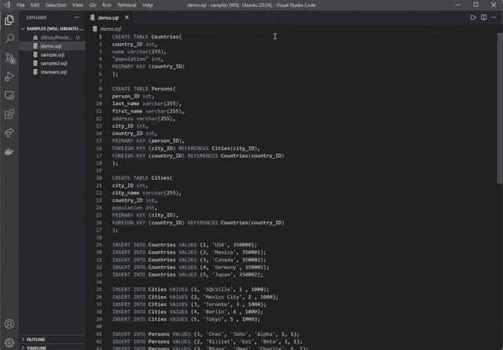

# dBizzy 简介:一个直观的 VSCode 扩展，旨在促进早期数据库开发

> 原文：<https://medium.com/codex/dbizzy-56652b107819?source=collection_archive---------0----------------------->

# 简介:

在关系数据库开发的早期阶段，工程师必须在他们的工作流程中使用几个过程。这些过程包括:创建 SQL 文件，利用数据库引擎(例如 PostgreSQL、MySQL)，通过语句和查询与数据库交互，以及引用实体关系(ER)图。当在数据库上构建和测试查询时，即使是经验丰富的工程师也必须克服这些困难。

当前工作流程的最大问题在于每个流程的孤立性。需要改变您的实体关系吗？也许调整一些列名？没问题！但是您必须使用代码编辑器编辑您的 SQL 创建文件，通过 SQL 客户端更新数据库，并使用第三方软件重新创建 ER 图。如果不执行这些步骤中的每一步，数据库可能不会像您预期的那样构建。

如果您想快速测试一些查询以确保得到预期的响应，或者测试不同的模式以查看查询如何变化，该怎么办？这需要让多个应用程序同时相互对话，重新连接到数据库引擎，以及一系列其他中断工作流的步骤。不应该这么复杂。现在不一定了。

# 解决方案:dBizzy

进入 dBizzy——可视化 er 图和运行数据库查询的一站式商店，专门用于早期数据库开发。dBizzy 是与技术加速器 OS Labs 合作创建的，它是一个 VSCode 扩展，使您能够可视化 ER 图并在数据库的本地实例上测试查询。不需要外部数据库引擎、ER 图生成器或其他任何东西。使用 dBizzy，这些事情都可以通过一个 SQL 创建文件来处理。它是轻量级的，支持 ER 图的实时呈现和导出，并且本地数据库实例只在选项卡会话期间保存在内存中。

dBizzy 是用于早期数据库开发的直观 VSCode 扩展*

# 如何使用 dBizzy？

dBizzy 是用户友好的，除了从扩展市场下载之外，不需要任何设置。它的设计非常简洁，不会让你的工作空间变得杂乱无章。dBizzy 有两个命令支持这个扩展。它们在命令选项板中显示为“dBizzy:预览数据库”和“dBizzy:打开数据库浏览器”。当您选择一个命令时，在您当前的选项卡旁边会启动一个新的选项卡，允许您保持焦点和生产力。dBizzy 的强大功能将在下面详细解释。

直接从 VSCode 下载 dBizzy 或者点击[这里](https://marketplace.visualstudio.com/items?itemName=dBizzy.dbizzy) *

# 特点:

## ER 图表可视化工具

dBizzy 的一半致力于使 ER 图的创建和可视化尽可能平滑。只需单击一个按钮，就可以在 VSCode 中从 SQL 创建文件中呈现一个图。加载后，将光标悬停在一个表上，通过主键和外键高亮显示该表及其任何相关实体。

点击按钮即可生成 ER 图*

看到与图表不一致的地方了吗？需要确定列名或属性类型吗？别担心，这只会花你一点时间。继续编辑 SQL 文件，单击“更新图表”按钮，您的更改将立即反映在屏幕上。就这么有效率。曾经耗时耗力的过程现在只需几秒钟即可完成。

当 ER 图完全符合需要时，可以通过单击“Export Diagram”按钮将其导出为 SVG 文件。然后你可以把它分享给你的团队，上传到 Github，或者如果你愿意的话，可以把它变成一张海报用在墙上(我们不做评判)。

将 ER 图导出为 SVG 文件*

## 本地 SQL 解释器

dBizzy 的另一半简化了构建数据库的查询测试方面。运行测试查询不应该在生产数据库上进行，而应该在测试或复制数据库上进行。这很重要，因为运行的测试可能会影响数据库的内容，而您不希望影响实际的数据。如果没有 dBizzy，您将使用您的 SQL 文件创建一个辅助数据库，将它连接到您的数据库引擎和客户机，确保每个组件相互通信，然后查询数据库。我们已经看到了第一次操作的效率有多低，现在我们必须再做一次？不，谢谢你！

幸运的是，通过 dBizzy 的本地 SQL 解释器，这些都可以在 VSCode 中处理，而不需要启动辅助数据库，甚至不需要考虑离开应用程序。您可以上传一个 SQL 文件或从头开始，并生成我们的数据库的本地实例。不需要第三方应用程序或摆弄命令行。您可以毫不费力地创建数据库，运行查询，然后上路。干净、高效，最重要的是对每个开发人员都很容易。

创建具有完整查询测试功能的数据库本地实例*

数据库保存在本地内存中，因此您可以执行查询，直到您关闭选项卡*

完成查询后，只需关闭选项卡，实例就会从本地内存中删除。既然您的创建文件已经按预期工作，那么部署数据库并将其与您选择的 SQL 引擎集成。

# 为什么应该使用 dBizzy？

dBizzy 为开发人员在开发过程中创建、可视化和查询数据库提供了最直观、最有效的方式。它解决了上下文切换的问题，并通过消除在应用程序之间跳转的需要而显著提高了生产率。在 VSCode 中不间断地处理数据库开发步骤的能力对于团队的整体工作流和性能至关重要。在 dBizzy 之前，设置 SQL 数据库既复杂又费力。但是现在那些日子已经成为过去。dBizzy 使软件工程师只需点击几下鼠标，就能无缝地将数据库从想法变为现实。

***访问 dBizzy 在线*******。****

****从 VSCode 扩展市场*** [***下载这里***](https://marketplace.visualstudio.com/items?itemName=dBizzy.dbizzy) ***。****

****有兴趣投稿或查看 dBizzy 的代码？在 OS Labs 上访问我们的***[***Github***](https://github.com/oslabs-beta/dBizzy)***产品页面。****

## ***dBizzy 团队***

**奥马尔拉纳→* [*领英*](https://www.linkedin.com/in/orana1/)*|*[*Github*](https://github.com/omar-rana)*

**马修·李→*[*LinkedIn*](https://www.linkedin.com/in/matthewcmlee/)*|*[*Github*](https://github.com/mcl030)*

**陈焕昌→*[*LinkedIn*](https://www.linkedin.com/in/johnnycschen/)*|*[*Github*](https://github.com/JcsChen)*

**Kai Rilliet→*[*LinkedIn*](https://www.linkedin.com/in/kairilliet)*|*[*Github*](https://github.com/kairilliet)*

**所有图像和 gif 由 dBizzy 团队在内部创建。*