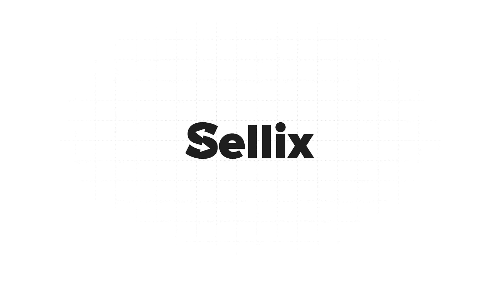
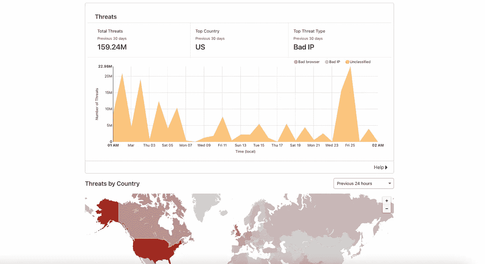
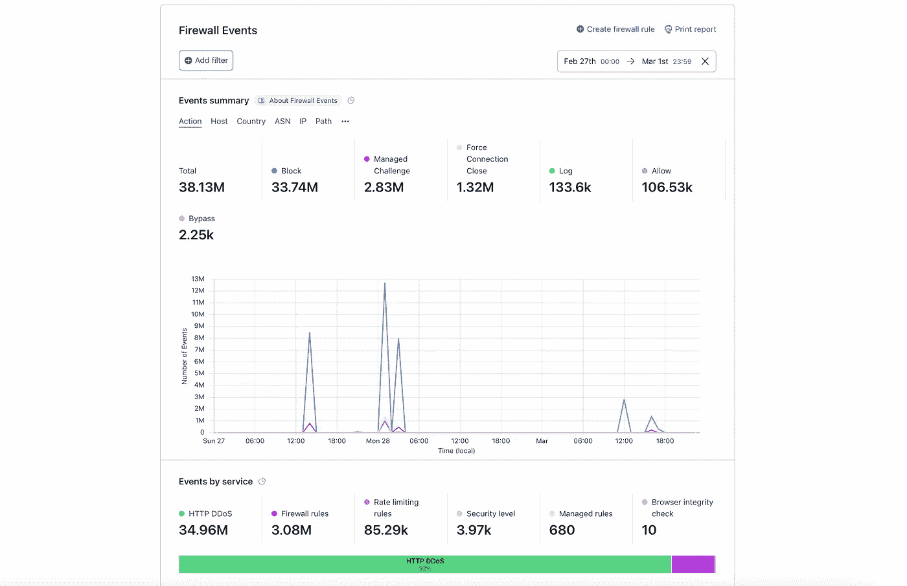
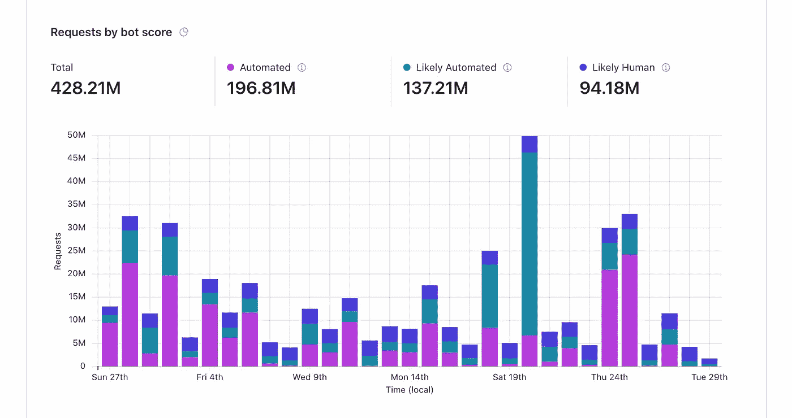
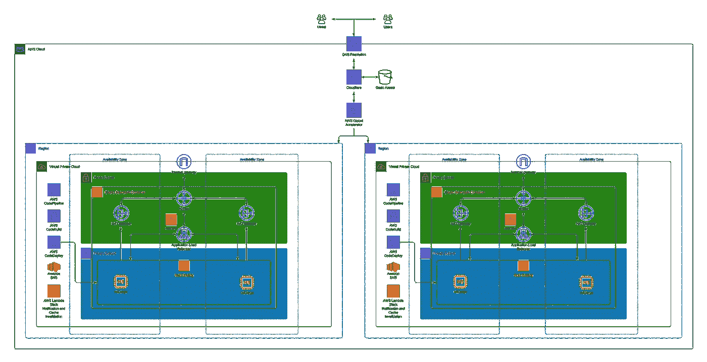
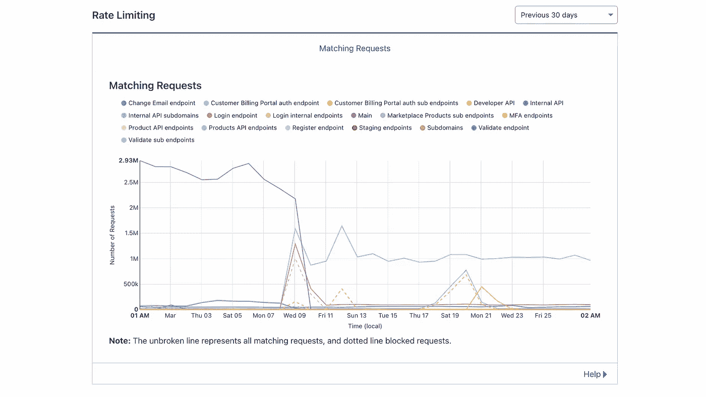

# DDoS 攻击是对数字电子商务发展的持续威胁

> 原文：<https://medium.com/codex/ddos-attacks-continue-to-be-a-massive-threat-to-the-growth-of-digital-ecommerce-668705dadabe?source=collection_archive---------6----------------------->

数字经济正在发生巨大的转变。像任何成长中的平台一样，DDoS 攻击是真实的、无声的威胁，必须以最高级别的关注来处理。

我们的 API 通常每天接收超过 100 万个请求，处理来自超过 142 个不同国家的请求。在过去的一个月中，我们收到了超过 3360 万个请求，其中有 135.22GB 以上被传输。

我们每天都会收到来自 200 多个不同国家的超过 390 万个请求(经过验证并来自真实用户)。在过去的 30 天里，我们看到了超过 3.5127 亿个以上的请求，传输了 8.02TB 以上，正如我们在上个月发布的第一份[年度安全报告](https://blog.sellix.io/charging-forward-sellixs-first-annual-security-report-aff139c9d2d2)中指出的那样。

从凌晨 1 点到 12 点，安全威胁在我们的全球基础设施中经常发生。这些威胁是由不怀好意的竞争对手和不良行为者引发的。

Cloudflare 威胁仪表板，2022 年 2 月 27 日至 3 月 29 日

## 214.10 千

根据我们在[的年度安全报告](https://blog.sellix.io/charging-forward-sellixs-first-annual-security-report-aff139c9d2d2)中的记录，我们收到的最大的 DDoS 攻击的每秒请求数转化为:

*   **每分钟 12.84 米**个请求
*   **一小时 308.30 米**请求
*   **7.39B** 一天内的请求数

我们每天都是第 7 层 DDoS 攻击的目标，在过去 30 天里，我们受到了超过 1.5924 亿次安全威胁:

*   印度尼西亚有**3.80 米+** 请求
*   中国有**2.40 米+** 的请求
*   俄罗斯联邦有**2.30 米以上**的请求
*   印度有**224 万+** 个请求
*   美国有**206 万+** 个请求

这些第 7 层 DDoS 攻击直接针对我们的域(sellix.io:443/ ),而不是我们任何商业客户的域或子域。我们已经进行了更大的投资来减轻 DDoS 攻击，并且已经取得了不可估量的成功。

2 月 27 日至 3 月 1 日，针对我们基础设施的最大规模 DDoS L7 攻击

## 对形势的深入探究

作为一个 SaaS 电子商务平台，Sellix 为全球成千上万的商家提供基础设施和逻辑，以创建、销售和交易他们的数字商品。

作为一个平台，我们不仅要担心我们的竞争对手，他们似乎依赖于 DDoS 攻击而不是改善他们的网站:我们还必须担心我们商家的每个竞争对手和对手。

Cloudflare 机器人仪表板，2022 年 2 月 27 日至 3 月 29 日

这导致频繁的 DDoS 攻击，在过去的 30 天里，每天甚至有超过 **159.24M** 的威胁和大约 **27.15M** 的请求被我们的 WAF 阻止。

DDoS 攻击可以分组为 BOT 请求；如上图所示，在过去的 30 天里，我们收到了超过**3.34 亿**个很可能或几乎肯定会自动处理的请求。

## 不断增长

尽管听起来很不幸，但情况并没有好转。就在一年前，我们遭遇的攻击还不到现在的一半，今天的攻击中使用的 rps(每秒请求数)还不到**1/10**。

## 我们是如何处理这种情况的

在这种情况下，像许多其他情况一样，在云上有助于:

Sellix AWS 基础架构:多地区(欧盟西部、美国东部)电子商务解决方案

我们的 AWS 基础设施会随着我们收到的流量的增加而自动扩展。然而，这远远不够，因为大型 DDoS 攻击可能会使数十台服务器饱和，无论它们的规模如何。

这就是 Cloudflare 的用武之地。由于他们的解决方案，我们与他们的团队明确配置了我们的用例，我们过滤掉了几乎 **100%** 进入我们云基础设施的不良流量，并将停机时间减少到接近**零**，这可以在我们的[状态页面](https://status.sellix.io)上看到。

## 限速的

简单而有效。速率限制是锁定特定 API 端点和网站页面的最佳方式之一。

Cloudflare 限速报告，2022 年 2 月 27 日-3 月 29 日

*我们的 web 解决方案的基础架构记录在* [*我们的 GitHub 存储库*](https://github.com/Sellix/aws-elastic-beanstalk-web-app) *上，以我们在 Cloudflare 下作为 CDN 使用的每个 AWS 服务为特色。*