# 处理 TensorFlow 中的弃用-使用工作示例修复卷积神经网络模型

> 原文：<https://medium.com/codex/dealing-with-deprecation-in-tensorflow-fixing-a-convolutional-neural-network-model-using-a-worked-dc3113b93049?source=collection_archive---------14----------------------->

所有软件都会被弃用，人工智能库也不例外。事实上，TensorFlow 库因被弃用而臭名昭著。TensorFlow 是谷歌的深度学习库，于 2015 年推出，此后一直在发展。

我正在关注 YouTuber sentdex，他创造了一系列优秀的后续机器学习和深度学习教程。这里有一个卷积神经网络(CNN)的例子，它是由 sentdex 在 2018 年创建的，它无缝地工作，直到 TensorFlow 否决了它的一个功能。(教程可以在这里找到:[https://python programming . net/卷积-神经网络-深度学习-python-tensorflow-keras/](https://pythonprogramming.net/convolutional-neural-network-deep-learning-python-tensorflow-keras/) )

我想和你分享我解决这个问题的方法，原因有二:第一，你可以让这个 CNN 算法在你的环境中工作(我正在使用我强烈推荐的 Google Colab)，但更重要的是，如果你遇到类似的问题，你可以应用我所做的相同的方法来修复你的废弃算法并让它再次工作。

让我们开始吧…

先决条件:

1.完成深度学习模块中的前两个教程:

深度学习入门——使用 python、TensorFlow 和 Keras p.1 的深度学习基础([https://Python programming . net/introduction-Deep-Learning-Python-tensorflow-Keras/](https://pythonprogramming.net/introduction-deep-learning-python-tensorflow-keras/))和加载自己的数据——使用 Python、tensor flow 和 Keras p.2 的深度学习基础([https://Python programming . net/Loading-custom-data-Deep-Learning-Python-tensor flow-Keras/](https://pythonprogramming.net/loading-custom-data-deep-learning-python-tensorflow-keras/))。这将导致酸洗对象的创建；x .泡菜和 y .泡菜

2.在 Colab 中安装您的 Google Drive。如果你不知道如何做到这一点，请关注我的文章:点击 3 次鼠标在 Google Colab 中安装 Google Drive \[https://miteshparmar 1 . medium . com/Mounting-Google-Drive-in-Google-Colab-with-3-mouse-clicks-8d 38d 681 aad 5 \](https://miteshparmar1.medium.com/mounting-google-drive-in-google-colab-with-3-mouse-clicks-8d38d681aad5/)

我将导入语句放在第一个代码单元中，将 pickled 对象的加载放在第二个代码单元中。使用 play 按钮执行每个命令都不会导致错误。

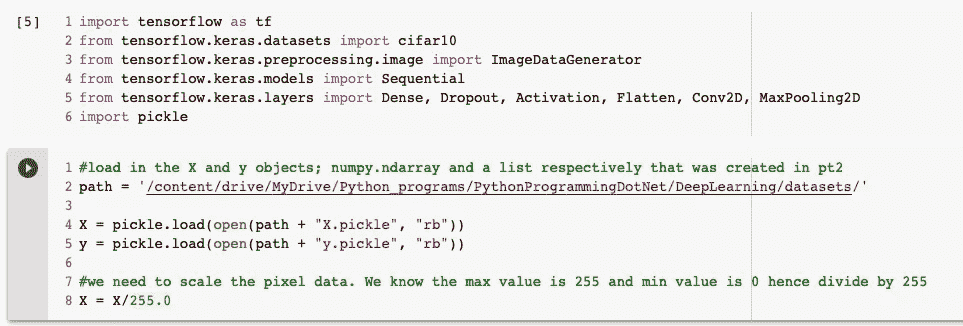

第三个代码单元格包含用于构建和训练 CNN 模型的代码。在上述步骤之后执行该命令会导致如下所示的两个错误(还要注意第 27 行 model.fit()函数是如何以红色突出显示的):

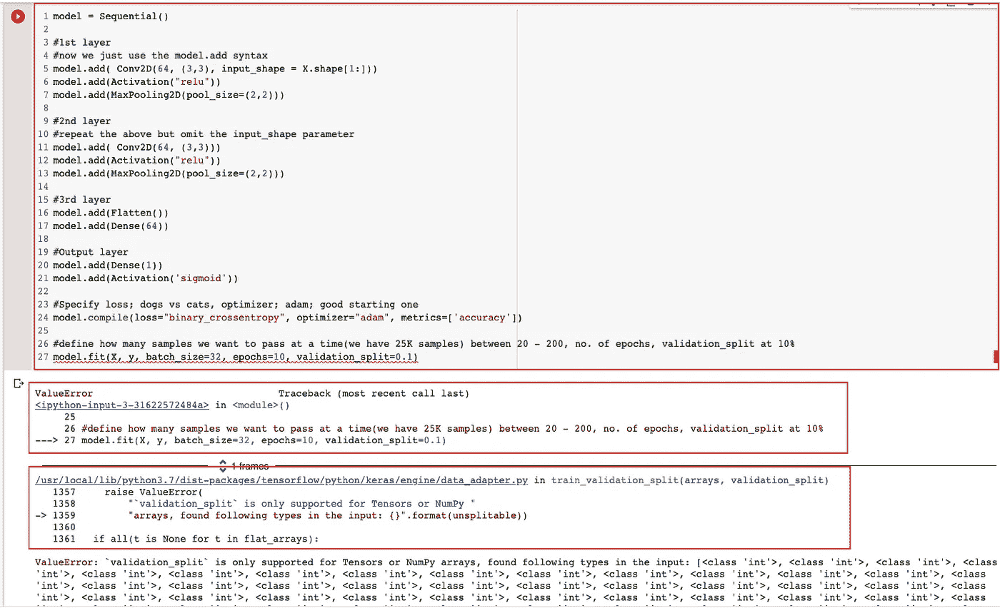

第一个错误立即指向第 27 行；model.fit()函数。第二个错误是内部 tensorflow python 脚本，它被调用指向第 1359 行；数组在输入中找到以下类型:{}。格式(不可拆分))。

就在这条蓝色线的上方，写着“validation_split 仅支持张量或数字”。

上面的错误信息是什么意思？

从表面上看，这意味着我们的代码出错了，因为我们在 model.fit()函数中提供了参数 validation_split。蓝色的句子告诉我们 validation_split 只支持 Tensors 或 Numpy 数据类型。

所以这是我们的问题。但是错误描述有点简短，所以我们将深入研究以获得更好的理解。

我们知道“模型”是顺序型变量，对吗？如果您有所怀疑，您可以使用 print(type())函数来检查您在变量赋值下面声明的任何变量数据类型，如下所示:

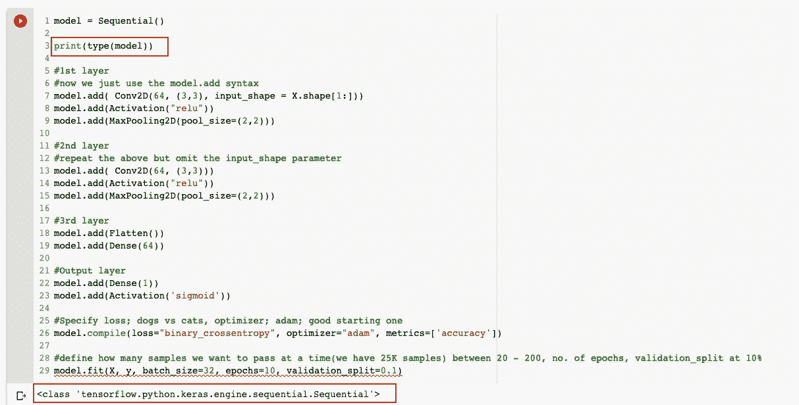

接下来，让我们在谷歌上搜索 Tensorflow Sequential 以获得更多相关信息…

搜索的第一个结果是官方的 Tensorflow 文档网页，所以点击…

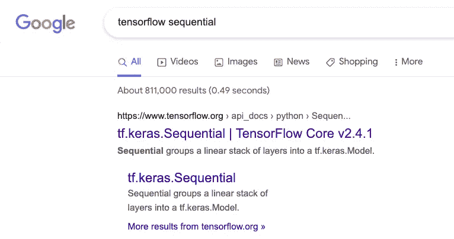

显示的是 Tensorflow API 的顺序功能细节；任何开发人员都必须去的一个地方，以找到关于 Tensorflow 库如何工作的详细信息:

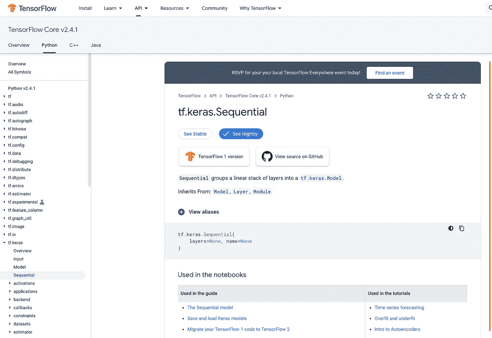

我们从代码中突出显示的弯曲红线中知道，model.fit()是错误发生的地方，因此滚动此网页并找到 fit 函数:

第一个函数带有删除线，因为它不再适用，已被绿色背景的函数所取代。如果仔细观察并比较两者，您会发现一些参数发生了变化，例如，verbose=1 变成了 verbose='auto ':

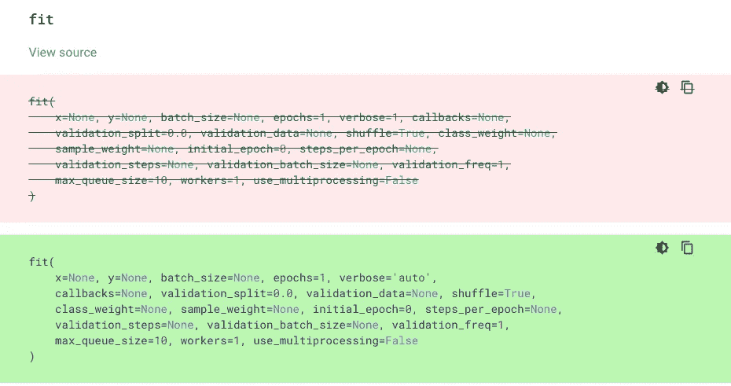

进一步向下滚动到参数部分，显示 x 和 y 的以下内容:

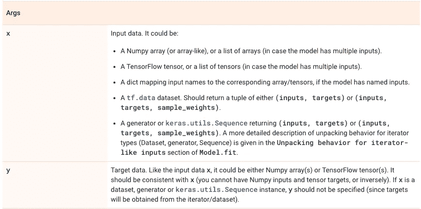

这就是这个问题的症结所在！基本上，它告诉我们 x；第一个参数和 y；第二个参数只能是规定的几种类型。

回到我们的脚本，我们可以检查加载的 pickled 对象的数据类型；x 和 y 使用嵌套在 print()函数中的 type()函数:

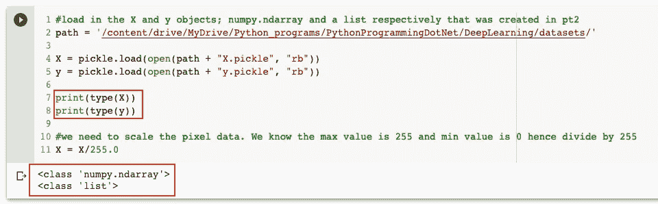

它向我们展示了 X 是一个 numpy.ndarray，y 是一个 list 对象。

因此，通过检查 Tensorflow API，我们知道 X 是受支持的数据类型:

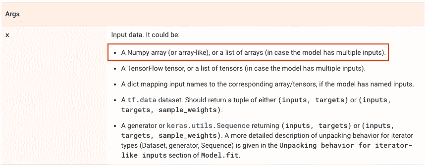

我们还知道 y 是不支持的数据类型:

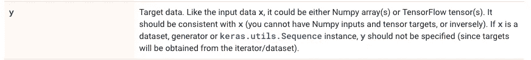

如上所述，y 只能是 Numpy 数组或 TensorFlow 张量类型，并且应该与 x 一致。

在我们的例子中，由于 X 的类型是 Numpy.ndarray，我们需要 y 的类型也是 Numpy.ndarray。

那么我们如何将一个标准的 Python list 对象转换成 Numpy.ndarray 对象呢？

让我们谷歌一下:

第一个结果是官方的 numpy 文档，让我们点击:

所以我们需要按照规定使用 numpy.asarray()函数:

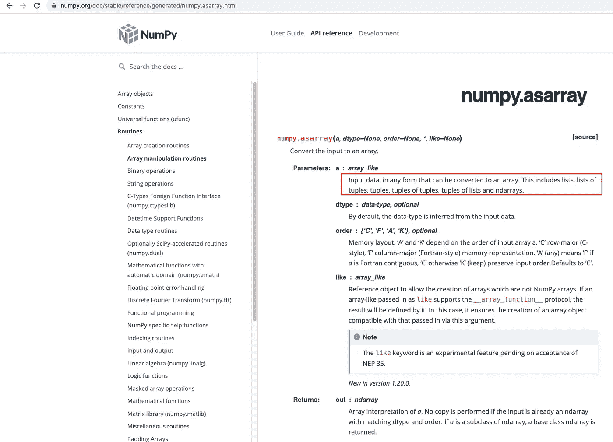

如上所述，输入数据可以是任何可以转换成数组的数据。这包括一个列表对象。因为 y 的数据类型是 list，所以我们可以使用这个函数。

我在代码单元 1 中插入了“import numpy as np ”,并执行它来重新加载导入。在第二个代码单元中，我简单地在它上面插入了突出显示的一行注释来解释它的作用。我执行了代码单元格 2，print 语句显示 X 和 y 数据类型都是 numpy.ndarray()类型:

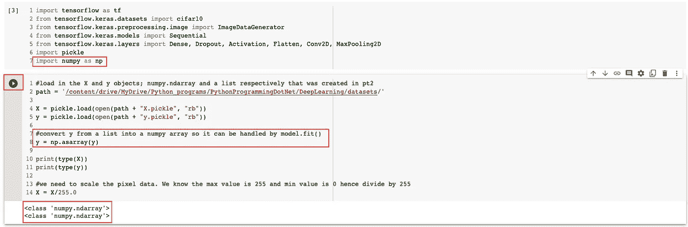

执行第三个细胞代码显示训练，虽然难以置信地慢！

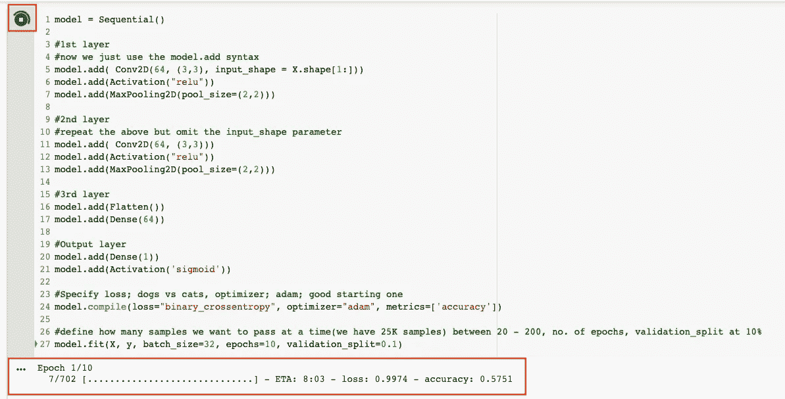

点击运行时间->中断执行，暂停训练:

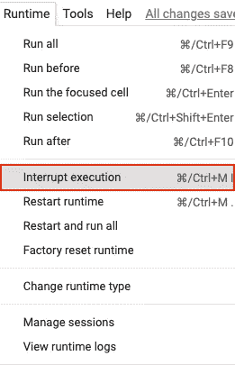

是时候利用 Colab 的免费 GPU 了。

点击运行时->更改运行时类型

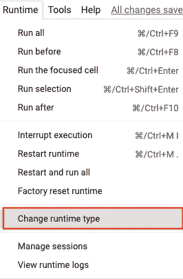

从硬件加速器下的下拉列表中选择“GPU”并单击“保存”:

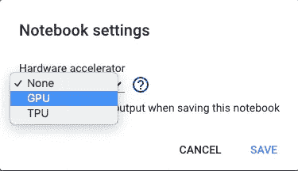

运行时->全部运行:

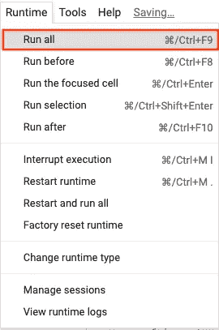

训练现在应该快得多，因为它利用 GPU 而不是 CPU:

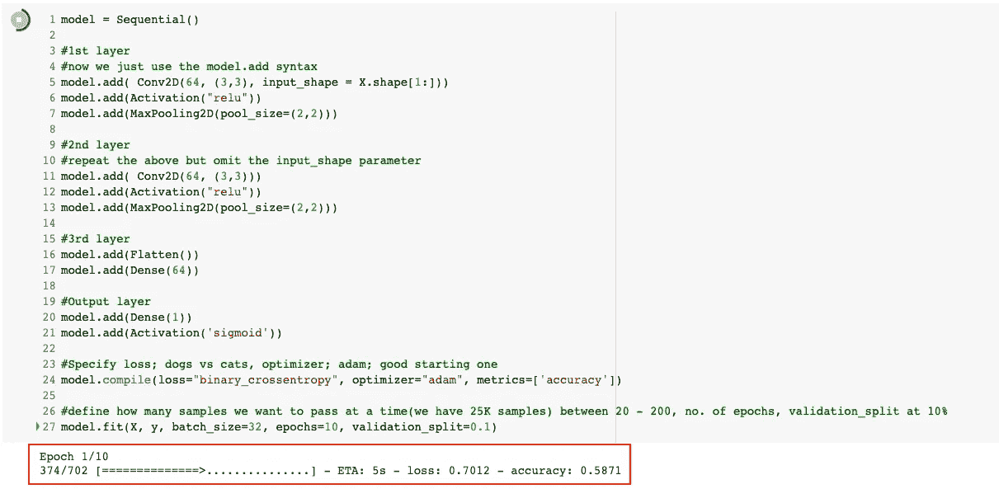

我希望这篇文章有助于您理解弃用并访问相关的 API 来解决这个问题。快乐的 Colab 训练你的固定复杂的神经网络。如有任何问题或意见，请在回复部分留言…