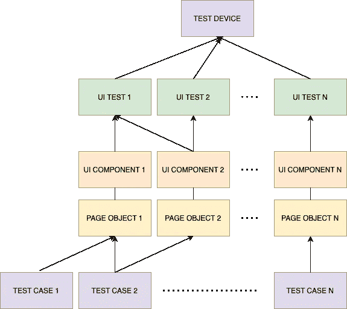
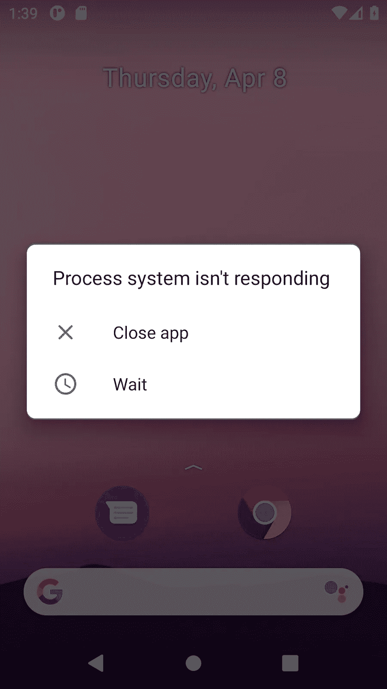
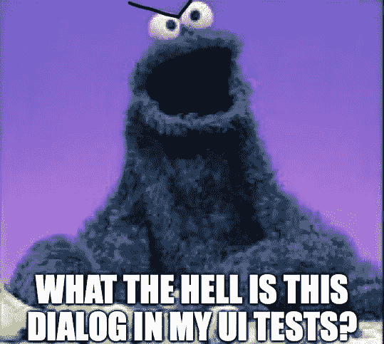
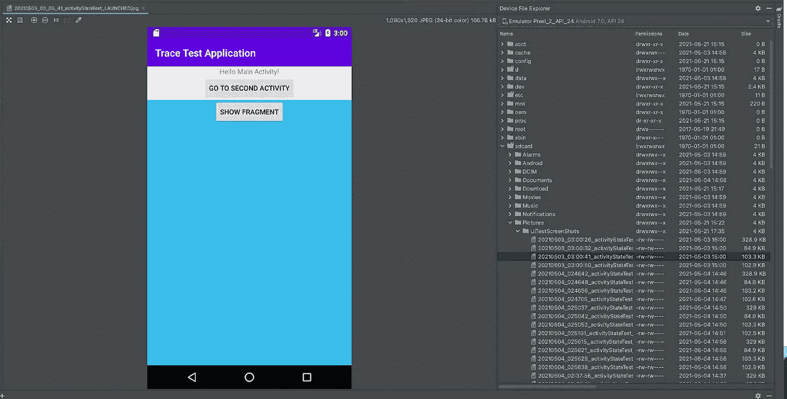

# 在 CI 上处理仿真器问题和 Android UI 测试失败

> 原文：<https://medium.com/codex/dealing-with-emulator-issues-and-android-ui-test-failures-on-ci-7895694d58c8?source=collection_archive---------7----------------------->

***注:*文章原载于** [**Bitrise 博客**](https://blog.bitrise.io/post/how-to-deal-with-emulator-issues-and-android-ui-test-failures-on-ci) **。
本文是关于 Android 测试的系列文章的一部分，请在这里找到该系列文章的完整列表:** [1。为你的 Android 应用编写测试的指南](https://richrdbogdn.medium.com/a-guide-to-write-your-tests-for-your-android-apps-d4272424cb23)
[2。为你的 Android 库和 Gradle 插件编写你的测试。](https://richrdbogdn.medium.com/write-your-tests-for-your-android-libraries-and-plugins-3ec4b5da2faf)
[四上考词。在 CI 上处理仿真器问题和 Android UI 测试失败](https://richrdbogdn.medium.com/dealing-with-emulator-issues-and-android-ui-test-failures-on-ci-7895694d58c8)

在上一篇文章中，我介绍了如何在配置项上设置测试，以及当出现问题时，通过提取调试测试所需的信息，您可以做些什么来使您的工作变得更容易。现在，我将更深入地探讨后一个主题，并将重点放在仿真器和 UI 测试相关的问题上。

# 缓解策略

当我声称插装测试(尤其是 UI 测试)是不可靠的时候，我很确定每个人都能从他们自己的经历中回忆起一件事情。或者如果没有，你很可能真的很幸运，但至少你听说有人认识一个经历过的人。遗憾的是，没有防止剥落的灵丹妙药，但是和所有事情一样，我们可以做很多事情来防止大部分剥落。这里有三组策略:

1.  **预防性**
2.  **无功**
3.  **支持性**

让我们看看每一个。

# 1.预防性试验剥落缓解

顾名思义，这些策略包含了在启动测试之前您可以做的所有事情，并使您能够防止古怪行为的发生。这听起来相当模糊，但是我现在将尝试给出更多的例子和细节。

# 页面对象模式

你熟悉“编码模式”这个术语吗？你知道并使用其中的一些吗？如果你对这两个问题的回答都是肯定的，那么我想当你听到测试也有它的模式，页面对象模式就是其中之一时，你不会感到惊讶。

这种模式在你做 UI 测试时很有用，例如用 [Espresso](https://developer.android.com/training/testing/espresso) 或 [UIAutomator](https://developer.android.com/training/testing/ui-automator) 。最初，这种模式是由 web UI 测试人员使用的，所以这就是“页面对象”这个名称的由来。虽然从名称上可以假定，您只能为页面或屏幕创建页面对象；但事实上，它们也可以用于较小的项目(例如片段或不同的视图)。页面对象模式的目标是在测试用例与在 UI 上执行动作/访问元素所需的代码之间引入一个解耦层。这将是页面对象。对于视觉思考者来说，这是一张概览图:



如你所见:

*   您可以在单个设备上运行多个测试类
*   给定的测试类可以使用一个或多个 UI 组件(例如，活动、片段)
*   每个 UI 组件都有一个页面对象
*   一个测试用例可以使用一个或多个页面对象

**付诸实践:
‍** 让我们想象你有一个简单的待办事项应用程序的 UI 测试，它列出了一些待办事项，你可以添加、编辑和删除它们。从测试的角度来看，您不会关心给定按钮和视图的资源名称，因为您很可能会测试不同的行为。因此，如果您将所有这些代码都放在 page 对象中，测试用例会变得更简单、更简短。此外，如果 UI 中的某些行为发生了变化，例如，以前您有一个按钮用于删除每一项，而现在变成了滑动它们来删除，您将需要更新每个测试用例。你应该把这个逻辑放在页面对象中，如果你必须改变，你只需要在一个地方更新它。继续这个例子，在 page 对象中应该有一个类似“deleteItem”的方法。总而言之，使用页面对象模式有以下优点:

*   避免代码重复，因为所有的访问器、动作等都可以在同一个地方
*   更可读的代码
*   你必须在一个地方改变代码，以防行为改变
*   您可以将它与其他模式/技术相结合，例如，如果您将它与 fluent API 相结合，它会变得更加紧凑

**现在，举例时间:**

```
@Test
public void fragmentStateTest() {
   final IndexActivityScreen indexActivityScreen = 
          new IndexActivityScreen(uiDevice); final MainActivityScreen mainActivityScreen = 
               indexActivityScreen.launchUiTests();
   mainActivityScreen
           .showParentFragment()
           .showChildFragment();
}
```

*注意:如您所见，我在命名中使用了“屏幕”一词，而不是“页面”。原因是它对移动用户界面更具描述性，页面在网页或桌面术语中更容易理解。*

**上面的例子展示了一个简单的 UiAutomator 测试用例，在这里我们做了以下事情:**

**a.** 用 IndexActivity 启动应用程序

**b.** 使用 launchUiTests()方法在 IndexActivityScreen 中启动 MainActivity

**c.** MainActivity 显示一个片段(ParentFragment)

**d.** ParentFragment 显示另一个片段(ChildFragment)

多亏了页面对象模式，这样做的代码非常短，可读性很强。如您所见，我将 page 对象模式与 fluent API 结合起来，使其更加简洁。

看起来不错，但是这将如何帮助防止测试剥落？


您可能在过去经历过不稳定的 UI 测试，因为您团队中的某个人忘记给给定的视图元素添加一些等待时间。这种情况时有发生，因为我们是人，会犯错误/忘记事情。好的一面是，如果你使用页面对象模式，你将编写一次等待逻辑，你可以在不同的测试用例中重用它，因为它在你的屏幕对象中。所以你添加等待逻辑的时间越少，你忘记添加的机会就越少。此外，可读代码有助于避免人为错误，对吗？

你可能会说页面对象模式不是解决/减轻上述问题的唯一方法，你是对的。我在这里的观点是，它是缓解这些问题的一个很好的选择，因为它解决了这些问题以及它的好处。

我将为 UiAutomator 提供一个例子。这是我的屏幕类查找 IndexActivity 的方式:

```
/**
* Screen class for {@link IndexActivity}.
*/
public class IndexActivityScreen extends BaseScreen { private static final BySelector uiTestsButton = 
       By.res(id + "btn_ui_tests");
   private static final BySelector networkTestsButton = 
       By.res(id + "btn_network_tests"); /**
    * Constructor for class.
    *
    * @param uiDevice the UiDevice that launches the test cases.
    */
   public IndexActivityScreen(@NonNull final UiDevice uiDevice) {
       super(uiDevice);
   } /**
    * Clicks on the UI tests button and launches the {@link MainActivity}.
    *
    * @return the created {@link MainActivityScreen}.
    */
   @NonNull
   public MainActivityScreen launchUiTests() {
       click(uiTestsButton);
       return new MainActivityScreen(uiDevice);
   } /**
    * Clicks on the Network tests button and launches the {@link NetworkActivity}.
    *
    * @return the created {@link NetworkActivityScreen}.
    */
   @NonNull
   public NetworkActivityScreen launchNetworkTests() {
       click(networkTestsButton);
       return new NetworkActivityScreen(uiDevice);
   } @Override
   public void waitTillLoad() {
       uiDevice.wait(Until.findObject(uiTestsButton), DEFAULT_TIMEOUT);
       uiDevice.wait(Until.findObject(networkTestsButton), DEFAULT_TIMEOUT);
   }
}
```

如您所见，我们有:

**答:**我们作为成员变量与之交互的 UI 元素

**b.** 作为成员方法的可用交互

和一个名为 waitTillLoad()的方法，当我们开始与它们交互时，它将确保所有需要的元素都显示在屏幕上

**为了全面了解情况，请看一下这个 IndexActivityScreen 类的父类:**

```
public abstract class BaseScreen { /**
    * The given UiDevice that runs the tests.
    */
   @NonNull
   protected final UiDevice uiDevice; /**
    * The id prefix to find resources by id.
    */
   @NonNull
   protected static final String id =
      InstrumentationRegistry.getInstrumentation()
         .getTargetContext()
         .getPackageName() 
         + ":id/"; /**
    * The default value for timeouts.
    */
   protected long DEFAULT_TIMEOUT = 10000; /**
    * The number of times the test will try to click on a given BySelector before failing the test.
    */
   private static final int numberOfClickAttempts = 3; /**
    * Constructor for class.
    *
    * @param uiDevice the UiDevice that launches the test cases.
    */
   public BaseScreen(@NonNull final UiDevice uiDevice) {
       this.uiDevice = uiDevice;
       waitTillLoad();
   } /**
    * Searches for the given {@link BySelector} on the active UI.
    *
    * @param by the given BySelector to search for.
    * @return the {@link UiObject2} if found, {@code null} otherwise.
    */
   @Nullable
   public UiObject2 find(@NonNull final BySelector by) {
       return uiDevice.wait(Until.findObject(by), DEFAULT_TIMEOUT);
   } /**
    * Performs a click action on the given {@link BySelector}. Attempts to find the given BySelector 3 times. This
    * is needed for cases when the UI is not ready.
    *
    * @param by the given BySelector.
    */
   public void click(@NonNull final BySelector by) {
       for (int i = 0; i < numberOfClickAttempts; i++) {
           final UiObject2 uiObject2 = find(by);
           if (uiObject2 != null) {
               uiObject2.click();
               break;
           } else {
               Log.i(BaseUiTest.UI_TEST_TAG, String.format("Could not find selector with name %s, retrying %s",
                       by.toString(), i));
           }
       }
   } /**
    * Waits till the given screen is loaded.
    */
   public abstract void waitTillLoad();
```

**从上面的代码看事情:**

*   像点击/查找这样的交互只需编写一次
*   父类的构造函数将调用 waitTillLoad()方法，所以所有子类都将从它们的构造函数中调用 super(uiDevice)来做同样的事情
*   waitTillLoad()是抽象的，每个非抽象子类都必须定义它，所以你不太可能忘记它
*   超时、重试是统一的，它们在一个地方定义

# 接管

以一种可读、紧凑和富于表现力的方式编写你的测试，这将省去你很多麻烦。页面对象模式是一个很好的选择。

# 2.反应测试剥落缓解

继续讨论减轻 UI 测试剥落，反应策略涉及到你在运行测试时可以做的所有事情，并使你能够防止剥落行为的发生。

# 处理系统事件

系统事件可能在你的测试运行期间发生，其中之一是当 Android 没有响应时(简称 ANR)，你会得到一个关于它的对话框。当我启动一个 API 级别为 30 的模拟器时，我经常会看到它们。



有没有发生过你的 UI 测试因为 Android 抛出系统对话框而失败的情况？如果答案是肯定的，我敢打赌你的感受和下图类似。



即使你的应用程序非常快，响应速度也很快，在 CI 上也会出现这样的对话框，因为正如我们在以前的帖子中了解到的，CI 机器的性能是有限的。显然，你必须对这些对话框做些什么。

如果没有其他要求，在大多数情况下，您可以通过单击“等待”或“关闭应用程序”按钮来关闭它们。使用第一种方法要简单一些，因为正如我所说的，即使你的应用程序也可能没有响应。

那么解决方案是什么呢？创建一个观察器，在测试运行期间观察这些对话框。听起来很合理。我有好消息和坏消息。先说不好的:浓缩咖啡里没有这种东西。好消息是 UiAutomator 中有一个观察器，即使你有浓缩咖啡测试，这也会帮助你。

这里有一个如何做的例子。正如我所说的，我们需要一个观察者，UiAutomator 有 [UiWatcher](https://developer.android.com/reference/androidx/test/uiautomator/UiWatcher) 。实现这一目标的步骤是:

**a .创建一个注册观察者的方法**

```
private static final String anrText = "isn't responding";private static void registerANRWatcher() {
   uiDevice.registerWatcher("ANR", () -> {
       final UiObject anrDialog = 
           uiDevice.findObject(new UiSelector()
               .packageName("android")
               .textContains(anrText)); return checkForAnrDialogToClose(anrDialog);
   });
}
```

因此，对话框将显示类似“<application>没有响应”的内容，我们应该搜索该文本。只是为了确保我们不会从一个不同的应用程序中获得相同的文本，将包过滤到“android”。</application>

**b .检查是否有 ANR 对话框**

```
private static boolean checkForAnrDialogToClose(@NonNull final UiObject anrDialog) {
   return anrDialog.exists() && closeAnrWithWait(anrDialog);
}
```

简单一步，不多解释。

**c .当 itt 出现时，点击“等待”按钮**

```
private static boolean closeAnrWithWait(@NonNull final UiObject anrDialog) {
   Log.i(UI_TEST_TAG, "ANR dialog detected!");
   try {
       uiDevice.findObject(new UiSelector().text("Wait").className("android.widget.Button").packageName(
               "android")).click();
       final String anrDialogText = anrDialog.getText();
       final String appName = anrDialogText.substring(0, anrDialogText.length() - anrText.length());
       Log.i(UI_TEST_TAG, String.format("Application \"%s\" is not responding!", appName));
   } catch (final UiObjectNotFoundException e) {
       Log.i(UI_TEST_TAG, "Detected ANR, but window disappeared!");
   }
   Log.i(UI_TEST_TAG, "ANR dialog closed: pressed on wait!");
   return true;
}
```

正如你所看到的，如果我们有一个 ANR 对话框，我们点击“等待”按钮让它消失。你可以做额外的事情，例如我记录哪个应用程序有 ANR，如果我检查日志，它可能是有趣的信息。

**d .注册观察者**

```
@BeforeClass
public static void setUpBeforeClass() {
   uiDevice = UiDevice.getInstance(getInstrumentation());
   registerANRWatcher();
}
```

带注释的方法是一个很好的例子。

这将省去你许多头痛。正如我所承诺的，当你做浓缩咖啡测试时，我会告诉你该怎么做。嗯，我确信也有不同的方法，但是没有什么可以阻止你使用相同的代码，你只需要依靠 UiAutomator 和这段代码来进行测试。一个好的方法是创建一个包含这个的抽象父测试类，您的测试可以扩展这个类。这样你就不会有代码重复，实际的测试类不需要包含这些代码，所以它看起来几乎是一样的，它只是把你从那些讨厌的 ANR 对话框中拯救出来。基于此，你也可以为其他情况编写自己的观察器，万岁！

# 接管

用 **UiWatchers** 关闭那些 ANR 对话框和其他不必要的东西。

# 3.支持性测试剥落缓解

最后一组关于 UI 测试剥落缓解，支持性策略包括所有你能做的事情来帮助减少你的测试的剥落，但是它不能防止剥落行为的发生。

# 更好的硬件

如果因为超时而导致测试不稳定，你可以做一件小事，你可以购买/租用更快的硬件，你可能想做也可能不想做。当然，这将有所帮助，但是正如我所说的，不会阻止它，因为测试可能需要的性能没有上限(想象一下拥有最新/最快的机器，并且同时启动 10 个或更多模拟器，我不会对没有一些性能问题下很大赌注)。


# UI 测试事件的屏幕截图

在某些情况下，如果你有一个设备的屏幕截图，当一个给定的 UI 测试用例失败时，这可能是一个很大的帮助，可以更好地理解是什么导致了它。例如，截图帮助我发现，有时 ANR 对话框出现在我的 UI 测试运行中，导致间歇性的测试失败。当然，这对于非间歇性/易发性故障来说很方便。


为了截屏，您必须创建一个 [TestWatcher](https://junit.org/junit4/javadoc/4.12/org/junit/rules/TestWatcher.html) 并实现您想要的给定事件的动作。有关 TestWatcher 拥有的完整事件集，请查看它的文档。我将向您展示如何在测试即将开始且失败时截图:

**答(可选):创建一个测试规则，以获取当前活动测试用例的名称。**

```
@Rule
public TestName testName = new TestName();
```

这将在创建那些截图文件时派上用场，并且稍后您将更容易将截图与测试用例相匹配。最简单的方法就是使用[测试名](https://junit.org/junit4/javadoc/4.12/org/junit/rules/TestName.html)。

b .创建您的 TestWatcher

```
public class TestDataCollectionRule extends TestWatcher { @Override
   protected void starting(@NonNull final Description description) {
       super.starting(description);
       Log.i(UI_TEST_TAG, "Test started: " + testName.getMethodName());
       takeScreenShot(TestEvent.START);
   } @Override
   protected void succeeded(@NonNull final Description description) {
       super.succeeded(description);
       Log.i(UI_TEST_TAG, "Test success: " + testName.getMethodName());
   } @Override
   protected void failed(@NonNull final Throwable e, @NonNull final Description description) {
       super.failed(e, description);
       Log.i(UI_TEST_TAG, "Test failed: " + testName.getMethodName());
       takeScreenShot(TestEvent.FAIL);
   }
}
```

专业提示:logcat 输出中的一些日志也会有所帮助。唯一需要解释的是 TestEvent enum。这是我创建的一个内部枚举类，我用它来指示哪个测试事件触发了截图。如果您不想创建自己的类，可以为此使用不同的类。

**c .添加创建截图的方法**

```
protected void takeScreenShot(@NonNull final TestEvent testEvent) {
   final Bitmap screenshotBitmap = getScreenShotBitmap();
   final String screenShotFileName = getTestReportFileBaseName(testEvent); storeScreenshot(screenshotBitmap, screenShotFileName);
}private Bitmap getScreenShotBitmapWithScreenShotApi() {
   return getInstrumentation().getUiAutomation().takeScreenshot();;
}private Bitmap getScreenShotBitmapWithUiAutomator() {
   return Screenshot.capture().getBitmap();
}
```

如您所见，您可以使用[屏幕截图 API](https://developer.android.com/reference/androidx/test/runner/screenshot/Screenshot) 或[ui automation . take screen shot()](https://developer.android.com/reference/android/app/UiAutomation#takeScreenshot())方法来完成。我把这个选择留给读者。

**d .添加给截图起个好名字的方法**

```
private String getTestReportFileBaseName(@NonNull final TestEvent testEvent) {
   final SimpleDateFormat simpleDateFormat = new SimpleDateFormat("yyyyMMdd_hhmmss");
   final String timeStamp = simpleDateFormat.format(Calendar.getInstance().getTime());
   return timeStamp + "_" + testName.getMethodName() + "_" + testEvent;
}
```

对于开发人员来说，什么是好的是相当主观的，在我的例子中，我将时间戳与测试用例的名称和给定的测试事件连接起来(例如，20210520 _ 120000 _ myUiTest _ FAILURE)

**e .最后，也可能是最重要的一步，我们需要将它保存到设备上**

```
private ContentResolver getContentResolver() {
   return InstrumentationRegistry.getInstrumentation()
                                 .getTargetContext()
                                 .getApplicationContext()
                                 .getContentResolver();
}private void storeScreenshot(@NonNull final Bitmap screenShotBitmap, @NonNull final String screenShotFileName) {
   final ContentResolver contentResolver = getContentResolver();
   final String UiTestScreenShotsDirName = "UiTestScreenShots"; try {
       if (android.os.Build.VERSION.SDK_INT >= 29) {
           storeWithMediaStore(new ContentValues(), contentResolver, screenShotFileName,
                   UiTestScreenShotsDirName, screenShotBitmap);
       } else {
           storeWithFileOutputStream(new ContentValues(), contentResolver, screenShotFileName,
                   UiTestScreenShotsDirName, screenShotBitmap);
       }
       Log.i(UI_TEST_TAG, "Created screenshot " + screenShotFileName);
   } catch (final IOException e) {
       Log.e(UI_TEST_TAG, "Failed to take screenshot!", e);
       e.printStackTrace();
   }
}
```

正如你所看到的，我在这里也添加了一些日志，在存储截图的过程中，我使用了传统的[内容解析器](https://developer.android.com/reference/android/content/ContentResolver)。由于[的限制和 API 级](https://developer.android.com/training/data-storage#scoped-storage)的更新，我们需要一种不同的方法。在这里你可以查看我的例子:

```
@RequiresApi(Build.VERSION_CODES.Q)
private void storeWithMediaStore(@NonNull final ContentValues contentValues,
                                @NonNull final ContentResolver contentResolver,
                                @NonNull final String screenshotFileName,
                                @NonNull final String screenshotLocation,
                                @NonNull final Bitmap screenshotBitmap) throws IOException {
   applyBaseScreenshotContentValues(contentValues);
   contentValues.put(MediaStore.MediaColumns.DISPLAY_NAME, screenshotFileName + ".jpeg");
   contentValues.put(MediaStore.Images.Media.RELATIVE_PATH,
           Environment.DIRECTORY_PICTURES + "/" + screenshotLocation); final Uri uri = contentResolver.insert(MediaStore.Images.Media.EXTERNAL_CONTENT_URI, contentValues);
   if (uri != null) {
       try (final OutputStream outputStream = contentResolver.openOutputStream(uri)) {
           saveScreenshotToStream(screenshotBitmap, outputStream);
       }
       contentResolver.update(uri, contentValues, null, null);
   }
}@RequiresPermission(Manifest.permission.WRITE_EXTERNAL_STORAGE)
private void storeWithFileOutputStream(@NonNull final ContentValues contentValues,
                                      @NonNull final ContentResolver contentResolver,
                                      @NonNull final String screenshotFileName,
                                      @NonNull final String screenshotLocation,
                                      @NonNull final Bitmap screenshotBitmap) throws IOException {
   final File picturesDir = new File("/sdcard/Pictures/" + screenshotLocation);
   final File screenshotFile = new File(picturesDir, screenshotFileName + ".jpg");
   screenshotFile.mkdirs();
   if (screenshotFile.exists()) {
       screenshotFile.delete();
   } try (final FileOutputStream outputStream = new FileOutputStream(screenshotFile)) {
       saveScreenshotToStream(screenshotBitmap, outputStream);
   } applyBaseScreenshotContentValues(contentValues);
   contentResolver.insert(MediaStore.Images.Media.EXTERNAL_CONTENT_URI, contentValues);
}private void saveScreenshotToStream(@NonNull final Bitmap screenshotBitmap,
                                   @NonNull final OutputStream outputStream) {
   screenshotBitmap.compress(Bitmap.CompressFormat.JPEG, SCREENSHOT_COMPRESSION, outputStream);
}
```

我不会深入细节，因为这是一个不同的主题，我的文章永远不会结束，但也许我会更新这篇文章的链接，如果我决定在未来写关于 Android 上的数据存储。你唯一需要知道的是，这将把截图存储在 SD card/Pictures/uitest snapshot s/目录下。不要忘记授予低于 API 级的应用的写权限。最简单的方法是使用**[**GrantPermissionrule**。](https://developer.android.com/reference/androidx/test/rule/GrantPermissionRule)**

```
@Rule
public GrantPermissionRule mRuntimePermissionRule = GrantPermissionRule.grant(
       Manifest.permission.WRITE_EXTERNAL_STORAGE);
```

# **接管**

**创建不同测试事件的**截图，它可以帮助您发现导致失败的问题。****

# **转储视图层次结构**

**创建截图在某些情况下非常有用，但如果我们不想要更多的代码细节，我们就不是开发人员。可能有看起来相似的视图，特别是在转换期间，所以在某些情况下，当我们调试一个测试失败时，一些资源名称和 ID 将意味着整个世界。如标题所示，我们也可以将视图层次结构转储到一个文件中。这是你可以做到的。**

****a.** 创建您的 TestWatcher(参见屏幕截图 Ui 测试事件)**

****b.** 创建一个方法，用于转储视图层次结构并将其存储在设备上**

```
private void dumpWindowHierarchy(@NonNull final TestEvent testEvent) {
   try {
       final String hierarchyReportFileName = getTestReportFileBaseName(testEvent) + "_hierarchy";
       if (android.os.Build.VERSION.SDK_INT >= 29) {
           uiDevice.dumpWindowHierarchy(getOutputStreamForViewHierarchyFile(hierarchyReportFileName));
       } else {
           uiDevice.dumpWindowHierarchy(createViewHierarchyFile(hierarchyReportFileName));
       }
   } catch (final IOException e) {
       Log.i(UI_TEST_TAG, "Failed to dump view hierarchy.", e);
       throw new IllegalStateException(e);
   }
}
```

**请注意，对于 Espresso，您可以使用 [TreeIterables](https://developer.android.com/reference/androidx/test/espresso/util/TreeIterables) 来创建视图层次。类似地，就像截图一样，我们必须使用不同的方法来存储 API 级别 29 的文件。**

```
@RequiresApi(Build.VERSION_CODES.Q)
private OutputStream getOutputStreamForViewHierarchyFile(@NonNull final String hierarchyReportFileName)
       throws FileNotFoundException {
   final ContentValues values = new ContentValues();
   values.put(MediaStore.Downloads.DISPLAY_NAME, hierarchyReportFileName);
   values.put(MediaStore.Downloads.RELATIVE_PATH, "Download/UiTestHierarchy");
   values.put(MediaStore.Downloads.MIME_TYPE, "text/xml");
   values.put(MediaStore.Downloads.IS_PENDING, 1); final ContentResolver resolver = getContentResolver();
   final Uri contentUri = MediaStore.Downloads.getContentUri(MediaStore.VOLUME_EXTERNAL_PRIMARY);
   final Uri itemUri = resolver.insert(contentUri, values); if (itemUri != null) {
       resolver.openFileDescriptor(itemUri, "w");
       values.clear();
       values.put(MediaStore.Downloads.IS_PENDING, 0);
       resolver.update(itemUri, values, null, null);
       return resolver.openOutputStream(itemUri);
   }
   return null;
}@NonNull
private File createViewHierarchyFile(@NonNull final String hierarchyReportFileName) {
   final File hierarchyDump = new File("/sdcard/Download/UiTestHierarchy", hierarchyReportFileName + ".xml");
   hierarchyDump.mkdirs();
   if (hierarchyDump.exists()) {
       hierarchyDump.delete();
   } return hierarchyDump;
}
```

****c.** 如上面的代码所示，这些方法将视图层次结构文件存储在文件夹/SD card/Download/uitesthierchy/下。请注意，在截图部分已经介绍了一些帮助函数，你可以在那里找到它们。**

# **外卖食品**

**您可以在 UI 测试的不同阶段创建**视图** **层次转储**，这可以帮助您调试测试失败。**

# **从设备中提取保存的数据**

**当您在本地机器上工作时，您可以通过使用 Android Studio 中的**设备文件浏览器**轻松查看收集的测试数据。只需搜索给定的文件并双击打开它，或者你甚至可以下载到你的机器上，只需右键单击和左键单击“另存为”。**

****

**在 CI 上要复杂得多，因为它可能不会存储给定虚拟设备的数据。例如，这就是**位上升**的情况。在构建完成之前，我们必须从设备中取出这些文件，并上传到某个地方。幸运的是，通过一个简单的[脚本步骤](https://www.bitrise.io/integrations/steps/script)，我们可以很容易地做到这一点，当收集的数据准备就绪时，只需将以下代码添加到您的 bitrise.yml 中:**

```
- script@1:
   title: save_collected_test_data
   is_always_run: true
   description: |-
     Pulls from the virtual device and moves it to the build reports dir the following things:
     1\. screenshots of UI tests
     2\. view hierarchy xmls of UI tests
   inputs:
     - content: |-
         #!/usr/bin/env bash
         # fail if any commands fails
         set -e
         # debug log
         set -x echo "Listing files in /sdcard/Pictures/UiTestScreenShots/"
         adb shell ls /sdcard/Pictures/UiTestScreenShots/ || true echo echo "Listing files in /sdcard/Download/UiTestHierarchy/"
         adb shell ls /sdcard/Download/UiTestHierarchy/ || true echo "Pulling test data files"
         mkdir -p /bitrise/src/trace-test-application/build/reports/screenshots/
         adb pull /sdcard/Pictures/UiTestScreenShots/ /bitrise/src/trace-test-application/build/reports/screenshots/
         mkdir -p /bitrise/src/trace-test-application/build/reports/viewhierarchy/
         adb pull /sdcard/Download/UiTestHierarchy/ /bitrise/src/trace-test-application/build/reports/viewhierarchy/
```

**如您所见，在将文件拖到给定应用程序的 build/reports 目录之前，我打印出了用于调试目的的文件列表。现在我们只需要把它上传到我们能找到的地方。前面的例子我已经在 CI 文章的**测试中展示过，用 [Deploy to Bitrise.io 步骤](https://www.bitrise.io/integrations/steps/deploy-to-bitrise-io)上传它。****

# **接管**

**使用 **adb pull** 命令提取收集的数据，并将其存储在某处。**

# **检查您设备的健康状况**

**有时虚拟设备启动会导致失败。它们甚至会在您的构建运行期间死亡，这可能会让您无法理解，为什么您的测试运行会以失败告终。一个简单而有用的技巧是用 adb devices 命令检查设备的健康状况。例如，如果您收到“离线”结果，您应该知道您的设备没有响应或当时没有连接。详情请参见[文档](https://developer.android.com/studio/command-line/adb)。
在 Bitrise 中，只需添加一个脚本步骤来进行设备健康检查。**

```
- script@1:
   inputs:
     - content: |-
         #!/usr/bin/env bash
         # fail if any commands fails
         set -e
         # debug log
         set -x adb devices
         sdkmanager --list
   title: Log emulators and installed SDK packages
```

**注意:我更喜欢列出已安装的 SdkManager 包，当一个奇怪的问题发生时，它会有所帮助，而且这是谷歌方面的已知问题。**

# **摘要**

**您可以在运行测试之前、期间和之后做一些事情来帮助减轻剥落问题。希望你喜欢我的文章，让我知道你的想法和问题。**