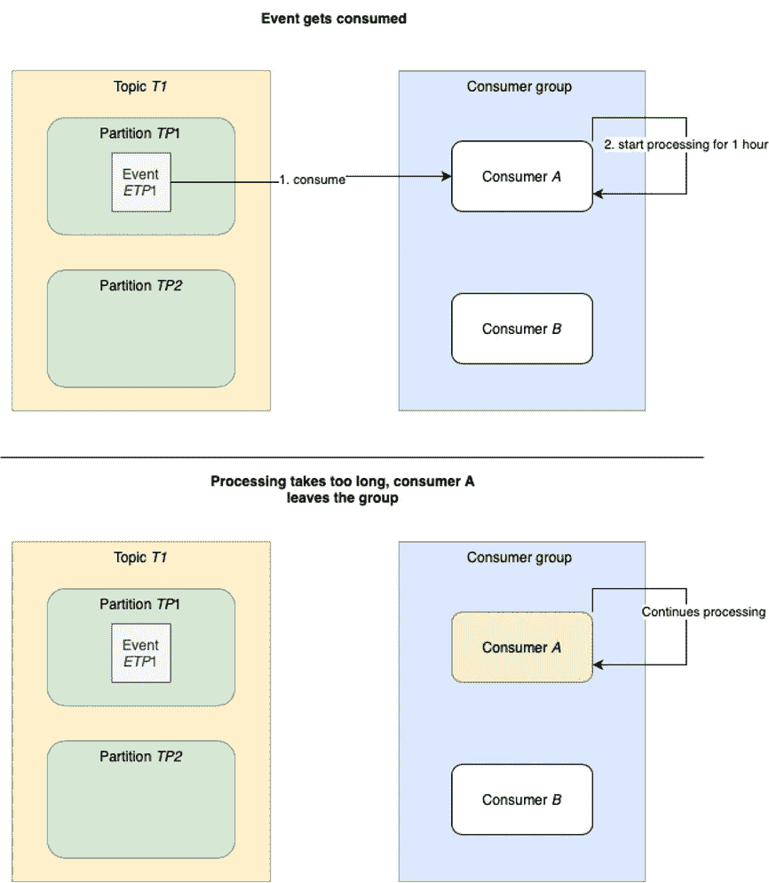

# 使用 Apache Kafka 处理长时间运行的作业

> 原文：<https://medium.com/codex/dealing-with-long-running-jobs-using-apache-kafka-192f053e1691?source=collection_archive---------0----------------------->

## Java (Spring)中执行长时间运行作业的五种方法及示例


凯文·Ku 在 [Unsplash](https://unsplash.com/s/photos/hourglass?utm_source=unsplash&utm_medium=referral&utm_content=creditCopyText) 上的照片

作为工程师，我们始终致力于为正确的工作使用正确的工具，追求卓越。然而，有时我们面临这样一种情况，我们有交付需求，我们必须用可用的工具使它工作。虽然这通常是一种有点令人沮丧的经历，但这也是一种学习经历，可以加深和更好地理解。

这正是我最近的一个项目中发生的事情。我们使用了一个事件驱动的微服务架构，主要使用 Java 和 Spring 作为我们的微服务，使用 Apache Kafka 作为我们的事件代理。在某种程度上，我们需要向我们的环境中添加长期运行的作业。考虑到我们面临的时间压力，我们决定不在那个时间点向我们的环境添加新的组件，因此我们的长时间运行的作业变成了新的微服务，这些微服务使用来自 Kafka 的事件并开始处理它们。

尽管一开始一切似乎都很顺利，但当我们增加微服务的副本数量时，我们开始遇到问题。这些问题都与 Kafka 消费者的默认配置有关，这些配置是为许多快速作业而不是少数长期运行的作业而构建的。在做了一些研究之后，我们设法让它工作起来，而没有改变我们环境中的工具(并且没有任何对整体规划的延迟)。在这篇博客中，我打算向你展示我们遇到的问题，以及我们根据不同类型的工作实施的各种解决方案。

通过这篇博客，我并不试图鼓励您使用 Apache Kafka 作为长时间运行作业的消息代理。它的优势在于在一个快速流类型的系统中有大量的事件，并且小型、快速的作业/进程经常被触发。如果您处于需要长时间运行作业的情况下，我建议您寻找一种针对并行化长时间运行作业进行优化的替代解决方案。相反，这篇博客的目的是向您展示如何使用 Apache Kafka 和 4 种不同的实现来处理长时间运行的作业，以防您处于那些罕见的场景之一，在您的环境中根本没有时间/预算来获得另一种工具。

在我们开始之前，最后说几句。这篇博客希望读者至少在一定程度上熟悉 Apache Kafka 的基础知识和[对等编排和编排](https://xavyr-rademaker.medium.com/peer-to-peer-choreography-and-orchestration-544af8b1bcfb)的概念。因为我将在整个问题&解决方案中提到其中一些概念。我还创建了一个知识库，里面有我将在博客中讨论的所有解决方案的一些非常基本的例子，可以在[这里](https://github.com/Xavyr-R/kafka-long-running-jobs)找到。

# 问题

在 Spring 中，Kafka 的消费者被默认配置为至少每 5 分钟进行一次投票。如果消费者未能在最后一次投票后的 5 分钟内投票，将被标记为死亡消费者并离开该组。当使用 Spring Kafka 消费程序时，它会在启动后在消费线程上持续轮询，因此您不需要为此做任何事情。一旦事件被轮询，系统将开始在消费者线程上处理该事件，直到它结束。这意味着默认情况下，消费者在完成处理之前不能再次轮询(因为消费者线程正忙于处理)。

下面您可以找到一小段伪代码来更好地解释消费者处理，请注意，对于长时间运行的作业，我指的是任何比默认的 5 分钟处理时间更长的作业。

```
While(true){ event = poll(); //since this happens sequentially, the next iteration & poll call    only happen after the method is done runLongRunningJob(event); commitOffset()}
```

现在我们已经了解了默认行为，让我们来说明出错的场景。在下面的示例中，我们有一个消费者组，其中有两个消费者，消费者 A 和消费者 B。消费者收听主题 T1，主题 T1 有两个分区 TP1 和 TP2，这意味着每个消费者分配了一个分区:消费者 A 有 TP1，消费者 B 有 TP2。此外，分区 TP1 上有一个名为 ETP1 的新事件。这种初始情况如图 1 所示。


*图 1:系统初始状态*

消费者 A 刚刚消费了事件 ETP1 并开始处理。处理这个事件大约需要一个小时，所以它只是从它开始。经过 5 分钟的处理(因此不是轮询)，消费者 A 被标记为死亡并离开该组。这些步骤如图 2 所示。



*图 2:消费者 A 花了太长时间处理事件，并离开了小组*

这触发了重新平衡，分区得到重新分配，将 TP1 和 TP2 分配给消费者 b。由于消费者 A 尚未提交其偏移量，它也将消费事件 ETP1 并开始处理。这也需要超过 5 分钟的时间，所以我们可以猜测这个消费者的未来。图 3 显示了这一过程。


图 3:消费者 B 接手，循环继续

除了每个消费 ETP1 的消费者将在 5 分钟后不得不离开组的不幸事实之外，即使在离开组之后，他们所有人仍然忙于处理事件。这意味着在我们的示例中，事件 ETP1 将被处理两次。想象一下有 10 或 20 个副本。迟早他们都会陷入处理完全相同的事件。这当然是对时间和资源的巨大浪费，更糟糕的是，如果事件没有被设计成幂等的，这可能会使系统处于不一致的状态。

# 解决方法

现在我们已经对发生的问题有了一个概念，让我们来看几个解决方案。本节将介绍以下五种解决轮询问题的不同方法:

*   优化代码
*   增加超时时间
*   一次性线程化
*   用线程和回调暂停消费者
*   把工作分成几个微进程

请记住，尽管这五种解决方案是相互独立描述的，但它们并不一定相互排斥。例如，将微处理器与增加的超时或一次性线程相结合就可以很好地工作。

这篇博客中给出的例子使用了伪代码或者 Java 和 Spring，但是当然这些解决方案也适用于其他语言。比如我们也用 Python 实现了其中的一些。

## 优化代码

第一个，也是最明显的，解决方案是优化你写的代码。有时使用正确的数据类型可以节省大量时间。例如，如果您的代码循环遍历一个列表，寻找一个 id 为 123 的对象，这个对象与列表的大小成线性关系( *O(n)* )。将数据加载到 HashMap 而不是 list 中，并使用 ID 作为键可能会提高性能，因为 HashMap 查找通常会不断扩展( *O(1)* )(平均而言)。

除了使用正确的数据类型，还要检查是否有冗余循环和/或计算。如果没有任何多余的代码片段，也尝试对所有集成进行一些完整性检查。你可以问自己这样的问题:我们是否多次加载数据？我们是否优化了对数据库的写入(考虑批量插入而不是普通插入/更新)？我们的查询被优化了吗？我们在需要索引的表上有索引吗(或者索引太多了)？我们能否在同一个循环中组合某些计算，从而避免我们不得不再次迭代同一个列表？所有这些问题都会导致我们系统的优化。

当然，这是一个简化的场景，有时代码已经尽可能地优化了，但是这项工作需要很长时间来处理。在这种情况下，本博客中讨论的其他解决方案可能会有所帮助。然而，这并不意味着代码是否可以优化总是值得关注的。

## 增加超时时间

当我在前面描述这个问题时，我提到最大轮询间隔的默认配置是 5 分钟。因此，第二个解决方案是增加这种配置的价值。为此设置的特定 Kafka 配置是“max.poll.records”，在 Spring 中可以设置如下(注意 300000 是 5 分钟的默认值):

```
spring.kafka.consumer.properties.max.poll.interval.ms= 300000
```

尽管这个解决方案听起来很简单，但它也有一些缺点。最大的缺点是，如果您的主处理线程(消费者线程)出现问题，只有在配置的轮询间隔后才能检测到。如果我们将其值设置为 1 小时，这意味着代理需要 1 小时才能意识到有问题并触发重新平衡。在很多情况下，1 小时的无所事事是不可接受的。

其次，多少时间够？如果您知道该过程最多需要 6 分钟，那么升级配置可能是可行的。然而，在很多情况下，找到正确的值充其量只能成为(受过教育的)猜测。将它设置得太低意味着同样的问题会在更长的时间后发生，而将它设置得太高意味着当事情真的出错时，需要更长的时间来触发重新平衡。

总结一下这种方法的利弊:

**优点:**

*   代码不受影响，它的纯配置
*   当一项工作需要超过 5 分钟，但仍然是可预见的快时，表现出色

**缺点:**

*   如果事先不知道阈值，这只是(有根据的)猜测
*   对消费者的重新平衡有影响，尤其是当配置设置为高值时

最后，在一些场景中，您可以使用这种方法来解决这个问题:

*   当作业的最大运行时间是可预测的时
*   当作业的运行时间比默认时间长不了多少时

## 一次性线程化

列表中的第三种方法是一次性线程化。仔细观察这个问题，我们发现它存在于这样一个事实中，即长时间运行的作业阻塞了消费者线程上的轮询循环，阻止它在作业完成之前再次轮询。现在，如果我们将工作卸载到单独的工作线程，会发生什么呢？在这种情况下，轮询循环只是在作业运行时继续。

使用 Spring 以一劳永逸的方式开始一项工作非常简单。首先将以下注释添加到您的配置类(如果有)或主类中:

```
@EnableAsync
```

这启用了 Spring 的异步方法执行能力。第二个，也是最后一个，需要添加到代码中的内容是将下面的注释添加到启动长时间运行作业的公共方法中:

```
@Asyncpublic void run(String event) { //some long running job}
```

只要从您的使用者调用这个方法，它就会作为后台作业运行，同时使用者的轮询循环继续进行，不会被中断。Spring 将为您处理线程管理。

如您所见，这种方法几乎不需要修改代码。无论处理时间如何，该解决方案都有效。简单易用、最少的代码修改和 Spring 处理并发的事实使得这种方法非常有吸引力。

然而，这种方法也有一些缺点。当您的作业是非常资源密集型的(高 CPU/内存使用率)时，为多个事件同时运行该作业意味着您有耗尽资源的风险，这意味着要么由于最大 CPU 使用率而降低性能，要么甚至更糟，耗尽内存。

除了资源密集之外，使用这种方法处理故障也变得更加复杂。由于这种方法的一次性本质，工作线程也需要包含其弹性逻辑。这可以是任何事情，从失败时调用自身(作为重试机制)到为死信主题(或原始主题，将其放回队列中)生成一个事件以供以后重新处理。

此外，由于消费者在消费下一个事件之前不会等待该事件被处理，因此我们失去了卡夫卡的排队行为。这意味着所有事件，即使是同一分区上的事件，都必须能够无序处理，或者需要在微服务中构建内部队列(确保遵循 Kafka 分区的队列)，这增加了复杂性。

我发现这种方法非常有效的是编排策略。由于该策略的核心是有一个处理流管理的协调器，它可以处理“一劳永逸”式长时间运行作业的错误流。微服务需要确保的是，无论成功与否，总是将结果返回给编排器。

总结这种方法:

**优点:**

*   最少的代码更改
*   高并发性
*   不管工作需要多长时间都可以工作

**缺点:**

*   当大量长时间运行的作业被触发时，资源变得稀疏
*   像重试这样的错误处理变得更加复杂，因为这个逻辑必须被添加到处理逻辑中

何时使用这种方法:

*   不占用大量资源的 I/O 密集型作业
*   作业可以彼此独立运行
*   不可预测/长时间运行
*   有一个编排器来跟踪成功/错误/重试(所有流方式逻辑)

## 用线程和回调暂停消费者

问题的第四个解决方案是暂停消费者。此处的[(在检测消费者故障下)](https://kafka.apache.org/25/javadoc/org/apache/kafka/clients/consumer/KafkaConsumer.html)文档中也描述了这种方法。

暂停使用者时，通常会暂停特定的主题分区。消费者仍然会轮询代理，但是，它只是不接受来自指定主题分区的任何新事件，直到它再次恢复。这项民意调查只是一项健康检查。为了确保轮询真正继续，我们仍然将工作卸载给工作线程(因为否则轮询循环将被阻塞，如解决方案 2 中所解释的)。不同之处在于，我们不使用“一劳永逸”式的处理，而是主动向作业添加一个回调，该回调将再次继续处理。

就代码而言，伪代码如下所示:

```
while(true){event = poll();consumer.pause(topicPartition);thread.runLongRunningJob(event) .callbackSuccess(resume(topicPartition)) .callbackError(handleError());commitOffset();}
```

偏移量仍然会被自动提交(替代方法将在后面讨论)，但是我们已经为长时间运行的作业添加了一个回调。在这个回调中，我们还可以处理错误场景(在 Spring 中，我们可以添加成功和错误回调),其中我们可以添加重试或死信主题逻辑，使其适用于对等编排，而不必修改我们的工作逻辑。

使用 Spring 在 Java 中实现这种方法如下所示:

```
@KafkaHandlerpublic void handleEvent(@Payload String event) { log.info(“Handling the event with body {} the pause container way”, event); //pauses the container containerSupportMethods.pauseConsume(containerId); executor.submitListenable(() -> longRunningJob.run(event)) .addCallback(result -> { containerSupportMethods.resumeConsumer(containerId); log.info(“Success callback”); }, ex -> { //perform retry mechanism like a dead letter queue here containerSupportMethods.resumeConsumer(containerId); log.warn(“Error callback”); } );}
```

其中暂停和恢复功能的实现方式如下:

```
private final KafkaListenerEndpointRegistry registry;public void pauseConsume(String containerId) { getContainer(containerId)
    .ifPresent(MessageListenerContainer::pause);}public void resumeConsumer(String containerId) { getContainer(containerId)
    .ifPresent(MessageListenerContainer::resume);}private Optional<MessageListenerContainer> getContainer(String containerId) { return Optional
    .ofNullable(registry.getListenerContainer(containerId));}
```

需要注意的一点是，低级的 Kafka 库允许您直接在消费者上调用 pause，确切地指定要暂停哪些分区。Spring 在底层消费者之上添加了一个抽象层，称为 MessageListenerContainer(运行消费者的 Spring 容器),从这里调用 pause 方法。该容器不允许您指定应该暂停哪些主题分区，而是针对消费者收听的所有主题暂停分配给消费者的所有分区。另一方面，这个容器确实提供了线程安全，允许我们在工作线程上恢复容器(在回调中)，其中低级消费者对象不是线程安全的(并且当从回调线程调用时不会恢复)。

当资源在“一劳永逸”的方法中变得稀缺时，这个解决方案将非常适合您。这是因为您限制了并发的数量，使其更加稳定。此外，我们重新获得了在不增加太多复杂性的情况下优雅地处理错误的自由，并且保留了 Kafka 分区的排队行为(由于有限的/无并发性)。然而，我们必须向我们的消费者添加更多的逻辑来实现这一点，并且我们失去了并发性可以给我们带来的速度优势。

总结这种方法:

**优点:**

*   稳定，即使对于资源(CPU/内存)密集型作业也是如此
*   回调可用于错误处理、重试等。，使它也适用于编排模式
*   保留 Kafka 分区的自然排队行为

**缺点:**

*   比以前的方法需要更多的代码更改
*   有限的/无并发性，这会导致更长的总体处理时间

何时使用这种方法:

*   您有不可预测的或非常长的运行时间
*   CPU/内存密集型作业
*   作业执行顺序很重要

## 将作业拆分成多个微进程

根据工作的性质，最后一个可行的解决方案是将其分成更小的流程。这种解决方案适用于任务计算量很大且可以并行化的情况。请注意，这更像是一个与技术无关的设计解决方案。

例如，如果我们的作业对每个名为 A、B 和 C 的新事件执行三个步骤，并且每个步骤最多需要 4 分钟来处理，如下面的伪代码所示:

```
While(true){ event = poll(); resultA = performA(event); //max 4 minutes result B = performB(resultA); //max 4 minutes finalResult = performC(resultB); //max 4 minutes}
```

这个示例作业可以分成三个[微进程](/creditorwatch/microprocesses-a-new-architectural-design-pattern-for-background-jobs-on-a-microservice-172a8a19ba8f)，每个微进程都有自己的消费者，并且在默认的时间限制内运行。重构后,(伪)代码库将是:

消费者甲:

```
While(true){ event = poll(); resultA = performA(event); //max 4 minutes produce(resultA);}
```

消费者 B:

```
While(true){ resultA = poll(); resultB = performB(resultA); //max 4 minutes produce(resultB)}
```

消费者 C:

```
While(true){ resultB = poll(); finalResult = performC(resultB); //max 4 minutes}
```

将长时间运行的作业划分为微进程有很多好处，比如更容易维护和部署。每个微进程都可以是它自己的微服务，因此它们可以在其他阶段运行时被部署。此外，每个微进程可以提供适当的资源，以满足特定阶段的需求，当然，它消除了长时间运行的作业和 Kafka 的问题。

然而，这是有代价的:增加了系统的整体复杂性。理解一个单独的长时间运行的过程意味着你必须检查所有的单个微过程，以发现它们都做什么以及它们如何联系在一起。此外，由于流程被分割成更小的部分，因此也需要使用对等编排或编排来协调这些流程。更不用说，并不是所有的作业都可以细分为微进程，每个阶段都符合最大轮询间隔持续时间。

根据这些信息，我认为这种方法有以下优点和缺点:

**优点:**

*   单个阶段可以单独部署和扩展
*   各个阶段的可维护性可能会提高(由于它们的范围有限)

**缺点:**

*   由于代码分离，您的工作的整体复杂性可能会增加
*   流程需要协调，这增加了系统的复杂性或组件
*   如果一个(或多个)部分的范围不能细化到适合默认的 5 分钟，那么就需要为该特定情况找到不同的解决方案

在某些情况下，将作业划分为微流程是可行的:

*   这项工作可以分成更小的工作单元
*   这项工作对系统来说非常重要，足以证明增加复杂性的合理性

# 一些要带走的提示

在实现上面的五个解决方案时，我发现有一些实现细节很方便，这一部分将详细介绍。

## 划分策略

如果执行顺序无关紧要，请确保系统使用的分区策略将长时间运行的作业均匀地分布在各个分区中。在我们的例子中，我们使用循环分区来确保工作在处理长时间运行的作业的消费者组中的所有副本上近似平均地分布。

值得注意的是，循环分区是 Kafka 2.3 和更低版本的默认分区策略(在没有键的情况下)。但是，在 2.4 版和更高版本中，这被粘性分区器所取代。尽管粘性分区器在有许多小任务的场景中在[性能](https://www.confluent.io/blog/apache-kafka-producer-improvements-sticky-partitioner/)方面提供了很多好处，但是当有几个长时间运行的任务时(在这种情况下，均匀分布会导致更多的并行性)，粘性分区器并没有什么帮助。

除了使用循环分区器，当然也可以编写适合您的用例的自定义分区策略。

## 限制每次轮询消耗的事件数

在使用暂停消费者方法的资源密集型作业中，我们发现限制每次轮询的最大轮询记录非常有用(我们将其限制为 1)。这可以通过设置以下弹簧配置来实现:

```
spring.kafka.consumer.max-poll-records=1
```

这迫使消费者一次处理 1 个事件，将消费者暂停的时间限制到绝对最小值。此外，在您希望纵向扩展副本，而一些使用者仍在处理数据的情况下，这种方法在扩展后提供了最高的并行性。下面的两张 gif 图展示了这种情况:


*默认行为，一次轮询多个事件*


*每次轮询一个事件时的行为*

## 使用手动提交

这对于资源密集型作业来说尤其如此，在这些作业中，消费者被暂停并使用回调来恢复。不要让 spring 在事件成功反序列化时自动提交，而是在事件处理逻辑的回调中自己提交事件。这允许您通过使用死信主题、重试(将事件添加到分区的后面或真正重试逻辑)或“否定”事件来构建适当的错误处理场景。

Spring 提供了一个很好的包装器类来处理事件的确认，称为“确认”，您可以在您的监听器(消费者)中将其作为 Kafka 处理程序的参数。若要访问此对象，请在应用程序中设置以下配置。

```
spring.kafka.listener.ack-mode=MANUAL_IMMEDIATE
```

成功处理后，可以通过调用 acknowledgement.acknowledge()来确认事件。类似地，当事件处理失败时，可以使用 acknowledgement.nack()对其进行否定应答，或者如前所述，结合一些重试逻辑对其进行应答。

# 包装它

这篇关于使用 Kafka 消费者处理长时间工作的博客到此结束。如果你想为不同的方法找到一些工作实例，看看这个库:[https://github.com/Xavyr-R/kafka-long-running-jobs](https://github.com/Xavyr-R/kafka-long-running-jobs)。repo 中的模块映射到解决方案，如下所示:

*   非异步:图示的问题也包含第一个解决方案的配置
*   Spring-async:一次性线程化
*   暂停容器:用线程和回调暂停消费者
*   Pause-container-with-acknowledge:通过线程和回调以及手动提交提示暂停消费者，并限制轮询的事件数量
*   微进程:将作业拆分成多个微进程

在结束之前，我想重复一遍，如果您的情况允许，您可能会更好地使用运行/编排长时间运行的作业的替代方案，而不是 Apache Kafka。在我的下一篇博客中，我将介绍工作流引擎，它可以作为其中的一种选择。所以，敬请关注未来的博客！