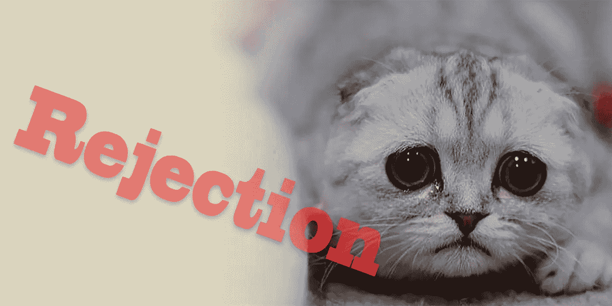

# 处理来自苹果应用商店的拒绝

> 原文：<https://medium.com/codex/dealing-with-rejection-from-the-apple-app-store-a597e012ca51?source=collection_archive---------0----------------------->

*本文转载自我给* [*Hashnode*](https://hashnode.com/post/dealing-with-a-rejection-from-the-apple-app-store-cisp16zu001284g53iqp3lu9d) 发的一个帖子。

在 iOS 出现之前，我就一直在为它编写软件，那时它还被称为 iPhone OS 2.0。浏览 App Store 审批流程可能很棘手，尤其是在处理被拒绝的应用程序时。

苹果可以因为很多不同的原因拒绝一个应用。在经历了几十次这一过程后，我想我会分享一些当你的应用被苹果拒绝时该怎么办的见解。几天前，我开发的一个应用程序被拒绝了，我通过苹果的“上诉委员会”让这个应用程序获得了批准。

我试图提交的应用被拒绝，因为苹果公司说它不能在 IPv6 WiFi 网络上工作。苹果在 7 月份开始要求提交给苹果的应用程序应该在 IPv6 网络上运行，因为许多蜂窝网络只能切换 IPv6。这是有道理的，因为 ICANN 前段时间用完了 IPv4 的 IP 地址。如果你的应用不能在 IPv6 网络上运行，苹果将拒绝该应用。

我们的应用确实可以在 IPv6 网络上运行，但苹果仍然拒绝了我们的应用。这是怎么发生的？是因为苹果的 WiFi 测试网络存在缺陷。你可以点击此链接了解相关信息[https://forums.developer.apple.com/thread/48314.](https://forums.developer.apple.com/thread/48314](https://forums.developer.apple.com/thread/48314).)苹果开发网站上有一篇关于如何将你的 Mac 变成支持 NAT64 的 IPv6 WiFi 路由器的文章。我用这个来证明我们的应用可以在 IPv6 网络上运行。

# 如何赢得上诉

*不要只是重新提交你的 app* ！苹果在 iTunes Connect 上提供了一个“解决中心”。在解决中心，你可以回复来自苹果的信息。在回复中尽可能多地向苹果提供信息。你甚至可以上传附件。苹果还提供了一个链接，可以将你的应用程序被拒绝的情况“上诉”到苹果的审查委员会。这听起来很官僚，但苹果通常会在 24 小时内回应你的请求。

在我们的例子中，他们要求我们在元数据的注释部分添加一些额外的信息，其中包括我们的应用程序在 IPv6 网络上工作的视频链接，并要求我们在 iTunes Connect 中按下“提交以供审查”按钮。

# 提交应用程序的基础知识

我建议任何开发者在向苹果应用商店提交应用之前做的第一件事就是阅读他们的[应用商店审查指南](https://developer.apple.com/app-store/review/guidelines/)。苹果甚至发布了一本漫画书，解释苹果接受应用程序的规则。在审查我们的视频后，他们接受了我们的应用程序。

现在创建一个 App 有很多不同的方法。在很多情况下，你甚至可以选择你最喜欢的编程语言。其中一些框架包括 PhoneGap、Cordova、Xamarin、Unity 3D、React Native、NativeScript，当然还有苹果的 CocoaTouch 框架。苹果过去对他们自己的工具之外的任何东西都有限制，但他们已经向大多数不同的框架开放了应用商店。也就是说，确保如果你确实使用了这些非苹果框架中的一个，你仍然遵循他们的指导方针。苹果不希望任何人在 iPhone 或 iPad 上运行编译器。即使你确实用 CocoaTouch 构建了你的应用，那也不能保证苹果不会拒绝你的应用。

# 应用程序完整性

苹果拒绝你的应用的另一个原因是他们所谓的“完整性”。这意味着他们不希望你发布一个有问题或者在启动时崩溃的应用。你可能还需要考虑的其他事情是，如果你的应用程序需要登录，请确保你向苹果公司提供他们在审查你的应用程序时可以使用的登录名和密码。如果你的应用需要后端服务，请确保该服务已打开。这大部分是常识，但这是一些开发人员常见的问题。

# 内容

苹果对你放在应用上的内容很敏感。确保你尊重你计划发布应用的国家的版权法和知识产权法。同样重要的是，要确保你的应用适合你的目标年龄群。他们希望确保家长控制能够正常工作。为你的应用选择正确的类别也很重要。如果你的应用以商业为目标，确保你选择它作为你的类别。

# 隐私

尊重用户的隐私。未经用户同意，不要发回有关用户个人信息的数据。如果你处理的是医疗信息或儿童，这种审查会被放大。还需要考虑一般隐私和 HIPAA 法律。

# 位置

就电池使用而言，在手机上使用 GPS 和其他基于位置的 API 可能会很昂贵。我让苹果拒绝了我做的一个应用程序更新，因为他们不喜欢我在后台使用定位的方式。在我的情况下，苹果建议我们使用地理围栏，这是他们的位置 API 的一部分。

# [计]元数据

这听起来可能微不足道，但这是苹果拒绝许多应用程序的一个常见原因，这是因为应用程序的元数据中提供的信息不完整或错误。我有一个更新被拒绝，因为我们在描述中提到了一个在竞争对手的操作系统上运行的配套应用程序。我现在不会说那是哪个 OS，但我可以告诉你那是世界上最常见的手机操作系统，是一家名字和“foogle”押韵的公司出的。

# 总结

向苹果提交应用程序的过程有时似乎很繁琐，但苹果现在在这方面已经做得很好了。菲尔·席勒接管了苹果公司运营应用商店的部分，自他接管以来，评论次数大幅下降。过去，苹果批准一个应用程序需要两周时间。这个时间现在减少到大约一天。

苹果很快就要发布 iOS 10 了，所以我敢肯定，随着开发人员竞相为 iOS 10 准备好他们的应用程序，这些审查时间会再次增加，但现在整个过程似乎没有那么痛苦了。

我喜欢为 iOS 开发，尽管在与应用商店打交道时你必须跨越一些障碍。这不应该阻止任何想为 iOS 开发应用程序的人在 App Store 上发布。