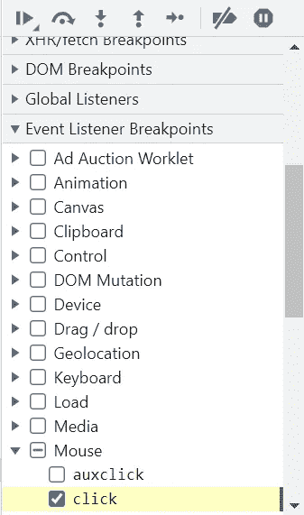

# 调试 JavaScript —正确的方法

> 原文：<https://medium.com/codex/debugging-javascript-the-right-way-206fe62748cf?source=collection_archive---------10----------------------->

**还在用 console.log 调试你的代码？—你在浪费很多时间。**

让我们讨论一种调试 JavaScript 代码的更好方法。

每当我们调试一个问题时，我们总是从重现问题开始——找到导致错误的一系列操作。

对于本文，我们将使用由 Google 提供的 [***这个***](https://googlechrome.github.io/devtools-samples/debug-js/get-started) buggy sum 应用程序。

在这个应用程序中，假设我们将 6 和 7 相加，它返回的和是 67——这是我们需要调试的问题。

现在，您可以说我可以使用 console.log 来调试这个问题，所以在继续之前，让我告诉您使用它的缺点。

1.  在大型代码库中找到相关代码是一项开销很大的任务。
2.  然后在这里和那里洒上 console.log，希望到达有问题的部分。
3.  然后刷新页面&检查控制台。

并且，如果以上三个步骤不起作用，那么你需要一次又一次地重复以上三个步骤。

**DevTools 使您能够暂停执行中的代码，检查作用域变量&查看代码一次执行一行。**

让我们开始调试这个有问题的应用程序。

打开控制台&转到 sources 选项卡，调试在 sources 选项卡中进行。

在左侧，你会发现**文件导航窗格** — ，其中显示了所有的 JavaScript 文件。在右边，我们有 JS 调试面板，所有神奇的事情都发生在这里

通过查看应用程序，我们可以说在调用“click”事件监听器时出现了一些问题。让我们来看看代码中的那个时刻。

转到事件侦听器断点->鼠标->单击。它现在在首次单击事件侦听器中添加了一个断点。

当我们现在单击“添加数字 1 和数字 2”按钮时，控制器到达 onClick 函数的第一行。

**断点**不是此列表中提到的唯一事件，它们可以是不同的类型。它可以是特定的一行代码，任何 DOM 节点的改变，或者任何你想要停止代码的地方。

**代码步进控件**，位于调试窗格顶部，帮助一次执行一行。我们来讨论一下-

**恢复脚本执行** —恢复脚本执行。如果您觉得您没有到达代码中的要求点，那么继续执行脚本，直到到达要求点

**转到下一个函数调用**——这将绕过当前语句&到达其结尾。

**跳出当前函数调用**——帮助跳出特定函数

当你开始使用它们的时候，你会了解它们的功能，让我们回到我们的问题上来。

检查完代码后，我们可以说错误在 updateLabel 函数的某个地方，让我们在那里设置一个断点。

在调试窗格中，我们有调用堆栈，它显示了范围内的所有变量。当我们查看变量 addend1 & addend2 时，我们看到它们是字符串。

让我们转到**观察**部分——它使我们能够观察一段时间内表达式的值。让我们添加类型的总和&看到它后，增加。

当代码暂停时，我们可以访问范围变量。让我们在调试阶段修改代码&看看我们是否得到了正确的错误。

现在，在纠正错误并运行代码后(用 Ctrl+S 保存后),我们得到的 sum 类型为 number。

而且，我们在浏览器中也得到了同样的结果！！

希望您通过这篇文章了解了令人惊奇的 DevTools。更多精彩内容， ***敬请期待*** ！！！😁 😁

在 [LinkedIn](https://www.linkedin.com/in/eshaan-bagga/) 上和我联系。