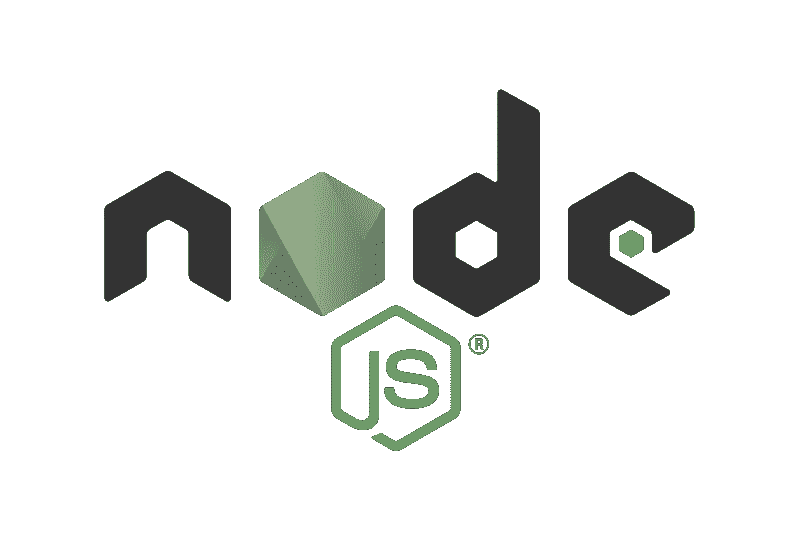
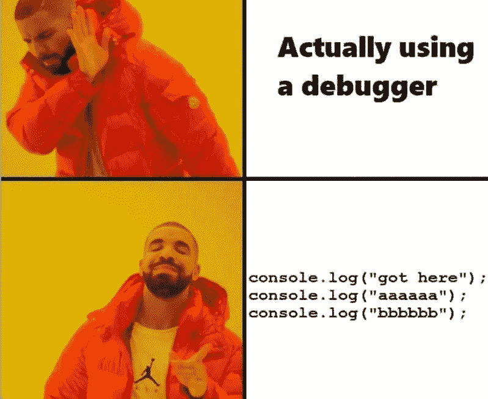
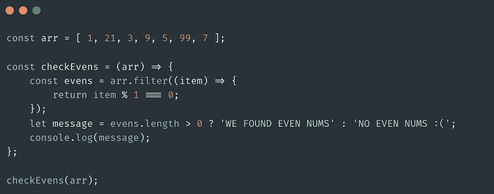
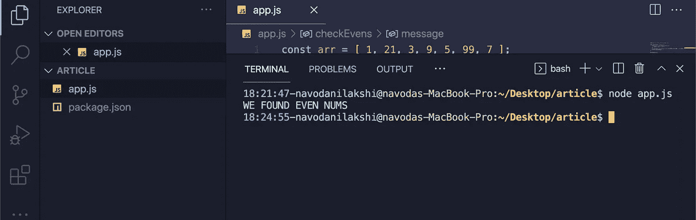
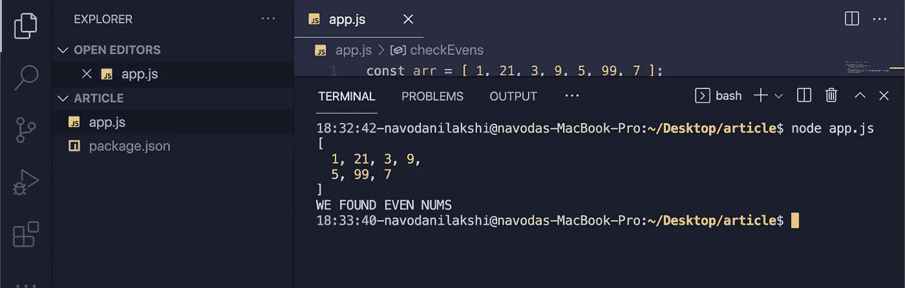
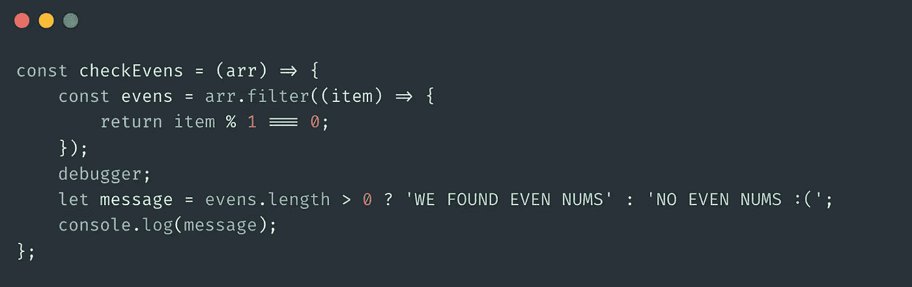
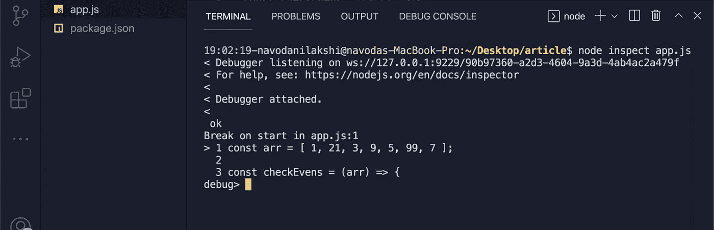
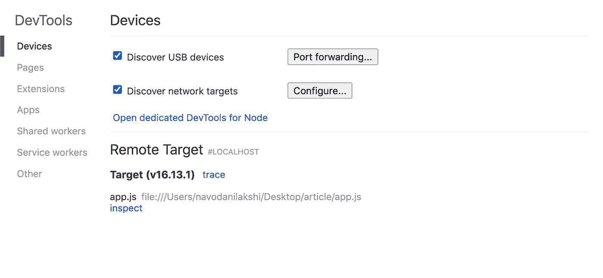
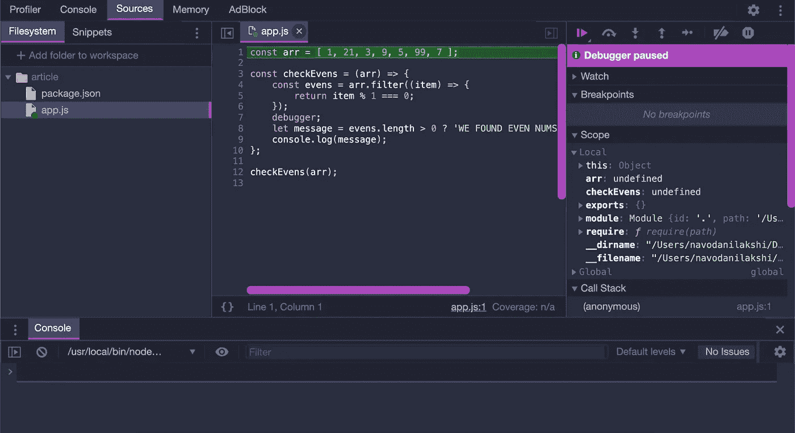
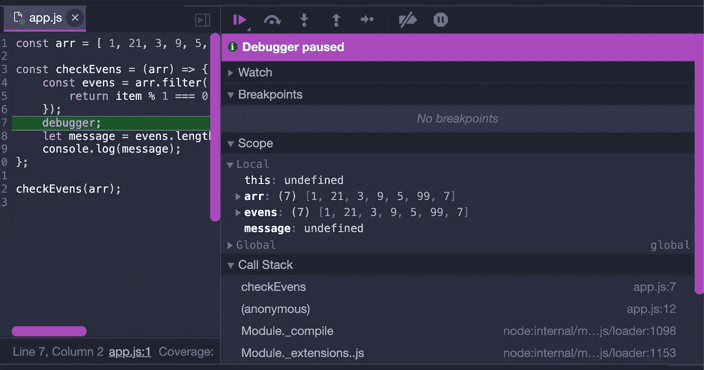

# 调试 Node.js

> 原文：<https://medium.com/codex/debugging-node-js-4544262349e1?source=collection_archive---------5----------------------->



bug 总是开发不可避免的一部分。你永远不知道你的程序什么时候会崩溃，在屏幕上抛出一个大错误。这就是为什么在本文中，我们将探索 Node.js 中的各种调试方法，以便您可以更快地摆脱困境，继续开发您的应用程序。

在我看来，客户端 Javascript(浏览器 JS)调试起来容易多了，因为有‘开发工具’什么的。我们大多数人都有花哨的编辑器，让我们尽可能轻松、无痛苦地进行调试。

现在，对于服务器端 JavaScript AKA Node.js，情况并非总是如此。尽管现代 IDE 和编辑器提供了不可否认的支持，但有些情况可能会令人沮丧。

Node.js 中有很多调试方法，在本文中，我们将学习几种最流行的方法。当然，还有许多其他方式可以是编辑器自带的特定于 IDE/代码编辑器的方式。另一方面，不管您使用什么编辑器，也有一些通用的调试方法。

# “臭名昭著”的 console.log()



首先，我想说这是最受批评的调试方式，因为它的基本性质。但是尽管如此，在很多情况下，一个简单的“console.log()”可以跟踪代码中的错误，并帮助您更快地修复它。

考虑下面的代码片段:



如果你运行这段代码，你会得到这样的结果，即使数组中没有偶数。



嗯，这是因为我有' ***误把*** '取模时用了 **1 而不是 2** 。每个数字都可以被 1 整除，所以测试通过了，将每个数字过滤到新数组中。这使得它的长度为 0，因此“我们发现偶数 NUMS”被打印出来，尽管实际上每个数字都是奇数。

这个例子很简单，你可以在一瞬间看到我们哪里出错了。**但是**想象一下，这是一大块代码在做十几件事，很难跟踪代码出错的地方。您可以做的是，您可以定位打印结果的位置，然后您可以查看' *evens* '数组由什么组成，以通过控制台日志记录' evens '数组产生这样的输出。

```
console.log(evens)
```

您将获得以下输出:



现在你可以很快到达“啊哈”时刻，因为你可以看到整个数组被打印出来，尽管并不均匀。你知道这是你的逻辑有问题，你可以在一个例子中纠正它。

" *console.log()"* 可以帮助你将变量值转储到控制台，这样你就可以看看你的逻辑哪里出错了。希望您能在调试时看到简单的“ *console.log()* ”语句的潜力。没问题的..继续下一个！

# 节点调试器

这是调试影院的下一部分。添加一两个 *console.logs* 来找到自己的路就可以了。但是当开发大型应用程序时(不像我愚蠢的 *checkEvens* 例子，这可能会很快失控，并且随着你不断在各处添加 *console.logs* 而变得越来越令人讨厌。

嗯，这正是**节点的内置调试器**派上用场的时候。你可以很容易地使用你的浏览器(Chrome)，它是建立在 ***v8 JavaScript 引擎*** 之上的。是的，你没听错。您*可以借助浏览器*调试节点！

第一步是将'*调试器*'关键字放在有问题的代码中任何有意义的地方。理想情况下，这应该在决策之前。



之后，照常运行应用程序，但是使用' *inspect* '参数。

```
node inspect app.js
```

它应该让你这样，



下一步是打开 chrome，进入' **chrome://inspect** '。如果您正确地完成了前面的所有步骤，那么您得到的页面应该类似于下面这样，



在*远程目标*下，您将看到您刚刚在终端中运行的进程。点击相关目标下的“*检查*链接，将在“*开发工具*中打开您的文件。但是如果您的文件夹/文件没有被打开，您可以通过进入**文件系统- >将文件夹添加到工作区**来打开它。



如果一切就绪，可以单击右上角的 play 按钮，进入调试过程的下一步。在这种情况下，当遇到代码中的“debugger”关键字时，单击 play 按钮将立即冻结执行。从那里，您可以很容易地从右侧面板检查变量的值。



从上面的截图可以看出，在检查变量执行的值时，这种方式更容易、更快，并且可伸缩。您还可以添加断点，以便在您感兴趣的特定点停止执行。

如果需要进一步澄清，可以参考[官方 Node.js 关于调试的指南](https://nodejs.org/en/docs/guides/debugging-getting-started/)。

所以你有它！下次当你面临那些可怕的错误时，尝试使用这些方法。下次见！