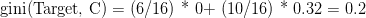
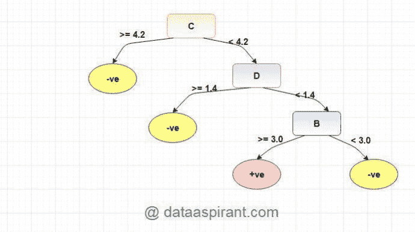

# 决策图表

> 原文：<https://medium.com/codex/decision-tree-d77d4bf8b284?source=collection_archive---------18----------------------->

决策树是一种监督学习算法，可用于回归和分类。

决策树是一种监督预测模型，可以学习预测回答一组简单的问题。它回答了一系列的问题，这些问题把我们带到了树的某一条路线上。决策规则通常采用 if-then-else 语句的形式。树越深，规则就越复杂，模型就越合适。

**决策树是如何工作的？**

决策树使用不同的属性重复地将数据分成子集，并重复该过程，直到子集是纯的。纯意味着它们都具有相同的目标值。

分割是如何进行的，或者树是如何决定在哪个变量上进行分割的？

输入变量可以是数字的或分类的，或者是数字和分类的混合，而不管目标变量是数字的(即回归问题)还是目标变量是分类的(即分类问题)。

在分类输入变量的情况下，我们必须找出一个变量来分割数据集。为了计算这个变量，我们需要使用不同的变量分割数据集，并选择最适合下面提到的指标的变量。

对于数值输入变量，我们必须找出一个变量和值的组合来分割数据集。为了计算这个变量和值的组合，我们需要使用不同的变量和这些不同变量的不同值来分割数据集，并选择最适合下面提到的指标的变量和值的组合。

回归

-标准偏差的减少

分类

-信息增益

-基尼杂质

**标准差减少**

标准偏差减少是一种当目标变量连续时用于分裂节点的方法。我们使用标准差来计算一个数字样本的同质性。如果数字样本是完全同质的，其标准偏差为零。

分别计算一个属性和两个属性的标准差和变异系数。

它是如何工作的

步骤 1:计算目标的标准偏差

步骤 2:计算每个拆分的标准偏差，作为子节点的加权平均标准偏差

步骤 3:选择要分割的分支，该分支给出标准偏差的最大减少

第四步:在实践中，我们需要一些终止标准。检查分支的变化系数是否小于阈值和/或当分支中剩余的实例太少(n)时(例如 3)，然后终止分裂，并且相关的叶节点获得目标变量的平均值。

步骤 5:重复上述步骤，直到所有数据都处理完毕。

例子

第一步:计算目标的标准偏差。

标准偏差(比赛时间)= 9.32

第 2 步:然后数据集被分割成不同的属性。计算每个分支的标准偏差。从分割前的标准差中减去得到的标准差。结果是标准偏差减少

步骤 3:选择具有最大标准偏差减少的属性作为决策节点。

步骤 4a:基于所选属性的值划分数据集。这个过程在非叶分支上递归运行，直到所有数据都被处理。

实际上，我们需要一些终止标准。例如，当分支的偏差系数(CV)变得小于某个阈值(例如 10%)时和/或当分支中剩余的实例(n)太少时(例如 3)。

步骤 4b:“阴”子集不需要任何进一步的分裂，因为其 CV (8%)小于阈值(10%)。相关的叶节点获得“阴天”子集的平均值。

步骤 4c:然而,“阳光”分支的 CV (28%)比阈值(10%)大，需要进一步分裂。我们选择“Windy”作为“Outlook”之后的最佳节点，因为它具有最大的 SDR

因为两个分支(假和真)的数据点数等于或小于 3，所以我们停止进一步分支，并将每个分支的平均值分配给相关的叶节点。

步骤 4d:此外，“多雨”分支的 CV (22%)大于阈值(10%)。这根树枝需要进一步劈开。我们选择“Windy”作为最佳节点，因为它具有最大的 SDR。

因为所有三个分支(冷、热和温和)的数据点的数量等于或小于 3，所以我们停止进一步分支，并将每个分支的平均值分配给相关的叶节点。

当一个叶节点上的实例数量多于一个时，我们计算平均值作为目标的最终值。

**信息增益**

数据集分割后熵减少的度量是信息增益。

信息增益是一种统计属性，用于衡量给定属性根据目标分类将训练样本分开的程度。

如果使用 X 特征进行分割，则信息增益可以表示为

信息增益(T，X) =熵(T) —熵(T，X)

或者

其中[加权平均值] *熵(子节点)=(左侧子节点中的示例数)/(父节点中的示例总数)*(左侧节点的熵)+(右侧子节点中的示例数)/(父节点中的示例总数)*(右侧节点的熵)

熵是什么？

熵是一种测量杂质的方法。它是对数据集中随机性或不可预测性的一种度量。熵是无序或不确定性的度量，由于机器学习模型的目标通常是减少不确定性，熵越低，就越容易从数据中得出任何结论，相反，熵越高，就越难从该信息中得出任何结论。

熵=∑pj log2pj

-如果节点的所有样本属于同一类(样本是同类的)，则熵为 0

熵= 1 log 1 = 0

-如果我们有一个均匀的类分布(样本被等分)，熵是最大的

熵= 0.5 log 0.5 0.5 log 0.5 = 1

-分裂的熵越大，从分裂中获得的信息越少。分裂的熵越大，目标变量的无序/不确定性减少得越少

-分裂的熵越小，从分裂中获得的信息越多。分裂的熵越小，目标变量的无序/不确定性减少得越多

-熵为 0 的分支是叶节点。

-熵大于 0 的分支需要进一步分裂。

步伐

-计算目标的熵

-计算每个分裂的熵，作为子节点的加权平均熵

-选择具有最低熵或最高信息增益的分裂

-重复上述步骤，直到获得同类节点

例子

考虑一个例子，我们正在构建一个决策树来预测给一个人的贷款是否会导致注销。我们的全部人口由 30 个实例组成。16 个属于注销类，另外 14 个属于非注销类。我们有两个特性，即“Balance”可以取两个值—“< 50K” or “>50K”和“Residence”可以取三个值—“OWN”、“RENT”或“OTHER”。

圆点是分类正确的数据点，星号是未注销的数据点。在属性平衡上分割父节点给我们 2 个子节点。左侧节点获得了总观察值中的 13 个，其中 12/13 (0.92 概率)观察值来自注销类，而只有 1/13(0.08 概率)观察值来自未写入类。右节点得到总观察值的 17，其中 13/17(0.76 概率)观察值来自非注销类，4/17 (0.24 概率)来自注销类。让我们计算父节点的熵，看看通过平衡分裂，树可以减少多少不确定性。

分割特征，“平衡”导致目标变量的信息增益为 0.37。让我们做同样的事情为功能，“住宅”，看看它如何比较。在 Residence 上分割树给了我们 3 个子节点。左边的子节点得到总观察值中的 8 个，其中 7/8 (0.88 概率)观察值来自注销类，而只有 1/8 (0.12 概率)观察值来自非注销类。中间的子节点得到总观察值的 10，其中注销类的观察值为 4/10(概率为 0.4)，非注销类的观察值为 6/10(概率为 0.6)。右边的子节点得到总观察值中的 12 个，其中 5/12 (0.42 概率)观察值来自注销类，7/12 (0.58)观察值来自非注销类。我们已经知道了父节点的熵。我们只需要计算分裂后的熵来计算“居住”的信息增益

来自特征平衡的信息增益几乎是来自居住地的信息增益的 3 倍。Balance 比 Residence 提供了更多关于我们的目标变量的信息。它减少了我们的目标变量中更多的无序。决策树算法将使用此结果，使用 Balance 对我们的数据进行第一次拆分。

**基尼指数或基尼不纯度**

是最小化错误分类概率的标准

可以将其视为用于评估数据集中分割的成本函数。

这是一个衡量随机选择的元素被错误识别的频率的指标。

它的计算方法是从 1 中减去每类概率的平方和。基尼指数与分类目标变量“成功”或“失败”一起工作。它只执行二进制分割。

基尼= 1∑p j

-如果类别完全混合(例如二元类别)，基尼指数最大

基尼= 1(P1+p2)= 1((0.5)+(0.5))= 0.5

与基尼系数较高的属性相比，基尼系数较低的属性被错误分类的可能性较小。因此，在构建决策树时，我们倾向于选择基尼系数最小的属性/特征进行拆分。

-基尼优于熵，因为它的计算速度更快

步伐

-计算每个分裂的基尼系数，作为子节点的加权平均基尼系数

-选择基尼系数最低的分割点

-重复上述步骤，直到获得同类节点

例子

我们将使用与信息增益示例相同的数据样本。让我们试着用基尼指数作为判断标准。这里，我们有 5 列，其中 4 列有连续数据，第 5 列由类标签组成。

a、B、C、D 属性可被视为预测值，E 列类标签可被视为目标变量。为了从这些数据中构建决策树，我们必须将连续数据转换成分类数据。

我们选择了一些随机值来对每个属性进行分类:

A

B

C

D

>= 5

>= 3.0

>=4.2

>= 1.4

< 5

< 3.0

< 4.2

< 1.4

Var A 的基尼指数

16 条记录中有 12 条记录的 Var A 值> =5，4 条记录的值<5 value.

For Var A > = 5 & class ==正:5/12

对于变量 A >= 5 & class ==负:7/12

基尼(5，7) = 1- ( (5/12)2 + (7/12)2 ) = 0.4860

对于 16 条记录中的 12 条记录的 Var A <5 & class == positive: 3/4

For Var A <5 & class == negative: 1/4

gini(3,1) = 1- ( (3/4)2 + (1/4)2 ) = 0.375

By adding weight and sum each of the gini indices:

Gini Index for Var B

Var B has value > =3，以及值为<5 value.

For Var B > = 3 & class ==正数的 4 条记录:8/12

对于 Var B >= 3 & class ==负:4/12

基尼(8，4) = 1- ( (8/12)2 + (4/12)2 ) = 0.446

对于 Var B ❤ & class ==正数:0/4

对于 Var B ❤ & class ==负:4/4

gin(0，4) = 1- ( (0/4)2 + (4/4)2 ) = 0

Var C 的基尼指数

16 个记录中有 6 个记录的 Var C 值> =4.2，10 个记录的值<4.2 value.

For Var C > = 4.2 & class ==正数:0/6

对于 Var C >= 4.2 & class ==负:6/6

基尼(0，6) = 1- ( (0/8)2 + (6/6)2 ) = 0

对于 16 个记录中的 5 个记录，Var C < 4.2& class == positive: 8/10

For Var C < 4.2 & class == negative: 2/10

gin(8,2) = 1- ( (8/10)2 + (2/10)2 ) = 0.32

Gini Index for Var D

Var D has value > =1.4，并且 11 个记录的值<1.4 value.

For Var D > = 1.4 & class ==正:0/5

对于变量 D >= 1.4 & class ==负:5/5

基尼(0，5) = 1- ( (0/5)2 + (5/5)2 ) = 0

对于 Var D < 1.4 & class == positive: 8/11

For Var D < 1.4 & class == negative: 3/11

gini(8,3) = 1- ( (8/11)2 + (3/11)2 ) = 0.397

**问题用决策树**

当我们构建决策树时，它会考虑数据集中的所有列，并逐个分支地选择最佳列进行拆分。因此，在根节点进行分割的列被认为比在其他分支的列更重要，因此所有预测将对顶部的列产生巨大影响，并且当在实时场景中，如果出现第一列不是进行预测的最重要特征的观察时，模型将不能很好地预测。

这个问题会导致高方差，即当我们更改数据集进行预测时，准确性会降低。解决方案是使用随机森林模型，该模型通过在随机样本子集上使用随机特征子集来训练模型，从而减少方差。因此，输出不是来自一个决策树，其中具有固定重要性级别的列用于所有样本的预测，而是来自许多决策树的输出，其中不同的特征被认为具有不同的重要性。

**修剪**

在建立决策树模型时，过拟合是一个实际问题。我们可以使用随机森林算法或剪枝技术来克服过度拟合的问题。

修剪是删除树叶和树枝以提高决策树性能的过程。修剪是分裂的相反过程。

修剪包括移除利用低重要性特征的分支。这样，我们降低了树的复杂性，从而通过减少过拟合来提高其预测能力。

**预修剪**

在预修剪中，它提前停止了树的构建。这种方法阻止了非重要分支的生成。它根据给定的条件终止新分支的生成。如果节点的品质度量低于阈值，则优选不分割节点。

**后期修剪**

生成完整的树，然后修剪/移除不重要的分支。在每一步都要进行交叉验证，以检查新分支的添加是否会提高准确性。否则，该分支将被转换为叶节点。

执行修剪的一些重要参数是减少叶节点数量的 max_leaf_nodes、限制样本叶大小的 min_samples_leaf、减少树的深度以构建一般化树的 max_depth。

#数据科学#机器学习算法#深度学习算法#数据#算法#德勤#德勤大学#英特尔#target #pwcindia