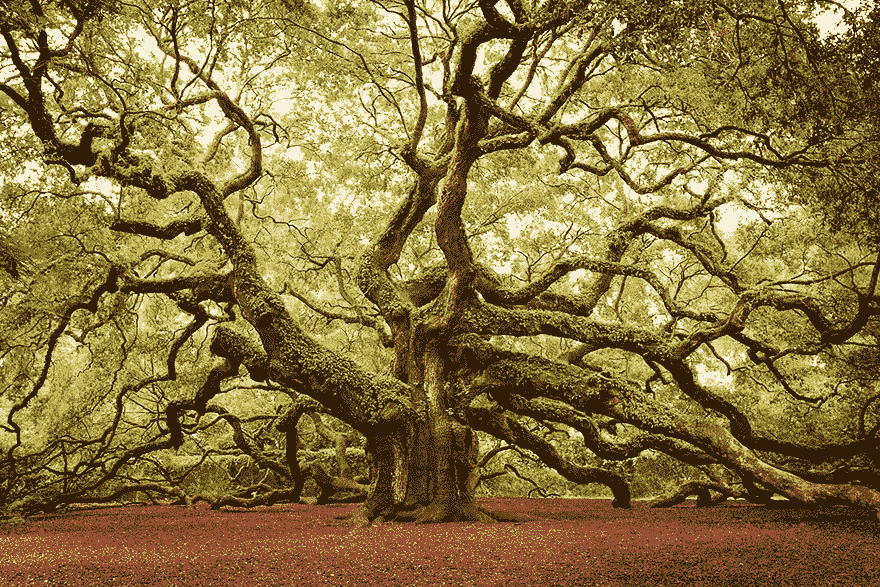
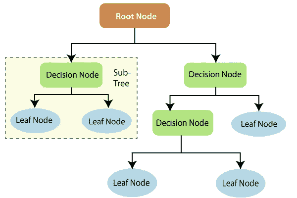
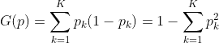
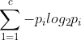
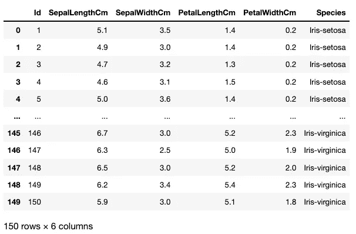
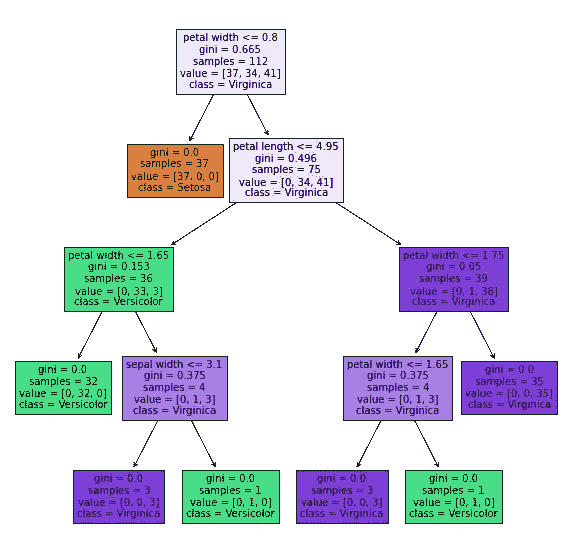

# Python 中的决策树

> 原文：<https://medium.com/codex/decision-trees-in-python-98ca587f4329?source=collection_archive---------11----------------------->



(图片来源:[丹妮拉·邓肯](http://500px.com/photo/77479191/angel-oak-by-daniela-duncan))

决策树是一种*监督的*机器学习模型，用于分类和回归任务(CART)。它们易于实现和解释，是最常用的机器学习工具之一。

树是*非参数* *非线性*模型，这意味着它们的函数可以根据需要采用任意多的参数 *(* 不同于固定在 *a* =截距、 *b* =斜率 *)* 上的线性回归，并生成 *X* 到 *y* 的非线性映射。

# 分类和回归树

决策树可以分为两类:

1.  *回归树*:目标变量可以取连续值的决策树(*通常是数字*)。
2.  *分类树*:目标变量取一组离散值的树模型(*类*)。

所有的树都由*节点*和*分支*组成。第一个节点也被称为*根节点*，最终节点(预测)被称为*叶节点*，中间的节点是**内部节点或决策节点。*节点由*分支连接。**

**

*图 1 —决策树*

# *主旨:信息增益*

*决策树将根据在该阶段实现最大信息增益的特征，将每个*父节点*分成两个*子节点*。这个过程将从根节点(第一次分裂)开始，并且将继续，直到所有子节点都是纯的，或者直到信息增益为 0(除非我们手动设置一个“max_depth”参数)。*

*信息增益通过分割给定特征上的数据来衡量*熵*(数据集的*杂质*或*随机性*的度量)减少了多少，并且树通过连续分割特征来增长其分支，从最具预测性到最不具预测性。*

*最小化熵相当于最大化信息增益，这正是树在每次分裂时要达到的目标。*

*在具有 *n* 不同概率类别 *P、*的数据集中，测量节点 *I、*杂质的两个主要标准是**基尼指数:***

**

*和**熵:***

**

*基尼指数往往在计算上更有效，因此它最常用于决策树算法中。对任何有兴趣了解更多的人，我推荐这个视频。这帮助我将基尼指数背后的想法形象化，并最终更好地理解树形模型是如何工作的。*

# ***用 Scikit-Learn 实现分类树***

*在下一节中，我将编写一些代码来演示分类树在众所周知的 Iris 数据集上的简单应用。这可以通过 Scikit-Learn 轻松访问，并随时进行处理:*

```
*from sklearn import datasets
iris = datasets.load_iris()*
```

*…但我将把它作为. csv 文件导入，使这个应用程序更通用。*

*让我们开始导入所有模块:*

```
*import pandas as pd
import numpy as np
from sklearn.tree import DecisionTreeClassifier
from sklearn.model_selection import train_test_split
import matplotlib.pyplot as plt*
```

*导入和读取数据集:*

```
*df = pd.read_csv("Desktop/Iris.csv")
print(df)*
```

**

*图 2—虹膜数据集*

*我们的特征 *X* 是 *SepalLenghtCm，SepalWidthCm，PetalLenghtCM，PetalWidthCM* 和*我们的目标变量 *Y* 是物种。**

*为了使用我们的特性，我们需要创建一个矩阵 *X* ，其中每行代表一个*实例*，每列代表一个*特性。*我们可以使用一个 NumPy 数组来实现这一点，该数组从感兴趣的列中获取数据，然后对其进行转置。我们还需要创建一个列向量 *y* ，这是我们的目标变量(花卉种类):*

```
*X = np.array([df.SepalLengthCm, df.SepalWidthCm, df.PetalLengthCm, df.PetalWidthCm]).Ty = np.array(df.Species).reshape(-1,1)print(X.shape) -> *Out: (150, 4)*
print(y.shape) -> *Out: (150, 1)**
```

**(注意:树不需要特征缩放，所以我们不担心这个。)**

*一旦我们将数据整理好，我们就可以开始创建决策树分类器了:*

```
*dtc = DecisionTreeClassifier(max_depth = 4, random_state=0)*
```

*然后，我们将数据集分为训练集和测试集:*

```
*X_train, X_test, y_train, y_test = train_test_split(X, y, random_state=0)*
```

*使分类器适合训练集:*

```
*dtc = dtc.fit(X_train, y_train)*
```

*最后，对测试集上的分类器进行评分，以检查模型*的准确性*:*

```
*score = dtc.score(X_test, y_test)
print(score) -> O*ut: 0.9736842105263158**
```

*我们的模型是完整的: *0.97%的准确率，*对于这样一个简单的分类器来说一点也不差！*

# *这是我们的树的样子*

```
*fn=['sepal length','sepal width ','petal length ','petal width ']
cn=['Setosa', 'Versicolor', 'Virginica']plt.figure(figsize=(10,10))
tree.plot_tree(dtc, feature_names = fn, class_names=cn, filled = True)*
```

**

*图 3 —我们的分类树*

# *使用我们的模型进行预测*

*给定一朵新的花(实例),我们可以这样开始预测它的种类:*

```
*new_flower = np.array([5.5, 2.8, 5, 2]).reshape(1,-1)
prediction = dtc.predict(new_flower)
print(prediction) -> *Out: 'Iris-virginica'**
```

*我们的分类器似乎工作得很好，我们今天做得相当不错！*

*决策树可以被调整(它们的*超参数*)、增强，也可以被组合来创建随机森林。还没完…*

# *编写基本决策树*

*总之，实现这个分类树的代码是:*

```
*import pandas as pd
import numpy as np
from sklearn.tree import DecisionTreeClassifier
from sklearn.model_selection import train_test_splitdf = pd.read_csv("Desktop/Iris.csv")X = np.array([df.SepalLengthCm, df.SepalWidthCm, df.PetalLengthCm, df.PetalWidthCm]).Ty = np.array(df.Species).reshape(-1,1)dtc = DecisionTreeClassifier(max_depth = 4, random_state=0)X_train, X_test, y_train, y_test = train_test_split(X, y, random_state=0)dtc = dtc.fit(X_train, y_train)score = dtc.score(X_test, y_test) 
print(score)*
```