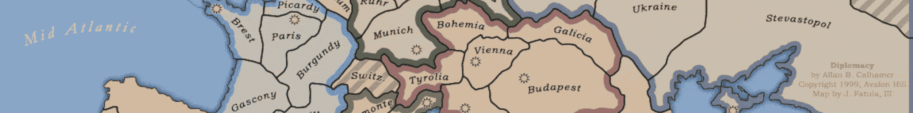
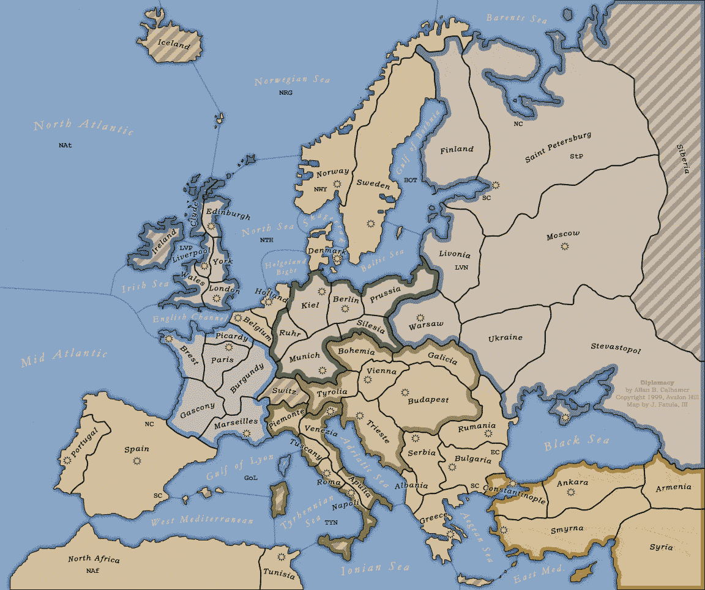

# 声明式 Swift 中的外交

> 原文：<https://medium.com/codex/declarative-diplomacy-in-swift-c32a07101c9f?source=collection_archive---------5----------------------->

我想介绍一个精彩的游戏。这需要战略思维、勇气、心理、谈判技巧——以及偶尔的暗箭伤人。它被恰当地命名为外交。

故事发生在 1901 年的欧洲，是第一次世界大战的前奏。

游戏的目标是占领至少一半的大陆领土。但是，在其他游戏引入掷骰子等随机选择的情况下，在外交中，任何举动的结果都完全取决于你的谈判技巧，因为在某一点上，你将不得不结成联盟——而在某些点上，这些联盟将在背叛中破裂。我想你不会感到惊讶，有些人把它描述为友谊黑仔。

对于这篇文章，我想实现董事会和单位的运动。我们假设之前已经检查过这些动作的有效性，并且它们可以被执行——如果没有任何冲突的动作，这是正确的，因为外交的一个特点是，在给定的游戏赛季中，所有玩家的动作都在同一时间执行。

外交委员会

我们将实施陆上军队和海上舰队的运动。

我们将使用声明式编码风格，其中状态和所有模型都是 100%不可变的——从数量上减少了可能的错误空间。事实上，我们的代码将只对以前使用过的变量进行一次重新分配——写入新生成的状态。

这里的声明性意味着我们告诉计算机我们想要他做什么，而不是如何做——并且一遍又一遍地重复。

编程界面将非常类似于英语口语。

最后，我们将把一支军队从德国的鲁尔区转移到荷兰和比利时(这听起来像是历史重演)，一支军队从柏林一直转移到君士坦丁堡(自 1930 年以来的伊斯坦布尔)，这是我希望有一天能进行的一次旅行——不过不是和一支军队，而是一辆旧的沃尔沃 240。我们会看到一支舰队驶向爱琴海——来接我。

《外交》知道七个帝国有七个玩家，领土可以是`land`或`sea`类，可以被军队或舰队占领。

边界可以是陆地、海洋、陆地和海洋(沿海)之间，也可以是海峡，丹麦和基尔或君士坦丁堡的博斯普鲁斯海峡之间。

`Board`掌握着领土和边境。`Board.Change`对可能的命令进行编码。我们将在`move`上看一看。在`execute`中，对`change`值进行评估，并通过对区域进行必要的更改并将其写回而进行相应的处理。唯一真正需要可变性的地方。只有当两个区域直接相连时，移动才是可能的。

现在我们创建领土。有一大堆，只是一些例子:

大不列颠

法国

现在，我们需要根据地图通过建立边界来连接领土:

现在让我们创建一个董事会，并作出一些举动！
`.move( .army(of:.germany,from:bulgaria, to:constantinople) )`
读起来难道不像自然的英语吗——如果你能忽略那些时髦的标点符号的话？

`print(board:)`移动前将输出

在...之后

就是这样:德国已经通过比利时将军队转移到荷兰，并在此过程中征服了这两个国家。从柏林到君士坦丁堡的所有行动都顺利完成，舰队到达了阿吉昂海。

# 结论

在大学期间，我和一些朋友玩过几次外交游戏。无论是作为一个经典的面对面的棋盘游戏还是在线游戏。从那以后的几年里，我不时地把游戏的一部分编码成一种*式的编码形式*——从来没有比这种声明式风格更令人愉快和简单的体验了。此外，仅用了大约 100 行代码来表达模型和电路板。这些代码即使对非编码人员也是可读的。我妈妈能理解是怎么回事——真的，我考验过她。它尽可能的不可变，减少了错误和崩溃的可能性。

我已经在 [gitlab](https://gitlab.com/-/snippets/2185068) 上传了故事板。阅读更多关于 Khipu 的[，Khipu 是一个使用相同语言元素并建立相同约束的通用应用程序架构。](https://decodemeester.medium.com/khipu-rapid-and-sustainable-software-creation-in-swift-using-engineering-and-science-principles-312a933cce57?sk=8359f48cc06571e53de156db8cbc005c)

一个伟大而有趣的外交入门:

在我的下一篇文章中——即将完成——我想向您介绍 Swift 中基于能力的设计，同样是完全不可变和声明性的。