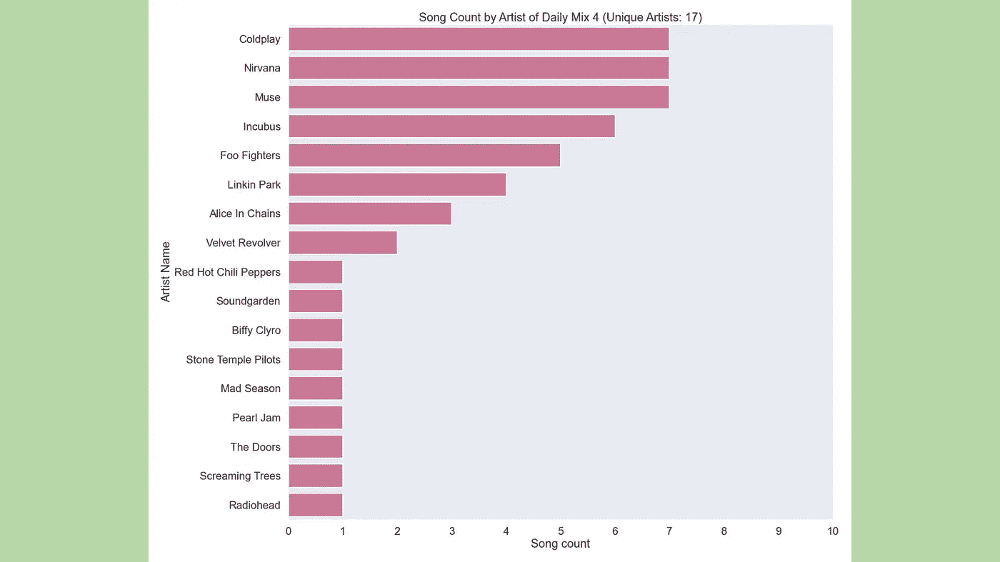

# 解码 Spotify 每日混音

> 原文：<https://medium.com/codex/decoding-spotify-daily-mix-73f4783037b4?source=collection_archive---------10----------------------->

## 使用 Python 中的 Spotipy 来分析我的 Spotify 每日混音


韦斯·希克斯在 [Unsplash](https://unsplash.com?utm_source=medium&utm_medium=referral) 上的照片

我几乎每天都听音乐，Spotify 是我的主要收听平台。我学习的时候听音乐，睡觉的时候听音乐，写这篇文章的时候其实也在听音乐。我也为了听音乐而听音乐，跟着唱，用贝斯或吉他跟着弹。

既然我听音乐听得这么多，我想分析一下我的听歌行为可能会很有趣。

你可以说我听音乐的方式可以分为两类:主动听和背景音乐。


作者的两个音乐类别:主动聆听和背景音乐(缩略图来自 [Spotify](https://spotify.com/)

我最初的想法是获取我听的 1000 首最新歌曲并进行分析。为此，我使用了一个名为 Spotipy 的 Python 库来帮助我完成任务。

Spotipy 是一个 Python 库，充当 Jupyter Notebook 上的应用程序和 Spotify API 之间的桥梁。简而言之，Spotipy 使得获取数据更加 Python 友好。你可以点击阅读完整的文档[。](https://spotipy.readthedocs.io/en/master/)

# 设置 Spotify API

要开始使用 Spotify API，首先我们需要在 [Spotify for Developers](https://developer.spotify.com/dashboard/applications) 页面上创建一个帐户，然后创建一个应用程序。


创建应用程序后，Spotify for Developers 仪表盘应该是什么样子(图片由作者提供)

在我们创建应用程序之后，设置一个回调 URI 来使 API 工作是很重要的。要设置回拨，进入你的应用程序，然后点击**编辑设置**，并在**重定向 URIs** 下填写 URI。如果你没有预先确定的 URI，你几乎可以在那里放入任何东西。我简单地输入*http://localhost:8877/callback/*就可以了。如果这不起作用，请尝试放置另一个不是为另一个应用程序保留的端口( *localhost:8888* 通常是为 Jupyter Lab 保留的)。


设置回调(图片由作者提供)

# 设置 Spotipy

现在我们已经完成了 API 设置，我们可以继续到 Jupyter 实验室。首先，我们导入我们需要的库。

```
# import spotipy library
import spotipy
from spotipy.oauth2 import SpotifyClientCredentials
from spotipy.oauth2 import SpotifyOAuth# import other relevant libraries
import pandas as pd
import numpy as np
import matplotlib.pyplot as plt
import seaborn as sns
import os
```

如果没有安装 Spotipy 库，可以使用 pip 来安装。

```
!pip install spotipy
```

然后我们设置凭证。为此，我们需要客户端 id、客户端密码和重定向 URI。客户端 id 和密码可以在我们在 Spotify 上为开发者页面创建的应用程序中找到，重定向 URI 就是我们之前设置的那个。我这里是[*http://localhost:8877/callback/*](http://localhost:8877/callback/)*。*我在这里使用 *os.environ* 来提高安全性，并使认证过程自动化。

```
# setting up the credentials
os.environ['SPOTIPY_CLIENT_ID'] = ''
os.environ['SPOTIPY_CLIENT_SECRET'] = ''
os.environ['SPOTIPY_REDIRECT_URI'] = ''
```

Spotipy 有两种认证方式: *SpotifyClientCredentials* 和 *SpotifyOAuth* 。使用*SpotifyClientCredentials*，我们可以从与用户无关的 Spotify 数据中获取信息，比如艺术家和专辑。这种方法不需要使用重定向 URI 登录 Spotify，因为它是一般数据。另一方面， *SpotifyOAuth* 允许我们获取与特定用户相关的信息，比如保存的曲目或最近播放的歌曲。我们需要为这个方法指定一个[范围](https://developer.spotify.com/documentation/general/guides/authorization/scopes/)，它将使用重定向 URI 提示一个登录页面。这两种方法都与上面的 *os.environ* 步骤无缝协作，这意味着我们不需要再次指定凭证，因为它们会自动从 *os.environ* 中获取凭证。

```
# method for general data to get artist albums
sp = spotipy.Spotify(client_credentials_manager=SpotifyClientCredentials())
results = sp.artist_albums('spotify:artist:2WX2uTcsvV5OnS0inACecP', album_type='album') # method for user specific data to get saved tracks
sp = spotipy.Spotify(auth_manager=SpotifyOAuth(scope="user-library-read"))
results = sp.current_user_saved_tracks()
```

# 尝试分析最近播放的歌曲

现在我们已经设置了 Spotipy，我们可以进入下一步，即获取曲目。Spotipy 一次只能获取 50 首曲目，但它有一个 *next* 函数，可以让我们获取更多曲目。这是一个获取我保存的曲目的例子。


保存的曲目列表提供 540 个结果(图片由作者提供)

然而，我遇到了一个特殊的问题。对于*current _ user _ recent _ played()*方法，我似乎无法获取超过 50 首曲目。


最近播放的列表仅限于 50 个结果(图片由作者提供)

我认为我的代码是不正确的，所以我试图调整它，但无济于事。我也在网上做了一些研究，看看是否有人也遇到了这个问题。事实证明，这是一个常见的问题，促使许多人在 Spotify 开发者论坛上发表了许多帖子，包括这篇文章。

我得出的结论是，Spotify 团队没有为最近播放的曲目正确实现 *next* 功能，获取它的唯一方法是手动完成，或者创建一个每 3 小时左右自动运行一次的脚本来获取曲目。对我来说，这有点太费时间了。因此，我决定转向另一个方向，分析自动生成的日线图。

# 分析每日混合

Spotify 根据用户的收听行为自动生成 6 首每日混音。每个混音包含 50 个通常彼此相似的轨道。在这种情况下，混合分类如下图所示。


每日混音(缩略图来自 [Spotify](https://spotify.com/)

分类似乎分为三个更大的类别。每日混音 1 和 2 是背景音乐，有更多的高保真度。每日混音 3 和 4 是活跃的收听播放列表，主要是摇滚、另类摇滚和基督教音乐。出于某种原因，一些印度尼西亚流行歌曲融入了基督教音乐播放列表。最后，每日混音 5 和 6 是背景音乐，更平静和放松的氛围。

我对分析每日混音感兴趣的有三件事，即:音频特征、歌曲发行年份和艺术家的歌曲计数。

要开始分析，我们需要先提取音轨。我写了一个函数 *fetch_daily_mix()* 来自动化这个过程。首先，我们将范围定义为*用户最近阅读播放的*，并创建引擎 *sp* 。然后，我们使用 *sp.playlist()* 从播放列表 ID 中获取所有曲目。它将返回一个类似 json 的结果，我们将结果放入 dataframe 中。

播放列表 ID 可以是 URL、URI 或 ID。可以从 Spotify 应用程序中获取 URL，方法是右键单击播放列表，然后**共享** → **复制播放列表的链接**。所以现在我们为所有六个每日混音调用该函数。这里有一个每日混合 1 的例子。


获取每日混音 1 的音轨信息(图片由作者提供)

现在我们想从音轨中获取音频特征。我写了下面的函数来获取它。我们使用上面定义的 *sp* 引擎来调用 *sp.audio_features()* ，将音轨信息作为数据帧的输入。

之后，我们为每日混音调用该函数。这里有一个每日混合 1 的例子。我将在下面的图像中解释每个特征。


带音频功能的每日混音 1(图片由作者提供)

现在，我们将数据帧连接在一起，并在可视化数据之前做一些整理。

```
# give the source name for each dataframe
mix_1_complete['source'] = 'Daily Mix 1'
mix_2_complete['source'] = 'Daily Mix 2'
mix_3_complete['source'] = 'Daily Mix 3'
mix_4_complete['source'] = 'Daily Mix 4'
mix_5_complete['source'] = 'Daily Mix 5'
mix_6_complete['source'] = 'Daily Mix 6'# merge the dataframes together
spotify_df = pd.concat([mix_1_complete, mix_2_complete, mix_3_complete, mix_4_complete, mix_5_complete, mix_6_complete])# change the datatype of release date to visualize the release year
spotify_df['album_release_date'] = pd.to_datetime(spotify_df['album_release_date'])# set the sns style for the visualization
sns.set_context('poster')
sns.set_style('dark')
```

## 可视化音频特征

完成初步工作后，我们现在可以将音频特征可视化。我决定用 *sns.violinplot()* 来展示每天的搭配之间的对比。根据播放列表封面，我对每天的混音使用相似的颜色。提醒一下，每日混音 1 和 2 是 Lo-Fi 音乐，每日混音 3 和 4 是主动聆听混音，而每日混音 5 和 6 是平静音乐。


可跳舞性(作者图片)


能量(图片由作者提供)


响度(图片由作者提供)


演讲(图片由作者提供)


声音(图片由作者提供)


工具性(作者图片)


活跃度(作者图片)


化合价(图片由作者提供)


速度(作者图片)

根据上面的可视化，很明显，每日混音 3 和 4 与其他混音相比具有不同的音频特征，尽管对人类来说风格完全不同(基督教音乐与摇滚/另类摇滚音乐)，但彼此之间具有非常相似的特征。这意味着我会主动听具有这些音频特征的歌曲，而不管其流派如何。

除此之外，每日混合 1 和 2 被分组在一起，在这里和那里有微小的变化。这意味着每日混音 1 和 2 可以互换播放，我可能不会注意到。

对于每日混合 5 和 6，它们也大多被分组在一起。但在某些情况下，如可跳性、效价和节奏，它们变化很大。这可能是相互补充的，但如果有人将运行播放列表从每日混音 5 改为 6，我可能会注意到一点。

## 基于发行年份可视化歌曲

这一次，我们希望根据歌曲的发行年份来可视化歌曲，以查看分布情况。我还会根据歌曲属于哪种日常混音来给出不同的颜色。


基于发行年份的每日混音类别的歌曲直方图(图片由作者提供)

从上面的直方图中，我们可以看到绝大多数歌曲都是在 2020 年之后发布的，其中 2021 年的歌曲最多。只有 Daily Mix 4(摇滚/另类摇滚播放列表)有一直到 90 年代才发布的歌曲。新发布歌曲的绝对数量似乎是由 Lo-Fi 和环境音乐引起的，这些音乐最近才因 Spotify 等流媒体服务而激增。

## 可视化每个艺术家的歌曲计数

在这种情况下，我们希望根据歌曲的发行年份来显示歌曲数量，包括每天的混音中有多少独特的艺术家。我保持和以前一样的颜色。


每日混音 1 艺术家的歌曲计数(图片由作者提供)


每日混音 2 艺术家的歌曲计数(图片由作者提供)


每日混音 3 艺术家的歌曲计数(图片由作者提供)



每日混音 4 艺术家的歌曲计数(图片由作者提供)


每日混音 5 艺术家的歌曲计数(图片由作者提供)


每日混音 6 艺术家的歌曲计数(图片由作者提供)

从上面的可视化中，我们可以看到，每日混音 3 和 4 是活跃的听力混音，具有较少的独特艺术家(<20) compared to the Background Music (> 30)。主动聆听混音也有更多来自个人艺术家的歌曲。这可能是因为主动聆听更倾向于特定的艺术家，而在背景音乐中，艺术家比音乐的声音更不相关。

正如我之前指出的，有一些印度尼西亚流行歌曲最终出现在了 Daily Mix 3 播放列表(基督教音乐混合)上。从我人类的角度来看，他们不属于一起，但根据 Spotify，他们实际上属于一起。因此，看起来 Spotify 自动生成并不完美。

这就是我如何利用 Spotipy 来分析我自己的倾听行为。从这个过程中，我在最初的想法中遇到了一个问题，学会了如何迭代，找到另一个解决方案，得到我想要的见解。我还了解到 Spotify 如何通过使用音频功能而不是流派来管理和分类他们的库。最重要的是，我了解了自己的倾听行为，这是我生活中很大的一部分。

如果你想了解自己在 Spotify 上的收听行为，你可以在这里找到完整的代码[。祝您分析 Spotify 数据愉快！](https://github.com/abrahamzetz/spotipy-daily-mix)