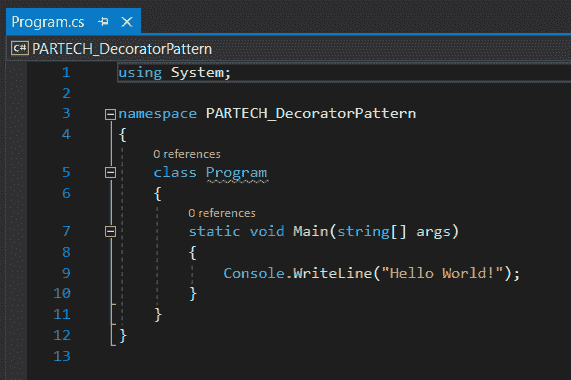
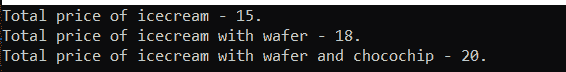

# C#中的装饰模式

> 原文：<https://medium.com/codex/decorator-pattern-in-c-45d19337dc69?source=collection_archive---------8----------------------->


软件世界中的设计模式有助于开发更快且经过测试的范例。它解决了代码(或开发人员)在实现代码之前不会遇到的未来问题。

一般来说，设计模式增加了代码的可重用性，提高了代码的可读性。有三种类型——创造型、结构型和行为型。

Creational 处理类实例化技术。结构化处理类对象组合，并提供向类添加新功能的方法。行为处理类的对象如何通信。

在这篇博客中，我们将会看到一个属于结构类的装饰模式。让我们先看看什么是装饰模式，然后理解上面提到的设计模式解决了什么问题。

**目录**

1.  什么是装饰模式？
2.  如何在 C#中实现装饰模式
3.  结论

# 什么是装饰模式？

装饰模式解决了在不影响开闭原则的情况下向现有类添加责任的问题。这不需要对现有的类进行任何动态修改。

这是通过向现有的类添加一个包装器来实现的。装饰模式由四个主要元素组成

1.  成分
2.  混凝土构件
3.  装饰者
4.  混凝土装饰工

组件是提供由具体组件消费的操作的接口。具体组件是实现该组件的类，并且具有需要执行的原始操作。装饰器为所有需要添加到具体组件的动态操作定义了接口。具体装饰者是需要添加到具体组件中的单个操作。它继承了一个装饰器。

围绕这四个项目，已经构建了装饰器模式。它是在功能被扩展而不修改现有类的地方实现的。

# 如何在 C#中实现 Decorator 模式？

让我们借助现实生活中的情况来解释这一点。

考虑一家冰淇淋店，用户可以在那里定制他/她的订单。用户必须选择冰淇淋的基本口味，然后选择浇头。

现在，为了计算冰淇淋的总价，我们需要将冰淇淋的基价和各种配料的基价相加。

我们将使用 C#中的装饰模式来实现这个简单的场景。

为此，我们将使用一个简单的基于控制台的。Net 应用程序。我们将专注于在 C#中实现该模式，而不是在可以使用。网络图书馆。

## 第一步

创建基于. Net Core 的控制台应用程序，并为解决方案提供有效的名称和路径。


## 第二步

创建解决方案后，打开 Program.cs 文件。这是将要做出改变的地方。默认情况下，该文件如下所示。



## 第三步

如前一节所述，其思想是实现装饰模式实现所需的四个主要元素。作为第一步，我们将实现组件。因为这是一家冰淇淋店，所以我们正在为冰淇淋创建一个组件。

```
public interface Icecream ​ { ​ double CalculatePrice(); ​ }
```

## 第四步

创建具体的组件，在我们的例子中是冰淇淋口味。这里，我们将考虑 vanilla 并实现它的逻辑。具体组件继承组件并实现方法 CalculatePrice。

```
public class VanillaIcecream : Icecream ​ { ​ public double CalculatePrice() ​ { ​ return 15; ​ } ​ }
```

## 第五步

创建将被混凝土装饰者使用的装饰者。这用于将浇头值添加到冰淇淋的基础价格中。在这里，装饰器继承了组件并实现了所需的方法，还拥有一个期望组件被传递的构造函数。

```
public abstract class ToppingDecorator : Icecream ​ { ​ readonly Icecream _icecream; ​ public ToppingDecorator(Icecream icecream) ​ { ​ _icecream = icecream; ​ } ​ public virtual double CalculatePrice() ​ { ​ return _icecream.CalculatePrice(); ​ } ​ }
```

## 第六步

创建继承 ToppingDecorator 并覆盖 CalculatePrice 方法的 concrete decorator。因此，当更新后的 concrete 组件或 decorator concrete 被传递时，将会计算总和值。

下面是一个继承了 toppingdecorator 并实现了 CalculatePrice 方法的 Wafers 示例，其中包含了将额外金额与产品的基本价格相加的逻辑。

```
public class Wafers : ToppingDecorator ​ { ​ public Wafers(Icecream icecream) : base(icecream) ​ { ​ } ​ public override double CalculatePrice() ​ { ​ return base.CalculatePrice() + 3; ​ } ​ }
```

类似于薄饼，任何其他浇头也可以根据需要添加。下面是另一个巧克力片浇头的例子。

```
public class Chocochip : ToppingDecorator ​ { ​ public Chocochip(Icecream icecream) : base(icecream) ​ { ​ ​ } ​ public override double CalculatePrice() ​ { ​ return base.CalculatePrice() + 2; ​ } ​ }
```

## 第七步

现在我们已经实现了组件(冰激凌接口)、具体组件(VaniallaIceCream)、装饰器(ToppingDecorator)和具体装饰器(waves 和 Chocochip)。让我们看看如何使用它们来实现装饰模式。

打开 Program.cs 文件并包含以下代码行。

```
var icecreamOrder = new VanillaIcecream(); Console.WriteLine($"Total price of icecream - { icecreamOrder.CalculatePrice() }."); var wafer = new Wafers(icecreamOrder); Console.WriteLine($"Total price of icecream with wafer - { wafer.CalculatePrice() }."); var chocoChip = new Chocochip(wafer); Console.WriteLine($"Total price of icecream with wafer and chocochip - { chocoChip.CalculatePrice() }."); Console.ReadLine();
```

在上面的例子中，首先，创建了混凝土组件(VanillaIcecream)的对象。在下一行中，打印的是基本冰淇淋的价格。

接下来，为 wafer 创建一个对象，并将 vanillaicecream 对象作为输入参数传递给它。所以，价格可以在包括香草冰淇淋上面的威化之后计算出来。

如果我们在晶圆上添加一个 choco-chip，那么晶圆的对象将作为输入参数传递给 choco-chip 类。然后在包括香草冰淇淋、威化饼和巧克力片的基础价格之后计算价格。

下面是将在控制台窗口中显示的最终数据。



# 结论

多亏了 C#中的 Decorator 模式，您能够在不修改现有类的情况下实现额外的功能。这对开发人员来说非常方便，因为它有助于代码的可重用性和可读性。除此之外，它还有助于实现开闭原则。

*原载于*[*https://www . partech . nl*](https://www.partech.nl/nl/publicaties/2021/05/decorator-pattern-in-c-sharp)*。*