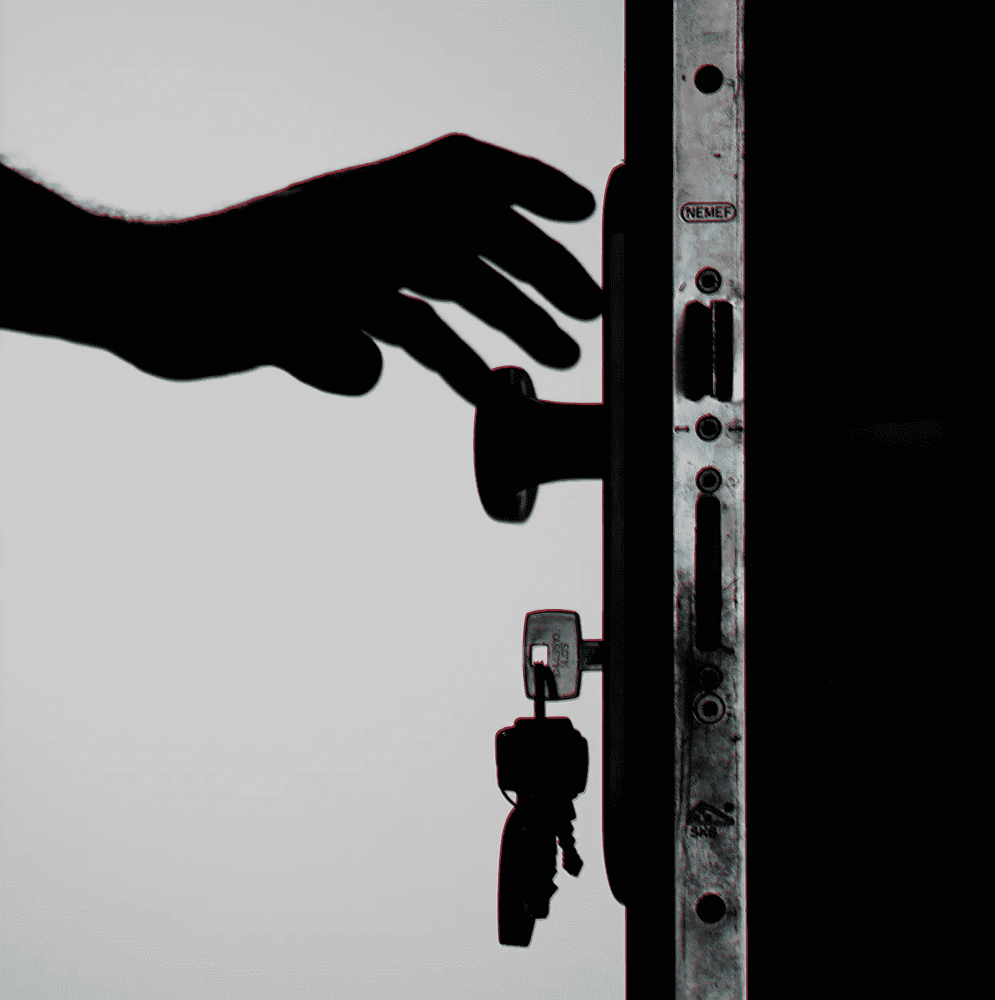

# 解密端到端加密

> 原文：<https://medium.com/codex/decrypting-end-to-end-encryption-f158f03acb5b?source=collection_archive---------4----------------------->

## 以及为什么我们现在想推迟它

致谢:乔治·贝克尔(via [Pexels](https://www.pexels.com/nl-nl/foto/silhouetfoto-van-houder-van-deurknop-792032/)

**人们很容易忘记隐私辩论是如何沉寂了一个多世纪的。美国宪法第四修正案奠定了基础，最高法院只是将其扩展到密封信件。甚至政府拥有的邮政服务的信封也在它的保护之下。就这样。** …