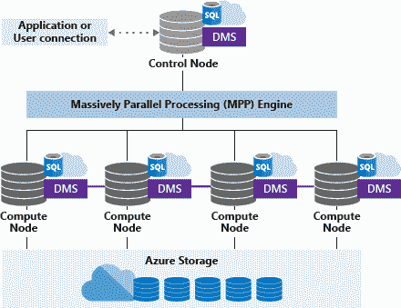
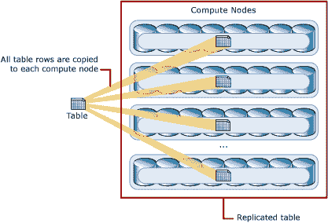
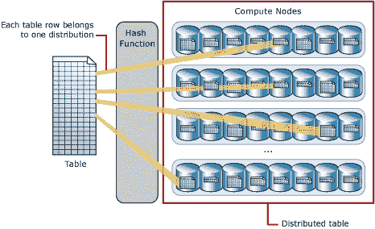
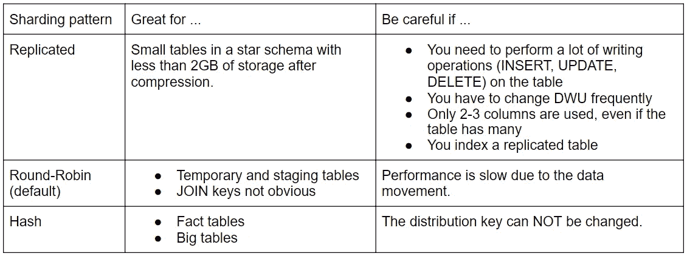
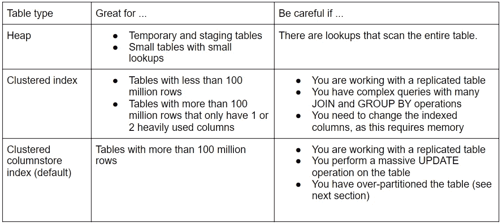

# Azure Synapse Analytics 中的专用 SQL 池

> 原文：<https://medium.com/codex/dedicated-sql-pools-in-azure-synapse-analytics-d3ac7c394a95?source=collection_archive---------6----------------------->

在 [Unsplash](https://unsplash.com?utm_source=medium&utm_medium=referral) 上由[Yehor milohroskyi](https://unsplash.com/@milogrodskiy?utm_source=medium&utm_medium=referral)拍摄的照片

*本文由 Betacom 分析和创新团队撰写。Betacom 是一家总部位于意大利和德国的公司，在 IT 领域使用创新技术、数字解决方案和尖端编程方法开展业务。你可以在我们的* [*网站*](https://betacom.eu/) *了解更多。*

# 介绍

在本文中，我们将讨论 Azure Synapse Analytics 的核心:专用 SQL 池。在第一部分中，我们将学习它们的体系结构，而在剩下的三部分中，我们将研究专用 SQL 池中的表可能具有的不同属性。

# 体系结构

专用 SQL 池指的是 Azure Synapse Analytics 中提供的企业数据仓库功能。它们的架构是基于节点的，可以描述如下。

来源:[专用 SQL 池(以前的 SQL DW)架构— Azure Synapse Analytics](https://docs.microsoft.com/en-us/azure/synapse-analytics/sql-data-warehouse/massively-parallel-processing-mpp-architecture)

**控制节点**代表专用 SQL 池的大脑，是应用程序和连接的前端。 **MPP** (大规模并行处理)引擎在控制节点上运行，以优化和协调并行查询的执行。计算节点执行查询，并通过在它们之间平均分配工作来使用。根据所选的数据仓库单位(DWU ),它们可以是 1 到 60。请记住，DWU 是对计算资源和性能的抽象和标准化度量。Azure Synapse Analytics 提供的服务是按照 DWU 付费的。

对于 DMS，我们指的是**数据移动服务**，或者在节点之间移动数据以允许并行执行查询并获得准确结果的内部服务(在系统级别)。

每个查询分为 60 个部分，每个部分由一个分布执行，分布是对分布式数据运行的并行查询的基本存储和处理单元。

# 碎片图案

专用 SQL 池中的数据分布在分片中，以优化系统性能。创建表格时，可以选择使用哪种分片模式:

*   复制的，
*   循环法(默认)，
*   哈希。

在**复制表**中，表的完整副本存储在每个计算节点上。因此，在运行查询之前，没有必要在节点之间传输数据。需要额外的存储空间，并且在写入数据时会产生开销，这使得大型表不切实际。

来源:[专用 SQL 池(原 SQL DW)架构——Azure Synapse Analytics](https://docs.microsoft.com/en-us/azure/synapse-analytics/sql-data-warehouse/massively-parallel-processing-mpp-architecture)

数据均匀分布在**循环分配表**中，但没有进一步优化。首先选择随机分布，然后将行缓冲区顺序分配给分布。如果用作装载数据的临时表，这是创建表并获得快速性能的最简单的分布。但是，查询性能可能需要额外的时间。

在**散列分布表**定义中，其中一列被指定为分布列，散列函数使用该列的值将每一行分配给一个分布。哈希分布式表为大型表上的连接和聚合提供了最高的查询性能。

来源:[专用 SQL 池(以前的 SQL DW)架构— Azure Synapse Analytics](https://docs.microsoft.com/en-us/azure/synapse-analytics/sql-data-warehouse/massively-parallel-processing-mpp-architecture)

一个好的分发密钥

*   平均分配数据；
*   用于聚合(然后将被分组的所有记录应该在相同的分布中)；
*   用于连接(对于大型事实表尤其如此)；
*   不能更改(要更改，必须删除，重新输入数据)；
*   有 60 多个不同的值，因此所有分布都获得相同数量的数据。

如何选择使用哪种分片模式？

# 表格类型

表的主要索引选项有:

*   聚集列存储索引(默认)，
*   堆表，
*   聚集索引。

**聚集列存储索引**是大型表的最佳选择，但不建议用于少于 6000 万行的表。

*   表是按列组织的，这允许高度压缩
*   非常适合只读操作。
*   无法定义辅助索引。
*   rowgroup 是一组以 columnstore 格式压缩的行。rowgroup 中的一列数据称为列段，理想情况下应该包含一百万行。

**堆表**推荐用于临时或暂存表，以及少于 6000 万行的小型查找表。

*   数据没有排序，事实上也没有索引。
*   没有数据压缩。
*   允许定义二级索引。

**聚集索引**是最常见的索引类型，也称为聚集 B 树。它是一个索引，保存的顺序与数据的索引顺序相同。

*   没有压缩。
*   它通过非常有选择性的过滤器使得查询的执行非常快。
*   允许定义二级索引。

如何选择桌子的类型？

# 分割

分区表是这样一种表，其中数据被分成数据桶内的小组。通常，分区基于表中代表记录加载日期的列。

使用分区的优点是:

*   由于分区的删除、切换和合并，提高了数据加载的效率和性能；
*   更好的查询执行性能；
*   装卸方便；
*   易于维护、改造和组织。

在定义分区时，您应该遵循一些实践:

*   您不应该创建带有太多分区的表，因为在某些情况下这会降低性能；
*   好的分区方案有 10 个或几百个分区；
*   对于聚集的 columnstore 表，考虑每个分区中有多少行是很重要的。

⚠️ **注意** ⚠️
在创建分区之前，表已经被 MPP 引擎分成了 60 个分布。

让我们看一个例子。选择根据一年中插入记录的日期对一个聚集的 columnstore 表进行分区将导致 365 个分区。总行数将如下所示:

> 60 个分布* 365 个分区= 21 900 个数据桶
> 
> 21 900 个数据桶* 1M(理想段大小)= 21 900 000 000 行

因此，建议使用较低的粒度，例如每周或每月一次。

# 结论

总而言之，让我们回顾一下如何将这些原则应用于事实表和维度表。

**事实数据表**

*   如果很大，建议选择聚集列存储索引；
*   使用散列键控分布，只要数据在所有碎片上平均分割；
*   只有当表大到足以填满每个列段时，才对表进行分区。

**尺寸表**

*   如果没有候选的连接键，使用散列或循环分布；
*   只有当表很大时，才选择聚集列存储索引；
*   为备用联接列添加辅助索引；
*   不建议分区。

现在，您应该能够将自己的表定义到一个专用的 SQL 池中。请参考[本教程](https://docs.microsoft.com/en-us/azure/synapse-analytics/sql-data-warehouse/create-data-warehouse-portal)了解关于创建一个专用 SQL 池并将数据加载到其中的更多信息。