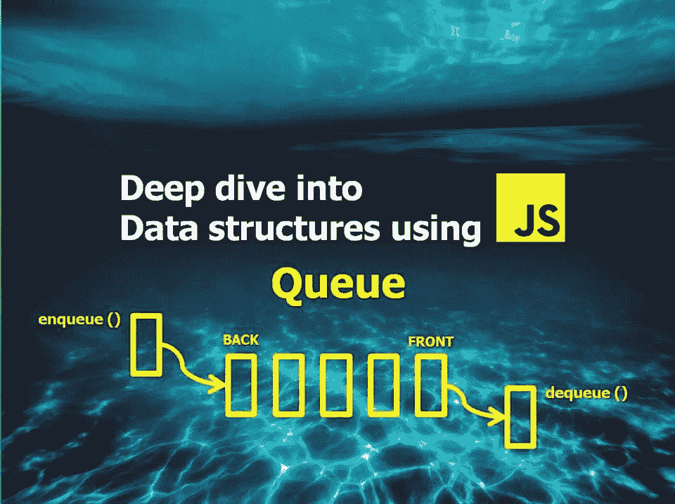
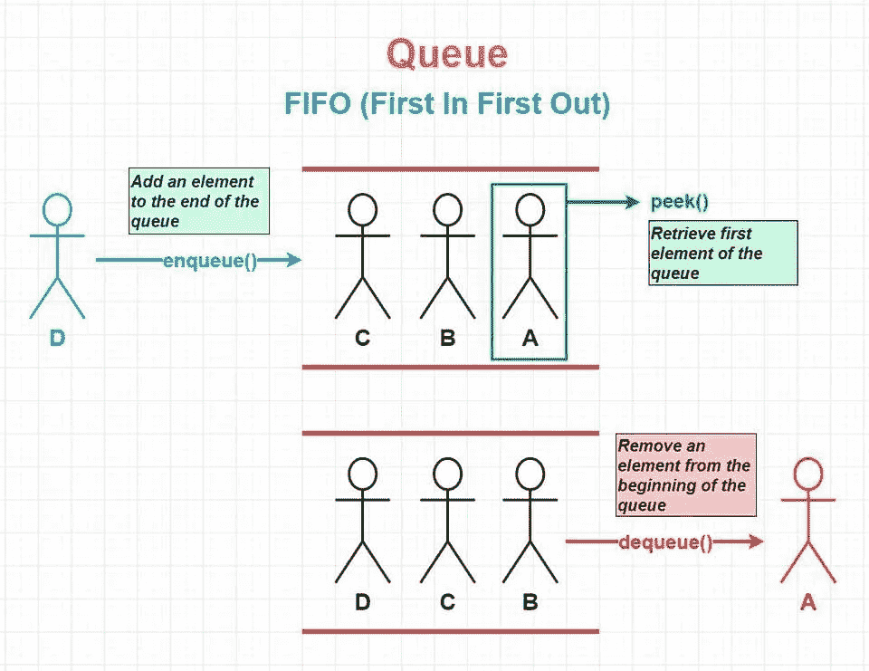
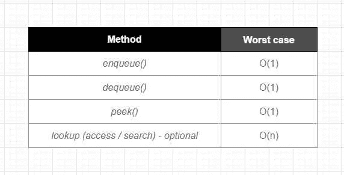

# 使用 Javascript 深入研究数据结构—队列

> 原文：<https://medium.com/codex/deep-dive-into-data-structures-using-javascript-queue-6976f5801bba?source=collection_archive---------19----------------------->



# 什么是队列？

队列是一种线性数据结构，它以类似于数组的顺序存储其元素。当添加或删除元素时，它遵循一个叫做 **FIFO** 的特定顺序——这是**先进先出**的缩写。

理解/记忆队列如何使用 **FIFO** 的一个简单方法是想象一个字面上的队列，换句话说，一群人在排队等候。每个新人从列表的末尾开始(排队)，第一个进入等待队列的人是第一个从队列中出来的人。所有的人遵循同样的顺序，直到没有人留下。

Queue 不是 Javascript 中的内置数据结构，但是实现一个定制的队列非常简单。

# 队列剖析



队列数据结构具有非常基本和直接的结构，它与[堆栈数据结构](https://www.sahinarslan.tech/posts/deep-dive-into-data-structures-using-javascript-stack/)非常相似——我们使用一些方法按顺序存储和管理元素。每当我们想要添加(入队)一个项目时，我们像堆栈一样添加到列表的末尾，但是当我们删除(出列)一个项目时，我们总是在列表的最开始工作，以遵循 FIFO(先进先出)操作顺序。类似地，使用 peek 方法，我们可以快速检索队列中第一个插入的元素。队列和栈的主要区别在于我们在列表中的什么地方移除:对于队列，我们总是从开始移除，而对于栈，移除总是在最后。

# 何时使用队列

让我们先来快速浏览一下队列中常见操作的[大 O](https://www.sahinarslan.tech/posts/comprehensive-big-o-notation-guide-in-plain-english-using-javascript) :



当您特别希望实施 FIFO(先进先出)访问规则时，队列非常有用。一个很好的例子就是任何类型的等待队伍，在那里你想要按照“先来先服务”的顺序进行操作。它可以是任何东西，从销售库存有限的产品(因此，如果只剩下一个产品，排队的第一个顾客可以得到产品)到预订约会或酒店房间。

与 Stack 类似，Queue 也只有很少的方法(enqueue、dequeue 和 peek)。这使得能够使用 FIFO(先进先出)规则来强制执行对数据的受限访问，并且很少的处理方法也会使代码更容易理解和使用。

您还可以有一个可选的查找/迭代器方法——但是如果您需要经常使用它，您可能会重新考虑使用数组。因为队列的主要用途不是频繁迭代，所以从概念的角度来看，它不太合适。

现实世界中的许多编程语言和应用程序都使用队列。一些例子是:

-在 **CPU 任务调度**中使用—这是一种机制，用于确定在另一个进程暂停时将使用 CPU 资源的进程。

-用于打印机-每个打印请求进入一个队列，队列中的第一个请求被执行，而其他请求被搁置。

*   也用于 BFS(广度优先搜索/遍历),用于高级数据结构，如树和图，二叉树中的级别顺序搜索，解决问题的概念，如在迷宫/矩阵中寻找最短路径和检测回文。

# Javascript 中的队列实现

可以使用[数组](https://www.sahinarslan.tech/posts/deep-dive-into-data-structures-using-javascript-arrays)或[链表](https://www.sahinarslan.tech/posts/deep-dive-into-data-structures-using-javascript-linked-list)来实现队列。链表是一个更好的选择，因为它有更好的性能和适当的时间复杂度匹配。因为我们从列表的开始处进行移除——这个动作在链表中花费了常数时间 O(1)(出列的时间复杂度应该是 O(1))，而由于索引移位，它在数组中花费了线性时间 O(n)。每当从数组中删除一个元素时(只要它不是列表中的最后一个元素)，由于列表中的大小变化，所有后面的元素都会移动以匹配正确的索引号。

另一方面，与链表版本相比，数组版本实现起来更简单，当您处理少量项目时，它也能很好地工作。因此，您也可以根据使用情形选择阵列版本，只要您确定不需要扩展您要处理的项目数量。如果您不确定，请使用链表版本——因为一旦扩展出现，性能差异将会非常大。

我将在下面分享这两个实现。对于这两者，我们将使用 ES6 类来构建这个数据结构。以下是实现中的方法列表:

*   `enqueue(value)` - *添加到队列末尾。*
*   `dequeue()` - *从队列的开始处移除*
*   `peek()` - *检索队列中的第一个元素*
*   `isEmpty()` - *检查队列是否为空的帮助器方法*
*   `length()` - *查看队列长度的可选方法*
*   `clear()` - *清除队列的可选方法*
*   `toArray()` - *可选方法以数组形式返回队列元素*

我希望这篇文章能帮助你理解什么是队列以及它是如何工作的！我鼓励您在自己喜欢的代码编辑器中尝试下面的实现。感谢阅读！

# 使用链表的队列实现:

```
// Minimal Linked List implementation with: append, deleteHead and toArray (optional) methods.
// To match the time complexity of O(1) on both add (enqueue) & removal (dequeue) of Queue, we will be using both ends of the Linked List. Therefore we maintain both head and tail pointers.

class LinkedListMinimal {
  constructor(value) {
    this.head = null
    this.tail = null
    this.length = 0
  }

  // add to the end of the list
  append(value) {
    // Initialize a newNode with value recieved and next as null.
    const newNode = {
      value: value,
      next: null
    }

    // Let's check if Linked List is empty or not first.
    if (!this.head) {
      // If there is no head (no elements) it is empty. In that case make the newNode as head
      // since it is the only node at this point and there is no tail either,
      // tail will also have the same value (both head and tail will point to same place in memory from now on):
      this.head = newNode
      this.tail = newNode
    } else {
      // If Linked List is not empty, Attach new node to the end of linked list:
      this.tail.next = newNode      
      this.tail = newNode
    }

    this.length++
  }

  deleteHead() {
    if (!this.head) return

    const headVal = this.head.value

    // if one element left
    if (this.length === 1) {
      this.head = null
      this.tail = null
      this.length--
      return headVal
    }

    // define newHead as this.head.next
    const newHead = this.head.next
    // now change the head pointer to newHead
    this.head = newHead
    this.length--
    return headVal
  }

  // toArray - loop through nested objects, then return the values in an array
  toArray() {
    const array = []
    // Initialize a currentNode variable pointing to this.head - which will be the starting point for traversal.
    let currentNode = this.head

    // fill the array until we reach the end of list:
    while (currentNode !== null) {
      array.push(currentNode.value)
      currentNode = currentNode.next
    }
    return array
  }
}

class Queue {
  constructor() {
    this.items = new LinkedListMinimal()
  }

  // add to the end of Queue
  enqueue(value) {
    this.items.append(value)
  }

  // remove from the beginning of Queue
  dequeue() {
    if (this.isEmpty()) {
      return null
    }

    const dequeuedItem = this.items.deleteHead()
    if (!dequeuedItem) return
    return dequeuedItem
  }

  // retrive first element in the Queue
  peek() {
    if (this.isEmpty()) return null
    return this.items.head.value
  }

  // helper method to check if Queue is empty
  isEmpty() {
    return this.items.length === 0
  }

  // optional method to check the length of Queue
  length() {
    return this.items.length
  }

  // optional method to clear the Queue
  clear() {
    this.items = new LinkedListMinimal()
  }

  // optional method returns Queue elements as an Array
  toArray() {
    return this.items.toArray()
  }
}
```

# 使用数组的队列实现:

```
class Queue {
  constructor() {
    this.items = []
  }

  // add to the end of Queue
  enqueue(item) {
    this.items.push(item)
  }

  // remove from the beginning of Queue
  dequeue() {
    if (this.isEmpty()) return
    // This costs Linear Time O(n) instead of O(1) due to array shift:
    const dequeuedItem = this.items.shift()
    return dequeuedItem
  }

  // retrive first element in the Queue
  peek() {
    if (this.isEmpty()) return
    return this.items[0]
  }

  // helper method to check if Queue is empty
  isEmpty() {
    return this.items.length === 0
  }

  // optional method to check the length of Queue
  length() {
    return this.items.length
  }

  // optional method to clear the Queue
  clear() {
    this.items = []
  }

  // optional method returns Queue elements as an Array
  toArray() {
    return this.items
  }
}
```

*原发表于*[*https://www . sahinarslan . tech*](https://www.sahinarslan.tech/posts/deep-dive-into-data-structures-using-javascript-queue)*。*