# 深度学习基础🧠

> 原文：<https://medium.com/codex/deep-learning-essentials-9cce7a911326?source=collection_archive---------3----------------------->

关于深度学习你需要知道的一切——从神经元到神经网络🔥

图片由 [Pixabay](https://pixabay.com/images/id-3501528/) 提供

# 什么是深度学习？

**深度学习**是**机器学习**的一个子集，其灵感来自人脑的生物结构和功能，使用**人工神经网络**来学习数据中的非冗余信息或模式。这是处理大量信息的有效方法&做预测。深度学习在计算上是昂贵的，因为它需要大量的数据，深度学习模型的性能与我们提供的数据量成正比。

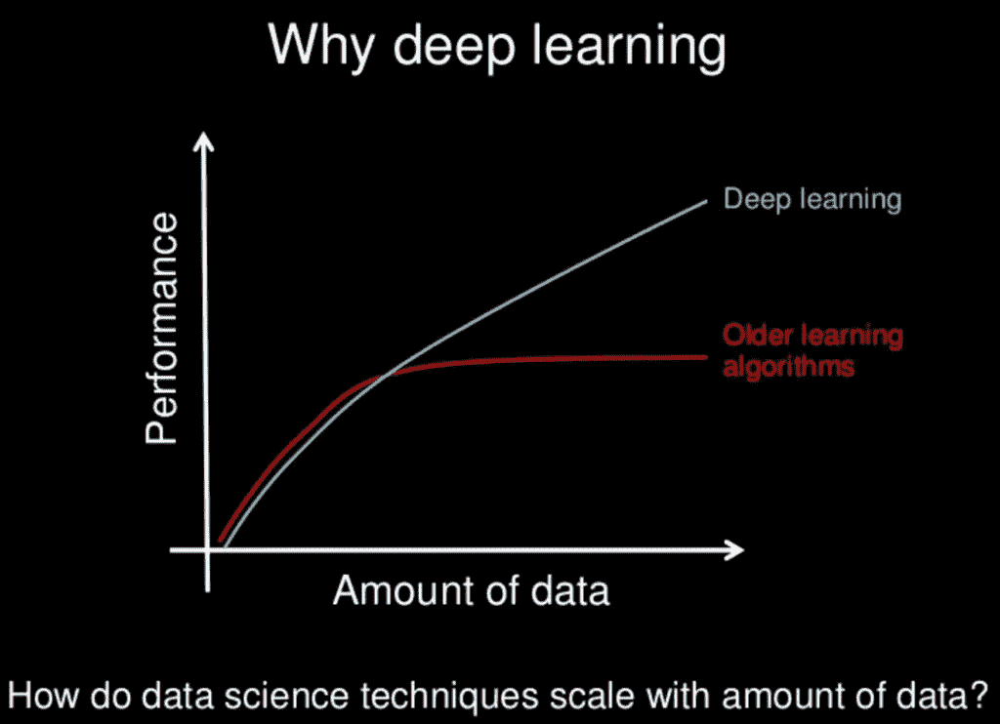

**图片来源:幻灯片由** [**吴少伟**](https://www.slideshare.net/ExtractConf)

近年来，每天生成的数据量呈指数级增长，强大的处理单元(CPU/GPU)的出现增强了人工智能的能力，人工智能的性能在许多专业领域超越了人类的能力，如 ***图像识别工具(计算机视觉)、自然语言处理(NLP)、游戏行业、机器人和语音识别*** 得益于**技术进步。**

# AI vs ML vs DL？

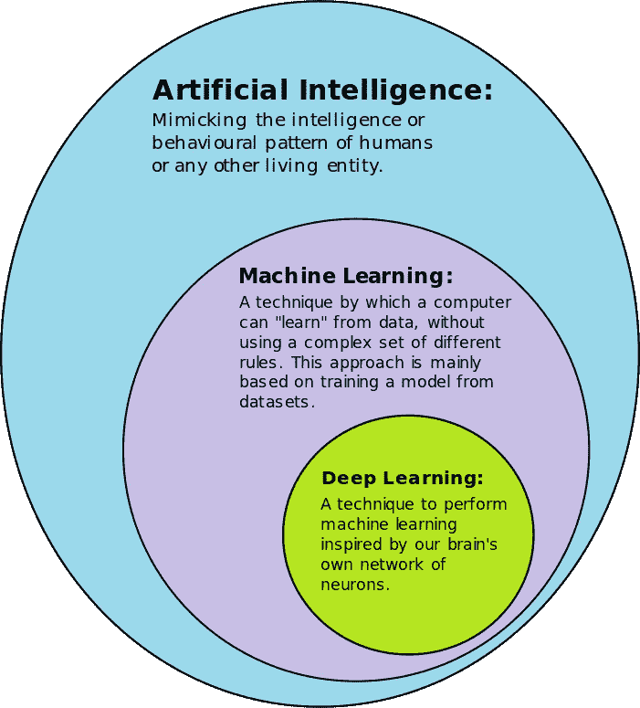

**图片来源:** [**维基百科**](https://en.wikipedia.org/wiki/Deep_learning)

## **人工智能**

是计算机在没有任何人为干预的情况下，像人一样*“思考”的能力。人工智能并不是什么新东西，它已经被研究了几十年，也许未来几年也是如此。1950 年英国数学家 [**阿兰·图灵**](https://en.wikipedia.org/wiki/Alan_Turing) 发表了一篇题为“ [***计算机械与智能***](https://academic.oup.com/mind/article/LIX/236/433/986238)*的论文，从而打开了这个后来被称为 **AI** 的领域的大门。**

**[***模仿游戏***](https://www.imdb.com/title/tt2084970/?ref_=ext_shr_lnk) 是一部强烈推荐的电影，它基于传奇**密码分析师**艾伦·图灵和他与时间赛跑建造一台计算机的真实故事，这台计算机可以执行复杂的排列，比任何人在二战中破解德国恩尼格玛密码的速度都快。据估计**图灵的工作使战争缩短了两年，拯救了 1400 万人的生命。**值得看对不对？这部电影给了我很大的启发，我忍不住分享了这个😅这是链接👇**

** [## 模仿游戏(2014) - IMDb

### 莫滕·泰杜姆导演。本尼迪克特·康伯巴奇，凯拉·莱特莉，马修·古迪，罗里·金奈尔…

www.imdb.com](https://www.imdb.com/title/tt2084970/?ref_=ext_shr_lnk) 

几年后，#Contributions_in_computer_science)**，也被称为 AI 之父，在 1956 年夏天著名的 [***达特茅斯会议***](https://en.wikipedia.org/wiki/Dartmouth_workshop) 中提出了**【人工智能】**这个术语。**

**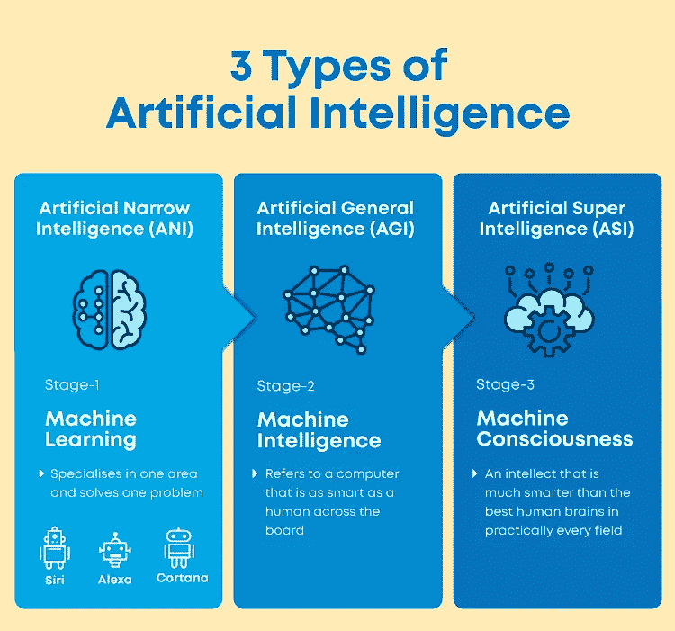**

**图片来源:[大学问](https://www.mygreatlearning.com/)**

****人工智能的 3 种类型🤖****

1.  ****ANI(人工狭义智能)**以目标为导向，被编程执行单一任务，如**预测天气、面部识别、语音助手中的语音识别、驾驶汽车等。****
2.  ****AGI(人工通用智能)**允许机器思考、学习、理解并应用它们的智能来解决复杂的问题，并在给定的情况下以与人类无法区分的方式行动，仍然是一种理论思想。AGI 的目标是训练足够智能的机器来真正理解人类的方方面面。**
3.  **ASI(人工超级智能)是一种假设的人工智能，机器能够展示出超越最聪明的人的智能，在每个方面都远远超过人类的技术，有点可怕👽，不是吗？**

## ****机器学习****

**它是人工智能的一个子集，使用算法让计算机在没有显式编程的情况下自主学习。机器学习使用各种统计算法，通过提取模式来利用`**structured /unstructured - labeled / unlabelled**`数据进行预测。**

**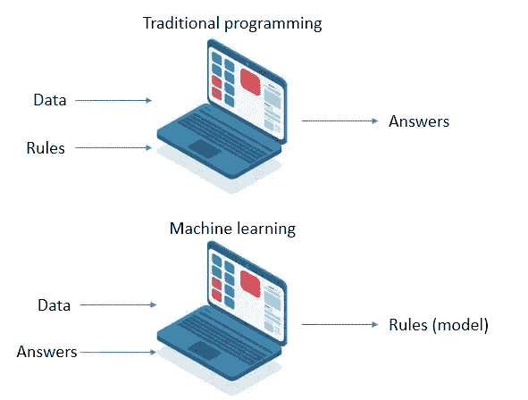**

**图片来源: [Sogetilabs](https://labs.sogeti.com/the-nature-of-machine-learning-projects/machine-learning-vs-traditional-programming/)**

**一个例子可能是一辆自动驾驶汽车，它通过分析随时间推移行驶的数百万英里来学习如何在不同的天气条件下，在白天和夜晚的不同时间以最佳方式安全地在道路上导航。**

****

**图片来源: [scikit-learn](https://scikit-learn.org/stable/tutorial/machine_learning_map/index.html)**

## ****深度学习****

**它是机器学习中的一种方法，涉及人工神经网络中的多层隐藏层，以提高预测的准确性。机器学习需要数据预处理，这涉及到人工干预，而深度学习中的神经网络能够提取特征；因此不需要人工干预。**

**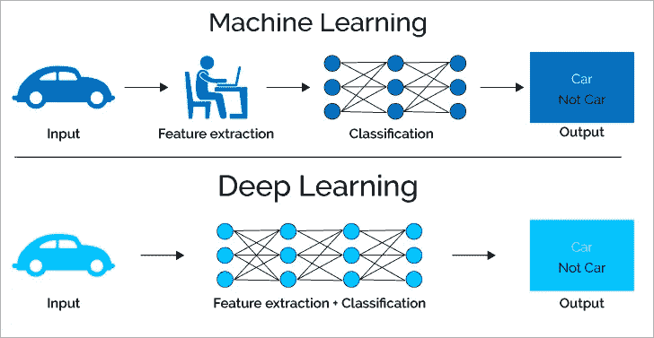**

**图片来源:[此处](https://www.softwaretestinghelp.com/data-mining-vs-machine-learning-vs-ai/)**

**由于复杂的多层结构，深度学习系统需要大数据集- [**大数据**](https://en.wikipedia.org/wiki/Big_data) 来消除波动，做出高质量的解释。**** 

# ****什么是神经网络？****

****深度学习算法的核心是分层的神经元(类似于大脑中的神经元)的分层组织，其中**神经元**又名**节点**连接到其他神经元，形成分层的**神经网络**，称为**人工神经网络(ANN)。******

****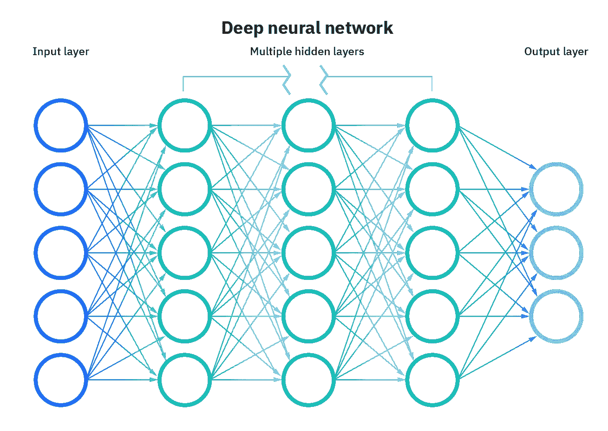****

****图片来源: [IBM](https://www.ibm.com/cloud/learn/neural-networks#toc-what-are-n-2oQ5Vepe)****

****一个神经网络有 3 层- `***The input layer***`、`***the Hidden layer***`、**、*、*、**和`***the Output layer***`、**、*。*** 最基本的 ANN 可以由 2 层组成(1 输入& 1 输出带 0 隐藏层)。它被称为深度神经网络，因为隐藏层的数量，隐藏层的数量越多，网络就变得越深。****

******神经元**是神经网络的基本构件。也被称为**节点/感知器。*“神经元一起放电，一起连线”——***神经元以 ***前馈/反向传播*** (👈我们将在后半部分讨论这一点。如果任何单个神经元的输出高于指定的阈值，则该节点被激活，数据从一层传递到下一层，从最左侧的**(输入层)**到最右侧的**(输出层)**，并带有一些反馈机制，直到算法学习到所需输出的`**weights & biases**`。****

****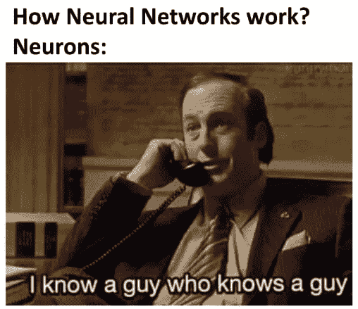****

****图片来源:[此处](https://www.engati.com/blog/funniest-ai-memes)****

# ******瓦解**神经网络🛠****

## ****第一步:输入****

****该过程从神经网络的输入层开始，输入层接收数据/输入值。这些是独立变量，对于神经网络来说，它们通常是标准化的或规范化的，这取决于我们正在解决的问题。****

****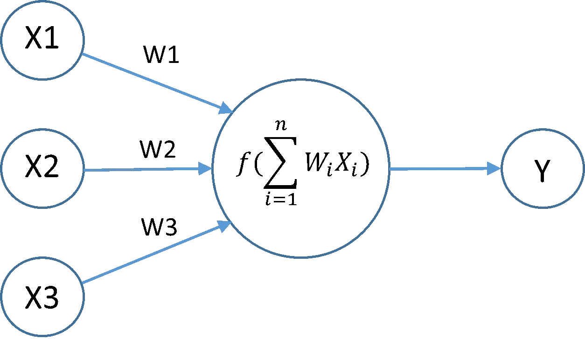****

****图片来源: [stackoverflow](https://i.stack.imgur.com/gzrsx.png)****

## ****第二步:加权总和****

****之后，每个输入值/信号被分配一些随机权重。这些权重是决定哪个输入参数更重要或与输出有密切关系的唯一参数。这些权重通过学习过程进行调整(**梯度下降/反向传播**)。权重乘以各自的输入，然后全部传递给神经元。这样接收到的乘积在神经元内部相加，我们称之为**加权和。******

****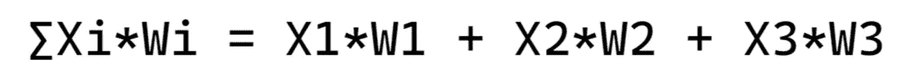****

****作者图片****

## ****第三步:激活功能****

****偏差被加到加权和上，这与线性方程中的截距相同。添加它只是为了提高模型的性能。得到的和然后被传递到激活函数中，该函数决定神经元的命运以及它是否可以被激活以向前传递信号，因此被命名为**激活函数**。****

****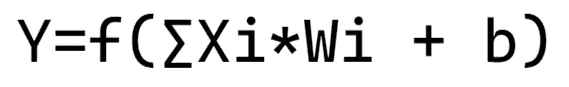****

****作者图片****

****这是一个非常关键的步骤&一个必要的步骤，如果不对一个神经元进行激活，所有维度上的神经元将只是简单地对输入进行线性变换，我们的模型将只不过是一个线性回归模型。****

****有各种激活功能。这里可以看到[这里](https://www.tensorflow.org/api_docs/python/tf/keras/activations)。最广泛使用的是****

****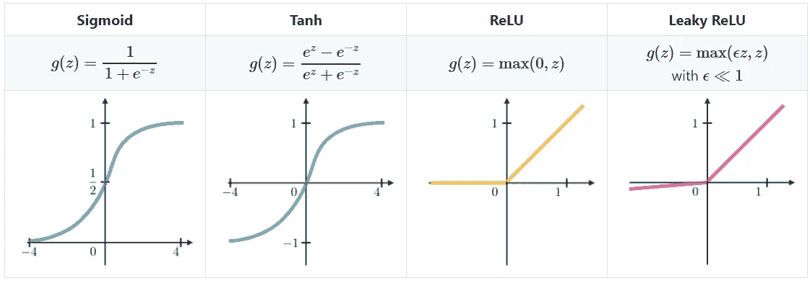****

****图片来源: [Kaggle](https://www.google.com/url?sa=i&url=https%3A%2F%2Fwww.kaggle.com%2Fgetting-started%2F150450&psig=AOvVaw0qzP0ZIpcmDLUMx2KggSiM&ust=1668944678490000&source=images&cd=vfe&ved=0CBAQjRxqFwoTCPDF9ceVuvsCFQAAAAAdAAAAABAE)****

1.  ******Sigmoid:** 该函数给出 0 到 1 范围内的输出。对于小值(< -5)，它返回一个接近 0 的值，对于大值(> 5)，该函数的结果接近 1。****
2.  ******ReLU(整流线性单元):**如果接收到任何负输入，该函数返回 0，但是对于任何正值，该函数返回该值作为 **max(x，0)** 。****

## ****步骤 4:输出层****

****它是网络的最后一层，通过隐藏层带来学习到的信息，并作为结果传递最终值。根据用于分类、预测或生成数据的激活函数，输出值可以是 ***二进制、连续或分类(离散或实数)*** 。最后一步是通过计算实际值和预测值之间的差值来计算误差。****

****这就是发生在该层的单个节点/节点/神经元上的情况。我们可以添加许多感知器👇在一层，所有将经历相同的过程。****

****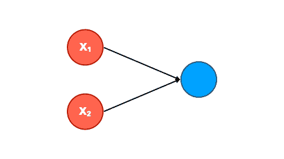****

****图片来源:[NN 的图解指南](https://www.google.com/url?sa=i&url=https%3A%2F%2Ftowardsdatascience.com%2Fan-illustrated-guide-to-artificial-neural-networks-f149a549ba74&psig=AOvVaw0wxh3OXPNXP4oIo2uVyv3A&ust=1668947478957000&source=images&cd=vfe&ved=0CBEQjhxqFwoTCKCh9_6fuvsCFQAAAAAdAAAAABAm)****

****当然，我们可以添加尽可能多的层，因为我们的硬件可以处理:)使神经网络真正深入和强大。一般来说，超过三层(包括输入和输出)的网络有资格成为**深度学习。**通过按比例增加神经元的数量和层数👇通过处理数百万甚至数十亿的参数，我们可以让模型强大到足以解决复杂的问题/模式。****

****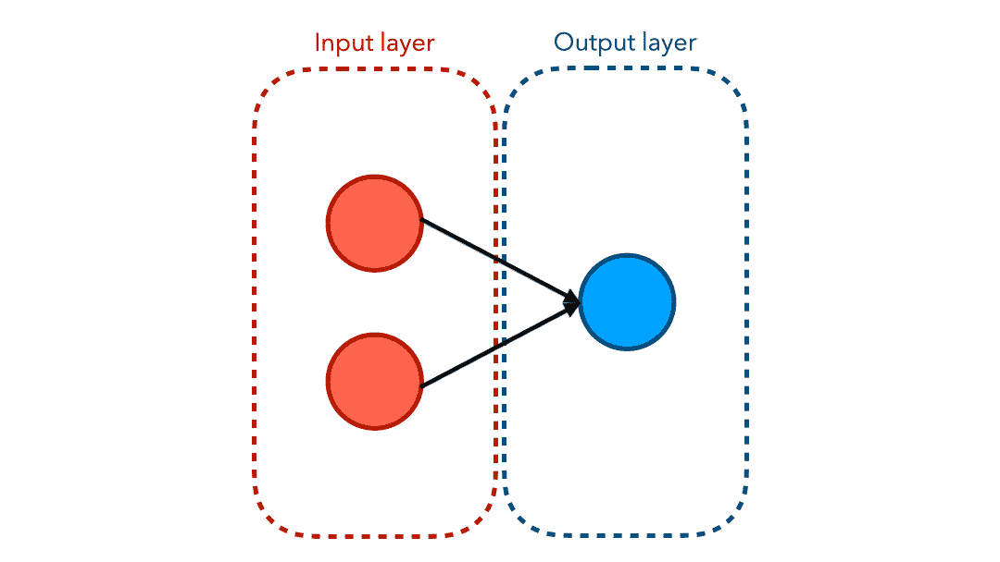****

****图片来源:[NN 的图解指南](https://www.google.com/url?sa=i&url=https%3A%2F%2Ftowardsdatascience.com%2Fan-illustrated-guide-to-artificial-neural-networks-f149a549ba74&psig=AOvVaw0wxh3OXPNXP4oIo2uVyv3A&ust=1668947478957000&source=images&cd=vfe&ved=0CBEQjhxqFwoTCKCh9_6fuvsCFQAAAAAdAAAAABAm)****

# ****但是神经元是如何学习的呢？****

## ****前馈与反向传播****

****上述数值从输入层到输出层的过程称为`**Feed Forward Algorithm**`或`**Forward Propagation**` &这是显而易见的。****

****一旦我们计算出误差，我们需要最小化它&为此，我们必须手动调整每个节点的权重，以了解这种痛苦超出想象的影响🥵🤯****

****这就产生了`[**Backpropagation**](https://en.wikipedia.org/wiki/Backpropagation)`，它是一种算法，设计用于根据同时从输出值获得的误差来调整权重。****

****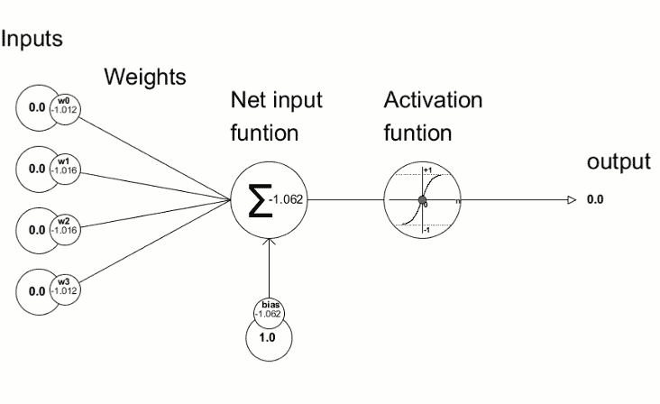****

****图片来源:[向艾](https://www.google.com/url?sa=i&url=https%3A%2F%2Ftowardsai.net%2Fp%2Fmachine-learning%2Fintroduction-to-neural-networks-and-their-key-elements-part-c-activation-functions-layers-ea8c915a9d9&psig=AOvVaw3OpAKUSYN0Z_WyYnkZ6DEw&ust=1668948557943000&source=images&cd=vfe&ved=0CBEQjhxqFwoTCIidzoGkuvsCFQAAAAAdAAAAABAP)****

****3 大深度学习框架🔥****

1.  ****[**tensor flow**](https://www.tensorflow.org/)**:**是由`[**Brain Team - Google Research**](https://research.google/teams/brain/)` 开发的开源框架，用于运行机器学习、深度学习以及其他统计和预测分析工作负载。它可以用于一系列任务，但特别侧重于深度神经网络的训练和推理。****
2.  ****[**py Torch**](https://pytorch.org/)**:**该框架基于 Torch 库，用于计算机视觉和自然语言处理等应用，最初由`[**Meta AI**](https://ai.facebook.com/)`开发，现在是 `[**Linux Foundation**](https://www.linuxfoundation.org/)`保护伞的一部分。****
3.  ****[**Keras**](https://keras.io/)**:**为人工神经网络提供 Python 接口的开源软件库。Keras 充当 TensorFlow 库的接口。****

## ****深度学习用例🧠****

1.  ****医疗保健。****
2.  ****自动驾驶汽车。****
3.  ****虚拟助理。****
4.  ****欺诈检测。****
5.  ****个性化。****
6.  ****计算机视觉。****
7.  ****农业。****
8.  ****自然语言处理。****
9.  ****语音识别。****
10.  ****翻译等****

## ****限制🤨？****

1.  ****它需要大量的数据——大数据。****
2.  ****实施成本高昂。****

****这就把我们带到了这篇博文的结尾，🛑.祝贺你🥳****

****我希望我能够解开一些关于深度学习的流行词汇。如果你有任何问题或者我错过了什么👆你可以在评论区随意发表意见。****

****我会试着提出更多机器学习/数据科学的概念，并试着把听起来花哨的术语和概念分解成更简单的。****

****我希望你喜欢这篇文章！你可以**关注我** [Afaque Umer](https://medium.com/u/430bc504f9d9?source=post_page-----9cce7a911326--------------------------------) 获取更多此类文章。****

## ****感谢阅读🙏继续学习🧠继续分享🤝保持敬畏🤘****

*****参考文献:*****

1.  ****[*IBM*](https://www.ibm.com/in-en/cloud/learn/deep-learning#toc-what-is-de-6i8FHi1_)****
2.  ****[分析 Vidhya](https://www.analyticsvidhya.com/blog/)****
3.  ****[*走向数据科学*](https://towardsdatascience.com/)****
4.  ****[*Java tpoint*](https://www.javatpoint.com/single-layer-perceptron-in-tensorflow)****
5.  ****[*v7labs*](https://www.v7labs.com/)****
6.  ****[维基百科](https://en.wikipedia.org/wiki/Main_Page)****