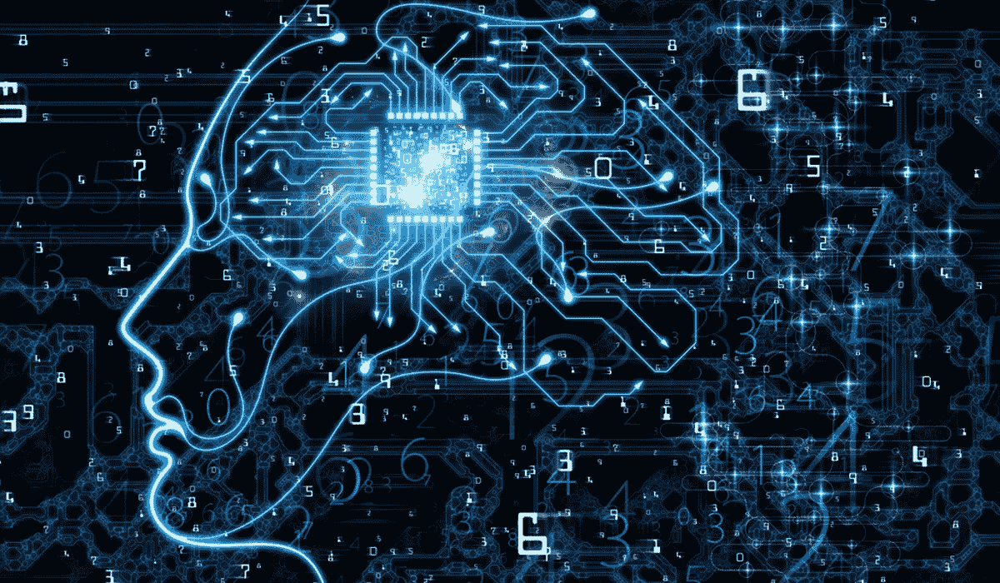

# 假人的深度学习:你需要知道的 10 个模型

> 原文：<https://medium.com/codex/deep-learning-for-dummies-10-models-you-need-to-know-7f976b765408?source=collection_archive---------15----------------------->

## 10 个惊人的深度学习模型将促进你的职业生涯。

深度学习是机器学习的一个分支，它处理从更类似于人类格式的数据中学习的算法。这意味着深度学习算法可以从非结构化和无标签的数据中学习。