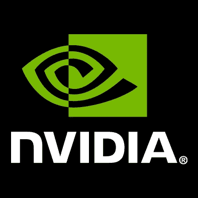
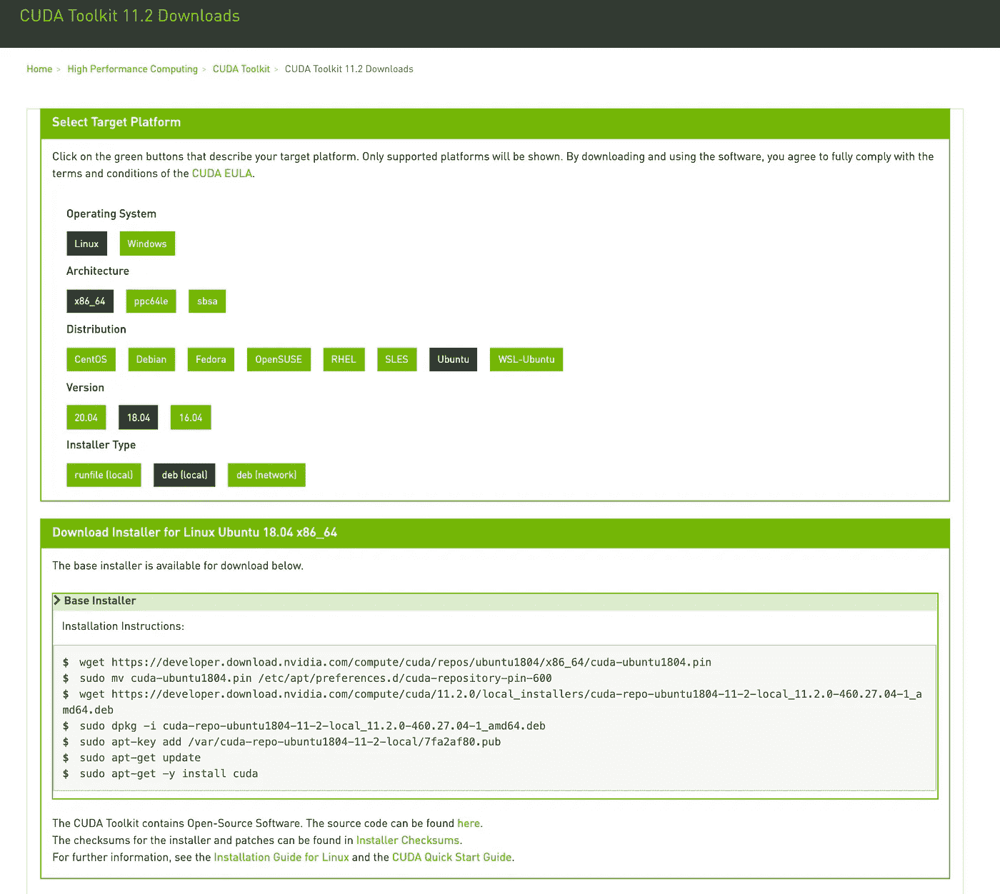
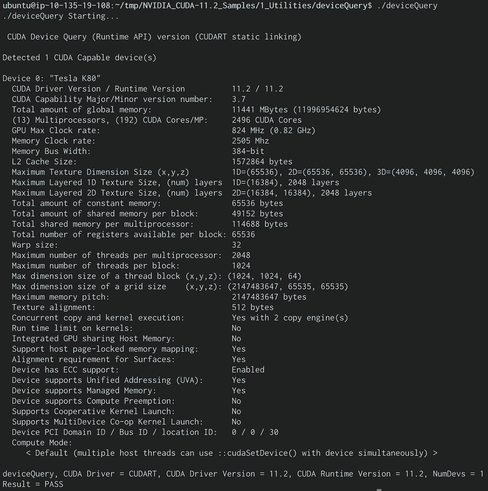

# 深度学习设置:Ubuntu 上的 ECS GPU 任务(第 1 部分)

> 原文：<https://medium.com/codex/deep-learning-setup-ecs-gpu-task-on-ubuntu-part-1-87933804c050?source=collection_archive---------2----------------------->

为了在 ECS 中运行基于 GPU 的任务，我们需要创建自己的 EC2 实例，因为 Fargate】仍然不支持 GPU。有了 [ECS GPU 优化的 ami](https://docs.aws.amazon.com/AmazonECS/latest/developerguide/ecs-gpu.html)，这应该不会太难。

然而，有时这是不可能的，因为团队已经在使用他们最喜欢的 AMI 设置，比如 Ubuntu [CIS 优化 AMI](https://aws.amazon.com/marketplace/seller-profile?id=dfa1e6a8-0b7b-4d35-a59c-ce272caee4fc) 或任何其他风格。这意味着他们需要从头开始安装和配置设置。

在这 4 篇文章中，我们将回顾在 Ubuntu 18.04 操作系统上使用 GPU 所需资源安装和配置 ECS 任务的过程。


**第一部分:NVIDIA 驱动程序**

[第 2 部分:ECS 代理](https://michael-41345.medium.com/deep-learning-setup-ecs-gpu-task-on-ubuntu-part-2-1c7abd6d14ad)

[第三部分:NVIDIA-Docker 运行时间](https://michael-41345.medium.com/deep-learning-setup-ecs-gpu-task-on-ubuntu-part-3-a6ffbc6a3c5a)

[第 4 部分:ECS 代理上的 GPU 配置](/codex/deep-learning-setup-ecs-gpu-task-on-ubuntu-part-4-46c364d1b556)

# NVIDIA 驱动程序和工具包

尽管安装和配置 NVIDIA tool kit & drivers 有很好的文档[记录](https://docs.nvidia.com/cuda/cuda-installation-guide-linux/index.html)，但我还是遇到了一些问题，所以我发现自己记录所需的步骤很有价值。然而，我建议仔细阅读更详细的正式文档，而且步骤可能会根据个人需求/偏好而改变。



***预安装***

验证您是否拥有支持 CUDA 的 GPU 要验证您的 GPU 是否支持 CUDA:

```
$ lspci | grep -i nvidiaIf your graphics card is from NVIDIA and it is listed in [https://developer.nvidia.com/cuda-gpus](https://developer.nvidia.com/cuda-gpus), your GPU is CUDA-capable.
```

验证您是否拥有受支持的 Linux 版本

```
$ uname -m && cat /etc/*releaseYou should see output similar to the following, modified for your particular system: x86_64 Red Hat Enterprise Linux Workstation release 6.0 (Santiago)
```

验证系统是否安装了 GCC

```
**$** gcc --version
```

我没有安装 gcc，并得到以下错误:“命令' GCC '未找到，但可以用 sudo 安装以安装 GCC”，这很容易通过运行解决:

```
sudo apt install gcc
```

验证系统是否安装了正确的内核头文件和开发包

```
**$** uname -rThis is the version of the kernel headers and development packages that must be installed prior to installing the CUDA Drivers.
```

当前运行的内核的内核头文件和开发包可以安装在:

```
**$** sudo apt-get install linux-headers-$(uname -r)This is for Ubuntu only, for a different OS please see the formal NVIDIA documentation.
```

***工具包安装***

我们可以只安装 NVIDIA 驱动程序，也可以安装 NVIDIA 工具包，这是一套工具和驱动程序。我更喜欢安装工具包，因为它将帮助我们稍后验证安装是否成功。

下载 NVIDIA CUDA 工具包

NVIDIA CUDA 工具包在[https://developer.nvidia.com/cuda-downloads](https://developer.nvidia.com/cuda-downloads)上市。选择操作系统、发行版和版本。然后选择你喜欢的安装类型，我在这里选择了 deb(local):



和运行命令，对于 Linux Ubuntu 18.04 x86_64:

```
**$** wget [https://developer.download.nvidia.com/compute/cuda/repos/ubuntu1804/x86_64/cuda-ubuntu1804.pin](https://developer.download.nvidia.com/compute/cuda/repos/ubuntu1804/x86_64/cuda-ubuntu1804.pin)
**$** sudo mv cuda-ubuntu1804.pin /etc/apt/preferences.d/cuda-repository-pin-600
**$** wget https://developer.download.nvidia.com/compute/cuda/11.2.0/local_installers/cuda-repo-ubuntu1804-11-2-local_11.2.0-460.27.04-1_amd64.deb
**$** sudo dpkg -i cuda-repo-ubuntu1804-11-2-local_11.2.0-460.27.04-1_amd64.deb
**$** sudo apt-key add /var/cuda-repo-ubuntu1804-11-2-local/7fa2af80.pub 
**$** sudo apt-get update
**$** sudo apt-get -y install cuda
```

***岗位安装***

环境设置—添加路径:

```
**$** export PATH=/usr/local/cuda-11.2/bin${PATH:+:${PATH}}
```

设置持久性守护程序:

```
**$** sudo /usr/bin/nvidia-persistenced --verbose
```

验证安装

现在一切就绪，让我们验证驱动程序是否安装成功:

```
**$** cat /proc/driver/nvidia/versionThe output should be similar to the following:
NVRM version: NVIDIA UNIX x86_64 Kernel Module  460.27.04  Fri Dec 11 23:35:05 UTC 2020
GCC version:  gcc version 7.5.0 (Ubuntu 7.5.0-3ubuntu1~18.04)
```

并验证工具包安装:

```
**$** nvcc -VThe output should be similar to the following:nvcc: NVIDIA (R) Cuda compiler driver
Copyright (c) 2005-2020 NVIDIA Corporation
Built on Mon_Nov_30_19:08:53_PST_2020
Cuda compilation tools, release 11.2, V11.2.67
Build cuda_11.2.r11.2/compiler.29373293_0
```

作为最后的测试，我们将运行一个示例 GPU 程序；请注意，这可能需要很长时间来执行。

```
mkdir tmp && cuda-install-samples-11.2.sh tmp && cd NVIDIA_CUDA-11.2_Samples && make && cd 1_Utilities/deviceQuery && ./deviceQueryThe output should be similar to the following image:
```



现在，我们已经安装并运行了 NVIDIA 驱动程序。在下一篇文章中，我们将安装和配置 ECS 代理，并对其进行调整以与我们刚刚安装的驱动程序一起工作。