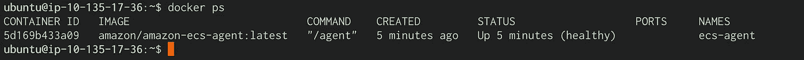

# 深度学习设置:Ubuntu 上的 ECS GPU 任务(第 2 部分)

> 原文：<https://medium.com/codex/deep-learning-setup-ecs-gpu-task-on-ubuntu-part-2-1c7abd6d14ad?source=collection_archive---------3----------------------->


奥斯卡·尼尔森在 [Unsplash](https://unsplash.com?utm_source=medium&utm_medium=referral) 上的照片

为了在 ECS 中运行基于 GPU 的任务，我们需要创建自己的 EC2 实例，因为 Fargate】仍然不支持 GPU。有了 [ECS GPU 优化的 ami](https://docs.aws.amazon.com/AmazonECS/latest/developerguide/ecs-gpu.html)，这应该不会太难。

然而，有时这是不可能的，因为团队已经在使用他们最喜欢的 AMI 设置，比如 Ubuntu [CIS 优化 AMI](https://aws.amazon.com/marketplace/seller-profile?id=dfa1e6a8-0b7b-4d35-a59c-ce272caee4fc) 或任何其他风格。这意味着他们需要从头开始安装和配置设置。

在这 4 篇文章中，我们将回顾在 Ubuntu 18.04 操作系统上使用 GPU 所需资源安装和配置 ECS 任务的过程。

[第 1 部分:NVIDIA 驱动程序](https://michael-41345.medium.com/deep-learning-setup-ecs-gpu-task-on-ubuntu-part-1-87933804c050)

**第 2 部分:ECS 代理**

[第三部分:NVIDIA-Docker 运行时间](https://michael-41345.medium.com/deep-learning-setup-ecs-gpu-task-on-ubuntu-part-3-a6ffbc6a3c5a)

[第 4 部分:ECS 代理上的 GPU 配置](/codex/deep-learning-setup-ecs-gpu-task-on-ubuntu-part-4-46c364d1b556)

## **码头工人& ECS 代理**

尽管 Docker & ECS 代理的安装和配置有很好的文档记录，但我还是遇到了一些问题，所以我发现自己记录所需的步骤很有价值。然而，我建议仔细阅读更详细的正式文档，并且步骤可能会根据个人需求&个人要求/偏好而改变。


***安装 Docker***

设置存储库

```
$ sudo apt-get update
$ sudo apt-get install apt-transport-https ca-certificates curl \     gnupg-agent software-properties-common
$ curl -fsSL [https://download.docker.com/linux/ubuntu/gpg](https://download.docker.com/linux/ubuntu/gpg) | sudo apt-key add -
$ sudo add-apt-repository \ "deb [arch=amd64] [https://download.docker.com/linux/ubuntu](https://download.docker.com/linux/ubuntu) \ $(lsb_release -cs) \ stable"
```

安装 Docker 引擎

```
$ sudo apt-get update
$ sudo apt-get install docker-ce docker-ce-cli containerd.io
```

***安装 ECS 代理***

允许端口代理使用环回地址路由流量

```
$ sudo sh -c "echo 'net.ipv4.conf.all.route_localnet = 1' >> /etc/sysctl.conf"
**$ sudo sysctl -p /etc/sysctl.conf**
```

为任务启用 IAM 角色

```
sudo apt-get install iptables-persistent
sudo iptables -t nat -A PREROUTING -p tcp -d 169.254.170.2 --dport 80 -j DNAT --to-destination 127.0.0.1:51679
sudo iptables -t nat -A OUTPUT -d 169.254.170.2 -p tcp -m tcp --dport 80 -j REDIRECT --to-ports 51679
```

添加一个 iptables 路由来阻止对自省 API 端点的脱离主机访问

```
sudo iptables -A INPUT -i eth0 -p tcp --dport 51678 -j DROP
```

将新的 **iptables** 配置写入操作系统特定的位置(Ubuntu)

```
sudo sh -c 'iptables-save > /etc/iptables/rules.v4'
```

创建`/etc/ecs`目录并创建 Amazon ECS 容器代理配置文件

```
**sudo mkdir -p /etc/ecs && sudo touch /etc/ecs/ecs.config**
```

在容器实例上创建主机卷挂载点。

```
**sudo mkdir -p /var/log/ecs /var/lib/ecs/data**
```

下载 ECS 容器代理

```
curl -o ecs-agent.tar [https://s3.amazonaws.com/amazon-ecs-agent-us-east-1/ecs-agent-latest.tar](https://s3.amazonaws.com/amazon-ecs-agent-us-east-1/ecs-agent-latest.tar)
```

加载 ECS 容器代理映像。

```
sudo docker load --input ./ecs-agent.tar && rm ecs-agent.tar
```

以非超级用户身份管理 Docker

[https://docs.docker.com/engine/install/linux-postinstall/](https://docs.docker.com/engine/install/linux-postinstall/)

```
sudo groupadd docker
sudo usermod -aG docker $USER
# Log out and log back in so that your group membership is re-evaluated.
```

为 ECS 代理创建一个守护程序:

```
sudo vi /etc/systemd/system/ecs-agent.service
```

增加以下内容:

```
[Unit]
Description=AWS ECS Agent
Documentation=[https://docs.aws.amazon.com/AmazonECS/latest/developerguide/](https://docs.aws.amazon.com/AmazonECS/latest/developerguide/)
Requires=docker.service
After=docker.service[Service]
Restart=always
RestartPreventExitStatus=5
ExecStartPre=/bin/mkdir -p /var/lib/ecs/data
ExecStartPre=/bin/mkdir -p /var/log/ecs
ExecStartPre=-/usr/bin/docker kill ecs-agent
ExecStartPre=-/usr/bin/docker rm ecs-agent
ExecStart=/usr/bin/docker run \
    --name=ecs-agent \
    --restart=on-failure:10 \
    --volume=/var/run/docker.sock:/var/run/docker.sock \
    --volume=/var/log/ecs/:/log \
    --volume=/var/lib/ecs/data:/data \
    --volume=/etc/ecs:/etc/ecs \
    --volume=/sys/fs/cgroup:/sys/fs/cgroup:ro \
    --net=host \
    --env-file=/etc/ecs/ecs.config \
    amazon/amazon-ecs-agent:latest
ExecStop=-/usr/bin/docker stop ecs-agent
[Install]
WantedBy=multi-user.target
```

启动服务:

```
sudo systemctl enable ecs-agent.service
sudo systemctl start ecs-agent.service
```

验证 ECS 代理正在工作

```
$ docker ps
```



将 ECS 群集添加到 ECS 代理配置中:

编辑配置文件:

```
sudo vi /etc/ecs/ecs.config
```

添加以下内容:

```
ECS_DATADIR=/data
ECS_ENABLE_TASK_IAM_ROLE=true
ECS_ENABLE_TASK_IAM_ROLE_NETWORK_HOST=true
ECS_LOGFILE=/log/ecs-agent.log
ECS_AVAILABLE_LOGGING_DRIVERS=["json-file","awslogs"]
ECS_LOGLEVEL=info
ECS_CLUSTER=defualt
```

然后重新启动 ECS 代理:

```
sudo systemctl restart ecs-agent.service
```

如果群集名称不同于默认名称，请为 ECS_CLUSTER 变量分配群集名称

此时，我们应该能够在 ECS 群集中的 ECS instances 选项卡下查看 EC2，这意味着代理已经成功订阅了群集。

但是，由于我们尝试在“events”选项卡下的特定 ECS 服务中运行基于 GPU 的任务，我们应该会看到以下事件:

```
service [.](https://eu-central-1.console.aws.amazon.com/ecs/home?region=eu-central-1#/clusters/qa-cct-fra-de-cluster/services/qa-cct-fra-de-dl_processor-service).. was unable to place a task because no container instance met all of its requirements. The closest matching container-instance [.](https://eu-central-1.console.aws.amazon.com/ecs/home?region=eu-central-1#/clusters/qa-cct-fra-de-cluster/containerInstances/fc1f209afc174a959342445c1daaf57a).. has insufficient GPU resource available. For more information, see the [Troubleshooting section](http://docs.aws.amazon.com/AmazonECS/latest/developerguide/troubleshooting.html).
```

发生这种情况是因为 ECS 代理没有适当的配置来利用托管它的 EC2 中的 GPU。

在下一篇文章中，我们将安装 Docker-NVIDIA 运行时，并开始连接 ECS 代理和 NVIDIA 驱动程序。