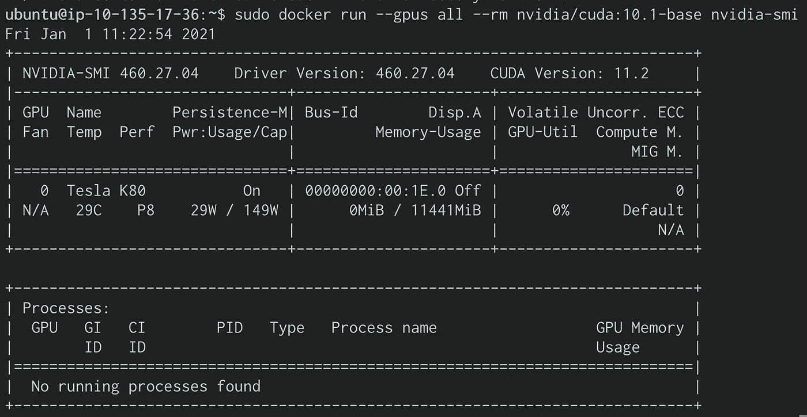

# 深度学习设置:Ubuntu 上的 ECS GPU 任务(第 3 部分)

> 原文：<https://medium.com/codex/deep-learning-setup-ecs-gpu-task-on-ubuntu-part-3-a6ffbc6a3c5a?source=collection_archive---------7----------------------->


丹尼尔·科尔派在 [Unsplash](https://unsplash.com?utm_source=medium&utm_medium=referral) 上拍摄的照片

为了在 ECS 中运行基于 GPU 的任务，我们需要创建自己的 EC2 实例，因为 Fargate】仍然不支持 GPU。有了 [ECS GPU 优化的 ami](https://docs.aws.amazon.com/AmazonECS/latest/developerguide/ecs-gpu.html)，这应该不会太难。

然而，有时这是不可能的，因为团队已经在使用他们最喜欢的 AMI 设置，比如 Ubuntu [CIS 优化 AMI](https://aws.amazon.com/marketplace/seller-profile?id=dfa1e6a8-0b7b-4d35-a59c-ce272caee4fc) 或任何其他风格。这意味着他们需要从头开始安装和配置设置。

在这 4 篇文章中，我们将回顾在 Ubuntu 18.04 操作系统上使用 GPU 所需资源安装和配置 ECS 任务的过程。

[第 1 部分:NVIDIA 驱动程序](https://michael-41345.medium.com/deep-learning-setup-ecs-gpu-task-on-ubuntu-part-1-87933804c050)

[第 2 部分:ECS 代理](https://michael-41345.medium.com/deep-learning-setup-ecs-gpu-task-on-ubuntu-part-2-1c7abd6d14ad)

**第三部分:NVIDIA-Docker 运行时间**

[第 4 部分:ECS 代理上的 GPU 配置](/codex/deep-learning-setup-ecs-gpu-task-on-ubuntu-part-4-46c364d1b556)

## Docker NVIDIA 运行时


尽管安装和配置 Docker NVIDIA runtime 已经有很好的文档[记录](https://github.com/nvidia/nvidia-container-runtime)，但我还是遇到了一些问题，所以我发现自己记录所需的步骤很有价值。然而，我建议仔细阅读更详细的正式文档，而且步骤可能会根据个人需求/偏好而改变。

存储库配置

```
$ curl -s -L https://nvidia.github.io/nvidia-container-runtime/gpgkey | \
  sudo apt-key add -
distribution**=**$(. /etc/os-release;echo $ID$VERSION_ID)
$ curl -s -L https://nvidia.github.io/nvidia-container-runtime/$distribution/nvidia-container-runtime.list | \
  sudo tee /etc/apt/sources.list.d/nvidia-container-runtime.list
$ sudo apt-get update
```

运行时安装

```
sudo apt-get install nvidia-container-runtime
```

创建 Systemd 插件文件

```
sudo mkdir -p /etc/systemd/system/docker.service.d
sudo tee /etc/systemd/system/docker.service.d/override.conf <<EOF
[Service]
ExecStart=
ExecStart=/usr/bin/dockerd --host=fd:// --add-runtime=nvidia=/usr/bin/nvidia-container-runtime
EOF
sudo systemctl daemon-reload
sudo systemctl restart docker
```

创建守护程序配置文件

```
sudo tee /etc/docker/daemon.json <<EOF
{
    "runtimes": {
        "nvidia": {
            "path": "/usr/bin/nvidia-container-runtime",
            "runtimeArgs": []
        }
    }
}
EOF
sudo pkill -SIGHUP dockerd
```

测试运行时安装

```
sudo docker run --gpus all --rm nvidia/cuda:10.1-base nvidia-smi
```

预期产出



在下一篇文章中，我们将使用 GPU 驱动程序配置 ECS 代理。