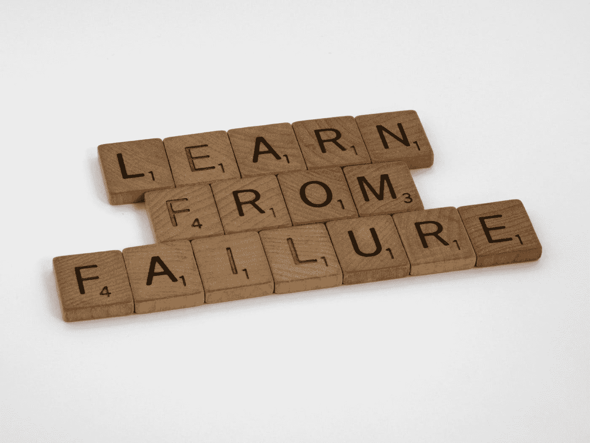
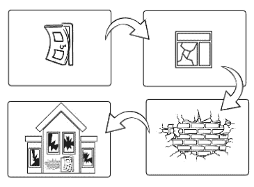
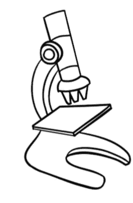

# 缺陷避免

> 原文：<https://medium.com/codex/defect-avoidance-2837f1795921?source=collection_archive---------16----------------------->

## 缺陷管理

## 不引入它们比以后再去寻找和修复它们要好得多。

布雷特·乔丹在 [Unsplash](https://unsplash.com/?utm_source=medium&utm_medium=referral) 上的照片

我已经意识到我在过去写了很多关于避免缺陷的文章，但这些文章并没有关注这个话题。我认为这是一个值得单独发表的话题。QA 的大部分工作都是检测和消除缺陷，但是 QA 管理应该超越这一点，采取主动的方法来避免缺陷的出现。如果您减少任何百分比的缺陷引入，在相同的检测和去除效率下，您应该看到逃逸缺陷的类似减少。那么，为什么不呢？:-)

我们首先需要了解的是缺陷是从哪里引入的。

# 缺陷传播

软件中有缺陷的行为被称为失败。代码中的一个或多个错误可能会导致此行为。虽然这个错误可能被直接引入到代码中，但是它也可能是从另一个工件转置而来的。

通过收集关于实际的根本原因(缺陷的起源)的信息，我们可以检测出过程中的哪些步骤更容易插入错误(或者哪些是我们可以避免的最便宜的缺陷)。然后，我们可以决定采取不同的措施来最小化引入缺陷的比率。一些方法可以是:

软件开发过程是知识的转化和丰富。我们定义一个问题，并用解决方案的需求来丰富知识。然后我们分析需求，将它们转换成支持构建这样一个解决方案的技术规范。接下来，我们开发向机器描述这个解决方案的代码。然后，我们回到需求和技术规范来设计测试，我们将执行这些测试来验证这些代码。

每一次转化都是由人类完成的，或者是基于人类建造的某个神器。在任何情况下，人类都会犯错误，过失。这些错误是错误的信息，它们将与正确的信息一起经过转换过程，生成下一个工件。这意味着错误将从一个工件传播到另一个工件，在最终的工件中累积。

有许多策略可以通过尽早识别这些故障(左移)来减少这种累积效应，从而减少传播。这不是本帖的重点。这篇文章的重点是避免它们被插入。

我们知道缺陷可能在开发的任何阶段被发现，但这并不意味着它就在最初被引入的地方。它们可能在更早的时候被引入，并传播到我们发现它们的地方。这意味着我们需要调查以确定它们实际被插入的位置。

# 根本原因调查

> 虽然根本原因调查可能已经检测到代码中导致缺陷行为的错误，但它不是根本原因。

根本原因调查是找到一个事件或一组类似事件的原因的过程。根本原因调查有不同的方法。

对于高流量软件，通常情况下，一次性事件只是在事件级别进行处理，直到事件发生的频率高于特定频率时，才会进行根本原因调查。有时，用户会犯错误或者遇到特殊的情况，为了这样或那样的情况而对软件进行永久性的修改可能是不值得的。

在进行根本原因调查时，团队通常会在代码级别停止调查原因，并在那里修复它。该故障可能是导致软件故障的原因，但可能不是根本原因。

在软件开发过程中，缺陷会传播。在过程开始时构建的工件(需求、模型等。)都会有缺点。这些错误会延续到中间的工件(技术规范，模型，等等。).当最后的*工件(代码、测试、手册、安装指南等。)被开发，这些故障将被内置于其中。这是意料之中的。我们甚至为质量保证过程起了一个名字，以确保我们始终如一地完成所有这些转换，这就是验证。

**我所说的“最后”，是指交付的工件不一定被用作在同一过程中构建其他工件的输入。*

我有一个大学教授曾经说过:“-如果你在需求中撒谎(或者不管你的真实来源是什么)，验证就是要确保你在所有后续的工件中说了相同的谎言，并且它将在生产中存在。”

虽然根本原因调查可能已经发现了导致缺陷行为的代码中的错误，但是根本原因是**而不是**。找到真正的根本原因(缺陷的起源)将使您能够通过防止缺陷的发生，开始关注于在未来的版本中交付更好的产品。

因此，您找到了根本原因，也就是缺陷产生的位置和原因。接下来你会做什么？

# 分析数据

> 通过收集关于哪个活动引入了缺陷的信息，我们可以检测出流程中的哪些步骤更容易插入错误(或者哪些是我们可以避免的成本最低的缺陷)。

照片由[国家癌症研究所](https://unsplash.com/@nci?utm_source=medium&utm_medium=referral)在 [Unsplash](https://unsplash.com?utm_source=medium&utm_medium=referral) 上拍摄

现在，你开始收集信息。您需要收集:

*   缺陷被插入的工件类型
    ——这将告诉您哪种类型的工件更容易出现缺陷。可能希望从贡献最大的类型开始。
*   日期
    —一旦您做出更改以避免插入缺陷，您将想要比较更改前后的情况。
*   受影响的工件
    ——与修复缺陷的努力相关的一个属性是缺陷传播到其他工件的程度。可能会有一些关键的工件，比如客户和合作伙伴的工件，您可能希望优先处理好。这将让你知道是什么导致了你想要改进的缺陷。
*   努力修复缺陷(在所有受影响的工件中)
    ——知道是什么导致了你更高的成本也是决定你想首先关注哪里的一个极好的标准。
*   缺陷的业务影响(t 恤尺寸没问题)
    —有时，导致您内部成本(修复工作)增加的原因并不是导致业务成本增加的原因。
*   类别(您可以创建您喜欢的任何类别，这只是为了帮助您对类似的缺陷进行分组)
    —拥有类别可以指导您如何改进。如果需求规格经常遗漏信息，您可能想要投资于需求启发培训，或者在您的需求模板中创建特定的部分。这与矛盾信息不同，在矛盾信息中，您可能希望投入更多的时间来选择您的需求提供者，并让他们交叉检查他们告诉您的内容。
*   对缺陷是什么的描述
    ——这是给你一个上下文，让你看到缺陷，并验证你收集的数据。例如，你可能想对它重新分类。
*   插入缺陷的工件
    ——同样，这是为了上下文。如果你想去看看缺陷被插入的地方，它会帮助你。

# 最后，避免缺陷！

Alex Radelich 在 [Unsplash](https://unsplash.com/?utm_source=medium&utm_medium=referral) 上拍摄的照片

这篇文章最关键的部分可能是这篇。这就是我们实际上如何改进我们的过程来减少缺陷的数量。到目前为止，我们讨论的所有事情都与改进事件管理有关，而不是减少要管理的事件。

那么，我们能做什么呢？

*   **完善模板。**它将帮助您捕捉遗漏的信息，并最大限度地减少谁写谁读工件的模糊性。如果您发现有些东西令人困惑，您可能希望将它的多个方面分成模板的不同部分。如果信息经常被遗漏，您可能希望为其包含一个特定的部分。您也可以选择完全不同的模板。
*   **投资培训。**通常，人们不了解他们正在构建的东西将如何在未来的活动中使用，或者有时他们不知道如何最好地使用组织采用的工具和模板。或者他们可能只是需要培训来更好地履行他们的职责。您需要将培训的重点放在他们应该如何开展活动，以及其他人如何依靠他们所做的来完成任务。这将增加他们的合作，并让他们更好地理解需要如何构建事物。
*   **改进做法。**如果您发现您在测试中遗漏了一些测试用例，您可能想要在结束测试活动之前运行代码突变测试。如果您正在进行特别的代码审查，您可能想要采用清单，特别是如果您的许多审查者是代码库的新手或者在某些相关方面不是专家的话。如果您经常在需求中发现相互冲突的信息，那么您可能想要改进您对需求提供者及其协作渠道的选择。
*   **消除活动。如果没有活动，就没有错误！；-)我不是开玩笑。有时你可以调整其他活动来弥补信息损失。其他时候，您可以在流程的早些时候或晚些时候将活动替换为另一个活动。**

> 如果你喜欢这个故事，在结尾击掌，这样我就知道你想读什么了。
> 
> ***我没有用博客赚一毛钱。如果您想支持更多内容的创作，请与您的同事和*** [***分享您的博客，关注它以获得新故事的通知***](/m/signin?actionUrl=https%3A%2F%2Fmedium.com%2F_%2Fsubscribe%2Fuser%2F391c64c47a32&operation=register&redirect=https%3A%2F%2Fblog.pplupo.com%2F&user=Peter+P.+Lupo&userId=391c64c47a32&source=user_profile-391c64c47a32-------------------------follow_profile--------------) ***！***

# 利益

通过识别这些改进机会，您可以减少增加的缺陷数量。将会有更少的缺陷被捕获，并且更少的缺陷逃逸到生产中。累积的结果将导致报告的事件减少。

更少的事故报告意味着更少的修复缺陷的努力，更少的高度紧张的事故，更少的对计划工作的中断，更高的生产率，更高的满意度(各方面)，以及更好的企业和产品形象。

一旦在任何 QA 活动中发现缺陷，无论是测试、评审还是检查，都应该遵循相同的方法。它允许一致地修复整个软件(不仅仅是代码)。

虽然只对生产中发现的缺陷这样做将使您专注于逃避 QA 的错误类型，但对所有错误都这样做将确保您在整个过程中节省时间和精力，并提高生产率。

这些信息也将有助于你的 QA 左移方法。一旦您知道哪些活动更容易出现缺陷，您就可以引入 QA 活动来减少进一步传播的缺陷数量。对于某些工件，您可以考虑以下一些 QA 活动:

*   **对于代码**，可以采用代码评审、代码检查、测试。
*   **对于测试**，你可能想要采用代码突变。
*   **对于型号**，你可能会选择采用清单。
*   **对于文本文件**，可以采用清单、评论、检查、基于视角的阅读技术和其他实践。
*   对于几乎任何工件来说，走查都是一种选择。

许多实践可以用来提高这些工件的质量。最佳方案将取决于每个场景。

如果你有其他避免缺陷的想法，你想收集的信息，或者其他评论，请在下面的评论中分享！:-)