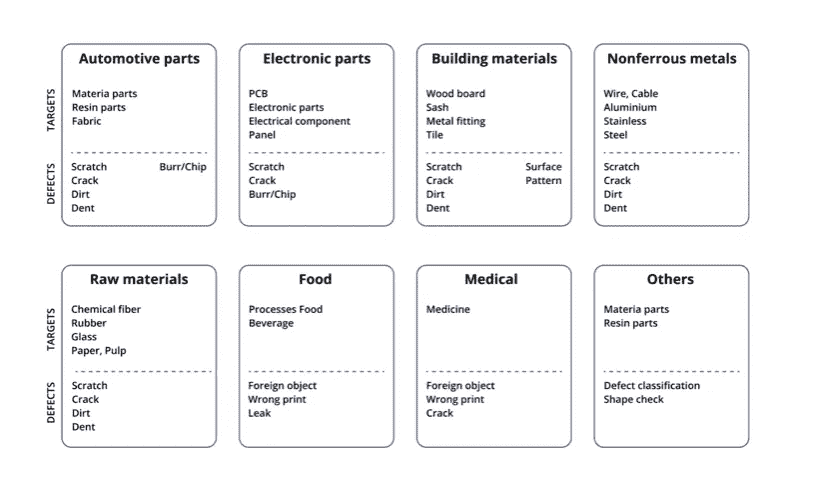
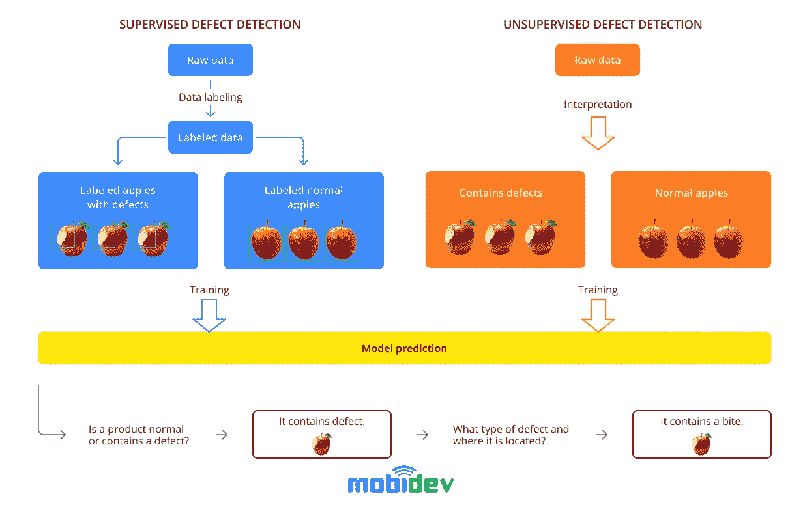
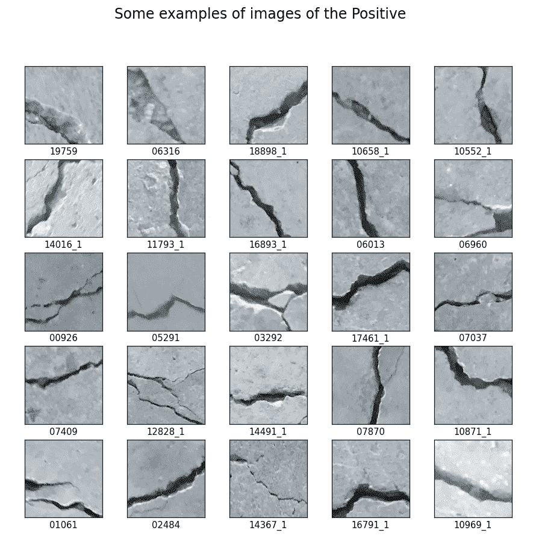
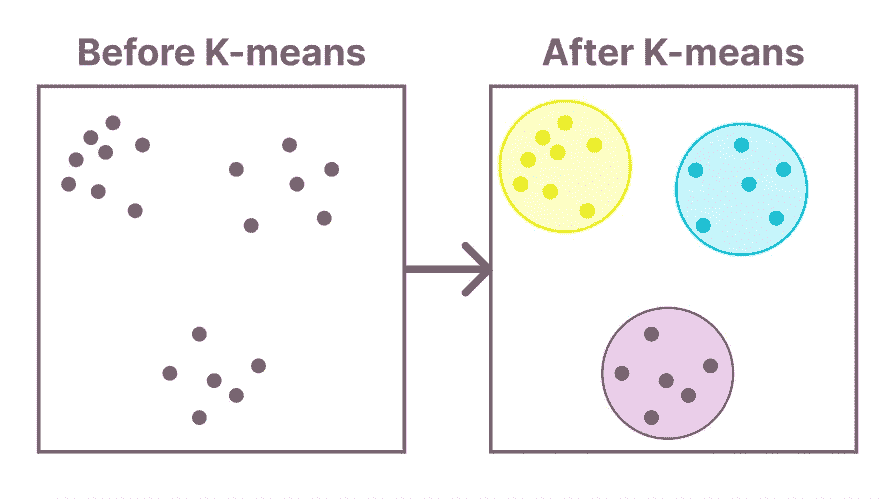
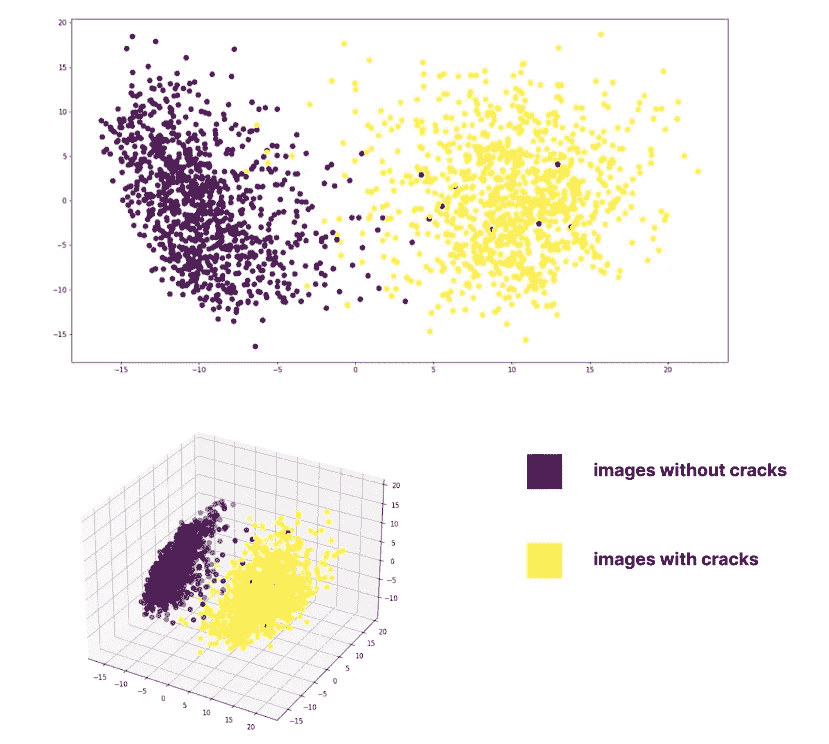
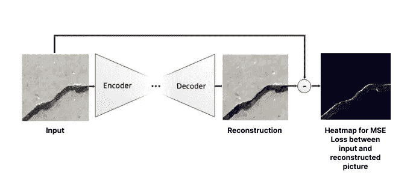
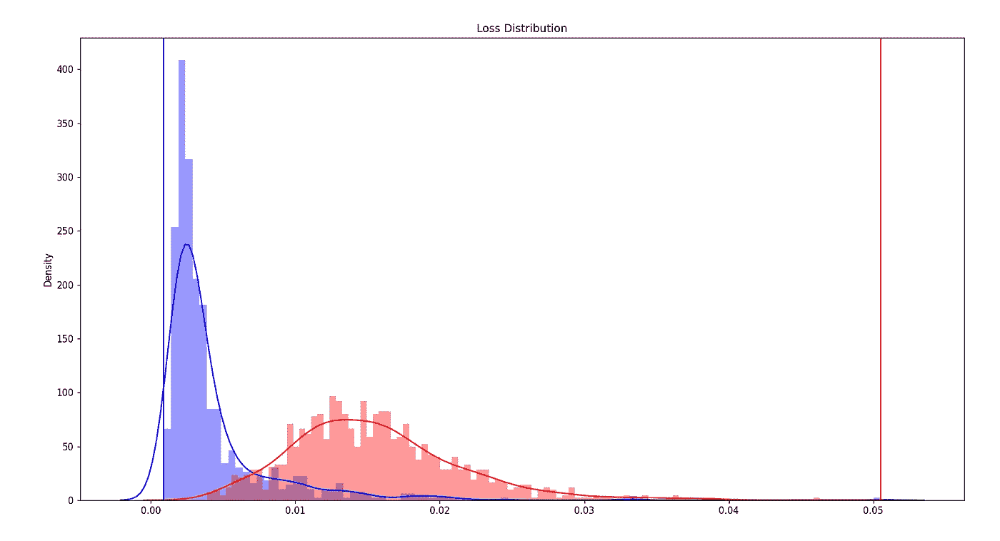
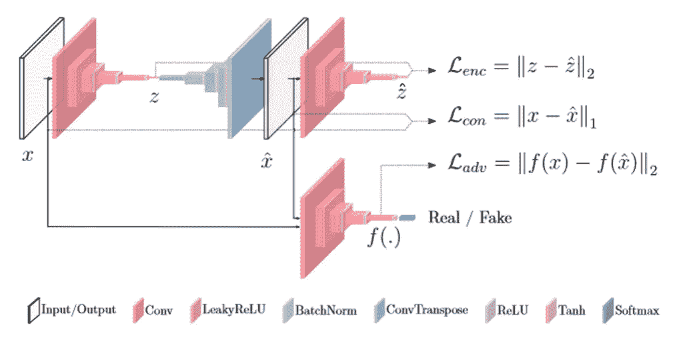

# 基于无监督学习的制造业缺陷检测

> 原文：<https://medium.com/codex/defect-detection-in-manufacturing-with-unsupervised-learning-1cbabb1fe0aa?source=collection_archive---------5----------------------->

正如美国质量协会报告的那样，许多组织的质量相关成本高达总生产收入的 40%。这一成本的很大一部分来自人工检测的低效率，而人工检测是制造业中最常见的质量控制方式。

人工智能在质量控制自动化中的应用提供了一种在生产线上进行视觉检测的更高效、更精确的方法。然而，传统的机器学习方法对我们如何训练和利用缺陷检测模型提出了一些限制。因此，在本文中，我们将讨论无监督学习对于缺陷检测的优势，并详细阐述 MobiDev 在我们的实践经验中使用的方法。

# 什么是 AI 缺陷检测，用在什么地方？

**人工智能缺陷检测**基于计算机视觉，利用机器学习算法提供自动化整个[人工智能质量检查](https://mobidev.biz/blog/ai-visual-inspection-deep-learning-computer-vision-defect-detection)过程的能力。缺陷检测模型经过训练，可以对通过生产线的产品进行目视检查，识别其表面的异常，并发现尺寸、形状或颜色的不一致。输出取决于模型被训练做什么，但是在缺陷检测的情况下，流程通常看起来像这样:

*简单地说，人工智能缺陷检测是如何工作的*

应用于质量控制过程，缺陷检测人工智能可以有效地检测大型生产线，甚至在最终产品的最小部分也能发现故障。这与可能包含不同性质的表面缺陷的大量制造产品有关。

*不同制造部门的缺陷检测*

*图片来源:*[*www.necam.com*](https://www.necam.com/Docs/?id=45e4e545-8503-44fd-8540-348102bf0a85)

英特尔描述了一个利用计算机视觉实现轮胎质量检测自动化的案例。正如[报告](https://www.intel.com/content/dam/www/public/us/en/documents/case-studies/iotg-ipc-tire-case-study-fv.pdf)中所述，质量控制的准确性从 90%上升到 99%,同时生产线削减了大约 49，000 美元的劳动力成本。但是这种系统并不局限于工厂中的固定硬件。例如，带有摄像头的无人机可以用于检查[路面缺陷](https://www.crayon.com/us/resources/case-studies/crayon-reduces-detection-process-from-7-days-to-1-hour-via-computer-vision-model-with-95-accuracy/)或其他户外表面，这大大减少了覆盖大城市区域所需的时间。

制药行业也受益于检测不同产品的生产线。例如，Orobix 使用一种特殊类型的摄像机对[制药](https://orobix.com/en/our-case-histories/defects-detection-and-classification-pharma/)进行缺陷检测，这种摄像机可以由未经培训的操作员使用。同样的原理也适用于检测[药用玻璃](https://www.mdpi.com/2313-433X/7/11/223/pdf?version=1635238475)的缺陷，如玻璃中的裂纹和气泡。

这样的例子可以在食品工业、纺织、电子、重工业和其他部门找到。但是，在我们如何用传统的机器学习来处理缺陷检测算法时，存在一些特定的问题。由于制造商每天检测数千种产品，因此很难收集用于培训的样本数据，也很难对其进行标记。这就是无监督学习发挥作用的地方。

# 什么是无监督学习？

大多数机器学习应用依赖于*监督机器学习*方法。监督学习需要我们通过手动标记收集的数据来为模型提供基础事实信息。就生产线而言，收集和标记数据可能是不可能的，因为我们无法收集产品上裂纹或凹痕的所有变化，以确保模型的准确检测。这里我们面临四个问题:

*   获取大量异常数据的困难
*   正常样品和异常样品之间差异极小的可能性
*   两个异常样本之间的显著差异
*   无法提前知道异常的类型和数量

*监督与非监督缺陷检测*

**无监督的机器学习**算法允许您在没有预先标记结果的数据集中找到模式，并发现数据的底层结构，而这是无法以正常方式训练算法的。与监督学习不同，训练流程变得不那么劳动密集型，因为我们希望该模型能够发现数据中具有更高变化阈值的模式。

异常检测揭示了以前未见过的罕见物体或事件，而事先对此一无所知。唯一可用的信息是数据集中的异常百分比很小。关于缺陷检测，这有助于解决数据标记和收集大量样本的问题。所以让我们看看无监督学习方法如何用于缺陷检测模型训练。

# 无监督学习如何应用于缺陷检测？

缺陷检测涉及机器学习中的异常检测问题。虽然我们不依赖于标记，但在无监督学习中还有其他方法，旨在对数据进行分组并为模型提供提示。

*   **聚类**是根据相似度对未标记的例子进行分组。聚类广泛用于推荐引擎、市场或客户细分、社交网络分析或搜索结果聚类。
*   **关联挖掘**旨在从数据集中观察频繁出现的模式、相关性或关联。
*   **潜在变量模型**设计用于模拟潜在变量的分布概率。它主要用于数据预处理，减少数据集中的特征，或者根据特征将数据集分解成多个组件。

无监督学习的未覆盖模式可用于实现传统的机器学习模型。例如，我们可以对可用数据应用聚类，然后将这些聚类用作监督学习模型的训练数据集。

# 基于无监督 ML 的混凝土裂缝检测

在机器学习方面有着丰富的经验，我们已经使用[混凝土裂缝数据集](https://data.mendeley.com/datasets/5y9wdsg2zt/2)进行了一次实验。目标是使用无监督学习创建一个能够识别有缺陷和正常图像的模型。此外，该研究检查缺陷图像的数量如何影响本项目中使用的某些算法。

*混凝土裂缝数据集示例*

在我们选择的用例中，我们假设图像标签在训练期间无法提前知道。只有测试数据集被标记，以便验证模型预测的质量，因为训练是通过无监督的方法进行的。因此，这里我们使用五种不同的方法从无监督学习模型中获得分类结果。

# 使聚集

因为我们没有任何已标记的基础事实数据，所以对未标记的例子进行分组是通过聚类来完成的。在我们的例子中，我们需要从数据集中挑选出两组图像。这是用预训练的 VGG16 卷积神经网络进行特征提取和 K-means 进行聚类的。聚类在这里所做的，是根据图像的视觉相似性将有裂缝和没有裂缝的图像分组。简而言之，集群看起来像这样。

*K-均值聚类*

聚类方法易于实现，通常被视为进一步深度学习建模的基线方法。

# 桦树聚类

在这种方法中，基于视觉相似性对图像进行聚类，使用预训练的 ResNet50 神经网络进行特征提取，使用 [Birch](https://scikit-learn.org/stable/modules/generated/sklearn.cluster.Birch.html) 进行聚类。该算法构建了一个树形数据结构，从叶子上读取聚类质心。这是一种内存高效的在线学习算法。聚类结果用[主成分分析](https://www.sartorius.com/en/knowledge/science-snippets/what-is-principal-component-analysis-pca-and-how-it-is-used-507186#:~:text=Principal%20component%20analysis%2C%20or%20PCA,more%20easily%20visualized%20and%20analyzed.)可视化；

*桦树聚类结果*

正如我们所见，birch 聚类显示了很好的类分布，即使在样本远离其质心的点上也是如此。

# 定制卷积自动编码器

自定义卷积自动编码器包含两个模块:编码器和解码器。它有助于在编码器部分获得特征，并在解码器部分根据这些特征重建图像。

*编码器-解码器可视化*

因为我们没有用于网络训练的标签，所以我们需要选择另一种方法来获得类——例如，自适应可选择的阈值。可自适应选择的阈值的目的是尽可能精确地划分两个分布(无裂缝图像和有裂缝图像):

*自动编码器分配结果*

# DCGAN

DCGAN 在对抗损失(BCALoss)的帮助下从 z 空间生成图像。最后，我们有三个损失——发生器损失、鉴别器损失和 MSE 损失(比较生成的图像和地面真实情况)。我们可以使用与自定义自动编码器相同的方法来构建我们的分类——借助自适应可选阈值，比较有裂缝和无裂缝图像的损失。对于阈值，根据它们的分布使用鉴别器损耗或 MSE 损耗是合适的。

# 加诺马利

[GANomaly](https://arxiv.org/abs/1805.06725) 使用条件 GAN 方法训练生成器生成正常数据的图像。在推断过程中，当异常图像通过时，它不能正确地捕获数据。它导致有缺陷的图像重建较差，而正常图像重建较好，并给出异常分数。

*加诺玛利建筑*

【图片来源:[*arxiv.org*](https://arxiv.org/abs/1805.06725)

# 如何进行无监督的异常检测

也许，无监督学习技术最有益的一面是，我们可以避免收集大量的样本数据，并为训练进行标记。应用无监督学习技术来导出数据模式，我们不局限于哪个模型可以用于实际的分类和缺陷检测。

然而，无监督学习模型更适合将现有数据划分为类，因为检查模型预测准确性非常困难，尤其是在没有标记数据集的情况下。

由 [Viktoriia Akhremenko](https://mobidev.biz/our-team/viktoriia-akhremenko) 撰写，mobi dev[的 AI 工程师。](https://mobidev.biz/services/machine-learning-consulting)

*全文原载于*[*https://mobidev . biz*](https://mobidev.biz/blog/defect-detection-in-manufacturing-with-unsupervised-learning)*，基于 mobi dev 技术研究。*