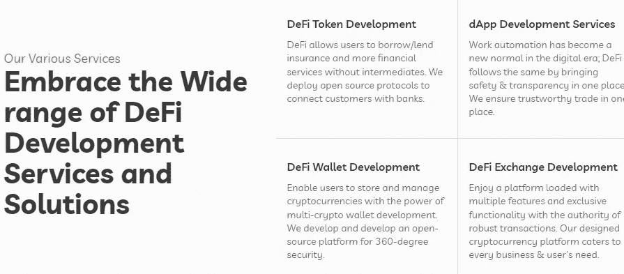

# DeFi 应用程序开发成本|构建您梦想中的 DeFi 项目的估算

> 原文：<https://medium.com/codex/defi-app-development-cost-ba7fce24dba3?source=collection_archive---------9----------------------->

由[泰佐斯](https://unsplash.com/@tezos?utm_source=medium&utm_medium=referral)在 [Unsplash](https://unsplash.com?utm_source=medium&utm_medium=referral) 上拍摄的照片

建立分散融资的成本从 65000 美元到 270000 美元不等。但这只是一个估计。影响 DeFi app 制作成本的因素有很多，比如——商业目的、区块链技术、智能合同选择、UI、UX、开发者和公司成本等。

[**与负担得起的 Defi 开发公司**](https://www.suffescom.com/) 一起启动自己的 Defi 项目

[**与负担得起的 Defi 开发公司一起启动自己的 Defi 项目**](https://www.suffescom.com/)

如果你计划建立你的 DeFi 平台，有一个问题，

"创建 defi 应用程序需要多少成本？"耽误了你的提问，你来对地方了。由[**Suffescom Solution**](https://www.suffescom.com/)创建的博客文章涉及所有增加 DeFi 应用程序开发成本的重要细节。

*如果您想要快速回答所有问题，您可以联系我们的专家，了解 Defi 应用程序成本核算的一些细节。*

回到主题…

DeFi 应用程序开发涉及一系列步骤，我们已经详细解释过了。但在此之前，我们已经列出了不同类型的 DeFi 应用程序。让我们向下滚动，了解更多信息。

# 各种类型的 DeFi 应用程序

请注意，我们在这里列出了不同类型的 DeFi 应用程序，但这些应用程序被组合在一个单一的 DeFi 应用程序中，以享受终极功能。请记住，添加更多的特性或功能也会提高你的应用程序开发成本。

*   自保管钱包

一个 DeFi 平台，允许用户在没有第三方参与的情况下安全地存储他们的资金。这些钱包是非保管型的，Metamask 就是其中最受欢迎的例子。像 metamask 这样的应用程序提供了一个通过互联网浏览器支付和接收资金的网关。开发人员可以使用 Metamask 插件在各种应用程序上构建交叉支付选项。

*   交易应用

交易软件的一个突出例子是 Uniswap，它不需要 KYC 账户，也没有交易限额。该平台完全基于智能合约运行，让你可以从钱包中交易受欢迎的代币。除了交易平台之外，Uniswap 还充当向池中提供密码并赚取名为“池”的交易费的平台。

*   DEX 聚合器

该平台能够以市场上最优惠的价格处理订单。它有助于提高 exchange、lending 等附加功能的可见性。今天，市场的主要部分被 Totle 平台所吸引，该平台将顶级交易所和综合提供商连接在一起。

*   放款与借款

DeFi 借贷平台允许像 Compound 这样的金融系统具有更好的安全性、透明度和问责制。该化合物是一个总部位于区块链的 DeFi 平台，允许快速借贷加密资金以换取利息。为了充分利用其优势，人们可以根据需求支付租金或购买杂货。

*   期权+保险

从开源代码设计开发的 dApps 有被 bug 利用的可能。这会在更短的时间内耗尽数百万的商业资金。为了解决这些问题，像 Nexus Mutual 这样的企业选择了一个具有智能合约功能的分散式金融平台。

*   道斯

DAOS 是另一个允许自动决策权的自治机构。分散的自治组织不涉及中央领导。平台上的每个决定都由智能合约功能做出，该功能允许用户继续或不继续。每一个决策都是投资人集体拥有和管理的。

*   非同质化通证

像 OpenSea、Rarible 等 NFT 市场是基于价值的资产，为虚拟财产所有者提供增长和收入机会。DeFi 为创造、购买和销售数字资产提供了难以置信的机会，这已经成为新一代 z 的加密热潮。

# 创建 DeFi App 要花多少钱？:了解时间和金钱问题

如你所知，并不是所有的移动应用都是平等的。存在基于平台、特性和功能的不平等。同样，时间和成本也会有所不同。例如，用于 iOS 的 DeFi 应用程序需要更少的时间来构建和启动，而 Android 应用程序需要大量的时间来设计和开发某些功能。在这里，我们根据估计的项目需求创建了分类:

*   具有简单功能的基本应用程序可以在 3-6 个月内开发完成，开发时间为 450-750 小时。
*   一个中等复杂的项目需要 5-9 个月和 800-1300 个开发小时。
*   一个高度复杂的项目需要 9 个多月的时间和 1200 多个开发小时来完成。

如上所述，根据构建应用程序所需的时间，成本会有所不同，从 65000 美元到 270000 美元不等。

# 增加 DeFi 应用程序开发成本的因素

当你着手开发一个 DeFi 应用程序时，有各种各样的因素是完美的 DeFi 应用程序开发所必需的，但是会增加额外的成本。为了简化 DeFi 应用程序开发流程，我们提供了增加预算的基本软件。这些是:

*   特定区块链技术
*   智能契约逻辑
*   网络/移动/桌面用户界面
*   链外数据
*   钱包整合

这些软件的集成经历了相同的开发步骤。我们已经在许多其他博客中讨论了这些步骤。让我们快速看一下构建 DeFi 软件的基本步骤。

*   发现阶段
*   设计和原型开发阶段
*   发展阶段
*   质量保证
*   维护

这些步骤侧重于增强用户体验和适应不断变化的市场条件。现在，让我们通过解释这些步骤来打破僵局，并转向构建以用户为中心的 Defi 应用程序并了解其成本。

# **要使用的区块链类型**

今天，市场上有几种区块链网络可供选择，如 Solana、Hyperledger、Polkadot、Ethereum、Polygon 等等。它们中的每一个都随着交易速度和成本因素而变化。例如，以太坊是最受欢迎的区块链技术，在 6 分钟的确认时间内只提供 12-25 的 TPS。鉴于投资者期望达到每秒 100000 笔交易，而该公司收取 0.9075 美元/tx 的平均以太坊交易费。

**注意:**区块链技术的普及是另一个需要成本的因素。加入 DeFi 生态系统的人越多，交易速度就越低，成本就越高。

让我们深入了解更多细节，并选择合适的区块链来构建值得信赖的 DeFi 应用程序。

*   **支持智能合约**

智能合约是 DeFi 平台的支柱。它包含了定义应用程序用途的所有业务逻辑。这里，我们有智能合约语言来帮助构建或更新智能合约。这些包括:

*   固态
*   锈
*   Vyper
*   **用户采用**

它涉及到有多少用户正在采用该链，他们的经济实力如何？

*   **费用和交易速度**

一般来说，人们使用较高的交易速度和较低的网络费用的组合。

*   **科技休闲裤**

技术栈包括几个后端 API 库、开发框架和编程语言。为了构建您的 DeFi 平台，我们列出了一些。

**后端 API 库**

*   Infura
*   魔力
*   道德
*   诺德史密斯
*   方块密码

**开发框架**

*   松露
*   建筑工人
*   布朗尼

**编程语言**

*   Java Script 语言
*   计算机编程语言
*   去

# 影响分散式应用开发成本的其他因素

*   **特性和功能**

特性和功能是应用程序开发中最大的成本驱动因素。这些涉及到屏幕、按钮、字段，以及更多震撼开发者心智的逻辑。根据复杂性，一些应用程序涉及第三方 API 集成，以使用本机功能。让我们来看看一些功能:

*   注册
*   文件上传
*   档案完成/编辑
*   推送通知
*   基本管理面板功能
*   社交媒体的参与
*   应用内购买支持
*   地图
*   支付
*   打电话

## 发展的位置和结构

你选择的开发公司的位置在计算成本时也起着重要的作用。比如，在印度等国家开发应用程序比选择英国公司更实惠。因为您必须单独支付:

*   商业分析员
*   UI/UX 工程师
*   建筑师
*   项目管理人
*   开发商
*   质量保证团队
*   项目管理人
*   美术设计员

## **App 维护成本**

现在是时候来看看占应用程序开发 15-20%的应用程序维护成本了。在复杂的项目中，下面提到的问题非常耗时。因此 grab 消耗更多的钱来建立一个有效的和交互式的商业方法。常见问题有:

*   修复 bug
*   提高稳定性和性能
*   代码优化
*   添加最新版本的操作系统支持
*   开发新功能
*   升级第三方服务

# Suffescom 解决方案如何帮助您？

从发现、集成和存储到产品开发，我们负责以合理的价格构建面向行业的应用程序。我们的应用是特色的、打包的、面向客户的，证实了对高级分散应用的需求。

我们的一些主要服务包括:

*   区块链咨询服务
*   设计和集成
*   MVP 咨询
*   分散交换
*   智能合同开发
*   定制钱包集成

如果您仍然对您的 DeFi 移动应用程序的价格感到困惑，请联系我们，了解更多关于我们的信息。我们只有一步之遥。