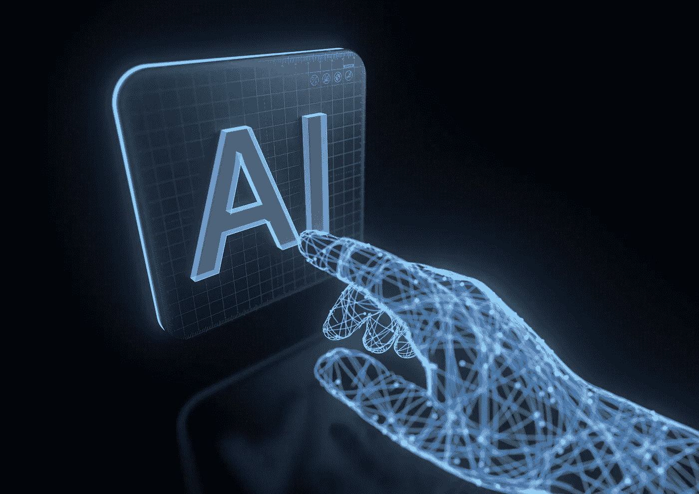
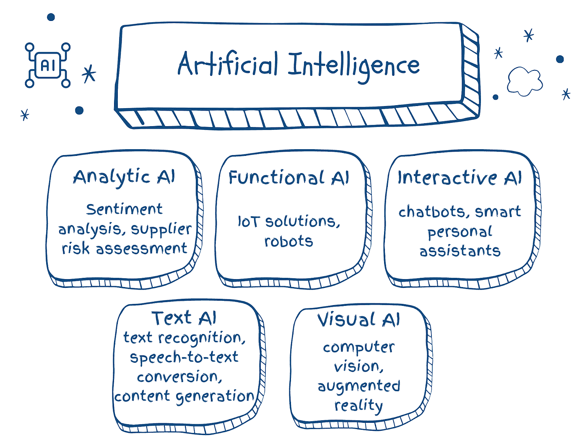

# 定义人工智能、机器学习和数据科学

> 原文：<https://medium.com/codex/defining-artificial-intelligence-machine-learning-and-data-science-b310119a76d1?source=collection_archive---------12----------------------->

今天的商业世界充斥着人工智能、机器学习和深度学习等时髦词汇。我们知道，这些技术和工具正在改变各垂直行业的竞争格局，很快将变得更加重要和基础性，而不是破坏性。然而，可能知道它们很重要，但不明白它们真正的意思。如果你感到困惑，这是可以理解的，因为这些都是术语，它们甚至没有被一致地使用。在这篇介绍性的文章中，我将解释人工智能、机器学习和数据科学之间的区别。

人工智能(AI)是一个庞大的工具集，用于让计算机以自动化的方式智能地运行。这包括语音助手、推荐系统和自动驾驶汽车。

**机器学习(ML):** 是在没有明确编程的情况下赋予计算机学习能力的研究领域。机器学习的最大份额涉及计算机从现有数据中学习模式，并以预测的形式将其应用于新数据，例如确定一个句子是正面还是负面，或者预测一封电子邮件是否是垃圾邮件，预测增长业务的一个最重要的指标(客户流失)，以及诊断一个特定的医学成像。

**数据科学(DS)** 是从数据中发现和创造见解，并将这些见解和发现传达给非技术利益相关者。

**AI、ML、DS 是如何关联的？**

机器学习为人工智能和数据科学提供了支持如果你的机器学习模型的输出被输入到一个计算系统，该系统以自动化的方式执行一个动作——例如推荐一个产品或提供搜索结果——它可以被视为你的人工智能系统的一个组件。

如果你的机器学习模型的输出被输入到人类的决策过程中，它可以被认为是数据科学的工作。例如，当预测客户可能流失导致人们决定激励客户留下来时，这种洞察力或发现会为数据科学决策提供信息。许多机器学习和人工智能依赖于高质量的数据，这意味着最有影响力和最有效的人工智能将站在强大的数据科学能力的肩膀上。

**艾**

在他的 Coursera 课程[AI for everybody](https://www.coursera.org/learn/ai-for-everyone)中，[谷歌大脑](https://research.google/teams/brain/)的联合创始人、前百度首席科学家吴恩达将人工智能定义为“一个让计算机智能运行的庞大工具集”这个定义涉及面很广，值得提供一些例子来说明“行为明智”的含义:

*   语音助手，比如亚马逊 Alexa
*   推荐系统，如网飞
*   无人驾驶汽车
*   表面算法，比如 Twiter 和脸书使用的算法，决定在你的 feed 中显示什么内容。

人工智能的类型

重要的是要认识到，人工智能意味着行动和决策是自动化的。还需要注意的是，所有这些都是狭义人工智能([弱人工智能](https://en.wikipedia.org/wiki/Weak_AI))或算法可以做好一件事的例子。这不要与人工通用智能( [AGI](https://en.wikipedia.org/wiki/Artificial_general_intelligence) )混淆，后者是一种假设的、未来的人工智能，可以做人类能够做的任何事情。也不是超智能的人工智能，是一种假设的智能超过人类的软件代理。

如果 AI 是一个庞大的工具集，我们说的是什么工具？让我们来探索对现代人工智能至关重要的工具——机器学习。

**机器学习**

机器学习为内容发现、垃圾邮件过滤器、推荐系统、搜索引擎和许多其他技术上的“匹配”问题提供了动力。在医疗保健领域，它正被用于药物研发和高通量诊断成像诊断。在金融领域，机器学习现在是欺诈检测、流程自动化、算法交易和机器人咨询的基础。这样的例子不胜枚举。那到底是什么呢？机器学习是人工智能和计算机游戏的先驱亚瑟·塞缪尔在 1959 年推广的一个术语。塞缪尔将其定义为“无需明确编程就能赋予计算机学习能力的研究领域。”

**监督学习**

大多数机器学习涉及计算机从现有数据中学习模式，然后以预测的形式将其应用于新数据。例子包括:

预测客户是否会流失

根据电子邮件发件人、主题和正文，预测电子邮件是否为垃圾邮件

预测特定医学影像的诊断

预测体育比赛的结果

这些预测和分类问题是商业领袖在短期和中期需要了解的最重要的 ML 技术——称为监督学习。你试图预测的标签模式——比如是否是垃圾邮件——据说可以监督学习过程。

现代机器学习的力量坚定地依赖于让你的算法学习或“接受训练”的高质量数据，并且这种训练数据需要被标记。在垃圾邮件分类示例中，您将需要许多标有垃圾邮件与否的电子邮件。在诊断成像示例中，您需要至少数千张标有诊断的图像。

然后，你的 ML 算法能够在你的训练数据中提取模式，并将这些模式推广到未标记的数据，其中你不知道你试图预测的结果。正是因为这个原因，数学家兼斯坦福大学教授[大卫多诺霍更喜欢机器学习的术语循环智能](https://hdsr.mitpress.mit.edu/pub/rim3pvdw/release/6)而不是人工智能，因为没有创造新的智能，而人类智能，由具有领域专业知识的人手工标记数据集，被回收并重新应用于新数据。

在机器学习和人工智能的世界背后有一个巨大而隐藏的供应链。公司和个人利用诸如[亚马逊机械土耳其](https://www.mturk.com/)这样的服务来众包标签数据。还有 [Scale AI](https://scale.com) ，一家与全球数万名承包商合作手工标注数据的初创公司，最近筹集了 1 亿美元，这反映了日益增长的市场需求。

**无监督学习**

无监督学习是关于发现数据中的一般模式。最常见的例子是对客户和用户进行聚类或细分。这种类型的细分是通用的，可以广泛应用于文档、公司和基因。异常检测通常被公式化为一个无监督的学习问题。异常检测算法有助于您确定哪些观察结果与众不同或非常不同。例如，如果您有一个包含大量交易的数据集，并且想要识别哪些交易可能是欺诈性的。当然，大多数数据都是无标签的。这使得无监督学习在每个领域都很有用，并且它的重要性在这些年里不断增长。以无人监管的方式从数据中可以学到很多东西。

**自我监督学习**

在一些领域，如文本和图像处理，我们有大量的数据要学习，但问题是它们通常是未标记的。挖掘这些数据的有效方法是使用自我监督学习技术。你可以认为自我监督学习是监督学习和非监督学习之间的缺失环节。在自我监督学习中，人类不会明确地标记数据。相反，通过考虑问题域，创造性地将固有标签添加到数据中。例如，使用自然语言处理，从网络上收集大量基于文本的文档，对于每个句子，中间的单词由空格代替。然后它被用作一个标签。最后，训练一个模型从上下文预测中间词。自我监督学习使模型能够学习复杂的模式，而不需要人为标记的数据。

**强化学习**

尽管绝大多数人工智能和机器学习依赖于标记数据和其中包含的再循环智能，但有一个不断增长的机器学习子领域称为强化学习，它对预先存在的训练数据的依赖程度要低得多。借助于行为心理学的强化学习，软件代理被置于受约束的环境中，并根据他们的活动给予“奖励”和“惩罚”。如果玩游戏对你来说听起来像是强化学习的相关应用，那你就对了:这就是为什么 [AlphaGo Zero 在 2017 年](https://www.scientificamerican.com/article/ai-versus-ai-self-taught-alphago-zero-vanquishes-its-predecessor/)击败了根据人类数据训练的 AlphaGo，成为世界围棋冠军。最近，在 2019 年，Pluribus 在六人无限注德州扑克中击败了最优秀的职业玩家。强化学习在其他领域也有重要的应用，如自动驾驶汽车和算法交易，我们肯定会在未来几年看到更多的应用。

**数据科学**

托马斯·达文波特和 DJ·帕蒂尔在他们 2012 年《哈佛商业评论》的开创性文章《数据科学家:[21 世纪最性感的工作](https://hbr.org/2012/10/data-scientist-the-sexiest-job-of-the-21st-century)中明确指出，“最重要的是，数据科学家在数据中游泳时会有所发现。”数据科学是关于从数据中创造洞察力的，通常是在商业环境中。然而，数据科学家是如何做到这一点的呢？数据科学是一个多学科领域，使用科学方法、流程、算法和系统从结构化和非结构化数据中提取知识和见解。

这在实践中如何发挥作用？现代数据科学家的工具箱中有如此多的工具和技术，对空间进行划分是很有帮助的。划分数据科学空间的一种方法是划分描述性分析、预测性分析和规定性分析，我将在下一篇文章中介绍这些内容。