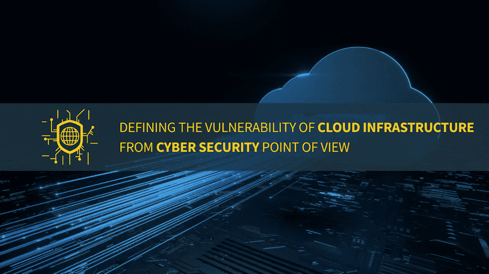

# 从网络安全角度定义云基础设施的漏洞

> 原文：<https://medium.com/codex/defining-the-vulnerability-of-cloud-infrastructure-from-cyber-security-point-of-view-5faae7580662?source=collection_archive---------15----------------------->

作者图片

## 混合和多云时代的模型:确定云转型带来的主要网络安全挑战。选择合适的云合作伙伴，确保遵守政府和行业法规…