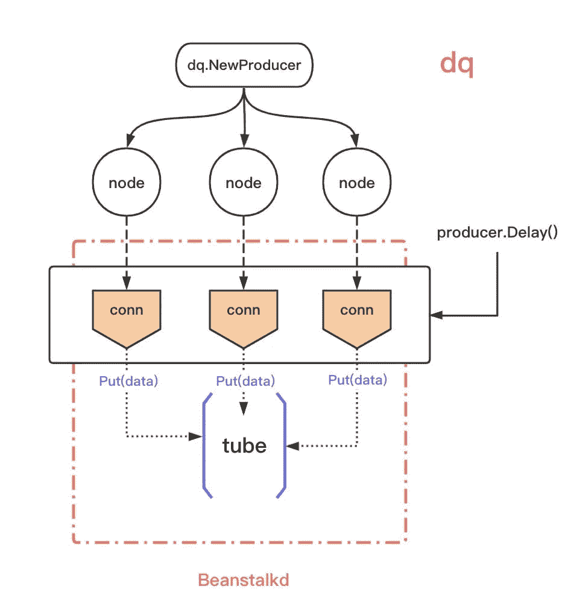
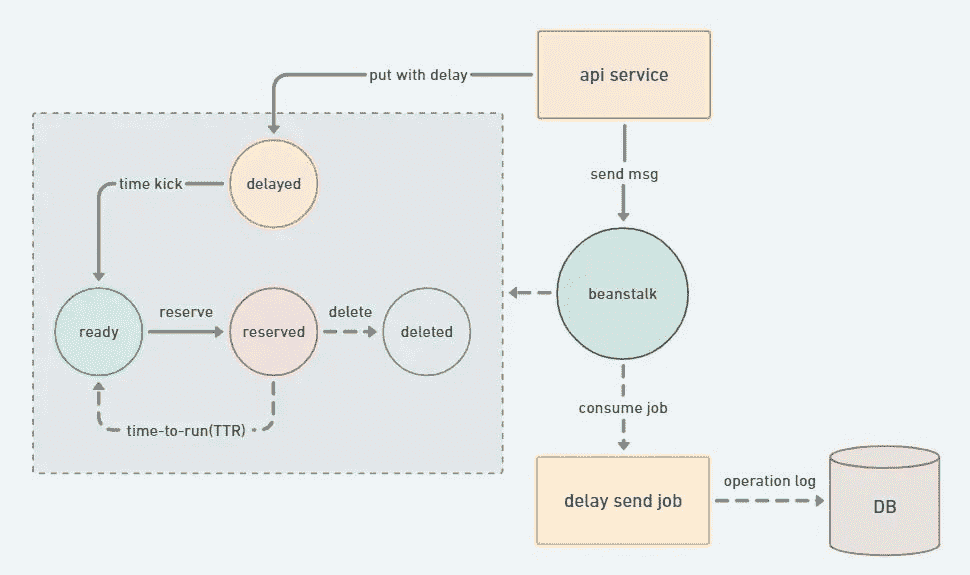
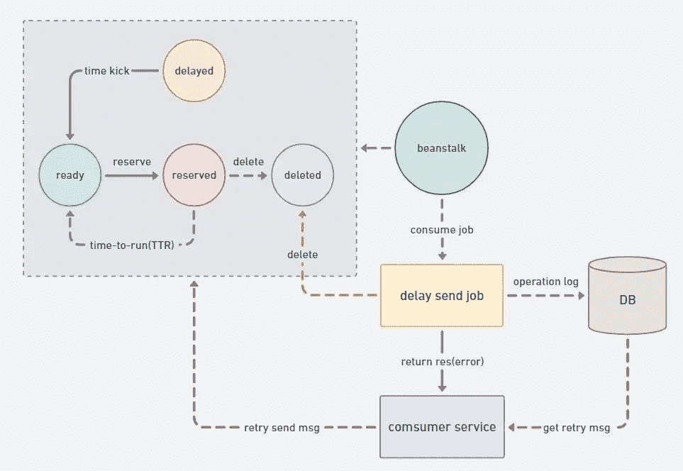

# 延迟队列:具有延迟特性的消息队列

> 原文：<https://medium.com/codex/delayed-queue-a-message-queue-with-delay-feature-268c8647c2fd?source=collection_archive---------1----------------------->

1.  延迟→未来不确定的时间
2.  mq →消费行为是顺序的

有了这个解释，整个设计就清晰了。**你的目的是延迟，而承运人集装箱是 mq。**

# 背景

列出我日常业务中可能存在的场景。

1.  创建一个延迟的时间表，需要提醒老师上课
2.  延迟推送→推送老师需要宣布和布置作业

要解决以上问题，最简单直接的方法就是定时扫描日程。

> *服务启动时，打开一个异步并发进程→定时扫描 msg 表，到达时触发一个事件，调用相应的处理程序。*

几个缺点。

1.  每个需要定时/延迟任务的服务都需要一个 msg 表，用于额外的存储→存储和业务耦合
2.  定时扫描→时间不好控制，可能错过触发时间
3.  这对 msg 表实例来说是一个负担。一个服务不断地对数据库产生持续的压力。

最大的问题是什么？

**调度模式基本统一，不做重复的业务逻辑**

可以考虑把具体业务逻辑中的逻辑拿出来，变成一个通用的部分。

而这个调度模型就是**延迟队列**。

其实说白了。

***延迟队列模型，是预先存储未来执行的事件，然后不断扫描这个存储，触发执行时间后再执行相应的任务逻辑。***

那么开源社区有现成的解决方案吗？答案是肯定的。青苗([**)https://github.com/beanstalkd/beanstalkd**](https://github.com/beanstalkd/beanstalkd))基本符合上述要求

# 设计目标

1.  至少消费行为
2.  高可用性
3.  实时的
4.  支持消息删除

针对这些目的的设计方向一次陈述一个。

# 消费行为

这个概念取自 mq。mq 中为消费者造型提供了几个方向。

*   `at most once` →消息最多可以被丢弃一次，但不能重复
*   `at least once` →至少一次，消息肯定不会丢失，但可能会重复
*   `exactly once` →是且仅一次，消息不会丢失或重复，且仅消费一次。

`exactly once`如果可能的话，在生产者和消费者两方面都有保证。当生产者得不到保证时，那么消费者需要在消费前做一次去重，实现一次消费，不重复消费，直接在延迟队列内部得到保证。

最简单:**使用 redis setNX 实现作业 id 的唯一消费**

# 高可用性

支持多实例部署。当一个实例关闭时，有一个备份实例继续提供服务。

这个外部可用的 API 使用一个集群模型，该模型在内部封装了多个节点，并在多个节点之间提供冗余存储。

# 为什么不是卡夫卡？

考虑过类似的基于消息队列的解决方案，如 kafka/rocketmq 作为存储，但最终放弃了存储设计模型中的此类选项。

例如，假设像 Kafka 这样的消息队列存储用于实现延迟功能，每个队列时间需要创建一个单独的主题(例如，Q1–1s，Q1–2s…)。这种设计在延迟时间固定的场景下问题不大，但如果延迟时间变化较大，就会导致话题过多，使磁盘从顺序读/写变成随机读/写并导致性能下降，还会带来重启或恢复时间长等其他问题。

1.  话题太多→存储压力
2.  主题是实时存储的，当调度不同时间的读取时(主题)，顺序读取→随机读取。3.
3.  同样，写入时，顺序写入→随机写入

# 建筑设计

# API 设计

生产者

1.  `producer.At(msg []byte, at time.Time)`
2.  `producer.Delay(body []byte, delay time.Duration)`
3.  `producer.Revoke(ids string)`

消费者

1.  `consumer.Consume(consume handler)`

使用延迟时间队列，服务的总体结构如下，以及队列中作业的状态变化。

1.  服务→ `producer.At(msg []byte, at time.Time)` →将延迟的工作插入试管
2.  定时触发→作业状态更新为就绪
3.  消费者准备好作业→获取作业并开始消费；并将状态更改为保留
4.  执行传递给使用者的处理程序逻辑函数

# 生产实践

我们将主要介绍我们在日常开发中对于延迟队列使用了哪些具体的函数。

# 生产侧

1.  生产开发中的一个延迟任务，**只是为了确定任务的执行时间** 1。

*   在()`producer.At(msg []byte, at time.Time)`传入
*   在内部，它将自己计算时间差值并插入试管

1.  **如果修改了任务时间，修改了任务内容**

*   您可能需要在生产时创建一个附加的 logic_id → job_id 关系表
*   查询到 job_id → `producer.Revoke(ids string)`,将其删除，然后重新插入

# 消费端

首先，框架层保证消费行为`exactly once`，但是上层业务逻辑消费失败或者网络问题，或者各种问题，导致消费失败，底层交给业务开发来做。这样做的原因。

1.  框架和底层组件只保证工作状态流的正确性
2.  消费者一方的框架只能保证消费行为的一致性
3.  延迟任务在不同的业务行为中是不统一的

*   对任务的强调必须达到，那么失败的消耗需要不断的重试，直到任务成功
*   强调任务的准时性，失败的消耗，商业的不敏感，那么你可以选择丢弃

这里描述的是框架的消费者一方如何确保消费行为的一致性。

分为集群和节点。

**集群:**

> [***https://github . com/zero micro/go-queue/blob/master/dq/consumer . go # L45***](https://github.com/zeromicro/go-queue/blob/master/dq/consumer.go#L45)

1.  集群内部将消费处理程序包装在另一层中。2.
2.  **对消费主体进行哈希处理，并将此哈希用作 redis 重复数据删除的密钥**。3.
3.  如果存在，则不进行处理并被丢弃

**节点:**

> [***https://github . com/zero micro/go-queue/blob/master/dq/consumer node . go # L36***](https://github.com/zeromicro/go-queue/blob/master/dq/consumernode.go#L36)

1.  消费者节点准备工作；首先执行保留(TTR)，预订该作业，将执行该作业进行逻辑处理
2.  在节点中删除(作业);然后消费
3.  **如果失败，将被扔给业务层做相应的口袋重试**

所以对于消费端，开发者需要自己实现消费的幂等性。

# 项目地址

`go-queue`由`go-zero`提供动力，性能卓越。

*   归零:[**https://github.com/zeromicro/go-zero**](https://github.com/zeromicro/go-zero)
*   排队:[**https://github.com/zeromicro/go-queue**](https://github.com/zeromicro/go-queue)

欢迎使用**和**星来支持我们！