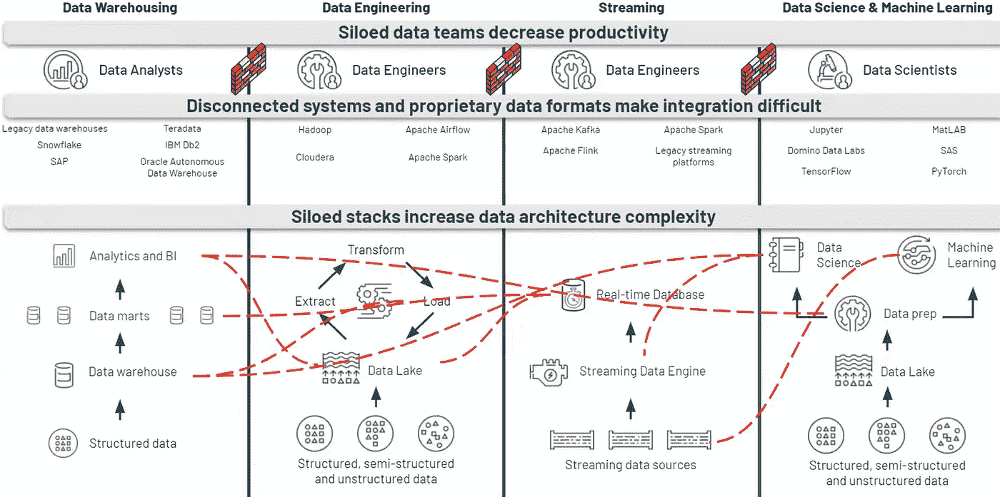

# 三角洲湖架构:简化数据工程和分析需求

> 原文：<https://medium.com/codex/delta-lake-architecture-simplifying-data-engineering-analytics-needs-8d8be8459678?source=collection_archive---------0----------------------->

***图片由 Onlyinyourstate.com*Gerrit Ebert 提供**

如今，大多数企业都在与迅猛的数据增长作斗争，我们需要了解传统系统失败的原因。在接下来的五年中，全球数据创建预计将增长到 180 多亿字节。

数据驱动的决策正在改变我们的工作和生活，无论是政府、教育机构还是其他金融机构，数据都被视为游戏规则的改变者。数据是新的石油。我们需要找到它，提取它，提炼它，分配它，并将其货币化。

因此，我们需要一个强大的解决方案，能够无限制地进行扩展，能够处理任意数量的各种数据，处理结构化、半结构化和非结构化数据，处理成批或实时流式传输的数据，并验证和确认数据。很明显，我们传统的关系数据库系统无法处理这种情况。

# **传统数据架构的挑战**

随着时间的推移，我们看到了数据驱动型系统的发展，如数据仓库、大数据工作负载(批处理和流)、lambda 架构和数据科学工作负载，但这些系统是由孤立的数据团队处理的，导致数据重复和生产力降低。

这些系统存在一些问题，如在作业失败和历史数据更新的情况下，同一路径上的数据覆盖会导致数据丢失。

下图描述了高级场景…

***图片来自*dataricks.com**

# **三角洲湖如何帮助解决这些挑战？**

三角洲湖建筑为上述问题陈述提供了解决方案。这并不意味着，我们不再需要数据仓库和数据湖解决方案，它们不会消失。
让我们进入细节……

**图片由 databricks.com**提供

# **三角洲湖泊概况**

Delta Lake 提供了 ACID 事务、可扩展的元数据处理，并统一了流式和批量数据处理。Delta Lake 运行在您现有的数据湖之上，并且与 Apache Spark APIs 完全兼容。

Delta Lake 是一个开放格式的存储层，为您的数据湖提供可靠性、安全性和性能，适用于流和批处理操作。开源为您提供了将工作负载轻松迁移到其他平台的灵活性。

Delta Engine 位于数据湖的顶部，是一个高性能、Apache Spark 兼容的查询引擎，它提供了一种有效的方法来处理数据湖中的数据，包括存储在开源 Delta Lake 中的数据。Delta 引擎优化加速了数据湖操作，支持从大规模 ETL 处理到即席交互式查询的各种工作负载。

***图片由 techcommunity.microsoft.com*提供**

# **三角洲湖泊建筑**

三角洲湖架构是对传统的λ架构的巨大改进。
在每个阶段，它通过连接的管道改善我们的数据，并允许我们通过共享文件存储将流和批处理工作流与符合 ACID 的事务相结合。

它将我们的数据组织到定义为青铜级、白银级和黄金级的层或文件夹中，如下所示…

*   青铜表包含从各种来源获取的原始数据(RDBMS 数据、JSON 文件、物联网数据等。)
*   银表将使用连接给出我们的数据的更精确的视图。
*   黄金表给出了经常用于仪表板和报告的业务级汇总。

各种商业智能工具可以使用这些黄金表进行报告和分析。

***图片来自*techcommunity.microsoft.com**

# **结论**

为了满足指数级的企业数据增长并围绕数据增长设计强大的数据解决方案，我们需要一个能够无限制扩展并能够处理任意数量的数据变化的解决方案。Delta Lake 架构可能是正确的解决方案，因为它是对传统 Lambda 架构的巨大改进。使用这种方法，我们可以通过一个连接的管道来改进我们的数据，该管道允许我们通过一个共享文件存储与 ACID 兼容的事务来组合流和批处理工作流，并提供两个世界的最佳效果。

一定要让我知道你对三角洲湖的看法…

感谢阅读！！！