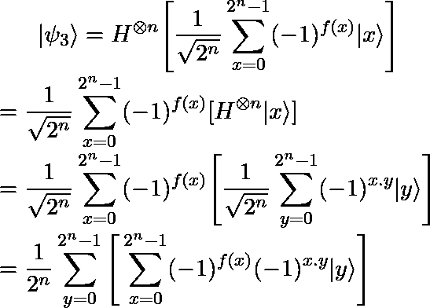
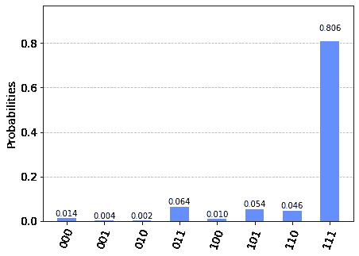

# 用 Deutsch-Jozsa 算法演示指数加速

> 原文：<https://medium.com/codex/demonstrating-exponential-speedup-with-the-deutsch-jozsa-algorithm-ae680df79039?source=collection_archive---------29----------------------->

每当一项新技术被大肆宣传时，人们都会好奇它能提供什么。随着量子计算越来越受到关注，你可能想知道它是否真的比我们今天拥有的计算机有好处。在这篇文章中，我将介绍 Deutsch-Jozsa 算法[1]，这是第一个被证明比最佳经典解决方案更快的量子算法。

假设你有一个“黑盒”，它充当函数 f:{0,1}ⁿ→{0,1}，也就是说，它以 n 位作为输入，输出 1 位，但你不知道这个函数是如何实现的，也不知道它的行为如何。您唯一知道的是，该函数只能有两种行为之一:该函数要么是常数，意味着它总是输出 0 或总是输出 1，要么是平衡的，因此它对恰好一半的输入输出 0，对另一半输入输出 1。举个例子，假设我们有 n=2，那么可能的输入是 00，01，10，11。如果函数是常数，我们有:

*   f(00)=f(01)=f(10)=f(11)=0 或
*   f(00)=f(01)=f(10)=f(11)=1

如果函数是平衡的，我们有很多可能性，你可以在下面看到一些例子。

*   f(00)=f(01)=0 且 f(10)=f(11)=1 或
*   f(00)=f(11)=0，f(01)=f(10)=1

Deutsch-Jozsa 算法的目标是使用尽可能少的函数调用来确定函数是常数还是平衡的。要看量子算法如何优越，必须先看经典解。

## **经典解:**

经典解决方案的最佳情况是需要两次调用该函数。在这种情况下，第一个调用返回 0，第二个调用返回 1，反之亦然。这是真的，因为如果有两个不同的输出，那么功能必须平衡。

然而，在最坏的情况下，我们需要对函数进行((2ⁿ÷2) +1)次调用。这是因为有可能前一半的调用将返回相同的值，所以如果下一个调用返回与前几个相同的值，那么 f 是常数，如果输出不同，那么 f 是平衡的。

## **量子解:**

使用量子计算机来解决这个问题，我们可以通过一个简单的调用来解决它。因此很明显，即使 n=1，量子解也更快，当我们增加输入的大小时，优势变得更大。那么，这怎么可能呢？

第一步是将函数 f 实现为一个量子预言，就像一个黑盒，这个预言将把输入|x⟩|y⟩映射到|x⟩|y ⊕ f(x)⟩.⊕符号表示模 2 加法，也称为异或。我们称之为 oracle Uf。

该算法的完整电路如下:


Deutsch-Jozsa 算法的量子电路。资料来源:qiskit.org

以防你感到困惑，你看到的这个“⊗n”意味着这个动作发生在 n 个量子位中。这意味着有 n 个量子位被初始化为|0⟩，然后对它们应用 n 个哈达玛门。

为了解释正在发生的事情，在每一步中观察系统的状态将会很有趣。

*   **第 0 步:**


初态

*   **第一步(哈达玛节之后):**

这里，可以很好地看到 Hadamards 对两个寄存器的影响，以及对整个系统的影响。


Hadamard 门应用于输入


阿达玛门应用于安西拉量子位


哈达玛门之后的结果状态

*   **步骤 2(Uf 之后):**

注意，在当前状态下，y = (|0⟩ -|1⟩).当应用 U_f 时，结果如下。


为了简化这种状态，请注意 XOR 的这些属性:


有了这个，我们可以这样写:


使得有可能将这个术语重写为


导致国家


U_f 后的结果状态

*   **步骤 3(在最后一个哈达玛之后):**

这里，我们可以忽略第二个寄存器(ancilla 量子位)，因为它不会被测量。这给我们留下了下面的状态。


没有 ancilla 量子位的状态

为了理解下一步，我们可以把哈达玛门对一些 state|x⟩的影响写成


x.y 是位积，所以 x.y=x₀y₀ ⊕ x₁y₁ ⊕ … ⊕xₙyₙ.也就是说，当哈达玛应用于 to|ψ2⟩时，我们得到了我们的最终状态。



请注意，如果你想严格，那么最后一个操作的中间步骤是错误的，因为求和是|x⟩定义的一部分，哈达玛实际上也应用于它。但由于这不会影响结果，而且我相信这更容易理解所做的事情，所以我决定让它保持原样。

*   **测量:**

现在是测量的时候了，这就是奇迹发生的地方。请注意，如果我们想要测量|00…0⟩状态，即|y⟩ = |00…0⟩，则此测量的概率由下式给出


注意:x.y=0，因为 y 的每一位都等于 0。

所以，如你所见，如果我们测量一次结果，它等于|00…0⟩，那么我们肯定知道函数是常数，如果我们得到任何其他结果，那么函数是平衡的。因此，如前所述，我们使用了一次函数调用，而不是((2ⁿ÷2) +1)，这意味着该算法比经典算法要快得多。

现在你已经知道了算法背后的理论，我们可以使用 qiskit 这样的平台来实现它，并在真正的量子计算机上进行尝试。我应该说下面的大部分代码都是基于 qiskit 文档[2]的，所以如果你想了解更多的信息，可以去看看。

## **Qiskit 实现:**

**设置环境:**

```
import numpy as np
from qiskit import QuantumCircuit
from qiskit.visualization import plot_histogram
n=3 #size of the inputfrom qiskit import IBMQ
IBMQ.save_account("*token*")
IBMQ.load_account()
provider = IBMQ.get_provider("ibm-q")
```

**创建 Oracle:**

我们可以创建一个常数甲骨文或一个平衡。我将创建两个，只是为了让你知道他们看起来像什么。

*   常量 Oracle:

```
const_oracle **=** QuantumCircuit(n**+**1)output **=** np**.**random**.**randint(2) #Randomly decides if f(x)=0 or f(x)=1
**if** output **==** 1:
    const_oracle**.**x(n)
const_oracle**.**draw()
```


常数 oracle，其中 f(x)=0

*   平衡的 Oracle:

平衡预言是通过一些 CNOT 门实现的。此外，我们添加了一些非门，以改变控制量子位，使 CNOT 有一些影响。然而，NOT 被应用了两次，所以控制量子位在 Uf 之后回到原始状态。

```
balanced_oracle **=** QuantumCircuit(n**+**1)
b_str **=** "101" # This string simply determines the balance*# Place X-gates*
**for** qubit **in** range(len(b_str)):
    **if** b_str[qubit] **==** '1':
        balanced_oracle**.**x(qubit)*# Use barrier as divider*
balanced_oracle**.**barrier()*# Controlled-NOT gates*
**for** qubit **in** range(n):
    balanced_oracle**.**cx(qubit, n)balanced_oracle**.**barrier()*# Place X-gates to return qubits to original state*
**for** qubit **in** range(len(b_str)):
    **if** b_str[qubit] **==** '1':
        balanced_oracle**.**x(qubit)*# Show oracle*
balanced_oracle**.**draw()
```


平衡 Oracle

**算法的其余部分:**

```
dj_circuit **=** QuantumCircuit(n**+**1, n) *# Apply H-gates*
**for** qubit **in** range(n):
    dj_circuit**.**h(qubit)*# Put ancilla qubit in state |->*
dj_circuit**.**x(n)
dj_circuit**.**h(n)*# Add oracle*
dj_circuit **+=** balanced_oracle #You can change for constant oracle*# Repeat H-gates*
**for** qubit **in** range(n):
    dj_circuit**.**h(qubit)
dj_circuit**.**barrier()*# Measure*
**for** i **in** range(n):
    dj_circuit**.**measure(i, i)*# Display circuit*
dj_circuit**.**draw()
```


全 Deutsch-Jozsa 算法电路

注意:电路是用 n+1 个量子位创建的，因为我们有一个安西拉量子位，初始化为|1⟩.另外，请注意，您可以使用+=运算将 oracle 附加到此电路，因此您在完整电路中看到的 NOTs 是 Oracle 的一部分，而不是外部电路的一部分。

**结果:**

```
from qiskit import execute
backend = provider.get_backend("ibmq_quito")
job = execute(dj_circuit, backend=backend, shots=500)
result = job.result()
answer = result.get_counts()
plot_histogram(answer)
```



正如你所看到的，仍然有很小的概率得到 000 的结果，但这是由于在真实的量子计算机上出现的一些噪声，比如执行算法的计算机。这意味着预期结果不是 000，意味着函数是平衡的，这是正确的。如果您愿意，您可以切换 oracles 并检查结果是否仍然正确。

尽管这是超越经典算法的第一个算法，但它的好处并不真正有用，因为它解决的问题不是我们需要经常解决的。所以，尽管这证明了量子计算机可以胜过经典计算机，但还有其他算法也可以做到这一点，而且还可以解决有用和有趣的问题，如 Grover 的算法和 Shor 的算法。除了算法，其他领域也可以利用这项技术，比如机器学习和化学。

综上所述，我相信可以有把握地说量子计算机不仅仅是炒作，而且在不久的将来将会给我们带来真正的好处。

## 参考资料:

[1]大卫·多伊奇和理查德·乔萨(1992)。“通过量子计算快速解决问题”。伦敦皇家学会会议录 a . 439:553–558。[doi:10.1098/rspa . 1992.0167](https://doi.org/10.1098%2Frspa.1992.0167)

[2] [Qiskit 关于 Deutsch-Jozsa 算法的教材](https://qiskit.org/textbook/ch-algorithms/deutsch-jozsa.html)