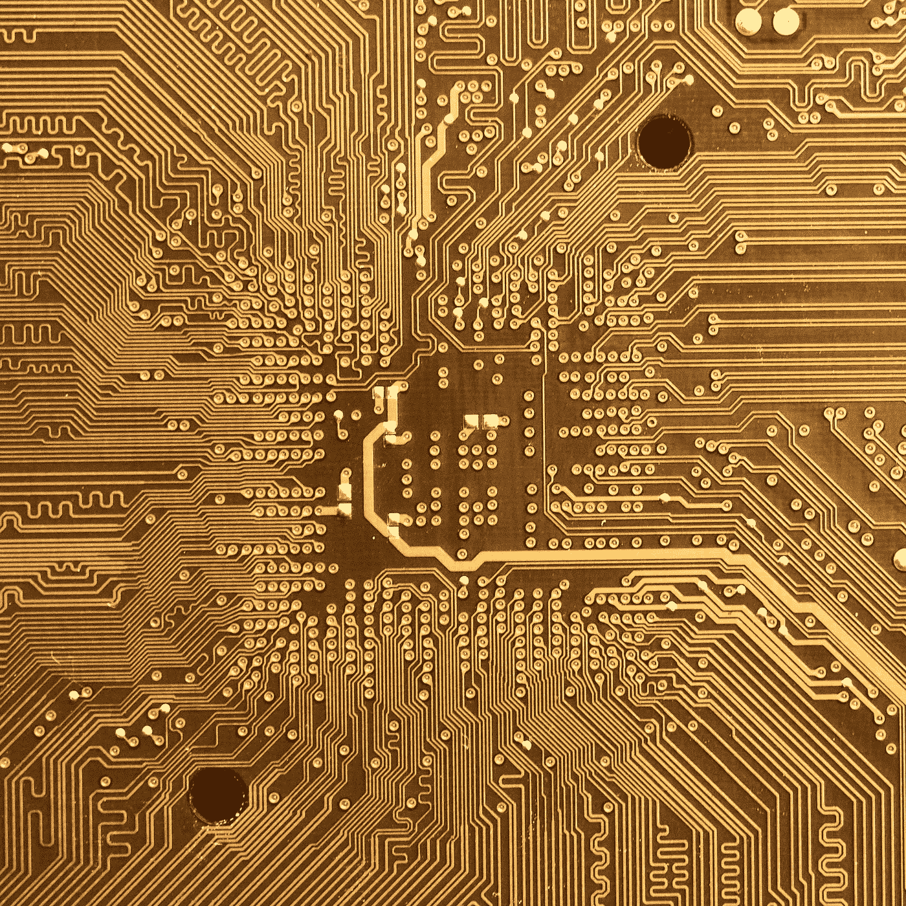

# 为科技企业家揭开量子计算的神秘面纱

> 原文：<https://medium.com/codex/demystifying-quantum-computing-for-tech-entrepreneurs-6c1afa4147ca?source=collection_archive---------16----------------------->

与加密货币非常相似，量子计算似乎是迈向未来的一大步——但消费者和企业家仍然难以理解其中的基本概念。

曼努埃尔 X [Unsplash](https://unsplash.com/photos/CANL3bzp6wU)

“量子计算”一词可能会让人联想到你可能在科幻电影中看到的高度先进技术的图像。虽然量子计算将有助于我们共同推进新技术，并让我们作为一个物种取得更多成就，但这并不像听起来那么令人畏惧。是的，底层技术很复杂——但这并不意味着像我这样的普通技术人员在某种程度上不能理解它！

就这一点而言，对于科技企业家来说，始终领先一步是极其重要的，尤其是在涉及未来工具的时候。量子计算有望打开一个充满机遇的全新世界，因此，如果你希望你的企业取得成功，并在不断发展的技术环境中保持相关性，你需要对预期有所了解。在今天的帖子中，我想帮助科技企业家揭开量子计算的神秘面纱，并解释为什么明天的计算技术可能是人类的下一个重大进步。

# 什么是量子计算？

[安东·马克西莫夫·尤文斯基 X·昂斯普拉什](https://unsplash.com/photos/qM37iptlCNY)

目前，量子计算(QC)更多的是一种理论实践，而不是企业家或消费者可以使用的实际技术。尽管自 20 世纪 80 年代以来，围绕量子计算的理论一直在流传，但许多研究人员认为量子计算更多的是白日梦。尽管如此，随着经典计算技术和我们的集体研究方法不断进步，量子计算正一步步接近成为现实。

那么，什么是量子计算呢？纵观全局，这是计算的下一个理论步骤。量子计算机不是使用传统的编程语言来解决问题，而是可以操纵量子态(原子或亚原子级别的自然状态)来解决远远超出当今设备能力的问题。

通俗地说，我们可以通过操纵 1 和 0 来解决算法或找到问题的解决方案，也可以通过操纵自然的基本元素来解决更高级、更复杂的问题。简而言之，量子计算提供了一种在计算机上模拟和利用物理定律的方法——这种方法只在科幻小说的世界里实现过。

从理论上讲，这不仅会极大地提高计算速度，还会从根本上改变我们(作为人类)解决问题的方式。理解量子计算潜力的一个问题是，可能性是如此之大，我们很难真正理解它们。例如，量子计算机将允许研究人员创建在正常自然条件下不存在的人工系统，从而在物理学、形而上学和其他与存在的基本性质相关的研究领域中带来新的发现。

# 量子计算对科技企业家意味着什么？

[Arif Riyanto X Unsplash](https://unsplash.com/photos/vJP-wZ6hGBg)

很容易看到量子计算如何有助于导致新的科学发现，但在我们看到个人量子计算机的引入之前，科技企业家的潜力很难预测。也就是说，现实情况是，量子计算将彻底重塑我们处理技术世界中一切事物的方式——从数据收集到软件开发——以及介于两者之间的一切事物。然而，在更实际的层面上，随着量子计算技术的发展，我们几乎可以肯定会看到一些事情。

# 闪电般的速度

几乎科技行业的每一项新发现都承诺更快的速度。无论是更快的 5G 下载速度，还是新微芯片处理速度的提高，技术世界都喜欢让每一项新发明比其前身更快。然而，量子计算可能会让所有这些改进相形见绌。想象一下，当你的计算机可以真正使用基于量子力学原理的处理器时，你可以多快地完成任何任务？

# 大数据组织

我们已经非常擅长收集数据，但是一旦我们有了数据，我们并不总是知道如何处理它。例如，我们现在可以收集数量惊人的信息，但是找到具体的数据却是一个挑战。有了量子计算，我们可以获取大量数据集，并在几毫秒内找到一小块拼图。而这只是冰山一角。随着数据组织能力的增强，我们能够以以前无法想象的熟练程度来理解趋势、消费者心理和不同运营的成功。

# 更大的存储能力

如果我们可以在计算机中复制我们物理世界的一些最基本的机制，那么我们就有理由开发可以与人脑的存储能力相媲美的软件和硬件。目前，我们已经开发出比人脑“思考”速度快 1000 多万倍的计算机。然而，当谈到存储时，经典的计算机和存储设备与我们两耳之间的灰质相比就相形见绌了。量子计算可以帮助我们理解允许人脑跟踪如此多信息的机制，并且从理论上讲，可以在日常计算机中复制它。

# 底线

归根结底，量子计算要成为企业家的现实，我们还有几年的时间。然而， [Google AI 已经进行了量子计算](https://www.ibm.com/blogs/research/2019/10/on-quantum-supremacy/)，我们每天都在离创造一台功能量子计算机越来越近。因此，对于科技企业家来说，没有时间像现在这样为不可避免的事情做准备，并准确理解量子计算为我们带来了什么。