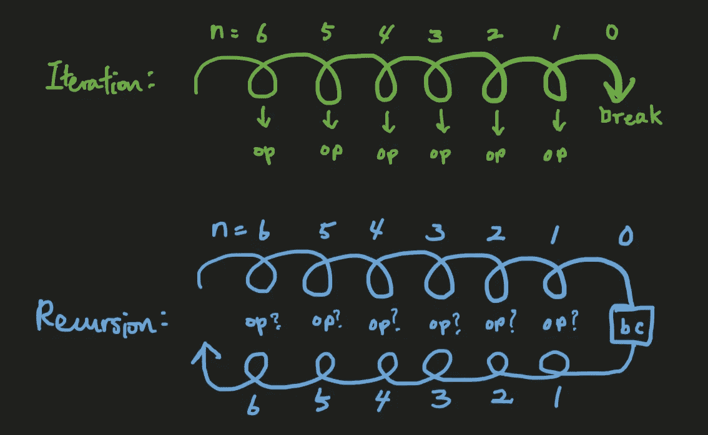
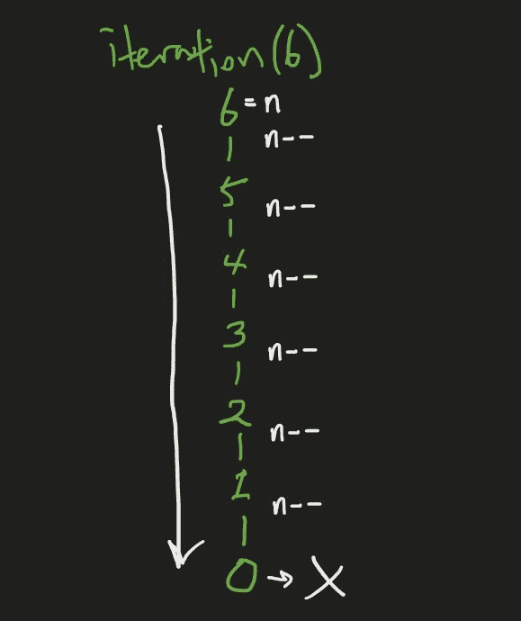
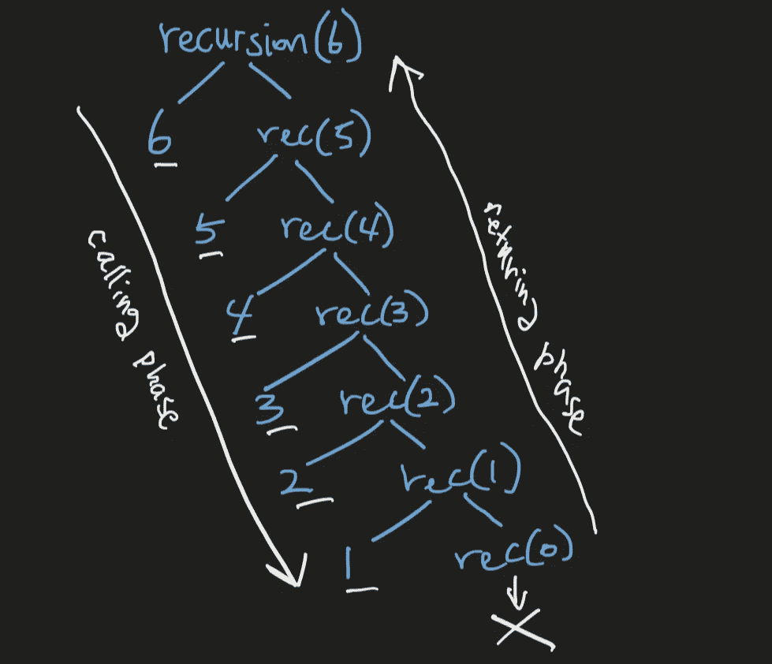
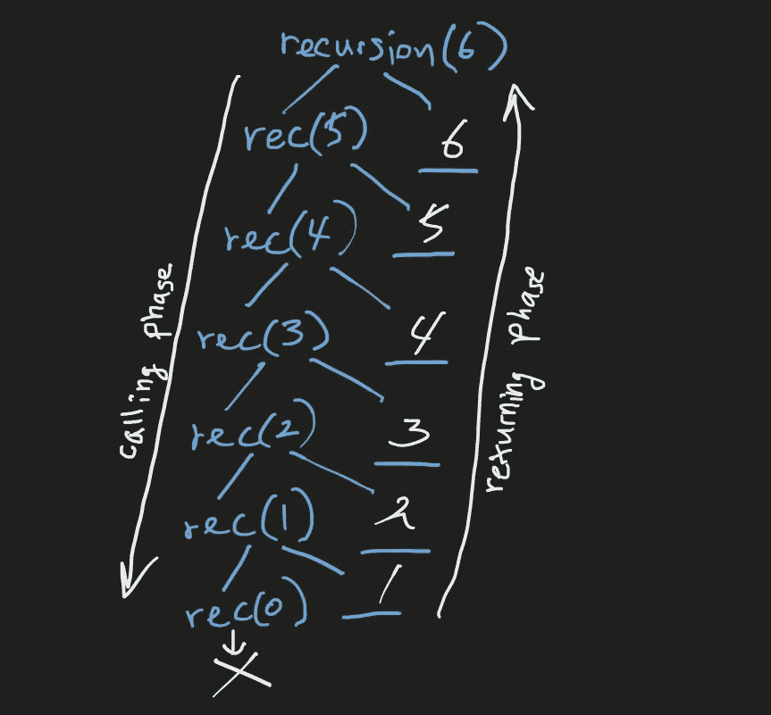

# 揭秘递归

> 原文：<https://medium.com/codex/demystifying-recursion-b567930c03a?source=collection_archive---------3----------------------->

## 理解递归

## 帮助你真正理解递归如何工作的新方法

Christophe Hautier 在 [Unsplash](https://unsplash.com/s/photos/inception?utm_source=unsplash&utm_medium=referral&utm_content=creditCopyText) 上拍摄的照片

**递归是编程中一个非常重要的概念**，在编写算法和解决问题时，为了高效地处理数据结构，你必须掌握这个概念。

然而，我们中的许多人发现递归的概念很难，并且在完全理解它之前挣扎了很久。

但是当一切都开始运转时，处理递归变得如此有趣和令人兴奋。

现在，如何让递归“只需点击一下”就能实现呢？

在这篇文章中，我将介绍一种有趣的(新的)看待递归的方式来帮助你掌握它。如果你不喜欢递归，并且想尽可能避免编写递归函数(就像我以前一样)，我的目标是让你从现在开始甚至在睡觉的时候也想编写递归函数！

# **递归与迭代**

让我们先回顾一下我们已经知道的。什么是递归？

→简单来说，递归就是一个循环。

递归几乎总是被比作迭代，迭代也是一个循环。如果递归和迭代都是循环，它们有什么不同？

让我们来看看递归和迭代之间的两个最显著的区别:

1.  **递归占用额外的堆栈空间** —我们知道递归为每个递归调用占用额外的内存堆栈空间，因此与迭代相比，潜在地具有更大的空间复杂度。
2.  **递归使得代码更干净，可读性更强**——尽管需要更多的空间，使用递归可以让你的代码比迭代更具可读性。

但是我们已经知道了这些区别，它们并没有真正帮助我们理解递归是如何工作的，对吗？

*递归和迭代之间真正的、最重要的区别是什么，可以让我们更全面地理解递归是如何工作的？*

要回答这个问题，我们需要理解递归的两个阶段。

# **递归的两个阶段**

注意，我们要看的两个阶段，不是我们熟悉的递归的两种情况:

*   基本情况
*   递归情况

递归是一个以较小的形式重复调用自己的函数，其思想是通过解决同一问题的较小版本，可以更容易地解决复杂的问题。

递归所做的是重复调用越来越小的自身版本，直到你有最小的可能情况，小到你可以简单地立即解决它→这个最小的情况是基础情况。然后你用这个基础案例的答案来回答下一个最小的问题，然后下一个，然后下一个，等等，直到你回到最初的问题。

*你注意到递归的两个阶段了吗？*

*   我们有一个向基本情况发展的阶段。
*   我们有另一个阶段从基础案例中返回。

从原始递归调用到基础用例的第一阶段被称为**调用阶段**。

从基本情况返回到原始递归调用的第二阶段被称为**返回阶段**。

> 这是递归和迭代的主要区别:
> 
> ***迭代只有调用阶段，递归有调用阶段和返回阶段。***

最初难以完全理解递归的原因是递归循环有两个阶段，这使得很难看到每个递归调用的结果在最终结果中的完全组合效果。

对于迭代来说，这很简单，因为循环是单向的→你只需在每个迭代周期中做同样的事情。

请注意，在上图中，我为每次迭代标记了“op ”,以表明每次迭代执行的操作会立即反映在代码中。

对于递归，我用问号表示“op”。这是因为在递归中，我们有两个阶段，递归调用的操作可以在调用阶段执行，也可以在返回阶段执行，这取决于递归函数是如何设计的。

*   *当在调用阶段执行操作时，递归调用一完成就执行操作*。这类似于迭代的工作方式。首先完成操作，然后进行其内部递归调用。
*   *当在返回阶段执行操作时，首先进行递归调用*。当进行递归调用时，它首先调用它的内部递归调用，内部递归调用调用它自己的内部递归调用，以此类推，直到进行带有基本用例的最后一个递归调用。然后，当递归返回到原始递归调用时，现在执行已经等待前一递归调用操作终止的每个递归调用的操作。

*这里是全面理解每个递归调用的结果如何组合成最终结果的关键* : **我们需要理解每个递归调用的操作是在什么时候执行的**。

在深入研究递归如何在代码中工作之前，让我们花点时间通过一个有趣的类比从概念上更全面地掌握递归及其两个阶段。

# 递归就像盗梦空间一样

如果你看过电影*盗梦空间*，你会注意到递归和盗梦空间之间惊人的相似。梦里的梦里的梦和递归调用里的递归调用里的递归调用。

*心中有了一个明确的目标，你就设计一个梦想，然后去实现它。在那个梦里，你创造了另一个梦并进入其中，然后在那个梦里又有另一个梦，如此下去，直到你进入一个最深处的梦。这是呼唤阶段，或进入梦想阶段。内心深处的梦想是最基本的情况。*

现在，为了实现你的目标，回到现实中过上幸福的生活，你必须走出梦境。你必须首先从内心最深处的梦中醒来，然后是上面的梦，然后是上面的梦，如此类推，直到你最终回到现实中。这是回归阶段，或回到现实阶段。

如何获得递归的最终结果取决于每个递归调用的操作是如何执行的。

有两种方法可以通过《盗梦空间》实现你的目标。

*   *当你进入最深处的梦*时，你可以对每个梦进行必要的操作。当你到达内心深处的梦想时，你已经为每个梦想做了所有必要的操作。你现在需要做的就是从每个梦里醒来，就像嘭嘭嘭一样，直到你回到现实中。**注意目标实现的顺序:最外层梦想的目标首先实现，最内层梦想的目标最后实现**。
*   *或者，你可以通过进入所有的梦，首先进入最里面的梦，然后在你从梦中醒来时执行必要的操作*。在实现内心深处的梦想后，你从梦中醒来。在下一个梦里，你再次执行你必要的操作并实现你的梦的目标。你将为每个梦继续这些操作，直到你从你开始的最后一个梦中醒来，并回到现实中。注意目标实现的顺序:最里面的梦想的目标首先实现，最外面的梦想最后实现。
*   *你也可以把这两种方式结合起来*。你可以在进入内在梦想的途中进行一些操作，当你从梦想中出来时再进行一些其他的操作。例如，你可以在进入最深层梦境的途中在梦中设置一些炸弹，然后当你从梦中醒来并在离开现实的途中再次到达这个梦境时，你可以触发炸弹爆炸。

在这个先启类比中，你可以注意到，先启是如何设计的(或者递归是如何设计的)会影响你的目标是如何实现的。换句话说，您的初始或递归函数应该以特定的方式设计，包括操作的时间，以实现您的预期目标。

# **代码中的递归**

现在，让我们看看递归在代码中是如何工作的。

我将使用的例子是 JavaScript，但是这种语言对于理解递归是如何工作的并不重要。

## **迭代**

首先，让我们考虑下面的迭代函数:

这是一个迭代循环，将执行一个操作(打印`n`)，从`n = 6`开始，每次递减`n`，直到`n > 0`。当`n = 0`出现时，循环中断，迭代完成。

> 这个 while 循环的结果将是:`6 5 4 3 2 1`。

迭代追踪

## **尾部递归**

使用递归可以实现相同的结果，如下所示:

用`recursion(6)`进行第一次递归调用。只要`n > 0`，它就会打印`n`，然后调用下一个递归调用。`recursion(6)`打印`6`然后调用`recursion(5)`。这个调用将打印`5`然后调用`recursion(4)`。该过程将持续到调用`recursion(0)`为止。当`recursion(0)`被调用时，`n = 0`，所以递归调用终止，不执行任何操作。由于`recursion(0)`已经终止，我们现在回到`recursion(1)`调用，它在调用`recursion(0)`之前已经执行了它的操作(打印`1`)。由于`recursion(1)`的两个操作(`console.log(1)` & `recursion(0)`)现在都已完成，`recursion(1)`终止，我们现在回到`recursion(2)`调用。这一直持续到我们返回到`recursion(6)`，之后我们的递归就完成了。

> 递归的结果将是:`6 5 4 3 2 1`。

尾部递归追踪

注意，当我们到达基本情况递归调用`recursion(0)`时，所有必要的操作都已经执行了。所有操作都在调用阶段执行。当我们从返回阶段的基本情况返回时，除了简单地终止每个递归调用之外，实际上没有做任何其他事情。

这是一个尾部递归的例子。**尾递归是递归的一种，递归调用是递归函数的最后一个操作**，如上例。在尾部递归中，所有操作都在调用阶段执行，在返回阶段除了简单地终止调用之外什么也不做。

> 尾部递归类似于迭代。
> 
> 当你有一个尾部递归时，把代码写成一个迭代会更有效率，因为它们基本上以同样的方式工作，但是迭代有更好的空间复杂度。

记住所有的递归函数都可以以迭代的形式编写，反之亦然，但是在某些情况下，以迭代的形式编写递归函数更困难。

尾部递归是递归的一个例子，可以很容易地以迭代的形式编写，在这种情况下，您应该明确地以迭代的形式编写代码，以节省内存空间。

## **头部递归**

现在，让我们以上面的例子为例，改为头递归，其中所有操作都在返回阶段执行:

请注意，除了两个递归 case 操作的顺序(`console.log(n)`和`recursion(n — 1)`)之外，一切都是一样的。

在这个递归中，进行第一个递归调用`recursion(6)`。自从`n = 6 > 0`，`recursion(5)`被制造出来。请注意，`console.log(5)`只能在`recursion(5)`呼叫完全处理后执行。`recursion(5)`必须调用`recursion(4)`，T6 必须调用`recursion(3)`以此类推，直到`recursion(0)`被调用。因为 n 现在等于 0，所以到达基本情况，并且`recursion(0)`终止而不做任何事情。现在我们回到`recursion(1)` call。这里，注意我们还没有执行`console.log(1)`操作，因为我们需要首先等待`recursion(0)`调用终止。随着`recursion(0)`现在被完全处理，执行`console.log(1)`操作。`1`已打印。`recursion(1)`现在终止，我们回到`recursion(2)`呼叫。还是那句话，我们还没有执行`console.log(2)`，所以现在执行。`2`已打印。`recursion(2)`现在结束了，我们回到了`recursion(3)`。这一直持续到我们回到`recursion(6)`，它打印`6`并且递归完成。

> 这种递归的结果是:`1 2 3 4 5 6`。

头部递归跟踪

这是一个头部递归。**头递归是递归调用是递归函数的第一个操作**的一种递归。在 head 递归中，所有操作都在返回阶段执行。

**与尾部递归不同，头部递归不容易转换成迭代**。

如果我们要以迭代的形式编写这个头部递归，我们需要以这样一种方式编写，结果将是`1 2 3 4 5 6`。

如果我们以完全相同的顺序以迭代形式编写上面的 head 递归代码，我们将得到以下结果:

上述迭代函数的结果将是:`5 4 3 2 1 0`。这不是我们想要的。

为了得到`1 2 3 4 5 6`，我们必须找到一种不同的方法来编写迭代函数:

> 上面的迭代将给出期望的结果:`1 2 3 4 5 6`。

但是，与尾部递归不同，以迭代形式编写头部递归更加困难，尽管这是可能的。

## 一个更复杂的递归例子

现在，让我们看看下面的递归函数:

这里，我们有一个在调用阶段和返回阶段执行的操作的组合。

这种递归肯定更复杂，但是利用我们对递归的两个阶段中执行的操作的理解，我们可以理解这种递归如何返回最终结果。

> 以下是递归函数中的操作何时执行的简单规则:
> 
> ***1。递归调用之前的任何事情都在调用阶段*** 执行
> 
> ***2。递归调用之后的任何事情都在返回阶段*** 执行

在上例中，`console.log(n)`是在调用阶段执行的。

`+ n`和`result`变量初始化到`recursion(n — 1) + n`和`return result`都在返回阶段进行。

**第一部分和我们之前看到的尾部递归例子基本相同:**

`console.log(n)`是在调用阶段执行的，所以当我们到达基础用例调用`recursion(0)`时，我们的递归函数应该已经打印了:`6 5 4 3 2 1`。

**现在，我们要看看在返回阶段执行的操作:**

*   在`recursion(0)`，从`n = 0`开始，执行递归程序块之外的基本情况操作:`return 0`。`recursion(0)`的返回值是`0`。
*   现在我们回到`recursion(1)`。因为我们现在有了来自`recursion(1 — 1) = recursion(0)`的返回值，也就是`0`，所以我们有:

`const result = 0 + 1 = 1`。

`return result = return 1`。`recursion(1)`的返回值为`1`。

*   现在我们回到`recursion(2)`。

`const result = 1 + 2 = 3`。

`return result = return 3`。`recursion(2)`的返回值为`3`。

*   现在我们回到`recursion(3)`。

`const result = 3 + 3 = 6`。

`return result = return 6`。`recursion(3)`的返回值是`6`。

*   现在我们回到`recursion(4)`。

`const result = 6 + 4 = 10`。

`return result = return 10`。`recursion(4)`的返回值是`10`。

*   现在我们回到`recursion(5)`。

`const result = 10 + 5 = 15`。

`return result = return 15`。`recursion(5)`的返回值为`15`。

*   现在我们回到`recursion(6)`。

`const result = 15 + 6 = 21`。

`return result = return 21`。`recursion(6)`的返回值为`21`。

我们完成了。

> 上述递归函数的最终结果是:
> 
> `6 5 4 3 2 1` *(在调用阶段执行)*
> 
> `21` *(返回环节操作的最终结果)*

这不是很简单吗？

通过将递归分为调用阶段和返回阶段，并逐个查看每个阶段中执行的操作，我们可以更容易地跟踪递归是如何实现的。

当然，还有更复杂的递归形式，包括**树递归**、**间接递归**和**嵌套递归**，但是如果你只记得递归有在调用阶段执行的操作和在返回阶段执行的操作，并且如果你只是一个接一个地跟踪每个操作，你应该能够理解整个递归是如何被实现来返回最终结果的。

我希望这篇文章有助于更好地理解递归是如何工作的！感谢您的阅读，并祝您所有的编程工作好运。

编码快乐！