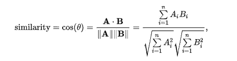
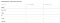
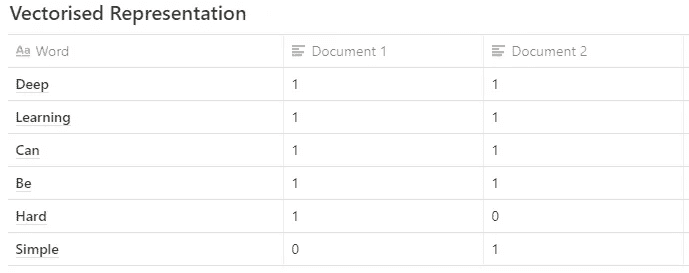
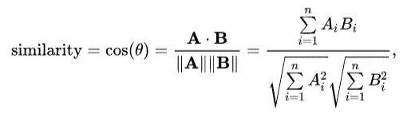
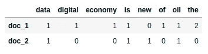
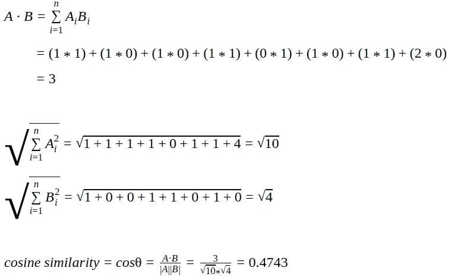

# 揭秘文本分析

> 原文：<https://medium.com/codex/demystifying-text-analytics-b550e7941d?source=collection_archive---------18----------------------->


帕特里克·托马索在 [Unsplash](https://unsplash.com?utm_source=medium&utm_medium=referral) 上的照片

# 用余弦相似度算法查找相似文档

去年我在做一项审计工作，当时我正在查看由两个团队在两个独立的系统中记录的任务列表。这两个系统中的任务*(随后导出到 excel)* 是相同的，但由不同的人在不同的时间使用相似但不准确的词语编写。

这促使我写了关于余弦相似性的文章，并分享了一些代码来帮助读者在几分钟内完成类似的挑战(我花了几个小时才弄明白)。

# **简介**

*余弦相似度是一种度量标准，用于衡量文本的相似程度，而不考虑其大小。在数学上，它测量的是在多维空间中投影的两个向量之间的角度余弦。使用这种方法很有用，因为即使两个相似的文档相距欧几里德距离很远(由于文档的大小)，它们仍有可能靠得更近。角度越小，余弦相似度越高。*

在任何人进入第 3 步(余弦相似性)之前，这是我们在这里要讨论的，有两个更重要的初步步骤，例如:

1.  通过将句子标记成单词、去除停用词、对单词进行词干处理以及构造 n 元语法等来准备文本数据。
2.  通过使用一种称为 [TF-IDF](https://en.wikipedia.org/wiki/Tf%E2%80%93idf) (术语频率—逆文档频率)的技术，为文档内部的术语(或标记)赋予权重，从而量化文档。计算出的 TF-IDF 表示每个术语(或标记)对给定文档的重要性。为了使这篇文章简短，我将直接跳到第 3 部分(余弦相似性)，你可以在以后向下滚动时阅读第 1 步和第 2 步。

余弦相似性在数学上被描述为向量的点积和每个向量的欧几里德范数或幅度的乘积之间的除法。



[图片来自 https://en.wikipedia.org/wiki/Cosine_similarity](https://en.wikipedia.org/wiki/Cosine_similarity)

我们的场景是恰当的，因为它需要识别文档对之间的相似性，作为两个对象之间相似性度量的量化。为了量化相似性，我们将把文档或句子中的单词或短语转换成矢量化的表示形式。

然后可以在余弦相似性公式中使用文档的矢量表示来获得相似性的量化。余弦相似度为 1 意味着这两个文档完全相似，余弦相似度为 0 意味着这两个文档之间没有相似性。

这是我使用的代码。我减少了项目这个词，并将其屏蔽:

```
def word2vec(word):
    from collections import Counter
    from math import sqrt

    # count the characters in word
    cw = Counter(word)
    # precomputes a set of the different characters
    sw = set(cw)
    # precomputes the "length" of the word vector
    lw = sqrt(sum(c*c for c in cw.values()))

    # return a tuple
    return cw, sw, lw

def append_str(item): 

    return item

def cosdis(v1, v2):
    # which characters are common to the two words?
    common = v1[1].intersection(v2[1])
    # by definition of cosine distance we have
    return sum(v1[0][ch]*v2[0][ch] for ch in common)/v1[2]/v2[2]

S= []
C = []
w = []
list_of_keywords = ["Benefit Term Reclass",
"Annuityxxxxxxxx",
"Final xxxxxxxxxxxxxx",
"Accrualxxxxxx",
"Seg xxxxxxReclass",
"HIxxxxxxxxx",
"Hxxxxxxxxxxxxxs",
"Gxx xxxxReserve xxxxxxxAnalysis",
"xxxxxRollforward Analysis",
"Negative xxxxxreclass xxxxxxxx",
"RCG's xxxxx",
"xxxxFair Value xxxxxxxxxx",
"GAAP xxxxxxxxxxxxxxxxxxxxxx",
"INSxxxxx"]

Sentence = ["12b1 fees xxxxxxxxxxxx)",
"Accountxxxxxxxxxxx",
"Accrue xxxxxxx",
"Analyze xxxxxxxxto roll forward",
"Analyze xxxxxxxxto roll forward",
"BB xxxxxxxxxxxxxxxxxxxxxxx)",
"BB xxxxxxxxxxxxxxxxx)",
"",
]
threshold = 0.80
for key in list_of_keywords:
    for word in Sentence:
        try:

            res = cosdis(word2vec(word), word2vec(key))
            {}".format(word, key, res*100))
            #print("Key is:{}".format(key))

            if res > threshold:
             with original word: {}".format(word, key))
               print(key , "^",  word)
        except IndexError:
            pass
```

> 上面的代码解决了我的目的，但对于有兴趣了解更多概念的人，请继续阅读。

假设我们有:

*文档 1:深度学习可能很难*

*文件二:深度学习可以简单*

**第一步:首先我们获得文本的矢量化表示**



*文档 1: [1，1，1，1，1，0]姑且称之为*

*文件 2: [1，1，1，1，0，1]我们把这个称为 B*

上面我们有两个向量(A 和 B ),它们在一个 6 维向量空间中

**第二步:寻找余弦相似度**

# 两个非零向量之间的余弦相似性的数学公式为:



让我们看看如何计算两个文本文档之间的余弦相似度的例子。

```
doc_1 = "Data is the oil of the digital economy" 
doc_2 = "Data is a new oil" **# Vector representation of the document**
doc_1_vector = [1, 1, 1, 1, 0, 1, 1, 2]
doc_2_vector = [1, 0, 0, 1, 1, 0, 1, 0]
```



**余弦相似度**是比 ***欧几里德距离*** 更好的度量，因为如果两个文本文档相隔*欧几里德距离*，它们仍然有可能在上下文方面彼此接近。

# 定义数据

让我们定义样本文本文档并对其应用 CountVectorizer。

```
doc_1 = "Data is the oil of the digital economy"
doc_2 = "Data is a new oil"data = [doc_1, doc_2]
```

# 调用[计数矢量器](https://studymachinelearning.com/countvectorizer-for-text-classification/)

机器只能理解数字，不能理解文本。所以有必要将文本数据编码成数字。将每个唯一的数字分配给每个单词的过程称为标记化。

Scikit-Learn 库提供了一个 CountVectorizer，它将一组文本文档转换成一个令牌计数矩阵。

# count vectorizer 提供了一种简单的方法来标记文本数据和构建已知单词的词汇表。

#它还使用构建的词汇表对新的文本数据进行编码。编码向量是一个稀疏矩阵，因为它包含许多零。使用计数矢量器的步骤如下:

*   *创建一个对象的****count vectorizer****类。*
*   *调用****fit()****函数，以便从文本数据中构建单词的词汇表。*
*   *调用****transform()****函数，使用构建的词汇对文本数据进行分词。*

***参数:***

*   ***输入:*** *序列字符串*
*   ***小写:*** *bool(默认-真)。在标记前将所有字符转换成小写。*
*   ***stop_words :*** *从结果词汇中删除已定义的单词。*
*   ***ngram _ range:****要提取的不同 n 元文法的 n 值范围的上下边界。*
*   ***max_df :*** *忽略文档频率高于阈值的术语。*
*   ***min_df :*** *忽略文档频率低于阈值的术语。*
*   ***max _ features:****构建一个只考虑按单词出现次数排序的 top max_features 的词汇表。*

**例如:**

```
**In [1]:** from sklearn.feature_extraction.text import CountVectorizer
text = ["Do not limit your challenges,challenge your limits"]
vect = CountVectorizer()  # create an object 
vect.fit(text)            # build vocabulary
tokenize_text = vect.transform(text)  # encode the text data**# Let's print vocabulary**
**In [2]:** vect.vocabulary_
**Out[2]:** {'limit': 3, 'do': 2, 'challenge': 0, 'challenges': 1, 'not': 5, 'your': 6, 'limits': 4}**In [3]:** vect.get_feature_names()
**Out[3]:** ['challenge', 'challenges', 'do', 'limit', 'limits', 'not', 'your']**# Let's see the encoded vector, which showing a count of 1 occurrence for each word except the last word(index=6) that has an occurrence of 2.** **In [4]:** tokenize_text.toarray() 
**Out[4]:** [[1, 1, 1, 1, 1, 1, 2]]
```

让我们应用这个词汇表来编码新的文本数据。

```
**In [5]:** new_text = ["push yourself to your limit"]
new_txt_encode = vect.transform(new_text)**In [6]:** new_txt_encode.toarray() **Out[6]:** [[0, 0, 0, 1, 0, 0, 1]]
```

上面的结果表明，索引 3 和 6 处的单词(' limit '，' your ')在测试文档中出现过一次，其余的单词不在词汇表中，因此，它将 0 指定为没有出现。

回到我们的问题:

```
from sklearn.feature_extraction.text import CountVectorizercount_vectorizer = CountVectorizer()
vector_matrix = count_vectorizer.fit_transform(data)
vector_matrix<2x8 sparse matrix of type '<class 'numpy.int64'>'
	with 11 stored elements in Compressed Sparse Row format>
```

生成的向量矩阵是稀疏矩阵，这里不打印。我们把它转换成 numpy 数组，用令牌字显示。

这里是在数据中找到的唯一令牌列表。

```
tokens = count_vectorizer.get_feature_names()
tokens['data', 'digital', 'economy', 'is', 'new', 'of', 'oil', 'the']
```

将稀疏向量矩阵转换为 numpy 数组，可视化 doc_1 和 doc_2 的矢量化数据。

```
vector_matrix.toarray()array([[1, 1, 1, 1, 0, 1, 1, 2],
       [1, 0, 0, 1, 1, 0, 1, 0]])
```

让我们创建 pandas 数据帧，使矢量化数据和令牌清晰可见。

```
import pandas as pddef create_dataframe(matrix, tokens): doc_names = [f'doc_{i+1}' for i, _ in enumerate(matrix)]
    df = pd.DataFrame(data=matrix, index=doc_names, columns=tokens)
    return(df)create_dataframe(vector_matrix.toarray(),tokens)data  digital  economy  is  new  of  oil  the
doc_1     1        1        1   1    0   1    1    2
doc_2     1        0        0   1    1   0    1    0
```

# 查找余弦相似性

Scikit-Learn 提供了计算[余弦相似度](https://scikit-learn.org/stable/modules/generated/sklearn.metrics.pairwise.cosine_similarity.html)的功能。让我们计算 **doc_1** 和 **doc_2** 之间的余弦相似度。

```
from sklearn.metrics.pairwise import cosine_similaritycosine_similarity_matrix = cosine_similarity(vector_matrix)
create_dataframe(cosine_similarity_matrix,['doc_1','doc_2'])doc_1     doc_2
doc_1  1.000000  0.474342
doc_2  0.474342  1.000000
```

通过观察上表，我们可以说 **doc_1** 和 **doc_2** 的余弦相似度为 **0.47**

让我们用 **TfidfVectorizer、**检查余弦相似度，看看它在 **CountVectorizer 上是如何变化的。**

# 调用[tfidf 矢量器](https://studymachinelearning.com/tfidfvectorizer-for-text-classification/)

从文本文档中统计单词是非常基础的。然而，简单的字数统计对于文本处理是不够的，因为存在诸如“the”、“an”、“your”等词。经常出现在文本文档中。频繁出现的单词会妨碍我们的分析，因此 **Tf-idf** 可以成功地用于过滤掉文本文档中的停用词。

解决这个问题的另一个方法是词频。这种方法叫做 **TF-IDF** 代表***词频—逆文档频率***。TF-IDF 是一个数字统计量，用于衡量单词在文档中的重要性。

*   ***词频:*** *一个词在文本文档中出现的次数。*
*   ***逆文档频率:*** *衡量该词是文档中的稀有词还是常用词。*

*用来计算****IF-IDF****的公式是* ***:***

```
**tf(t,d) = (Number of times term t appears in a document) / (Total number of terms in the document)**Where, 
tf(t,d) - Term Frequency
t = term 
d = document**idf(t) = log [ n / df(t) ] + 1**where,
idf(t) - Inverse Document Frequency
n - Total number of documents
df(t) is the document frequency of term t;**tf-idf(t, d) = tf(t, d) * idf(t)**
```

示例:

考虑一个总共有 100 个单词的文档，单词**“book”**在文档中出现了 5 次。

**词频(tf)** = 5 / 100 = 0.05

假设我们有 10，000 个文档，单词**“book”**在其中的 1000 个文档中出现过。那么 idf 就是:

**逆文档频率(IDF)** = log[10000/1000] + 1 = 2

TF-IDF = 0.05 * 2 = 0.1

**。。。**

Scikit-Learn 提供了 tfidf 矢量器的实现。

***参数:***

*   ***输入:*** *文本文档*
*   ***小写:*** *bool(默认-True)。在标记前将所有字符转换成小写。*
*   ***stop _ words:****从结果词汇中删除已定义的单词。*
*   ***ngram _ range:****要提取的不同 n 元文法的 n 值范围的上下边界。*
*   ***max_df :*** *忽略文档频率高于阈值的术语。*
*   ***min_df :*** *忽略文档频率低于阈值的术语。*
*   ***max_features:****构建一个只考虑按单词出现次数排序的顶级 max _ features 的词汇表。*
*   ***规范:****‘L1’，‘L2’或‘无’(默认——‘L2’)*
*   ***use _ IDF:****boolean(默认=真)。启用逆文档频率重新加权。*
*   ***smooth _ IDF:****布尔型(默认=真)。通过给文档频率加 1 来平滑 idf 权重，就好像一个额外的文档恰好包含集合中的每个术语一次。防止零次分割。*
*   ***sublinear _ TF:****布尔(默认=假)。应用次线性 tf 标度，即用 1 + log(tf)代替 tf。*

**例子**

```
**In [1]:** from sklearn.feature_extraction.text import TfidfVectorizer
text = ["Do not limit your challenges,challenge your limits",
        "your challenges",
        "their limits"]vect = TfidfVectorizer()  # create an object 
vect.fit(text)            # build vocabulary
tokenize_text = vect.transform(text)  # encode the text data**# Let's print vocabulary
In [2]:** vect.vocabulary_ 
**Out[2]:** {'your': 7, 'limits': 4, 'challenge': 0, 'limit': 3, 'do': 2, 'not': 5, 'their': 6, 'challenges': 1}**In [3]:** vect.get_feature_names()
**Out[3]:** ['challenge', 'challenges', 'do', 'limit', 'limits', 'not', 'their', 'your']**In [4]:** tokenize_text.shape **Out[4]:** (3, 8)**# Let's print idf score of terms**
**In [5]:** vect.idf_
**Out[5]:** [1.69314718, 1.28768207, 1.69314718, 1.69314718, 1.28768207,
       1.69314718, 1.69314718, 1.28768207]**# Let’s apply this vocabulary to encode new text data.**
**In [6]:** 
new_text = ["push yourself to your limit"]
new_txt_encode = vect.transform(new_text)
**In [7]:** new_txt_encode.toarray()
**Out[7]:** [[0\.        , 0\.        , 0\.        , 0.79596054, 0\.        ,
        0\.        , 0\.        , 0.60534851]]
```

回到我们的问题:

```
from sklearn.feature_extraction.text import TfidfVectorizerTfidf_vect = TfidfVectorizer()
vector_matrix = Tfidf_vect.fit_transform(data)tokens = Tfidf_vect.get_feature_names()
create_dataframe(vector_matrix.toarray(),tokens)data  digital  economy        is       new       of       oil      the
doc_1  0.243777  0.34262  0.34262  0.243777  0.000000  0.34262  0.243777  0.68524   
doc_2  0.448321  0.00000  0.00000  0.448321  0.630099  0.00000  0.448321  0.00000cosine_similarity_matrix = cosine_similarity(vector_matrix)
create_dataframe(cosine_similarity_matrix,['doc_1','doc_2'])doc_1     doc_2
doc_1  1.000000  0.327871
doc_2  0.327871  1.000000
```

这里，使用 **TfidfVectorizer** 我们得到 doc_1 和 doc_2 之间的余弦相似度是 **0.32。**其中**计数矢量器**返回 doc_1 和 doc_2 的余弦相似度为 **0.47** 。 **TfidfVectorizer** 惩罚文档中最频繁出现的单词，如停用词。