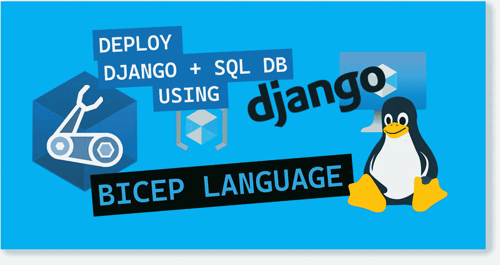
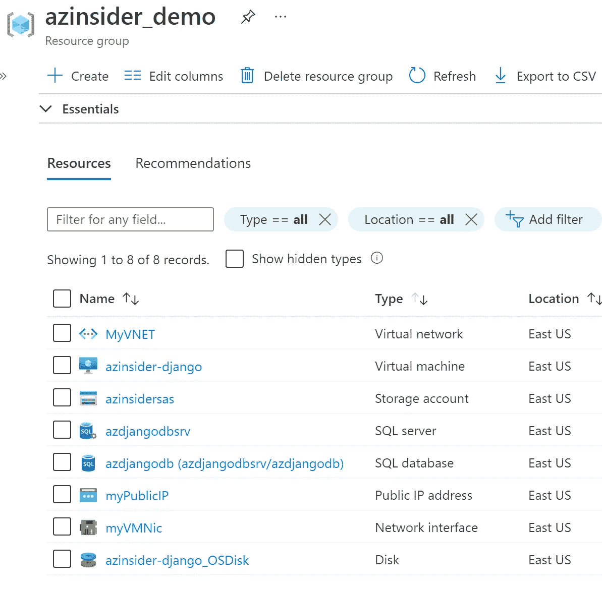
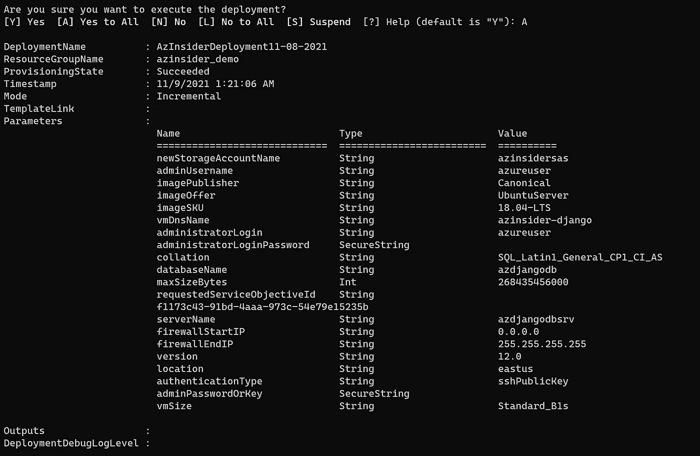

# 💪使用“基础设施即代码”部署带有 SQL 数据库的 Django 应用程序

> 原文：<https://medium.com/codex/deploy-a-django-app-with-sql-database-using-infrastructure-as-code-deb567856fa0?source=collection_archive---------3----------------------->

了解如何使用 Azure Bicep 通过 SQL DB 部署 Django 应用程序。



使用“基础设施即代码”部署带有 SQL 数据库的 Django 应用程序

本文将展示如何在 Ubuntu VM 上部署一个简单的 Django 应用程序。

1.  解决方案概述
2.  先决条件
3.  部署步骤

# 1.解决方案概述

我们将使用 Azure Bicep 利用基础设施即代码，这是一种用于声明式部署 Azure 资源的领域特定语言(DSL)。

我们将利用 Azure Linux CustomScript 扩展来静默安装 Python 和 Apache。Bicep 文件还将创建一个包含一些示例数据的 SQL 数据库。

该解决方案将包括以下文件:

*   **📄 *main.bicep*** :这是二头肌模板
*   **📄*azure deploy . parameters . JSON***:这个参数文件包含用于部署 Bicep 模板的值。
*   📁工件:这个文件夹将包含一个名为' *install_django.sh* '的脚本。

该模板还提供安装所需的存储帐户、虚拟网络、公共 IP 地址、网络接口以及 SQL Server 和 SQL 数据库。



Django 部署

# 2.先决条件

*   一个活跃的 Azure 账户:你可以[免费创建一个账户](https://azure.microsoft.com/free/)。
*   [Azure Bicep](https://github.com/azure/bicep) 安装在您的本地机器上。
*   Azure PowerShell。参见:[安装 Azure PowerShell](https://docs.microsoft.com/en-us/powershell/azure/install-az-ps) 。
*   Azure 订阅中的资源组

我们开始吧！

# 3.部署步骤

## 3.1.创建 SSH 密钥对

第一步是创建一个 SSH 密钥对；您可以查看以下关于如何在 Azure 中为 Linux 虚拟机创建 SSH 密钥对的文章—[https://docs . Microsoft . com/en-us/Azure/virtual-machines/Linux/MAC-create-SSH-keys](https://docs.microsoft.com/en-us/azure/virtual-machines/linux/mac-create-ssh-keys)

在本例中，我们将使用 Azure Bash 控制台创建一个 SSH 密钥对。在 Azure 门户中，请求一个新的控制台，如下图所示:


云壳— Azure 门户

然后，我们将使用下面的命令生成一个 SSH 密钥:

```
ssh-keygen \
    -m PEM \
    -t rsa \
    -b 4096 \
    -C "django" \
    -f ~/.ssh/django-key \
    -N yourpasshphrase
```

这将在文件共享中的 SSH 目录下生成密钥。

如果您不熟悉 SSH 公钥的格式，可以使用下面的 cat 命令显示您的公钥，替换' *~/。如果需要，ssh/id_rsa.pub* '带有您自己的公钥文件的路径和文件名:

```
cat ~/.ssh/django-key.pub
```

上面的命令将在控制台中显示 SSH 公钥。我们将在部署期间需要它，所以请将它放在手边。

酷！现在我们有了 SSH 密钥对。我们将在参数文件中传递这个 SSH 密钥的值。

## 3.2.Azure 二头肌模板-参数

在您的工作目录中创建一个新文件，并将其命名为' *main.bicep* '。我们将定义以下参数:

```
@description('Name of the Storage Account')
param newStorageAccountName string@description('Username for the Administrator of the VM')
param adminUsername string@description('Image Publisher')
param imagePublisher string = 'Canonical'@description('Image Offer')
param imageOffer string = 'UbuntuServer'@description('Image SKU')
param imageSKU string = '18.04-LTS'@description('DNS Name for the Public IP. Must be lowercase.')
param vmDnsName string@description('Admin username for SQL Database')
param administratorLogin string@description('Admin password for SQL Database')
@secure()
param administratorLoginPassword string@description('SQL Collation')
param collation string = 'SQL_Latin1_General_CP1_CI_AS'@description('Name of your SQL Database')
param databaseName string@description('Max DB size in bytes')
param maxSizeBytes int = 268435456000@description('Requested Service Objective ID')
param requestedServiceObjectiveId string = 'f1173c43-91bd-4aaa-973c-54e79e15235b'@description('Unique name of your SQL Server')
param serverName string@description('Start IP for your firewall rule, for example 0.0.0.0')
param firewallStartIP string = '0.0.0.0'@description('End IP for your firewall rule, for example 255.255.255.255')
param firewallEndIP string = '0.0.0.0'@description('SQL Version')
param version string = '12.0'@description('Location for all resources.')
param location string = resourceGroup().location@allowed([
  'sshPublicKey'
  'password'
])
@description('Type of authentication to use on the Virtual Machine. SSH key is recommended.')
param authenticationType string = 'sshPublicKey'@description('SSH Key or password for the Virtual Machine. SSH key is recommended.')
@secure()
param adminPasswordOrKey string@description('Default VM Size')
param vmSize string = 'Standard_B1s'
```

# 3.Azure 二头肌模板-变量

我们将定义以下变量:

```
var nicName_var = 'myVMNic'
var addressPrefix = '10.0.0.0/16'
var subnetName = 'Subnet-1'
var subnetPrefix = '10.0.0.0/24'
var storageAccountType = 'Standard_LRS'
var publicIPAddressName_var = 'myPublicIP'
var publicIPAddressType = 'Dynamic'
var vmName_var = vmDnsName
var virtualNetworkName_var = 'MyVNET'
var subnetRef = resourceId('Microsoft.Network/virtualNetworks/subnets', virtualNetworkName_var, subnetName)
var linuxConfiguration = {
  disablePasswordAuthentication: true
  ssh: {
    publicKeys: [
      {
        path: '/home/${adminUsername}/.ssh/authorized_keys'
        keyData: adminPasswordOrKey
      }
    ]
  }
}
```

# 4.Azure 二头肌模板—资源

我们将定义以下资源:

```
resource serverName_resource 'Microsoft.Sql/servers@2020-11-01-preview' = {
  location: location
  name: serverName
  properties: {
    administratorLogin: administratorLogin
    administratorLoginPassword: administratorLoginPassword
    version: version
  }
}resource serverName_databaseName 'Microsoft.Sql/servers/databases@2020-11-01-preview' = {
  parent: serverName_resource
  location: location
  name: databaseName
  properties: {
    collation: collation
    maxSizeBytes: maxSizeBytes
    recoveryServicesRecoveryPointId: requestedServiceObjectiveId
  }
}resource serverName_FirewallRule1 'Microsoft.Sql/servers/firewallrules@2020-11-01-preview' = {
  parent: serverName_resource
  name: 'FirewallRule1'
  properties: {
    endIpAddress: firewallEndIP
    startIpAddress: firewallStartIP
  }
}resource newStorageAccountName_resource 'Microsoft.Storage/storageAccounts@2021-02-01' = {
  name: newStorageAccountName
  location: location
  sku: {
    name: storageAccountType
  }
  kind: 'StorageV2'
}resource publicIPAddressName 'Microsoft.Network/publicIPAddresses@2020-07-01' = {
  name: publicIPAddressName_var
  location: location
  properties: {
    publicIPAllocationMethod: publicIPAddressType
    dnsSettings: {
      domainNameLabel: vmDnsName
    }
  }
}resource virtualNetworkName 'Microsoft.Network/virtualNetworks@2020-07-01' = {
  name: virtualNetworkName_var
  location: location
  properties: {
    addressSpace: {
      addressPrefixes: [
        addressPrefix
      ]
    }
    subnets: [
      {
        name: subnetName
        properties: {
          addressPrefix: subnetPrefix
        }
      }
    ]
  }
}resource nicName 'Microsoft.Network/networkInterfaces@2020-07-01' = {
  name: nicName_var
  location: location
  properties: {
    ipConfigurations: [
      {
        name: 'ipconfig1'
        properties: {
          privateIPAllocationMethod: 'Dynamic'
          publicIPAddress: {
            id: publicIPAddressName.id
          }
          subnet: {
            id: subnetRef
          }
        }
      }
    ]
  }
  dependsOn: [
    virtualNetworkName
  ]
}resource vmName 'Microsoft.Compute/virtualMachines@2020-12-01' = {
  name: vmName_var
  location: location
  properties: {
    hardwareProfile: {
      vmSize: vmSize
    }
    osProfile: {
      computerName: vmName_var
      adminUsername: adminUsername
      adminPassword: adminPasswordOrKey
      linuxConfiguration: ((authenticationType == 'password') ? json('null') : linuxConfiguration)
    }
    storageProfile: {
      imageReference: {
        publisher: imagePublisher
        offer: imageOffer
        sku: imageSKU
        version: 'latest'
      }
      osDisk: {
        name: '${vmName_var}_OSDisk'
        caching: 'ReadWrite'
        createOption: 'FromImage'
      }
    }
    networkProfile: {
      networkInterfaces: [
        {
          id: nicName.id
        }
      ]
    }
  }
  dependsOn: [
    newStorageAccountName_resource
  ]
}resource vmName_django 'Microsoft.Compute/virtualMachines/extensions@2020-12-01' = {
  parent: vmName
  name: 'django'
  location: location
  properties: {
    publisher: 'Microsoft.Azure.Extensions'
    type: 'CustomScript'
    typeHandlerVersion: '2.0'
    autoUpgradeMinorVersion: true
    settings: {
      fileUris: [
        '[https://gist.githubusercontent.com/daveRendon/bf68e2b419a5907eb639e6265be70cda/raw/818c370103e09ea61c5cd4d573ee8e9d77d6fc09/install_django.sh'](https://gist.githubusercontent.com/daveRendon/bf68e2b419a5907eb639e6265be70cda/raw/818c370103e09ea61c5cd4d573ee8e9d77d6fc09/install_django.sh')
      ]
    }
    protectedSettings: {
      commandToExecute: 'sh install_django.sh ${vmDnsName} ${serverName} ${administratorLogin} ${administratorLoginPassword} ${databaseName}'
    }
  }
}
```

注意我们使用 Azure Linux CustomScript 扩展来安装 Django。这个脚本应该在部署时可以公开访问。因此，您可以将其存储在存储帐户上，并传递 SAS 令牌和文件所在的 URL。

另一种选择是将脚本托管在一个公共存储库中:[https://gist . githubusercontent . com/daveRendon/bf68e 2 b 419 a 5907 EB 639 e 6265 be 70 CDA/raw/818 c 370103 e 09 ea 61 C5 CD 4d 573 ee 8 e 9d 77 D6 fc 09/install _ django . sh](https://gist.githubusercontent.com/daveRendon/bf68e2b419a5907eb639e6265be70cda/raw/818c370103e09ea61c5cd4d573ee8e9d77d6fc09/install_django.sh)

# 5.参数文件

创建一个名为“*azure deploy . parameters . JSON*的新文件。下面的代码显示了参数文件的定义:

```
{
    "$schema": "[https://schema.management.azure.com/schemas/2019-04-01/deploymentParameters.json#](https://schema.management.azure.com/schemas/2019-04-01/deploymentParameters.json#)",
    "contentVersion": "1.0.0.0",
    "parameters": {
      "newStorageAccountName": {
        "value": "YOUR-STORAGE-ACCOUNT-NAME"
      },
      "adminUsername": {
        "value": "YOUR-ADMIN-USERNAME"
      },
      "vmDnsName": {
        "value": "YOUR-VM-DNS-NAME"
      },
      "administratorLogin": {
        "value": "YOUR-ADMIN-LOGIN"
      },
      "administratorLoginPassword": {
        "value": "YOUR-ADMIN-PASS"
      },
      "databaseName": {
        "value": "YOUR-DATABASE-NAME"
      },
      "serverName": {
        "value": "YOUR-SERVER-NAME"
      },
      "firewallStartIP": {
        "value": "0.0.0.0"
      },
      "firewallEndIP": {
        "value": "255.255.255.255"
      },
      "adminPasswordOrKey": {
        "value": "YOUR-SSH-KEY"
      }
    }
  }
```

# 6.Azure Bicep 模板-部署

我们将使用下面的命令来部署我们的二头肌模板:

```
$date = Get-Date -Format "MM-dd-yyyy"
$deploymentName = "AzInsiderDeployment"+"$date"New-AzResourceGroupDeployment -Name $deploymentName -ResourceGroupName azinsider_demo -TemplateFile .\main.bicep -TemplateParameterFile .\azuredeploy.parameters.json -c
```

下图显示了部署输出:



部署输出

一旦部署完成(通常需要几分钟),您就可以获取公共 IP 地址或 FQDN，并使用浏览器进行访问。您将看到应用程序如下所示运行:


Django 使用 Bicep 在 Azure 中使用 SQL 数据库

您可以在下面的 URL 中找到这个解决方案的代码，请随意投稿！

[](https://github.com/daveRendon/azinsider/tree/main/application-workloads/django-with-sql-db) [## azin sider/application-workloads/django-with-SQL-db at main daveRendon/azin sider

### 在 GitHub 上创建一个帐户，为 daveRendon/azinsider 开发做出贡献。

github.com](https://github.com/daveRendon/azinsider/tree/main/application-workloads/django-with-sql-db) 

👉 [*在此加入****azin sider****邮箱列表。*](http://eepurl.com/gKmLdf)

*-戴夫·r*