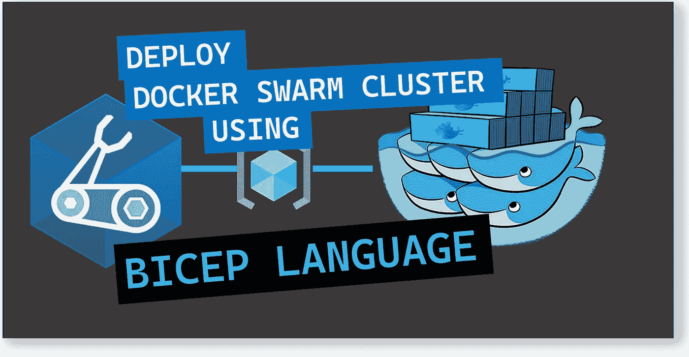
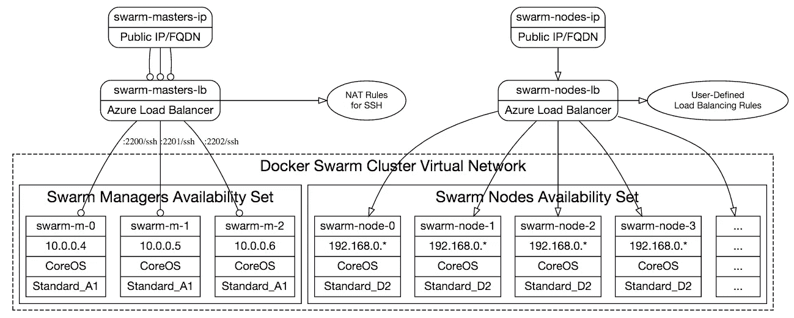
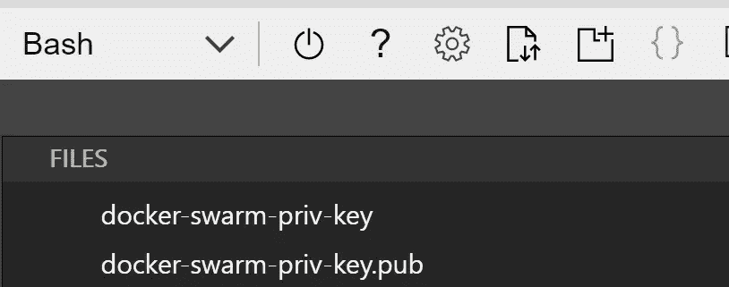
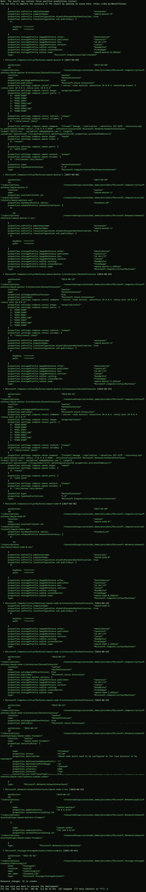
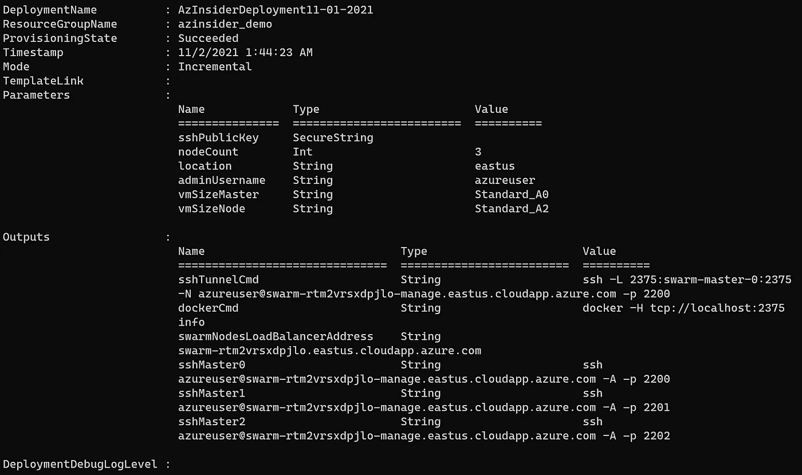
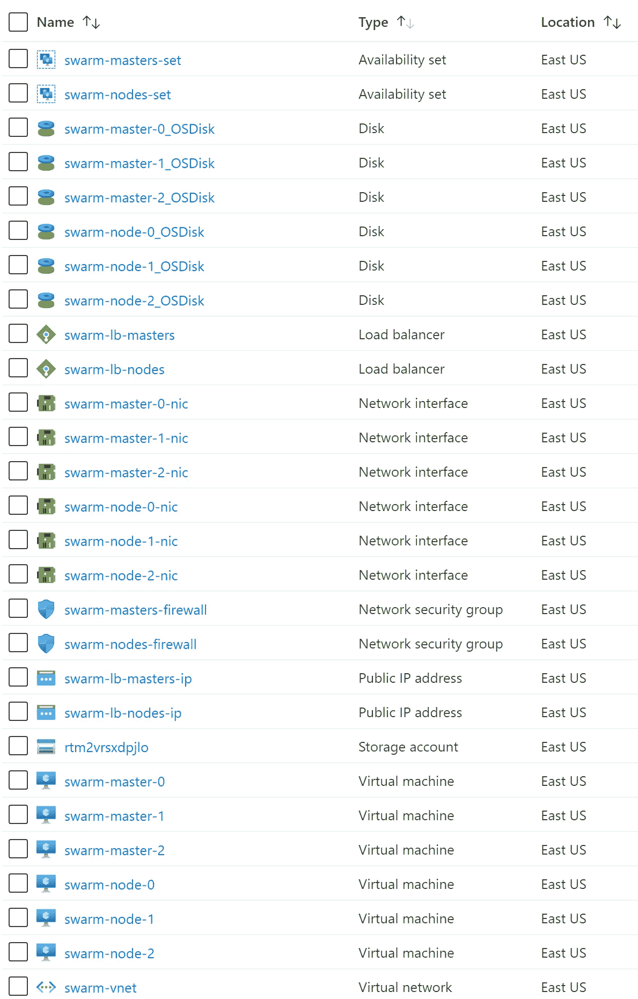

# 💪使用 Bicep 在 Azure 上部署 Docker Swarm 集群

> 原文：<https://medium.com/codex/deploy-a-docker-swarm-cluster-on-azure-using-bicep-7859cb7e0156?source=collection_archive---------3----------------------->



使用 Bicep 在 Azure 上部署 Docker Swarm 集群

本文将展示如何通过 Azure Bicep 使用基础设施即代码在 Azure 中部署 Docker Swarm 集群，Azure Bicep 是一种用于声明式部署 Azure 资源的领域特定语言(DSL)。

Docker Swarm 是一个容器编排工具，用于管理部署在多台主机上的多个容器。

以下 Bicep 模板基于以下架构:



[https://raw . githubusercontent . com/Azure/Azure-quick start-templates/master/application-workloads/swarm/docker-swarm-cluster/img/cluster-network . png](https://raw.githubusercontent.com/Azure/azure-quickstart-templates/master/application-workloads/swarm/docker-swarm-cluster/img/cluster-network.png)

更多细节可以参考下面的 GitHub 库。我们将关注如何利用 Bicep 来执行部署。

使用 Bicep 语言的目标之一是在为 Azure 创作基础设施即代码时更加灵活。

如果你阅读了上面的 GitHub 库和 ARM 模板，你会注意到这是一个有点复杂的 ARM 模板。

通过使用 Bicep，您将简化如何声明想要在 Azure 中部署的资源。

# 先决条件

要部署该解决方案，您需要以下各项:

*   一个活跃的 Azure 账户:你可以[免费创建一个账户](https://azure.microsoft.com/free/)。
*   安装在本地机器上的 Azure Bicep 。
*   Azure PowerShell。参见:[安装 Azure PowerShell](https://docs.microsoft.com/en-us/powershell/azure/install-az-ps) 。
*   Azure 订阅中的资源组

我们开始吧！

# 解决方案概述

我们将创建一个 Bicep 模板，在资源组的位置创建 3 个群管理器和指定数量的群节点。

该解决方案将包括以下文件:

*   ***main.bicep*** :这是 bicep 模板
*   ***azure deploy . parameters . JSON***:该参数文件包含用于部署 Bicep 模板的值。

# 1.创建 SSH 密钥对

第一步是创建一个 SSH 密钥对；您可以查看下面这篇关于如何在 Azure 中为 Linux 虚拟机创建 SSH 密钥对的文章—[https://docs . Microsoft . com/en-us/Azure/virtual-machines/Linux/MAC-create-SSH-keys](https://docs.microsoft.com/en-us/azure/virtual-machines/linux/mac-create-ssh-keys)

在本例中，我们将使用 Azure Bash 控制台创建一个 SSH 密钥对。在 Azure 门户中，请求一个新的控制台，如下图所示:


云壳— Azure 门户

然后，我们将使用下面的命令生成一个 SSH 密钥:

```
ssh-keygen \
    -m PEM \
    -t rsa \
    -b 4096 \
    -C "docker-swarm" \
    -f ~/.ssh/docker-swarm-priv-key \
    -N yourpasshphrase
```

这将在文件共享中的 SSH 目录下生成密钥:



SSH 密钥

如果您不熟悉 SSH 公钥的格式，可以使用下面的 cat 命令显示您的公钥，替换' *~/。如果需要，ssh/id_rsa.pub* 带有您自己的公钥文件的路径和文件名:

```
cat ~/.ssh/docker-swarm-priv-key.pub
```

上面的命令将在控制台中显示 SSH 公钥。我们将在部署期间需要它，所以请将它放在手边。

酷！现在我们有了 SSH 密钥对。我们将在参数文件中传递这个 SSH 密钥的值。

# 2.Azure 二头肌模板-参数

在您的工作目录中创建一个新文件，并将其命名为“ *main.bicep* ”。我们将定义以下参数:

```
@description('SSH public key for the Virtual Machines.')
@secure()
param sshPublicKey string@description('Number of Swarm worker nodes in the cluster.')
param nodeCount int = 3@description('Location for all resources.')
param location string = resourceGroup().location@description('Admin Username.')
param adminUsername string = 'azureuser'@description('Default Master VM Size')
param vmSizeMaster string = 'Standard_A0'@description('Default Node VM Size')
param vmSizeNode string = 'Standard_A2'
```

# 3.Azure 二头肌模板-变量

我们将定义以下变量:

```
var masterCount = 3
var vmNameMaster_var = 'swarm-master-'
var vmNameNode_var = 'swarm-node-'
var availabilitySetMasters_var = 'swarm-masters-set'
var availabilitySetNodes_var = 'swarm-nodes-set'
var osImagePublisher = 'Canonical'
var osImageOffer = 'UbuntuServer'
var osImageSKU = '16.04-LTS'
var managementPublicIPAddrName_var = 'swarm-lb-masters-ip'
var nodesPublicIPAddrName_var = 'swarm-lb-nodes-ip'
var virtualNetworkName_var = 'swarm-vnet'
var subnetNameMasters = 'subnet-masters'
var subnetNameNodes = 'subnet-nodes'
var addressPrefixMasters = '10.0.0.0/16'
var addressPrefixNodes = '192.168.0.0/16'
var subnetPrefixMasters = '10.0.0.0/24'
var subnetPrefixNodes = '192.168.0.0/24'
var mastersNsgName_var = 'swarm-masters-firewall'
var nodesNsgName_var = 'swarm-nodes-firewall'
var newStorageAccountName_var = uniqueString(resourceGroup().id, deployment().name)
var clusterFqdn = 'swarm-${uniqueString(resourceGroup().id, deployment().name)}'
var storageAccountType = 'Standard_LRS'
var mastersLbName_var = 'swarm-lb-masters'
var mastersLbIPConfigName = 'MastersLBFrontEnd'
var mastersLbBackendPoolName = 'swarm-masters-pool'
var nodesLbName_var = 'swarm-lb-nodes'
var nodesLbBackendPoolName = 'swarm-nodes-pool'
var sshKeyPath = '/home/${adminUsername}/.ssh/authorized_keys'
var consulServerArgs = [
  '-advertise 10.0.0.4 -bootstrap-expect 3 -retry-join 10.0.0.5 -retry-join 10.0.0.6'
  '-advertise 10.0.0.5 -retry-join 10.0.0.4 -retry-join 10.0.0.6'
  '-advertise 10.0.0.6 -retry-join 10.0.0.4 -retry-join 10.0.0.5'
]
```

# 4.Azure 二头肌模板—资源

我们将定义以下资源:

```
resource newStorageAccountName 'Microsoft.Storage/storageAccounts@2021-01-01' = {
  name: newStorageAccountName_var
  location: location
  sku: {
    name: storageAccountType
  }
  kind: 'StorageV2'
}resource availabilitySetMasters 'Microsoft.Compute/availabilitySets@2017-12-01' = {
  name: availabilitySetMasters_var
  location: location
  sku: {
    name: 'Aligned'
  }
  properties: {
    platformFaultDomainCount: 2
    platformUpdateDomainCount: 5
  }
}resource availabilitySetNodes 'Microsoft.Compute/availabilitySets@2017-12-01' = {
  name: availabilitySetNodes_var
  location: location
  sku: {
    name: 'Aligned'
  }
  properties: {
    platformFaultDomainCount: 2
    platformUpdateDomainCount: 5
  }
}resource managementPublicIPAddrName 'Microsoft.Network/publicIPAddresses@2015-06-15' = {
  name: managementPublicIPAddrName_var
  location: location
  properties: {
    publicIPAllocationMethod: 'Dynamic'
    dnsSettings: {
      domainNameLabel: '${clusterFqdn}-manage'
    }
  }
}resource nodesPublicIPAddrName 'Microsoft.Network/publicIPAddresses@2015-06-15' = {
  name: nodesPublicIPAddrName_var
  location: location
  properties: {
    publicIPAllocationMethod: 'Dynamic'
    dnsSettings: {
      domainNameLabel: clusterFqdn
    }
  }
}resource virtualNetworkName 'Microsoft.Network/virtualNetworks@2015-06-15' = {
  name: virtualNetworkName_var
  location: location
  properties: {
    addressSpace: {
      addressPrefixes: [
        addressPrefixMasters
        addressPrefixNodes
      ]
    }
    subnets: [
      {
        name: subnetNameMasters
        properties: {
          addressPrefix: subnetPrefixMasters
          networkSecurityGroup: {
            id: mastersNsgName.id
          }
        }
      }
      {
        name: subnetNameNodes
        properties: {
          addressPrefix: subnetPrefixNodes
          networkSecurityGroup: {
            id: nodesNsgName.id
          }
        }
      }
    ]
  }
}resource mastersNsgName 'Microsoft.Network/networkSecurityGroups@2015-06-15' = {
  name: mastersNsgName_var
  location: location
  properties: {
    securityRules: [
      {
        name: 'ssh'
        properties: {
          protocol: 'Tcp'
          sourcePortRange: '*'
          destinationPortRange: '22'
          sourceAddressPrefix: '*'
          destinationAddressPrefix: '*'
          access: 'Allow'
          priority: 1000
          direction: 'Inbound'
        }
      }
    ]
  }
}resource nodesNsgName 'Microsoft.Network/networkSecurityGroups@2015-06-15' = {
  name: nodesNsgName_var
  location: location
  properties: {
    securityRules: [
      {
        name: 'AllowAny'
        properties: {
          description: 'Swarm node ports need to be configured on the load balancer to be reachable'
          protocol: '*'
          sourcePortRange: '*'
          destinationPortRange: '*'
          sourceAddressPrefix: '*'
          destinationAddressPrefix: '*'
          access: 'Allow'
          priority: 1000
          direction: 'Inbound'
        }
      }
    ]
  }
}resource vmNameMaster_nic 'Microsoft.Network/networkInterfaces@2015-06-15' = [for i in range(0, masterCount): {
  name: '${vmNameMaster_var}${i}-nic'
  location: location
  properties: {
    ipConfigurations: [
      {
        name: 'ipConfigMaster'
        properties: {
          privateIPAllocationMethod: 'Static'
          privateIPAddress: '10.0.0.${(i + 4)}'
          subnet: {
            id: resourceId('Microsoft.Network/virtualNetworks/subnets', virtualNetworkName_var, subnetNameMasters)
          }
          loadBalancerBackendAddressPools: [
            {
              id: resourceId('Microsoft.Network/loadBalancers/backendAddressPools', mastersLbName_var, mastersLbBackendPoolName)
            }
          ]
          loadBalancerInboundNatRules: [
            {
              id: resourceId('Microsoft.Network/loadBalancers/inboundNatRules', mastersLbName_var, 'SSH-${vmNameMaster_var}${i}')
            }
          ]
        }
      }
    ]
  }
  dependsOn: [
    mastersLbName
    virtualNetworkName
    mastersLbName_SSH_vmNameMaster
  ]
}]resource mastersLbName 'Microsoft.Network/loadBalancers@2015-06-15' = {
  name: mastersLbName_var
  location: location
  properties: {
    frontendIPConfigurations: [
      {
        name: mastersLbIPConfigName
        properties: {
          publicIPAddress: {
            id: managementPublicIPAddrName.id
          }
        }
      }
    ]
    backendAddressPools: [
      {
        name: mastersLbBackendPoolName
      }
    ]
  }
}resource mastersLbName_SSH_vmNameMaster 'Microsoft.Network/loadBalancers/inboundNatRules@2021-03-01' = [for i in range(0, masterCount): {
  name: '${mastersLbName_var}/SSH-${vmNameMaster_var}${i}'
  properties: {
    frontendIPConfiguration: {
      id: resourceId('Microsoft.Network/loadBalancers/frontendIPConfigurations', mastersLbName_var, mastersLbIPConfigName)
    }
    protocol: 'Tcp'
    frontendPort: (i + 2200)
    backendPort: 22
    enableFloatingIP: false
  }
  dependsOn: [
    mastersLbName
  ]
}]resource nodesLbName 'Microsoft.Network/loadBalancers@2015-06-15' = {
  name: nodesLbName_var
  location: location
  properties: {
    frontendIPConfigurations: [
      {
        name: 'LoadBalancerFrontEnd'
        properties: {
          publicIPAddress: {
            id: nodesPublicIPAddrName.id
          }
        }
      }
    ]
    backendAddressPools: [
      {
        name: nodesLbBackendPoolName
      }
    ]
  }
}resource vmNameNode_nic 'Microsoft.Network/networkInterfaces@2015-06-15' = [for i in range(0, nodeCount): {
  name: '${vmNameNode_var}${i}-nic'
  location: location
  properties: {
    ipConfigurations: [
      {
        name: 'ipConfigNode'
        properties: {
          privateIPAllocationMethod: 'Dynamic'
          subnet: {
            id: resourceId('Microsoft.Network/virtualNetworks/subnets', virtualNetworkName_var, subnetNameNodes)
          }
          loadBalancerBackendAddressPools: [
            {
              id: resourceId('Microsoft.Network/loadBalancers/backendAddressPools', nodesLbName_var, nodesLbBackendPoolName)
            }
          ]
        }
      }
    ]
  }
  dependsOn: [
    nodesLbName
    virtualNetworkName
  ]
}]resource vmNameMaster 'Microsoft.Compute/virtualMachines@2017-03-30' = [for i in range(0, masterCount): {
  name: '${vmNameMaster_var}${i}'
  location: location
  properties: {
    availabilitySet: {
      id: availabilitySetMasters.id
    }
    hardwareProfile: {
      vmSize: vmSizeMaster
    }
    osProfile: {
      computerName: '${vmNameMaster_var}${i}'
      adminUsername: adminUsername
      linuxConfiguration: {
        disablePasswordAuthentication: true
        ssh: {
          publicKeys: [
            {
              path: sshKeyPath
              keyData: sshPublicKey
            }
          ]
        }
      }
    }
    storageProfile: {
      imageReference: {
        publisher: osImagePublisher
        offer: osImageOffer
        sku: osImageSKU
        version: 'latest'
      }
      osDisk: {
        name: '${vmNameMaster_var}${i}_OSDisk'
        caching: 'ReadWrite'
        createOption: 'FromImage'
      }
    }
    networkProfile: {
      networkInterfaces: [
        {
          id: resourceId('Microsoft.Network/networkInterfaces', '${vmNameMaster_var}${i}-nic')
        }
      ]
    }
  }
  dependsOn: [
    newStorageAccountName
    availabilitySetMasters
  ]
}]resource vmNameNode 'Microsoft.Compute/virtualMachines@2017-03-30' = [for i in range(0, nodeCount): {
  name: '${vmNameNode_var}${i}'
  location: location
  properties: {
    availabilitySet: {
      id: availabilitySetNodes.id
    }
    hardwareProfile: {
      vmSize: vmSizeNode
    }
    osProfile: {
      computerName: '${vmNameNode_var}${i}'
      adminUsername: adminUsername
      linuxConfiguration: {
        disablePasswordAuthentication: true
        ssh: {
          publicKeys: [
            {
              path: sshKeyPath
              keyData: sshPublicKey
            }
          ]
        }
      }
    }
    storageProfile: {
      imageReference: {
        publisher: osImagePublisher
        offer: osImageOffer
        sku: osImageSKU
        version: 'latest'
      }
      osDisk: {
        name: '${vmNameNode_var}${i}_OSDisk'
        caching: 'ReadWrite'
        createOption: 'FromImage'
      }
    }
    networkProfile: {
      networkInterfaces: [
        {
          id: resourceId('Microsoft.Network/networkInterfaces', '${vmNameNode_var}${i}-nic')
        }
      ]
    }
  }
  dependsOn: [
    newStorageAccountName
  ]
}]resource vmNameMaster_DockerExtension 'Microsoft.Compute/virtualMachines/extensions@2015-06-15' = [for i in range(0, masterCount): {
  name: '${vmNameMaster_var}${i}/DockerExtension'
  location: location
  properties: {
    publisher: 'Microsoft.Azure.Extensions'
    type: 'DockerExtension'
    typeHandlerVersion: '1.0'
    autoUpgradeMinorVersion: true
    settings: {
      compose: {
        consul: {
          image: 'progrium/consul'
          command: '-server -node master${i} ${consulServerArgs[i]}'
          ports: [
            '8500:8500'
            '8300:8300'
            '8301:8301'
            '8301:8301/udp'
            '8302:8302'
            '8302:8302/udp'
            '8400:8400'
          ]
          volumes: [
            '/data/consul:/data'
          ]
          restart: 'always'
        }
        swarm: {
          image: 'swarm'
          command: 'manage --replication --advertise ${reference(resourceId('Microsoft.Network/networkInterfaces', '${vmNameMaster_var}${i}-nic')).ipConfigurations[0].properties.privateIPAddress}:2375 --discovery-opt kv.path=docker/nodes consul://10.0.0.4:8500'
          ports: [
            '2375:2375'
          ]
          links: [
            'consul'
          ]
          volumes: [
            '/etc/docker:/etc/docker'
          ]
          restart: 'always'
        }
      }
    }
  }
  dependsOn: [
    vmNameMaster  
  ]
}]resource vmNameNode_DockerExtension 'Microsoft.Compute/virtualMachines/extensions@2015-06-15' = [for i in range(0, nodeCount): {
  name: '${vmNameNode_var}${i}/DockerExtension'
  location: location
  properties: {
    publisher: 'Microsoft.Azure.Extensions'
    type: 'DockerExtension'
    typeHandlerVersion: '1.0'
    autoUpgradeMinorVersion: true
    settings: {
      docker: {
        port: '2375'
        options: [
          '--cluster-store=consul://10.0.0.4:8500'
          '--cluster-advertise=eth0:2375'
        ]
      }
    }
  }
  dependsOn: [
    vmNameNode
  ]
}]
```

# 5.输出

我们将包括以下输出:

```
output sshTunnelCmd string = 'ssh -L 2375:swarm-master-0:2375 -N ${adminUsername}@${managementPublicIPAddrName.properties.dnsSettings.fqdn} -p 2200'
output dockerCmd string = 'docker -H tcp://localhost:2375 info'
output swarmNodesLoadBalancerAddress string = nodesPublicIPAddrName.properties.dnsSettings.fqdn
output sshMaster0 string = 'ssh ${adminUsername}@${managementPublicIPAddrName.properties.dnsSettings.fqdn} -A -p 2200'
output sshMaster1 string = 'ssh ${adminUsername}@${managementPublicIPAddrName.properties.dnsSettings.fqdn} -A -p 2201'
output sshMaster2 string = 'ssh ${adminUsername}@${managementPublicIPAddrName.properties.dnsSettings.fqdn} -A -p 2202'
```

# 6.参数文件

创建一个名为“*azure deploy . parameters . JSON*的新文件。下面的代码显示了参数文件的定义:

```
{
    "$schema": "[https://schema.management.azure.com/schemas/2019-04-01/deploymentParameters.json#](https://schema.management.azure.com/schemas/2019-04-01/deploymentParameters.json#)",
    "contentVersion": "1.0.0.0",
    "parameters": {
      "sshPublicKey": {
        "value": "GEN-SSH-PUB-KEY"
   },
      "nodeCount": {
        "value": 3
      }
    }
  }
```

# 6.Azure Bicep 模板-部署

我们将使用下面的命令来部署我们的二头肌模板:

```
$date = Get-Date -Format "MM-dd-yyyy"
$deploymentName = "AzInsiderDeployment"+"$date"New-AzResourceGroupDeployment -Name $deploymentName -ResourceGroupName azinsider_demo -TemplateFile .\main.bicep -TemplateParameterFile .\azuredeploy.parameters.json -c
```

下图显示了部署的预览:



部署预览

然后我们将执行部署。下图显示了部署输出:



部署输出

您可以在 Azure 门户中验证部署。



部署输出

现在，您可以使用 swarm-lb-masters 的域名或公共 IP 地址 SSH 到 Swarm 管理的节点。您可以从部署的输出中获得完整的 DNS 名称。

要访问工作节点，您可以从主节点访问它们。更多详情请参考以下 GitHub repo—[https://GitHub . com/Azure/Azure-quick start-templates/tree/master/application-workloads/swarm/docker-swarm-cluster](https://github.com/Azure/azure-quickstart-templates/tree/master/application-workloads/swarm/docker-swarm-cluster)

完整的 Bicep 模板和参数文件可以在以下 URL 中找到:

[](https://github.com/daveRendon/azinsider/tree/main/application-workloads/docker-swarm-cluster) [## azin sider/应用程序工作负载/docker-swarm-位于主 daveRendon/azinsider 的集群

### 在 GitHub 上创建一个帐户，为 daveRendon/azinsider 开发做出贡献。

github.com](https://github.com/daveRendon/azinsider/tree/main/application-workloads/docker-swarm-cluster) 

👉 [*在此加入****azin sider****邮箱列表。*](http://eepurl.com/gKmLdf)

*-戴夫·r*